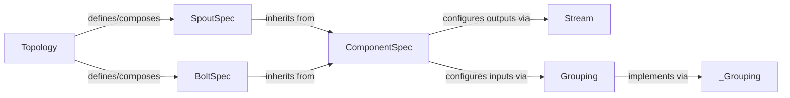

## Details

The `streamparse.dsl` subsystem provides a Pythonic Domain Specific Language (DSL) for defining Apache Storm topologies. At its core, the `Topology` component serves as the primary interface, allowing users to compose `SpoutSpec` (data sources) and `BoltSpec` (processing units). Both `SpoutSpec` and `BoltSpec` inherit from the abstract `ComponentSpec`, which standardizes the definition of component properties like parallelism, configuration, and crucially, their inputs and outputs. Data flow between components is explicitly defined using `Stream` objects for outputs and `Grouping` objects for inputs, dictating how tuples are routed across the distributed system. The `Topology` component is responsible for translating this high-level Python DSL definition into a deployable Thrift `StormTopology` object, leveraging the defined `ComponentSpec`s, `Stream`s, and `Grouping`s. Utility functions within `streamparse.dsl.util` assist in the conversion of Python types to Thrift-compatible arguments during this process.

### Topology
The central component for defining a Storm topology. It acts as a container and orchestrator, processing `SpoutSpec` and `BoltSpec` instances to construct the final Thrift `StormTopology` object for deployment. It handles the overall configuration and validation of the topology structure.

**Related Classes/Methods**:

- <a href="https://github.com/pystorm/streamparse/blob/main/streamparse/dsl/topology.py" target="_blank" rel="noopener noreferrer">`streamparse.dsl.topology.Topology`</a>

### ComponentSpec
An abstract base specification class for all topology components (Spouts and Bolts). It provides common attributes and sanitization logic for parallelism, configuration, inputs, and outputs, ensuring a consistent interface for defining how components interact within the DSL.

**Related Classes/Methods**:

- <a href="https://github.com/pystorm/streamparse/blob/main/streamparse/dsl/component.py#L23-L198" target="_blank" rel="noopener noreferrer">`streamparse.dsl.component.ComponentSpec`:23-198</a>

### SpoutSpec
Concrete specifications for data sources in a Storm topology. These classes extend `ComponentSpec` and define how external data is ingested, either via shell commands or Java classes.

**Related Classes/Methods**:

- <a href="https://github.com/pystorm/streamparse/blob/main/streamparse/dsl/spout.py#L9-L28" target="_blank" rel="noopener noreferrer">`streamparse.dsl.spout.ShellSpoutSpec`:9-28</a>
- <a href="https://github.com/pystorm/streamparse/blob/main/streamparse/dsl/spout.py#L31-L52" target="_blank" rel="noopener noreferrer">`streamparse.dsl.spout.JavaSpoutSpec`:31-52</a>

### BoltSpec
Concrete specifications for data processing units in a Storm topology. These classes extend `ComponentSpec` and define the logic for transforming or aggregating data, either via shell commands or Java classes.

**Related Classes/Methods**:

- <a href="https://github.com/pystorm/streamparse/blob/main/streamparse/dsl/bolt.py#L9-L30" target="_blank" rel="noopener noreferrer">`streamparse.dsl.bolt.ShellBoltSpec`:9-30</a>
- <a href="https://github.com/pystorm/streamparse/blob/main/streamparse/dsl/bolt.py#L33-L56" target="_blank" rel="noopener noreferrer">`streamparse.dsl.bolt.JavaBoltSpec`:33-56</a>

### Stream
Defines an output stream from a `SpoutSpec` or `BoltSpec`. It specifies the fields emitted on the stream and whether it's a direct stream, influencing how tuples are routed.

**Related Classes/Methods**:

- <a href="https://github.com/pystorm/streamparse/blob/main/streamparse/dsl/stream.py#L8-L46" target="_blank" rel="noopener noreferrer">`streamparse.dsl.stream.Stream`:8-46</a>

### Grouping
Defines the data routing strategy between components. It specifies how tuples from an upstream component's stream are distributed to the tasks of a downstream bolt (e.g., shuffle, fields, global). `_Grouping` is an internal class used by `Grouping` to represent the actual Thrift grouping types.

**Related Classes/Methods**:

- <a href="https://github.com/pystorm/streamparse/blob/main/streamparse/dsl/stream.py#L63-L138" target="_blank" rel="noopener noreferrer">`streamparse.dsl.stream.Grouping`:63-138</a>
- <a href="https://github.com/pystorm/streamparse/blob/main/streamparse/dsl/stream.py#L49-L60" target="_blank" rel="noopener noreferrer">`streamparse.dsl.stream._Grouping`:49-60</a>

### [FAQ](https://github.com/CodeBoarding/GeneratedOnBoardings/tree/main?tab=readme-ov-file#faq)