```mermaid
graph LR
    CLI_Management_Interface["CLI Management Interface"]
    Topology_Definition_Layer_DSL_["Topology Definition Layer (DSL)"]
    Storm_Cluster_Interaction["Storm Cluster Interaction"]
    Spout_Bolt_Implementations["Spout/Bolt Implementations"]
    Project_Scaffolding["Project Scaffolding"]
    CLI_Management_Interface -- "Deploys/Manages Topologies" --> Storm_Cluster_Interaction
    CLI_Management_Interface -- "Queries Cluster Status" --> Storm_Cluster_Interaction
    CLI_Management_Interface -- "Parses Topology Definitions" --> Topology_Definition_Layer_DSL_
    CLI_Management_Interface -- "Initiates New Projects" --> Project_Scaffolding
    Topology_Definition_Layer_DSL_ -- "Defines Topology Structure Using" --> Spout_Bolt_Implementations
    Topology_Definition_Layer_DSL_ -- "Outputs Topology Configuration" --> Storm_Cluster_Interaction
    Project_Scaffolding -- "Generates Boilerplate For" --> Topology_Definition_Layer_DSL_
    Project_Scaffolding -- "Generates Boilerplate For" --> Spout_Bolt_Implementations
    click CLI_Management_Interface href "https://github.com/CodeBoarding/GeneratedOnBoardings/blob/main/streamparse/CLI_Management_Interface.md" "Details"
    click Topology_Definition_Layer_DSL_ href "https://github.com/CodeBoarding/GeneratedOnBoardings/blob/main/streamparse/Topology_Definition_Layer_DSL_.md" "Details"
    click Storm_Cluster_Interaction href "https://github.com/CodeBoarding/GeneratedOnBoardings/blob/main/streamparse/Storm_Cluster_Interaction.md" "Details"
    click Spout_Bolt_Implementations href "https://github.com/CodeBoarding/GeneratedOnBoardings/blob/main/streamparse/Spout_Bolt_Implementations.md" "Details"
    click Project_Scaffolding href "https://github.com/CodeBoarding/GeneratedOnBoardings/blob/main/streamparse/Project_Scaffolding.md" "Details"
```

## Details

The `streamparse` project provides a robust framework for developing and managing Apache Storm topologies. Its architecture is centered around a `CLI Management Interface` that serves as the primary user interaction point, enabling users to define, deploy, and manage topologies. The `Topology Definition Layer (DSL)` offers a Pythonic way to construct topology structures, which are then realized by user-defined `Spout/Bolt Implementations`. The `Storm Cluster Interaction` component handles the crucial communication with the Storm cluster, facilitating deployment and operational tasks. Finally, the `Project Scaffolding` component streamlines the initial setup of `streamparse` projects, ensuring a consistent and efficient development workflow. This modular design promotes clear separation of concerns, making the system extensible and maintainable, and is well-suited for visual representation as a data flow diagram.

### CLI Management Interface [[Expand]](./CLI_Management_Interface.md)
The primary user-facing component, responsible for parsing command-line inputs and orchestrating various `streamparse` operations. It acts as the central control point for managing topologies on a Storm cluster.

**Related Classes/Methods**:

- <a href="https://github.com/pystorm/streamparse/blob/main/streamparse/cli/sparse.py" target="_blank" rel="noopener noreferrer">`streamparse.cli.sparse`</a>
- <a href="https://github.com/pystorm/streamparse/blob/main/streamparse/cli/submit.py" target="_blank" rel="noopener noreferrer">`streamparse.cli.submit`</a>
- <a href="https://github.com/pystorm/streamparse/blob/main/streamparse/cli/kill.py" target="_blank" rel="noopener noreferrer">`streamparse.cli.kill`</a>
- <a href="https://github.com/pystorm/streamparse/blob/main/streamparse/cli/list.py" target="_blank" rel="noopener noreferrer">`streamparse.cli.list`</a>
- <a href="https://github.com/pystorm/streamparse/blob/main/streamparse/cli/stats.py" target="_blank" rel="noopener noreferrer">`streamparse.cli.stats`</a>
- <a href="https://github.com/pystorm/streamparse/blob/main/streamparse/cli/visualize.py" target="_blank" rel="noopener noreferrer">`streamparse.cli.visualize`</a>
- <a href="https://github.com/pystorm/streamparse/blob/main/streamparse/cli/quickstart.py" target="_blank" rel="noopener noreferrer">`streamparse.cli.quickstart`</a>

### Topology Definition Layer (DSL) [[Expand]](./Topology_Definition_Layer_DSL_.md)
Provides a Pythonic Domain Specific Language (DSL) for users to define the structure and components (spouts, bolts, streams) of their Apache Storm topologies. This layer abstracts the complexities of Storm's internal representation.

**Related Classes/Methods**:

- <a href="https://github.com/pystorm/streamparse/blob/main/streamparse/dsl/topology.py" target="_blank" rel="noopener noreferrer">`streamparse.dsl.topology`</a>
- <a href="https://github.com/pystorm/streamparse/blob/main/streamparse/dsl/component.py" target="_blank" rel="noopener noreferrer">`streamparse.dsl.component`</a>
- <a href="https://github.com/pystorm/streamparse/blob/main/streamparse/dsl/spout.py" target="_blank" rel="noopener noreferrer">`streamparse.dsl.spout`</a>
- <a href="https://github.com/pystorm/streamparse/blob/main/streamparse/dsl/bolt.py" target="_blank" rel="noopener noreferrer">`streamparse.dsl.bolt`</a>

### Storm Cluster Interaction [[Expand]](./Storm_Cluster_Interaction.md)
This component handles the low-level communication with the Apache Storm cluster, including connecting to the Nimbus service, managing SSH tunnels, and retrieving cluster configurations. It acts as the bridge between `streamparse` and the distributed Storm environment.

**Related Classes/Methods**:

- <a href="https://github.com/pystorm/streamparse/blob/main/streamparse/util.py" target="_blank" rel="noopener noreferrer">`streamparse.util`</a>

### Spout/Bolt Implementations [[Expand]](./Spout_Bolt_Implementations.md)
Represents the actual data sources (Spouts) that ingest data and processing units (Bolts) that perform transformations or aggregations within a Storm topology. These are user-defined Python classes.

**Related Classes/Methods**:

- <a href="https://github.com/pystorm/streamparse/blob/main/streamparse/bootstrap/project/src/spouts/words.py" target="_blank" rel="noopener noreferrer">`streamparse.bootstrap.project.src.spouts.words`</a>
- <a href="https://github.com/pystorm/streamparse/blob/main/streamparse/bootstrap/project/src/bolts/wordcount.py" target="_blank" rel="noopener noreferrer">`streamparse.bootstrap.project.src.bolts.wordcount`</a>

### Project Scaffolding [[Expand]](./Project_Scaffolding.md)
Provides tools and templates for quickly initializing new `streamparse` projects, setting up the standard directory structure, and generating boilerplate code for topologies, spouts, and bolts.

**Related Classes/Methods**:

- <a href="https://github.com/pystorm/streamparse/blob/main/streamparse/bootstrap" target="_blank" rel="noopener noreferrer">`streamparse.bootstrap`</a>

### [FAQ](https://github.com/CodeBoarding/GeneratedOnBoardings/tree/main?tab=readme-ov-file#faq)