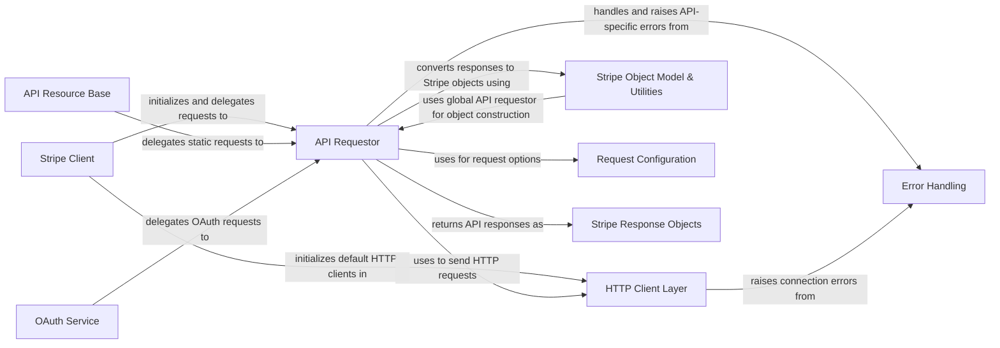

## Component Details

The API Communication Layer in the stripe-python library is responsible for managing the entire lifecycle of API requests. This includes constructing requests with appropriate options, handling the underlying HTTP communication with retry mechanisms, interpreting various API responses, and converting them into structured Python objects. It also encompasses robust error handling for both network and API-specific issues, and provides a clear entry point for developers to interact with the Stripe API.

### API Requestor
This component is the core of the API interaction, responsible for constructing, sending, and interpreting responses from the Stripe API. It manages request options, handles API-specific error responses, and converts raw JSON responses into Stripe objects.

**Related Classes/Methods**:

- `stripe._api_requestor._APIRequestor` (full file reference)

### HTTP Client Layer
This component is responsible for managing the underlying HTTP connections and sending requests to the Stripe API. It includes various implementations for different HTTP libraries (e.g., Requests, httpx, urllib2) and handles retry logic, telemetry, and basic error handling related to network issues.

**Related Classes/Methods**:

- `stripe._http_client.HTTPClient` (full file reference)

### Stripe Client
This is the primary entry point for developers to interact with the Stripe API. It manages the API key, initializes the API requestor, and provides access to various Stripe service clients (e.g., ChargeService, CustomerService).

**Related Classes/Methods**:

- `stripe._stripe_client.StripeClient` (full file reference)

### Error Handling
This component defines and manages the various types of errors that can be returned by the Stripe API or encountered during the request process, providing specific error classes for different scenarios.

**Related Classes/Methods**:

- `stripe._error.StripeError` (full file reference)
- `stripe.oauth_error.OAuthError` (full file reference)

### Stripe Object Model & Utilities
This component is responsible for converting raw API responses into structured Python objects that represent Stripe resources. It also includes general utility functions used across the library for logging, API mode detection, and data conversion.

**Related Classes/Methods**:

- `stripe._util` (full file reference)
- `stripe._stripe_object.StripeObject` (full file reference)

### Request Configuration
This component handles the management and application of various options and configurations for API requests, including API keys, idempotency keys, and other request-specific settings.

**Related Classes/Methods**:

- `stripe._request_options` (full file reference)

### Stripe Response Objects
This component defines the data structures used to encapsulate the responses received from the Stripe API, including both standard and streaming responses.

**Related Classes/Methods**:

- `stripe._stripe_response.StripeResponse` (full file reference)
- `stripe._stripe_response.StripeStreamResponse` (full file reference)

### API Resource Base
This component provides the foundational methods and properties for all specific Stripe API resources (e.g., Charge, Customer). It includes static methods for making requests related to a resource.

**Related Classes/Methods**:

- `stripe._api_resource.APIResource` (full file reference)

### OAuth Service
This component provides methods for interacting with Stripe's OAuth API, enabling applications to connect with Stripe accounts.

**Related Classes/Methods**:

- `stripe._oauth.OAuth` (full file reference)
- `stripe._oauth_service.OAuthService` (full file reference)

### [FAQ](https://github.com/CodeBoarding/GeneratedOnBoardings/tree/main?tab=readme-ov-file#faq)