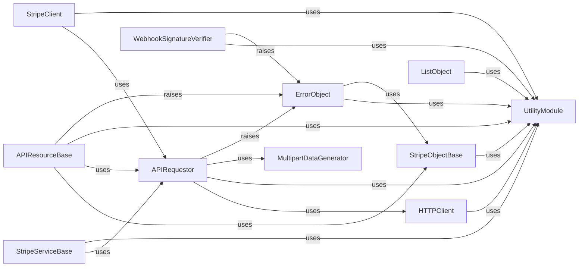

## Component Details

This graph illustrates the core components of the Stripe Python library, focusing on the flow of API requests and responses. The main purpose is to abstract the complexities of HTTP communication, data serialization, and error handling, providing a user-friendly interface for interacting with the Stripe API. The flow generally starts with a `StripeClient` or an `APIResourceBase` (or its subclasses) initiating a request, which is then processed by the `APIRequestor` for authentication and error handling. The `HTTPClient` handles the low-level network communication, and `UtilityModule` provides essential helper functions throughout the process. Responses are deserialized into `StripeObjectBase` or `ListObject` instances, while errors are represented by `ErrorObject`.

### UtilityModule
This module provides a collection of helper functions used throughout the Stripe Python library. These utilities include sanitizing IDs, logging debug and info messages, determining the Stripe environment (test or live), converting data to Stripe objects or dictionaries, and securely comparing strings for webhook signature verification.

**Related Classes/Methods**:

- `stripe-python.stripe._util.log_debug` (full file reference)
- `stripe-python.stripe._util.log_info` (full file reference)
- `stripe-python.stripe._util.dashboard_link` (full file reference)
- `stripe-python.stripe._util.logfmt` (full file reference)
- `stripe-python.stripe._util.convert_to_stripe_object` (full file reference)
- `stripe-python.stripe._util._convert_to_stripe_object` (full file reference)
- `stripe-python.stripe._util.convert_to_dict` (full file reference)
- `stripe-python.stripe._util.sanitize_id` (full file reference)
- `stripe-python.stripe._util.class_method_variant` (full file reference)
- `stripe-python.stripe._util.merge_dicts` (full file reference)
- `stripe-python.stripe._util.secure_compare` (full file reference)
- `stripe-python.stripe._util.get_api_mode` (full file reference)
- `stripe-python.stripe._util._console_log_level` (full file reference)
- `stripe-python.stripe._util._test_or_live_environment` (full file reference)
- `stripe-python.stripe._util.get_thin_event_classes` (full file reference)
- `stripe-python.stripe._util.get_object_classes` (full file reference)

### APIResourceBase
This is the foundational base class for all Stripe API resources. It provides common functionalities for interacting with the Stripe API, including constructing API request URLs, making static and instance-level requests, and refreshing object data from API responses. It abstracts away the underlying HTTP communication details.

**Related Classes/Methods**:

- `stripe-python.stripe._api_resource.APIResource:instance_url` (full file reference)
- `stripe-python.stripe._api_resource.APIResource:_request` (full file reference)
- `stripe-python.stripe._api_resource.APIResource:_request_async` (full file reference)
- `stripe-python.stripe._api_resource.APIResource:_request_and_refresh` (full file reference)
- `stripe-python.stripe._api_resource.APIResource:_request_and_refresh_async` (full file reference)
- `stripe-python.stripe._api_resource.APIResource:_static_request` (full file reference)
- `stripe-python.stripe._api_resource.APIResource:_static_request_async` (full file reference)
- `stripe-python.stripe._api_resource.APIResource:_static_request_stream` (full file reference)
- `stripe-python.stripe._api_resource.APIResource:_static_request_stream_async` (full file reference)
- `stripe-python.stripe._api_resource.APIResource.class_url` (full file reference)
- `stripe-python.stripe._api_resource.APIResource.refresh` (full file reference)
- `stripe-python.stripe._api_resource.APIResource.refresh_async` (full file reference)

### StripeServiceBase
This component serves as the base class for all specific Stripe service objects (e.g., CustomerService, PaymentIntentService). It provides a consistent interface for making API requests related to a particular resource type, delegating the actual HTTP communication to the underlying API requestor.

**Related Classes/Methods**:

- `stripe-python.stripe._stripe_service.StripeService._request` (full file reference)
- `stripe-python.stripe._stripe_service.StripeService._request_async` (full file reference)
- `stripe-python.stripe._stripe_service.StripeService._request_stream` (full file reference)
- `stripe-python.stripe._stripe_service.StripeService._request_stream_async` (full file reference)
- `stripe-python.stripe._stripe_service.StripeService.__init__` (full file reference)

### HTTPClient
This component is responsible for handling the low-level HTTP communication with the Stripe API. It manages connection details, retries for transient errors, and incorporates telemetry headers for request metrics. It provides both synchronous and asynchronous request methods.

**Related Classes/Methods**:

- `stripe-python.stripe._http_client.HTTPClient:_sleep_time_seconds` (full file reference)
- `stripe-python.stripe._http_client.HTTPClient:_add_telemetry_header` (full file reference)
- `stripe-python.stripe._http_client.HTTPClient:_record_request_metrics` (full file reference)
- `stripe-python.stripe._http_client.HTTPClient:_request_with_retries_internal` (full file reference)
- `stripe-python.stripe._http_client.HTTPClient:_request_with_retries_internal_async` (full file reference)
- `stripe-python.stripe._http_client.HTTPClient.request_stream` (full file reference)
- `stripe-python.stripe._http_client.HTTPClient.request` (full file reference)
- `stripe-python.stripe._http_client.HTTPClient._should_retry` (full file reference)
- `stripe-python.stripe._http_client.HTTPClient.sleep_async` (full file reference)
- `stripe-python.stripe._http_client.HTTPClient._add_jitter_time` (full file reference)
- `stripe-python.stripe._http_client.HTTPClient._retry_after_header` (full file reference)
- `stripe-python.stripe._http_client._now_ms` (full file reference)
- `stripe-python.stripe._http_client.HTTPClient.request_stream_with_retries` (full file reference)
- `stripe-python.stripe._http_client.HTTPClient.request_stream_with_retries_async` (full file reference)
- `stripe-python.stripe._http_client.HTTPClient.request_with_retries` (full file reference)
- `stripe-python.stripe._http_client.HTTPClient.request_with_retries_async` (full file reference)

### APIRequestor
This component orchestrates the entire API request lifecycle. It prepares request arguments, handles authentication, makes HTTP calls using the HTTPClient, and interprets the raw responses, converting them into appropriate Stripe objects or raising specific API errors. It also manages global API options.

**Related Classes/Methods**:

- `stripe-python.stripe._api_requestor._APIRequestor:request` (full file reference)
- `stripe-python.stripe._api_requestor._APIRequestor:request_async` (full file reference)
- `stripe-python.stripe._api_requestor._APIRequestor:request_stream` (full file reference)
- `stripe-python.stripe._api_requestor._APIRequestor:request_stream_async` (full file reference)
- `stripe-python.stripe._api_requestor._APIRequestor:specific_v2_api_error` (full file reference)
- `stripe-python.stripe._api_requestor._APIRequestor:specific_v1_api_error` (full file reference)
- `stripe-python.stripe._api_requestor._APIRequestor:specific_oauth_error` (full file reference)
- `stripe-python.stripe._api_requestor._APIRequestor:_args_for_request_with_retries` (full file reference)
- `stripe-python.stripe._api_requestor._APIRequestor:request_raw` (full file reference)
- `stripe-python.stripe._api_requestor._APIRequestor:request_raw_async` (full file reference)
- `stripe-python.stripe._api_requestor._APIRequestor._replace_options` (full file reference)
- `stripe-python.stripe._api_requestor._APIRequestor._interpret_response` (full file reference)
- `stripe-python.stripe._api_requestor._APIRequestor._interpret_streaming_response` (full file reference)
- `stripe-python.stripe._api_requestor._APIRequestor._interpret_streaming_response_async` (full file reference)
- `stripe-python.stripe._api_requestor._APIRequestor.request_headers` (full file reference)
- `stripe-python.stripe._api_requestor._APIRequestor._get_http_client` (full file reference)
- `stripe-python.stripe._api_requestor._APIRequestor._global_with_options` (full file reference)
- `stripe-python.stripe._api_requestor._APIRequestor._global_instance` (full file reference)

### StripeObjectBase
This is the fundamental base class for all data objects returned by the Stripe API. It provides mechanisms for deserializing raw data into structured Stripe objects and refreshing their attributes from new API responses.

**Related Classes/Methods**:

- `stripe-python.stripe._stripe_object.StripeObject:_refresh_from` (full file reference)
- `stripe-python.stripe._stripe_object.StripeObject:_request` (full file reference)
- `stripe-python.stripe._stripe_object.StripeObject:_request_async` (full file reference)
- `stripe-python.stripe._stripe_object.StripeObject:_request_stream` (full file reference)
- `stripe-python.stripe._stripe_object.StripeObject:_request_stream_async` (full file reference)
- `stripe-python.stripe._stripe_object.StripeObject._get_inner_class_type` (full file reference)
- `stripe-python.stripe._stripe_object.StripeObject._get_inner_class_is_beneath_dict` (full file reference)

### ListObject
This component represents a paginated list of Stripe objects. It provides convenient methods to navigate through the list, fetching the next or previous pages of results from the Stripe API.

**Related Classes/Methods**:

- `stripe-python.stripe._list_object.ListObject:next_page` (full file reference)
- `stripe-python.stripe._list_object.ListObject:next_page_async` (full file reference)
- `stripe-python.stripe._list_object.ListObject:previous_page` (full file reference)
- `stripe-python.stripe._list_object.ListObject:previous_page_async` (full file reference)
- `stripe-python.stripe._list_object.ListObject._empty_list` (full file reference)
- `stripe-python.stripe._list_object.ListObject.list` (full file reference)
- `stripe-python.stripe._list_object.ListObject.list_async` (full file reference)
- `stripe-python.stripe._list_object.ListObject._get_filters_for_next_page` (full file reference)
- `stripe-python.stripe._list_object.ListObject._get_filters_for_previous_page` (full file reference)

### WebhookSignatureVerifier
This component is responsible for verifying the authenticity of incoming webhook events from Stripe. It ensures that the webhook payload has not been tampered with and originates from Stripe by validating its signature.

**Related Classes/Methods**:

- `stripe-python.stripe._webhook.WebhookSignature:verify_header` (full file reference)
- `stripe-python.stripe._webhook.WebhookSignature._get_timestamp_and_signatures` (full file reference)
- `stripe-python.stripe._webhook.WebhookSignature._compute_signature` (full file reference)

### StripeClient
This is the primary client interface for the Stripe Python library. It provides high-level methods for making raw API requests and deserializing the responses into appropriate Stripe objects, serving as the main entry point for developers to interact with the Stripe API.

**Related Classes/Methods**:

- `stripe-python.stripe._stripe_client.StripeClient:raw_request` (full file reference)
- `stripe-python.stripe._stripe_client.StripeClient:raw_request_async` (full file reference)
- `stripe-python.stripe._stripe_client.StripeClient:deserialize` (full file reference)

### MultipartDataGenerator
This utility component is used to construct multipart/form-data payloads, primarily for uploading files to the Stripe API. It handles the formatting of parameters and file content into the correct multipart format.

**Related Classes/Methods**:

- `stripe-python.stripe._multipart_data_generator.MultipartDataGenerator:add_params` (full file reference)
- `stripe-python.stripe._multipart_data_generator.MultipartDataGenerator._write` (full file reference)
- `stripe-python.stripe._multipart_data_generator.MultipartDataGenerator.param_header` (full file reference)
- `stripe-python.stripe._multipart_data_generator.MultipartDataGenerator._write_file` (full file reference)

### ErrorObject
This component serves as the base class for all error objects returned by the Stripe API. It provides a standardized structure for error responses, allowing for consistent handling of API errors within the library.

**Related Classes/Methods**:

- `stripe-python.stripe._error_object.ErrorObject:_refresh_from` (full file reference)
- `stripe-python.stripe._error_object.OAuthErrorObject:_refresh_from` (full file reference)
- `stripe-python.stripe._error.InvalidRequestError` (full file reference)
- `stripe-python.stripe._error.SignatureVerificationError` (full file reference)
- `stripe-python.stripe._error.IdempotencyError` (full file reference)
- `stripe-python.stripe._error.TemporarySessionExpiredError` (full file reference)
- `stripe-python.stripe._error.RateLimitError` (full file reference)
- `stripe-python.stripe._error.AuthenticationError` (full file reference)
- `stripe-python.stripe._error.CardError` (full file reference)
- `stripe-python.stripe._error.PermissionError` (full file reference)
- `stripe-python.stripe._error.APIError` (full file reference)
- `stripe-python.stripe.oauth_error.InvalidClientError` (full file reference)
- `stripe-python.stripe.oauth_error.InvalidGrantError` (full file reference)
- `stripe-python.stripe.oauth_error.InvalidRequestError` (full file reference)
- `stripe-python.stripe.oauth_error.InvalidScopeError` (full file reference)
- `stripe-python.stripe.oauth_error.UnsupportedGrantTypeError` (full file reference)
- `stripe-python.stripe.oauth_error.UnsupportedResponseTypeError` (full file reference)

### [FAQ](https://github.com/CodeBoarding/GeneratedOnBoardings/tree/main?tab=readme-ov-file#faq)