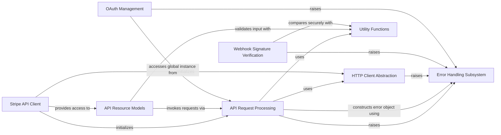

## Component Details

This graph illustrates the architecture of the Stripe Python library, focusing on its core components and their interactions. It encompasses error handling, API request processing, HTTP client abstraction, the main API client, API resource models, webhook signature verification, OAuth management, and various utility functions. The system is designed to provide a robust and user-friendly interface for interacting with the Stripe API, ensuring secure communication and structured error reporting.

### Error Handling Subsystem
This component defines a comprehensive hierarchy of custom exception classes for various API and OAuth-related errors within the Stripe Python library. It provides structured error information, including details like message, HTTP status, request ID, and specific error codes. It also includes mechanisms for parsing raw API error responses into these structured error objects.

**Related Classes/Methods**:

- `stripe._error.StripeError` (full file reference)
- `stripe._error.APIConnectionError` (full file reference)
- `stripe._error.CardError` (full file reference)
- `stripe._error.InvalidRequestError` (full file reference)
- `stripe._error.SignatureVerificationError` (full file reference)
- `stripe.oauth_error.OAuthError` (full file reference)
- `stripe._error.APIError` (full file reference)
- `stripe._error.IdempotencyError` (full file reference)
- `stripe._error.TemporarySessionExpiredError` (full file reference)
- `stripe._error.RateLimitError` (full file reference)
- `stripe._error.AuthenticationError` (full file reference)
- `stripe._error.PermissionError` (full file reference)
- `stripe.oauth_error.InvalidClientError` (full file reference)
- `stripe.oauth_error.InvalidGrantError` (full file reference)
- `stripe.oauth_error.InvalidRequestError` (full file reference)
- `stripe.oauth_error.InvalidScopeError` (full file reference)
- `stripe.oauth_error.UnsupportedGrantTypeError` (full file reference)
- `stripe.oauth_error.UnsupportedResponseTypeError` (full file reference)
- `stripe._error.StripeErrorWithParamCode` (full file reference)
- `stripe._error_object.ErrorObject` (full file reference)
- `stripe._error_object.OAuthErrorObject` (full file reference)

### API Request Processing
This component manages the entire lifecycle of an API request, from preparing the request parameters and headers to sending the request, interpreting the raw response, and handling any API-specific errors. It also includes mechanisms for encoding data and generating multipart data for file uploads.

**Related Classes/Methods**:

- `stripe._api_requestor._APIRequestor` (full file reference)
- `stripe._stripe_response.StripeResponse` (full file reference)
- `stripe._encode._api_encode` (full file reference)
- `stripe._multipart_data_generator.MultipartDataGenerator` (full file reference)

### HTTP Client Abstraction
This component provides a standardized interface for making HTTP requests using various underlying Python HTTP libraries. It abstracts away the specifics of each client, allowing the API Request Processing component to interact with different HTTP backends seamlessly and handle common request errors.

**Related Classes/Methods**:

- `stripe._http_client.RequestsClient` (full file reference)
- `stripe._http_client.UrlFetchClient` (full file reference)
- `stripe._http_client.PycurlClient` (full file reference)
- `stripe._http_client.Urllib2Client` (full file reference)
- `stripe._http_client.HTTPXClient` (full file reference)
- `stripe._http_client.AIOHTTPClient` (full file reference)
- `stripe._http_client.new_default_http_client` (full file reference)
- `stripe._http_client.new_http_client_async_fallback` (full file reference)

### Stripe API Client
This is the main entry point for developers to interact with the Stripe API. It initializes and manages the underlying API requestor and HTTP client, and provides access to a comprehensive set of service objects, each corresponding to a specific Stripe API resource (e.g., Customers, Charges, Payments).

**Related Classes/Methods**:

- `stripe._stripe_client.StripeClient` (full file reference)
- `stripe._requestor_options.RequestorOptions` (full file reference)
- `stripe._client_options._ClientOptions` (full file reference)
- `stripe._oauth_service.OAuthService` (full file reference)
- `stripe._account_service.AccountService` (full file reference)
- `stripe._account_link_service.AccountLinkService` (full file reference)
- `stripe._account_session_service.AccountSessionService` (full file reference)
- `stripe._apple_pay_domain_service.ApplePayDomainService` (full file reference)
- `stripe._application_fee_service.ApplicationFeeService` (full file reference)
- `stripe._apps_service.AppsService` (full file reference)
- `stripe._balance_service.BalanceService` (full file reference)
- `stripe._balance_transaction_service.BalanceTransactionService` (full file reference)
- `stripe._billing_service.BillingService` (full file reference)
- `stripe._billing_portal_service.BillingPortalService` (full file reference)
- `stripe._charge_service.ChargeService` (full file reference)
- `stripe._checkout_service.CheckoutService` (full file reference)
- `stripe._climate_service.ClimateService` (full file reference)
- `stripe._confirmation_token_service.ConfirmationTokenService` (full file reference)
- `stripe._test_helpers_service.TestHelpersService` (full file reference)
- `stripe._country_spec_service.CountrySpecService` (full file reference)
- `stripe._coupon_service.CouponService` (full file reference)
- `stripe._credit_note_service.CreditNoteService` (full file reference)
- `stripe._customer_service.CustomerService` (full file reference)
- `stripe._customer_session_service.CustomerSessionService` (full file reference)
- `stripe._dispute_service.DisputeService` (full file reference)
- `stripe._entitlements_service.EntitlementsService` (full file reference)
- `stripe._ephemeral_key_service.EphemeralKeyService` (full file reference)
- `stripe._event_service.EventService` (full file reference)
- `stripe._exchange_rate_service.ExchangeRateService` (full file reference)
- `stripe._file_service.FileService` (full file reference)
- `stripe._file_link_service.FileLinkService` (full file reference)
- `stripe._financial_connections_service.FinancialConnectionsService` (full file reference)
- `stripe._forwarding_service.ForwardingService` (full file reference)
- `stripe._identity_service.IdentityService` (full file reference)
- `stripe._invoice_service.InvoiceService` (full file reference)
- `stripe._invoice_payment_service.InvoicePaymentService` (full file reference)
- `stripe._invoice_rendering_template_service.InvoiceRenderingTemplateService` (full file reference)
- `stripe._invoice_item_service.InvoiceItemService` (full file reference)
- `stripe._issuing_service.IssuingService` (full file reference)
- <a href="https://github.com/stripe/stripe-python/blob/master/stripe/_mandate_service.py#L11-L56" target="_blank" rel="noopener noreferrer">`stripe._mandate_service.MandateService` (11:56)</a>
- `stripe._payment_intent_service.PaymentIntentService` (full file reference)
- `stripe._payment_link_service.PaymentLinkService` (full file reference)
- `stripe._payment_method_service.PaymentMethodService` (full file reference)
- `stripe._payment_method_configuration_service.PaymentMethodConfigurationService` (full file reference)
- `stripe._payment_method_domain_service.PaymentMethodDomainService` (full file reference)
- `stripe._payout_service.PayoutService` (full file reference)
- `stripe._plan_service.PlanService` (full file reference)
- `stripe._price_service.PriceService` (full file reference)
- `stripe._product_service.ProductService` (full file reference)
- `stripe._promotion_code_service.PromotionCodeService` (full file reference)
- `stripe._quote_service.QuoteService` (full file reference)
- `stripe._radar_service.RadarService` (full file reference)
- `stripe._refund_service.RefundService` (full file reference)
- `stripe._reporting_service.ReportingService` (full file reference)
- `stripe._review_service.ReviewService` (full file reference)
- `stripe._sigma_service.SigmaService` (full file reference)
- `stripe._setup_attempt_service.SetupAttemptService` (full file reference)
- `stripe._setup_intent_service.SetupIntentService` (full file reference)
- `stripe._shipping_rate_service.ShippingRateService` (full file reference)
- `stripe._source_service.SourceService` (full file reference)
- `stripe._subscription_service.SubscriptionService` (full file reference)
- `stripe._subscription_item_service.SubscriptionItemService` (full file reference)
- `stripe._subscription_schedule_service.SubscriptionScheduleService` (full file reference)
- `stripe._tax_service.TaxService` (full file reference)
- `stripe._tax_code_service.TaxCodeService` (full file reference)
- `stripe._tax_id_service.TaxIdService` (full file reference)
- `stripe._tax_rate_service.TaxRateService` (full file reference)
- `stripe._terminal_service.TerminalService` (full file reference)
- `stripe._token_service.TokenService` (full file reference)
- `stripe._topup_service.TopupService` (full file reference)
- `stripe._transfer_service.TransferService` (full file reference)
- `stripe._treasury_service.TreasuryService` (full file reference)
- `stripe._webhook_endpoint_service.WebhookEndpointService` (full file reference)
- `stripe._v2_services.V2Services` (full file reference)

### API Resource Models
These components represent the various data objects returned by the Stripe API. They provide methods for accessing object properties and performing actions directly on the resource, often by making further API calls through the API Request Processing component.

**Related Classes/Methods**:

- `stripe._stripe_object.StripeObject` (full file reference)
- `stripe._api_resource.APIResource` (full file reference)
- `stripe._bank_account.BankAccount` (full file reference)
- `stripe._source.Source` (full file reference)
- `stripe._card.Card` (full file reference)

### Webhook Signature Verification
This specialized component is responsible for securely validating the authenticity and integrity of incoming webhook events from Stripe, preventing tampering and ensuring that events originate from Stripe.

**Related Classes/Methods**:

- `stripe._webhook.WebhookSignature` (full file reference)

### OAuth Management
This component handles the specific functionalities related to Stripe Connect OAuth, including initiating the authorization flow, exchanging authorization codes for access tokens, and deauthorizing connected accounts.

**Related Classes/Methods**:

- `stripe._oauth.OAuth` (full file reference)

### Utility Functions
This component provides a collection of general-purpose helper functions used throughout the Stripe Python library for tasks such as logging information, securely comparing strings (e.g., for webhook signatures), and sanitizing input IDs.

**Related Classes/Methods**:

- `stripe._util.log_info` (full file reference)
- `stripe._util.secure_compare` (full file reference)
- `stripe._util.sanitize_id` (full file reference)

### [FAQ](https://github.com/CodeBoarding/GeneratedOnBoardings/tree/main?tab=readme-ov-file#faq)