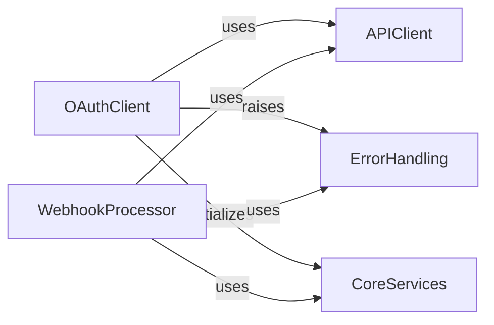

## Component Details

This subsystem manages specialized interactions with the Stripe API, focusing on OAuth authentication flows and the processing and verification of Stripe webhook events. It encompasses client-side OAuth logic, secure webhook handling, core API request functionalities, and a structured error handling mechanism, all supported by foundational utility services.

### OAuthClient
Handles the client-side logic for Stripe OAuth, including authorization URL generation, token exchange, and deauthorization. This component encapsulates the methods for interacting with Stripe's OAuth endpoints.

**Related Classes/Methods**:

- `stripe._oauth.OAuth` (full file reference)
- `stripe._oauth_service.OAuthService` (full file reference)
- `stripe._oauth_service.OAuthService:__init__` (full file reference)
- `stripe._oauth_service.OAuthService:_set_client_id` (full file reference)
- `stripe._oauth_service.OAuthService:authorize_url` (full file reference)
- `stripe._oauth_service.OAuthService:deauthorize` (full file reference)
- `stripe._oauth.OAuth:_set_client_id` (full file reference)
- `stripe._oauth.OAuth:authorize_url` (full file reference)
- `stripe._oauth.OAuth:token` (full file reference)
- `stripe._oauth.OAuth:deauthorize` (full file reference)

### WebhookProcessor
Manages the processing and verification of Stripe webhooks, ensuring the integrity and authenticity of incoming events. This component includes functionality for constructing event objects and verifying webhook signatures.

**Related Classes/Methods**:

- `stripe._webhook.Webhook` (full file reference)
- `stripe._webhook.WebhookSignature` (full file reference)
- `stripe._webhook.Webhook:construct_event` (full file reference)
- `stripe._webhook.WebhookSignature:verify_header` (full file reference)
- `stripe._webhook.WebhookSignature._get_timestamp_and_signatures` (full file reference)
- `stripe._webhook.WebhookSignature._compute_signature` (full file reference)

### APIClient
Provides the core functionality for making API requests to the Stripe platform. This includes encoding parameters for API calls and managing global API requestor instances for various operations.

**Related Classes/Methods**:

- `stripe._api_requestor._APIRequestor._global_instance` (full file reference)
- `stripe._api_requestor._APIRequestor._global_with_options` (full file reference)
- `stripe._encode._api_encode` (full file reference)

### ErrorHandling
Defines and manages specific error types for various failure scenarios within the Stripe Python library. This component provides structured exceptions for issues like authentication failures and signature verification errors.

**Related Classes/Methods**:

- `stripe._error.AuthenticationError` (full file reference)
- `stripe._error.SignatureVerificationError` (full file reference)

### CoreServices
Offers fundamental services and utility functions that support various parts of the Stripe Python library. This includes base service initialization, constructing Stripe objects from raw data, and secure comparison utilities.

**Related Classes/Methods**:

- `stripe._stripe_service.StripeService.__init__` (full file reference)
- `stripe._stripe_object.StripeObject._construct_from` (full file reference)
- `stripe._util.secure_compare` (full file reference)

### [FAQ](https://github.com/CodeBoarding/GeneratedOnBoardings/tree/main?tab=readme-ov-file#faq)