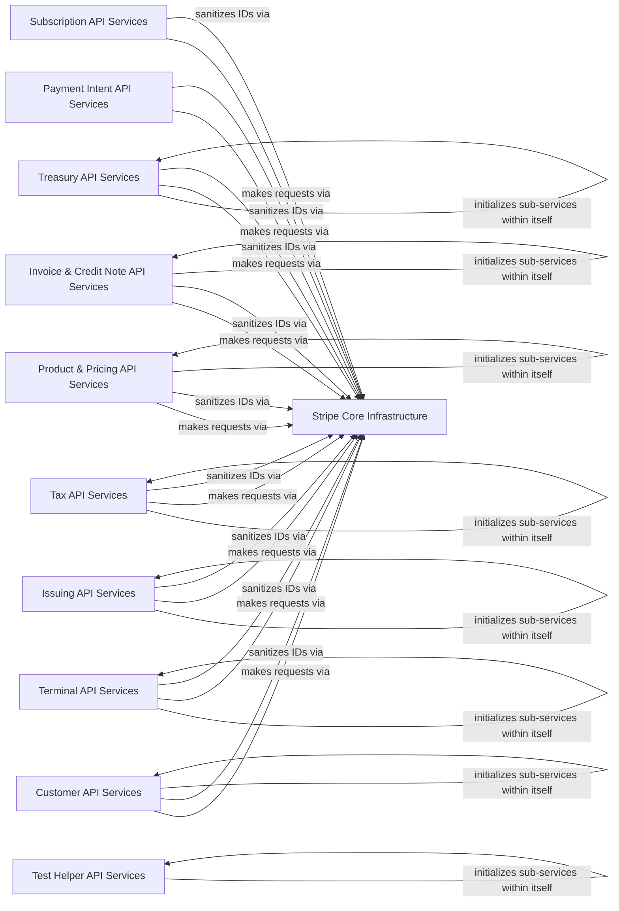

## Component Details

The Stripe API Services component provides a comprehensive interface for interacting with various Stripe products and functionalities. It is structured into several specialized sub-components, each responsible for a specific domain such as customer management, payment processing, subscriptions, invoicing, treasury operations, terminal interactions, card issuing, and tax calculations. These sub-components leverage a core infrastructure layer for making API requests and handling common utilities, ensuring consistent and efficient communication with the Stripe platform.

### Stripe Core Infrastructure
This component provides the fundamental infrastructure for interacting with the Stripe API, including the base service for making requests and utility functions for data sanitization.

**Related Classes/Methods**:

- `stripe._stripe_service.StripeService` (full file reference)
- `stripe._stripe_service.StripeService._request` (full file reference)
- `stripe._stripe_service.StripeService._request_async` (full file reference)
- `stripe._stripe_service.StripeService.__init__` (full file reference)
- `stripe._util.sanitize_id` (full file reference)

### Customer API Services
This component encapsulates all services related to managing customer entities within Stripe, including their financial details, payment methods, and tax information.

**Related Classes/Methods**:

- `stripe._customer_service.CustomerService` (full file reference)
- `stripe._customer_service.CustomerService:__init__` (full file reference)
- `stripe._customer_service.CustomerService:delete` (full file reference)
- `stripe._customer_service.CustomerService:delete_async` (full file reference)
- `stripe._customer_service.CustomerService:retrieve` (full file reference)
- `stripe._customer_service.CustomerService:retrieve_async` (full file reference)
- `stripe._customer_service.CustomerService:update` (full file reference)
- `stripe._customer_service.CustomerService:update_async` (full file reference)
- `stripe._customer_service.CustomerService:delete_discount` (full file reference)
- `stripe._customer_service.CustomerService:delete_discount_async` (full file reference)
- `stripe._customer_service.CustomerService:list` (full file reference)
- `stripe._customer_service.CustomerService:list_async` (full file reference)
- `stripe._customer_service.CustomerService:create` (full file reference)
- `stripe._customer_service.CustomerService:create_async` (full file reference)
- `stripe._customer_service.CustomerService:search` (full file reference)
- `stripe._customer_service.CustomerService:search_async` (full file reference)
- `stripe._customer_cash_balance_service.CustomerCashBalanceService` (full file reference)
- `stripe._customer_balance_transaction_service.CustomerBalanceTransactionService` (full file reference)
- `stripe._customer_cash_balance_transaction_service.CustomerCashBalanceTransactionService` (full file reference)
- `stripe._customer_payment_source_service.CustomerPaymentSourceService` (full file reference)
- `stripe._customer_tax_id_service.CustomerTaxIdService` (full file reference)
- `stripe._customer_payment_method_service.CustomerPaymentMethodService` (full file reference)
- `stripe._customer_funding_instructions_service.CustomerFundingInstructionsService` (full file reference)

### Payment Intent API Services
This component handles the lifecycle of payment intents, from creation and confirmation to cancellation and capture, facilitating various payment flows.

**Related Classes/Methods**:

- `stripe._payment_intent_service.PaymentIntentService` (full file reference)
- `stripe._payment_intent_service.PaymentIntentService:list` (full file reference)
- `stripe._payment_intent_service.PaymentIntentService:list_async` (full file reference)
- `stripe._payment_intent_service.PaymentIntentService:create` (full file reference)
- `stripe._payment_intent_service.PaymentIntentService:create_async` (full file reference)
- `stripe._payment_intent_service.PaymentIntentService:retrieve` (full file reference)
- `stripe._payment_intent_service.PaymentIntentService:retrieve_async` (full file reference)
- `stripe._payment_intent_service.PaymentIntentService:update` (full file reference)
- `stripe._payment_intent_service.PaymentIntentService:update_async` (full file reference)
- `stripe._payment_intent_service.PaymentIntentService:search` (full file reference)
- `stripe._payment_intent_service.PaymentIntentService:search_async` (full file reference)
- `stripe._payment_intent_service.PaymentIntentService:apply_customer_balance` (full file reference)
- `stripe._payment_intent_service.PaymentIntentService:apply_customer_balance_async` (full file reference)
- `stripe._payment_intent_service.PaymentIntentService:cancel` (full file reference)
- `stripe._payment_intent_service.PaymentIntentService:cancel_async` (full file reference)
- `stripe._payment_intent_service.PaymentIntentService:capture` (full file reference)
- `stripe._payment_intent_service.PaymentIntentService:capture_async` (full file reference)
- `stripe._payment_intent_service.PaymentIntentService:confirm` (full file reference)
- `stripe._payment_intent_service.PaymentIntentService:confirm_async` (full file reference)
- `stripe._payment_intent_service.PaymentIntentService:increment_authorization` (full file reference)
- `stripe._payment_intent_service.PaymentIntentService:increment_authorization_async` (full file reference)
- `stripe._payment_intent_service.PaymentIntentService:verify_microdeposits` (full file reference)
- `stripe._payment_intent_service.PaymentIntentService:verify_microdeposits_async` (full file reference)

### Subscription API Services
This component manages recurring billing and subscription-related operations, including creating, updating, and canceling subscriptions.

**Related Classes/Methods**:

- `stripe._subscription_service.SubscriptionService` (full file reference)
- `stripe._subscription_service.SubscriptionService:cancel` (full file reference)
- `stripe._subscription_service.SubscriptionService:cancel_async` (full file reference)
- `stripe._subscription_service.SubscriptionService:retrieve` (full file reference)
- `stripe._subscription_service.SubscriptionService:retrieve_async` (full file reference)
- `stripe._subscription_service.SubscriptionService:update` (full file reference)
- `stripe._subscription_service.SubscriptionService:update_async` (full file reference)
- `stripe._subscription_service.SubscriptionService:delete_discount` (full file reference)
- `stripe._subscription_service.SubscriptionService:delete_discount_async` (full file reference)
- `stripe._subscription_service.SubscriptionService:list` (full file reference)
- `stripe._subscription_service.SubscriptionService:list_async` (full file reference)
- `stripe._subscription_service.SubscriptionService:create` (full file reference)
- `stripe._subscription_service.SubscriptionService:create_async` (full file reference)
- `stripe._subscription_service.SubscriptionService:search` (full file reference)
- `stripe._subscription_service.SubscriptionService:search_async` (full file reference)
- `stripe._subscription_service.SubscriptionService:resume` (full file reference)
- `stripe._subscription_service.SubscriptionService:resume_async` (full file reference)

### Test Helper API Services
This component provides a suite of services designed to assist developers in testing their Stripe integrations without affecting live data, covering various Stripe functionalities.

**Related Classes/Methods**:

- `stripe._test_helpers_service.TestHelpersService` (full file reference)
- `stripe._test_helpers_service.TestHelpersService:__init__` (full file reference)
- `stripe.test_helpers._confirmation_token_service.ConfirmationTokenService` (full file reference)
- `stripe.test_helpers._customer_service.CustomerService` (full file reference)
- `stripe.test_helpers._issuing_service.IssuingService` (full file reference)
- `stripe.test_helpers._refund_service.RefundService` (full file reference)
- `stripe.test_helpers._terminal_service.TerminalService` (full file reference)
- `stripe.test_helpers._test_clock_service.TestClockService` (full file reference)
- <a href="https://github.com/stripe/stripe-python/blob/master/stripe/test_helpers/_treasury_service.py#L21-L28" target="_blank" rel="noopener noreferrer">`stripe.test_helpers._treasury_service.TreasuryService` (21:28)</a>

### Product & Pricing API Services
This component manages the product catalog and pricing models, including products, plans, coupons, and promotion codes.

**Related Classes/Methods**:

- `stripe._plan_service.PlanService` (full file reference)
- `stripe._plan_service.PlanService:delete` (full file reference)
- `stripe._plan_service.PlanService:delete_async` (full file reference)
- `stripe._plan_service.PlanService:retrieve` (full file reference)
- `stripe._plan_service.PlanService:retrieve_async` (full file reference)
- `stripe._plan_service.PlanService:update` (full file reference)
- `stripe._plan_service.PlanService:update_async` (full file reference)
- `stripe._plan_service.PlanService:list` (full file reference)
- `stripe._plan_service.PlanService:list_async` (full file reference)
- `stripe._plan_service.PlanService:create` (full file reference)
- `stripe._plan_service.PlanService:create_async` (full file reference)
- `stripe._product_service.ProductService` (full file reference)
- `stripe._product_service.ProductService:__init__` (full file reference)
- `stripe._product_service.ProductService:delete` (full file reference)
- `stripe._product_service.ProductService:delete_async` (full file reference)
- `stripe._product_service.ProductService:retrieve` (full file reference)
- `stripe._product_service.ProductService:retrieve_async` (full file reference)
- `stripe._product_service.ProductService:update` (full file reference)
- `stripe._product_service.ProductService:update_async` (full file reference)
- `stripe._product_service.ProductService:list` (full file reference)
- `stripe._product_service.ProductService:list_async` (full file reference)
- `stripe._product_service.ProductService:create` (full file reference)
- `stripe._product_service.ProductService:create_async` (full file reference)
- `stripe._product_service.ProductService:search` (full file reference)
- `stripe._product_service.ProductService:search_async` (full file reference)
- `stripe._product_feature_service.ProductFeatureService` (full file reference)
- `stripe._coupon_service.CouponService` (full file reference)
- `stripe._coupon_service.CouponService:delete` (full file reference)
- `stripe._coupon_service.CouponService:delete_async` (full file reference)
- `stripe._coupon_service.CouponService:retrieve` (full file reference)
- `stripe._coupon_service.CouponService:retrieve_async` (full file reference)
- `stripe._coupon_service.CouponService:update` (full file reference)
- `stripe._coupon_service.CouponService:update_async` (full file reference)
- `stripe._coupon_service.CouponService:list` (full file reference)
- `stripe._coupon_service.CouponService:list_async` (full file reference)
- `stripe._coupon_service.CouponService:create` (full file reference)
- `stripe._coupon_service.CouponService:create_async` (full file reference)
- `stripe._promotion_code_service.PromotionCodeService` (full file reference)
- `stripe._promotion_code_service.PromotionCodeService:list` (full file reference)
- `stripe._promotion_code_service.PromotionCodeService:list_async` (full file reference)
- `stripe._promotion_code_service.PromotionCodeService:create` (full file reference)
- `stripe._promotion_code_service.PromotionCodeService:create_async` (full file reference)
- `stripe._promotion_code_service.PromotionCodeService:retrieve` (full file reference)
- `stripe._promotion_code_service.PromotionCodeService:retrieve_async` (full file reference)
- `stripe._promotion_code_service.PromotionCodeService:update` (full file reference)
- `stripe._promotion_code_service.PromotionCodeService:update_async` (full file reference)

### Invoice & Credit Note API Services
This component handles all aspects of invoicing and credit management, including creating, managing, and finalizing invoices, as well as issuing and voiding credit notes.

**Related Classes/Methods**:

- `stripe._invoice_service.InvoiceService` (full file reference)
- `stripe._invoice_service.InvoiceService:__init__` (full file reference)
- `stripe._invoice_service.InvoiceService:delete` (full file reference)
- `stripe._invoice_service.InvoiceService:delete_async` (full file reference)
- `stripe._invoice_service.InvoiceService:retrieve` (full file reference)
- `stripe._invoice_service.InvoiceService:retrieve_async` (full file reference)
- `stripe._invoice_service.InvoiceService:update` (full file reference)
- `stripe._invoice_service.InvoiceService:update_async` (full file reference)
- `stripe._invoice_service.InvoiceService:list` (full file reference)
- `stripe._invoice_service.InvoiceService:list_async` (full file reference)
- `stripe._invoice_service.InvoiceService:create` (full file reference)
- `stripe._invoice_service.InvoiceService:create_async` (full file reference)
- `stripe._invoice_service.InvoiceService:search` (full file reference)
- `stripe._invoice_service.InvoiceService:search_async` (full file reference)
- `stripe._invoice_service.InvoiceService:add_lines` (full file reference)
- `stripe._invoice_service.InvoiceService:add_lines_async` (full file reference)
- `stripe._invoice_service.InvoiceService:attach_payment` (full file reference)
- `stripe._invoice_service.InvoiceService:attach_payment_async` (full file reference)
- `stripe._invoice_service.InvoiceService:finalize_invoice` (full file reference)
- `stripe._invoice_service.InvoiceService:finalize_invoice_async` (full file reference)
- `stripe._invoice_service.InvoiceService:mark_uncollectible` (full file reference)
- `stripe._invoice_service.InvoiceService:mark_uncollectible_async` (full file reference)
- `stripe._invoice_service.InvoiceService:pay` (full file reference)
- `stripe._invoice_service.InvoiceService:pay_async` (full file reference)
- `stripe._invoice_service.InvoiceService:remove_lines` (full file reference)
- `stripe._invoice_service.InvoiceService:remove_lines_async` (full file reference)
- `stripe._invoice_service.InvoiceService:send_invoice` (full file reference)
- `stripe._invoice_service.InvoiceService:send_invoice_async` (full file reference)
- `stripe._invoice_service.InvoiceService:update_lines` (full file reference)
- `stripe._invoice_service.InvoiceService:update_lines_async` (full file reference)
- `stripe._invoice_service.InvoiceService:void_invoice` (full file reference)
- `stripe._invoice_service.InvoiceService:void_invoice_async` (full file reference)
- `stripe._invoice_service.InvoiceService:create_preview` (full file reference)
- `stripe._invoice_service.InvoiceService:create_preview_async` (full file reference)
- `stripe._invoice_line_item_service.InvoiceLineItemService` (full file reference)
- `stripe._invoice_item_service.InvoiceItemService` (full file reference)
- `stripe._invoice_item_service.InvoiceItemService:delete` (full file reference)
- `stripe._invoice_item_service.InvoiceItemService:delete_async` (full file reference)
- `stripe._invoice_item_service.InvoiceItemService:retrieve` (full file reference)
- `stripe._invoice_item_service.InvoiceItemService:retrieve_async` (full file reference)
- `stripe._invoice_item_service.InvoiceItemService:update` (full file reference)
- `stripe._invoice_item_service.InvoiceItemService:update_async` (full file reference)
- `stripe._invoice_item_service.InvoiceItemService:list` (full file reference)
- `stripe._invoice_item_service.InvoiceItemService:list_async` (full file reference)
- `stripe._invoice_item_service.InvoiceItemService:create` (full file reference)
- `stripe._invoice_item_service.InvoiceItemService:create_async` (full file reference)
- `stripe._credit_note_service.CreditNoteService` (full file reference)
- `stripe._credit_note_service.CreditNoteService:__init__` (full file reference)
- `stripe._credit_note_service.CreditNoteService:list` (full file reference)
- `stripe._credit_note_service.CreditNoteService:list_async` (full file reference)
- `stripe._credit_note_service.CreditNoteService:create` (full file reference)
- `stripe._credit_note_service.CreditNoteService:create_async` (full file reference)
- `stripe._credit_note_service.CreditNoteService:retrieve` (full file reference)
- `stripe._credit_note_service.CreditNoteService:retrieve_async` (full file reference)
- `stripe._credit_note_service.CreditNoteService:update` (full file reference)
- `stripe._credit_note_service.CreditNoteService:update_async` (full file reference)
- `stripe._credit_note_service.CreditNoteService:preview` (full file reference)
- `stripe._credit_note_service.CreditNoteService:preview_async` (full file reference)
- `stripe._credit_note_service.CreditNoteService:void_credit_note` (full file reference)
- `stripe._credit_note_service.CreditNoteService:void_credit_note_async` (full file reference)
- `stripe._credit_note_line_item_service.CreditNoteLineItemService` (full file reference)
- `stripe._credit_note_preview_lines_service.CreditNotePreviewLinesService` (full file reference)

### Treasury API Services
This component provides services for managing financial accounts, inbound and outbound transfers, and various treasury-related transactions within the Stripe ecosystem.

**Related Classes/Methods**:

- `stripe._treasury_service.TreasuryService` (full file reference)
- `stripe._treasury_service.TreasuryService:__init__` (full file reference)
- `stripe.treasury._credit_reversal_service.CreditReversalService` (full file reference)
- `stripe.treasury._debit_reversal_service.DebitReversalService` (full file reference)
- `stripe.treasury._financial_account_service.FinancialAccountService` (full file reference)
- `stripe.treasury._financial_account_service.FinancialAccountService:__init__` (full file reference)
- `stripe.treasury._financial_account_service.FinancialAccountService:list` (full file reference)
- `stripe.treasury._financial_account_service.FinancialAccountService:list_async` (full file reference)
- `stripe.treasury._financial_account_service.FinancialAccountService:create` (full file reference)
- `stripe.treasury._financial_account_service.FinancialAccountService:create_async` (full file reference)
- `stripe.treasury._financial_account_service.FinancialAccountService:retrieve` (full file reference)
- `stripe.treasury._financial_account_service.FinancialAccountService:retrieve_async` (full file reference)
- `stripe.treasury._financial_account_service.FinancialAccountService:update` (full file reference)
- `stripe.treasury._financial_account_service.FinancialAccountService:update_async` (full file reference)
- `stripe.treasury._financial_account_service.FinancialAccountService:close` (full file reference)
- `stripe.treasury._financial_account_service.FinancialAccountService:close_async` (full file reference)
- `stripe.treasury._inbound_transfer_service.InboundTransferService` (full file reference)
- `stripe.treasury._inbound_transfer_service.InboundTransferService:list` (full file reference)
- `stripe.treasury._inbound_transfer_service.InboundTransferService:list_async` (full file reference)
- `stripe.treasury._inbound_transfer_service.InboundTransferService:create` (full file reference)
- `stripe.treasury._inbound_transfer_service.InboundTransferService:create_async` (full file reference)
- `stripe.treasury._inbound_transfer_service.InboundTransferService:retrieve` (full file reference)
- `stripe.treasury._inbound_transfer_service.InboundTransferService:retrieve_async` (full file reference)
- `stripe.treasury._inbound_transfer_service.InboundTransferService:cancel` (full file reference)
- `stripe.treasury._inbound_transfer_service.InboundTransferService:cancel_async` (full file reference)
- `stripe.treasury._outbound_payment_service.OutboundPaymentService` (full file reference)
- `stripe.treasury._outbound_payment_service.OutboundPaymentService:list` (full file reference)
- `stripe.treasury._outbound_payment_service.OutboundPaymentService:list_async` (full file reference)
- `stripe.treasury._outbound_payment_service.OutboundPaymentService:create` (full file reference)
- `stripe.treasury._outbound_payment_service.OutboundPaymentService:create_async` (full file reference)
- `stripe.treasury._outbound_payment_service.OutboundPaymentService:retrieve` (full file reference)
- `stripe.treasury._outbound_payment_service.OutboundPaymentService:retrieve_async` (full file reference)
- `stripe.treasury._outbound_payment_service.OutboundPaymentService:cancel` (full file reference)
- `stripe.treasury._outbound_payment_service.OutboundPaymentService:cancel_async` (full file reference)
- `stripe.treasury._outbound_transfer_service.OutboundTransferService` (full file reference)
- `stripe.treasury._outbound_transfer_service.OutboundTransferService:list` (full file reference)
- `stripe.treasury._outbound_transfer_service.OutboundTransferService:list_async` (full file reference)
- `stripe.treasury._outbound_transfer_service.OutboundTransferService:create` (full file reference)
- `stripe.treasury._outbound_transfer_service.OutboundTransferService:create_async` (full file reference)
- `stripe.treasury._outbound_transfer_service.OutboundTransferService:retrieve` (full file reference)
- `stripe.treasury._outbound_transfer_service.OutboundTransferService:retrieve_async` (full file reference)
- `stripe.treasury._outbound_transfer_service.OutboundTransferService:cancel` (full file reference)
- `stripe.treasury._outbound_transfer_service.OutboundTransferService:cancel_async` (full file reference)
- `stripe.treasury._received_credit_service.ReceivedCreditService` (full file reference)
- `stripe.treasury._received_credit_service.ReceivedCreditService:list` (full file reference)
- `stripe.treasury._received_credit_service.ReceivedCreditService:list_async` (full file reference)
- `stripe.treasury._received_credit_service.ReceivedCreditService:retrieve` (full file reference)
- `stripe.treasury._received_credit_service.ReceivedCreditService:retrieve_async` (full file reference)
- `stripe.treasury._received_debit_service.ReceivedDebitService` (full file reference)
- `stripe.treasury._received_debit_service.ReceivedDebitService:list` (full file reference)
- `stripe.treasury._received_debit_service.ReceivedDebitService:list_async` (full file reference)
- `stripe.treasury._received_debit_service.ReceivedDebitService:retrieve` (full file reference)
- `stripe.treasury._received_debit_service.ReceivedDebitService:retrieve_async` (full file reference)
- `stripe.treasury._transaction_service.TransactionService` (full file reference)
- `stripe.treasury._transaction_service.TransactionService:list` (full file reference)
- `stripe.treasury._transaction_service.TransactionService:list_async` (full file reference)
- `stripe.treasury._transaction_service.TransactionService:retrieve` (full file reference)
- `stripe.treasury._transaction_service.TransactionService:retrieve_async` (full file reference)
- `stripe.treasury._transaction_entry_service.TransactionEntryService` (full file reference)
- `stripe.treasury._financial_account_features_service.FinancialAccountFeaturesService` (full file reference)

### Terminal API Services
This component manages physical payment terminals, including their configurations, locations, and reader interactions for in-person payments.

**Related Classes/Methods**:

- `stripe._terminal_service.TerminalService` (full file reference)
- `stripe._terminal_service.TerminalService:__init__` (full file reference)
- <a href="https://github.com/stripe/stripe-python/blob/master/stripe/terminal/_configuration_service.py#L12-L1148" target="_blank" rel="noopener noreferrer">`stripe.terminal._configuration_service.ConfigurationService` (12:1148)</a>
- <a href="https://github.com/stripe/stripe-python/blob/master/stripe/terminal/_configuration_service.py#L942-L962" target="_blank" rel="noopener noreferrer">`stripe.terminal._configuration_service.ConfigurationService:delete` (942:962)</a>
- <a href="https://github.com/stripe/stripe-python/blob/master/stripe/terminal/_configuration_service.py#L964-L984" target="_blank" rel="noopener noreferrer">`stripe.terminal._configuration_service.ConfigurationService:delete_async` (964:984)</a>
- <a href="https://github.com/stripe/stripe-python/blob/master/stripe/terminal/_configuration_service.py#L986-L1006" target="_blank" rel="noopener noreferrer">`stripe.terminal._configuration_service.ConfigurationService:retrieve` (986:1006)</a>
- <a href="https://github.com/stripe/stripe-python/blob/master/stripe/terminal/_configuration_service.py#L1008-L1028" target="_blank" rel="noopener noreferrer">`stripe.terminal._configuration_service.ConfigurationService:retrieve_async` (1008:1028)</a>
- <a href="https://github.com/stripe/stripe-python/blob/master/stripe/terminal/_configuration_service.py#L1030-L1050" target="_blank" rel="noopener noreferrer">`stripe.terminal._configuration_service.ConfigurationService:update` (1030:1050)</a>
- <a href="https://github.com/stripe/stripe-python/blob/master/stripe/terminal/_configuration_service.py#L1052-L1072" target="_blank" rel="noopener noreferrer">`stripe.terminal._configuration_service.ConfigurationService:update_async` (1052:1072)</a>
- <a href="https://github.com/stripe/stripe-python/blob/master/stripe/terminal/_configuration_service.py#L1074-L1091" target="_blank" rel="noopener noreferrer">`stripe.terminal._configuration_service.ConfigurationService:list` (1074:1091)</a>
- <a href="https://github.com/stripe/stripe-python/blob/master/stripe/terminal/_configuration_service.py#L1093-L1110" target="_blank" rel="noopener noreferrer">`stripe.terminal._configuration_service.ConfigurationService:list_async` (1093:1110)</a>
- <a href="https://github.com/stripe/stripe-python/blob/master/stripe/terminal/_configuration_service.py#L1112-L1129" target="_blank" rel="noopener noreferrer">`stripe.terminal._configuration_service.ConfigurationService:create` (1112:1129)</a>
- <a href="https://github.com/stripe/stripe-python/blob/master/stripe/terminal/_configuration_service.py#L1131-L1148" target="_blank" rel="noopener noreferrer">`stripe.terminal._configuration_service.ConfigurationService:create_async` (1131:1148)</a>
- `stripe.terminal._connection_token_service.ConnectionTokenService` (full file reference)
- `stripe.terminal._location_service.LocationService` (full file reference)
- `stripe.terminal._location_service.LocationService:delete` (full file reference)
- `stripe.terminal._location_service.LocationService:delete_async` (full file reference)
- `stripe.terminal._location_service.LocationService:retrieve` (full file reference)
- `stripe.terminal._location_service.LocationService:retrieve_async` (full file reference)
- `stripe.terminal._location_service.LocationService:update` (full file reference)
- `stripe.terminal._location_service.LocationService:update_async` (full file reference)
- `stripe.terminal._location_service.LocationService:list` (full file reference)
- `stripe.terminal._location_service.LocationService:list_async` (full file reference)
- `stripe.terminal._location_service.LocationService:create` (full file reference)
- `stripe.terminal._location_service.LocationService:create_async` (full file reference)
- `stripe.terminal._reader_service.ReaderService` (full file reference)
- `stripe.terminal._reader_service.ReaderService:delete` (full file reference)
- `stripe.terminal._reader_service.ReaderService:delete_async` (full file reference)
- `stripe.terminal._reader_service.ReaderService:retrieve` (full file reference)
- `stripe.terminal._reader_service.ReaderService:retrieve_async` (full file reference)
- `stripe.terminal._reader_service.ReaderService:update` (full file reference)
- `stripe.terminal._reader_service.ReaderService:update_async` (full file reference)
- `stripe.terminal._reader_service.ReaderService:list` (full file reference)
- `stripe.terminal._reader_service.ReaderService:list_async` (full file reference)
- `stripe.terminal._reader_service.ReaderService:create` (full file reference)
- `stripe.terminal._reader_service.ReaderService:create_async` (full file reference)
- `stripe.terminal._reader_service.ReaderService:cancel_action` (full file reference)
- `stripe.terminal._reader_service.ReaderService:cancel_action_async` (full file reference)
- `stripe.terminal._reader_service.ReaderService:collect_inputs` (full file reference)
- `stripe.terminal._reader_service.ReaderService:collect_inputs_async` (full file reference)
- `stripe.terminal._reader_service.ReaderService:process_payment_intent` (full file reference)
- `stripe.terminal._reader_service.ReaderService:process_payment_intent_async` (full file reference)
- `stripe.terminal._reader_service.ReaderService:process_setup_intent` (full file reference)
- `stripe.terminal._reader_service.ReaderService:process_setup_intent_async` (full file reference)
- `stripe.terminal._reader_service.ReaderService:refund_payment` (full file reference)
- `stripe.terminal._reader_service.ReaderService:refund_payment_async` (full file reference)
- `stripe.terminal._reader_service.ReaderService:set_reader_display` (full file reference)
- `stripe.terminal._reader_service.ReaderService:set_reader_display_async` (full file reference)

### Issuing API Services
This component provides services for managing card issuing, including authorizations, cards, cardholders, and transaction disputes.

**Related Classes/Methods**:

- `stripe._issuing_service.IssuingService` (full file reference)
- `stripe._issuing_service.IssuingService:__init__` (full file reference)
- `stripe.issuing._authorization_service.AuthorizationService` (full file reference)
- `stripe.issuing._authorization_service.AuthorizationService:list` (full file reference)
- `stripe.issuing._authorization_service.AuthorizationService:list_async` (full file reference)
- `stripe.issuing._authorization_service.AuthorizationService:retrieve` (full file reference)
- `stripe.issuing._authorization_service.AuthorizationService:retrieve_async` (full file reference)
- `stripe.issuing._authorization_service.AuthorizationService:update` (full file reference)
- `stripe.issuing._authorization_service.AuthorizationService:update_async` (full file reference)
- `stripe.issuing._authorization_service.AuthorizationService:approve` (full file reference)
- `stripe.issuing._authorization_service.AuthorizationService:approve_async` (full file reference)
- `stripe.issuing._authorization_service.AuthorizationService:decline` (full file reference)
- `stripe.issuing._authorization_service.AuthorizationService:decline_async` (full file reference)
- `stripe.issuing._card_service.CardService` (full file reference)
- `stripe.issuing._card_service.CardService:list` (full file reference)
- `stripe.issuing._card_service.CardService:list_async` (full file reference)
- `stripe.issuing._card_service.CardService:create` (full file reference)
- `stripe.issuing._card_service.CardService:create_async` (full file reference)
- `stripe.issuing._card_service.CardService:retrieve` (full file reference)
- `stripe.issuing._card_service.CardService:retrieve_async` (full file reference)
- `stripe.issuing._card_service.CardService:update` (full file reference)
- `stripe.issuing._card_service.CardService:update_async` (full file reference)
- `stripe.issuing._cardholder_service.CardholderService` (full file reference)
- `stripe.issuing._cardholder_service.CardholderService:list` (full file reference)
- `stripe.issuing._cardholder_service.CardholderService:list_async` (full file reference)
- `stripe.issuing._cardholder_service.CardholderService:create` (full file reference)
- `stripe.issuing._cardholder_service.CardholderService:create_async` (full file reference)
- `stripe.issuing._cardholder_service.CardholderService:retrieve` (full file reference)
- `stripe.issuing._cardholder_service.CardholderService:retrieve_async` (full file reference)
- `stripe.issuing._cardholder_service.CardholderService:update` (full file reference)
- `stripe.issuing._cardholder_service.CardholderService:update_async` (full file reference)
- `stripe.issuing._dispute_service.DisputeService` (full file reference)
- `stripe.issuing._dispute_service.DisputeService:list` (full file reference)
- `stripe.issuing._dispute_service.DisputeService:list_async` (full file reference)
- `stripe.issuing._dispute_service.DisputeService:create` (full file reference)
- `stripe.issuing._dispute_service.DisputeService:create_async` (full file reference)
- `stripe.issuing._dispute_service.DisputeService:retrieve` (full file reference)
- `stripe.issuing._dispute_service.DisputeService:retrieve_async` (full file reference)
- `stripe.issuing._dispute_service.DisputeService:update` (full file reference)
- `stripe.issuing._dispute_service.DisputeService:update_async` (full file reference)
- `stripe.issuing._dispute_service.DisputeService:submit` (full file reference)
- `stripe.issuing._dispute_service.DisputeService:submit_async` (full file reference)
- `stripe.issuing._personalization_design_service.PersonalizationDesignService` (full file reference)
- `stripe.issuing._physical_bundle_service.PhysicalBundleService` (full file reference)
- `stripe.issuing._token_service.TokenService` (full file reference)
- `stripe.issuing._transaction_service.TransactionService` (full file reference)
- `stripe.issuing._transaction_service.TransactionService:list` (full file reference)
- `stripe.issuing._transaction_service.TransactionService:list_async` (full file reference)
- `stripe.issuing._transaction_service.TransactionService:retrieve` (full file reference)
- `stripe.issuing._transaction_service.TransactionService:retrieve_async` (full file reference)
- `stripe.issuing._transaction_service.TransactionService:update` (full file reference)
- `stripe.issuing._transaction_service.TransactionService:update_async` (full file reference)

### Tax API Services
This component handles tax calculation, registration, settings, and transaction recording for compliance purposes.

**Related Classes/Methods**:

- `stripe._tax_service.TaxService` (full file reference)
- `stripe._tax_service.TaxService:__init__` (full file reference)
- `stripe.tax._calculation_service.CalculationService` (full file reference)
- `stripe.tax._calculation_service.CalculationService:__init__` (full file reference)
- `stripe.tax._calculation_service.CalculationService:retrieve` (full file reference)
- `stripe.tax._calculation_service.CalculationService:retrieve_async` (full file reference)
- `stripe.tax._calculation_service.CalculationService:create` (full file reference)
- `stripe.tax._calculation_service.CalculationService:create_async` (full file reference)
- `stripe.tax._registration_service.RegistrationService` (full file reference)
- `stripe.tax._registration_service.RegistrationService:list` (full file reference)
- `stripe.tax._registration_service.RegistrationService:list_async` (full file reference)
- `stripe.tax._registration_service.RegistrationService:create` (full file reference)
- `stripe.tax._registration_service.RegistrationService:create_async` (full file reference)
- `stripe.tax._registration_service.RegistrationService:retrieve` (full file reference)
- `stripe.tax._registration_service.RegistrationService:retrieve_async` (full file reference)
- `stripe.tax._registration_service.RegistrationService:update` (full file reference)
- `stripe.tax._registration_service.RegistrationService:update_async` (full file reference)
- `stripe.tax._settings_service.SettingsService` (full file reference)
- `stripe.tax._settings_service.SettingsService:retrieve` (full file reference)
- `stripe.tax._settings_service.SettingsService:retrieve_async` (full file reference)
- `stripe.tax._settings_service.SettingsService:update` (full file reference)
- `stripe.tax._settings_service.SettingsService:update_async` (full file reference)
- `stripe.tax._transaction_service.TransactionService` (full file reference)
- `stripe.tax._transaction_service.TransactionService:__init__` (full file reference)
- `stripe.tax._transaction_service.TransactionService:retrieve` (full file reference)
- `stripe.tax._transaction_service.TransactionService:retrieve_async` (full file reference)
- `stripe.tax._transaction_service.TransactionService:create_from_calculation` (full file reference)
- `stripe.tax._transaction_service.TransactionService:create_from_calculation_async` (full file reference)
- `stripe.tax._transaction_service.TransactionService:create_reversal` (full file reference)
- `stripe.tax._transaction_service.TransactionService:create_reversal_async` (full file reference)
- <a href="https://github.com/stripe/stripe-python/blob/master/stripe/tax/_calculation_line_item_service.py#L12-L73" target="_blank" rel="noopener noreferrer">`stripe.tax._calculation_line_item_service.CalculationLineItemService` (12:73)</a>
- `stripe.tax._transaction_line_item_service.TransactionLineItemService` (full file reference)

### [FAQ](https://github.com/CodeBoarding/GeneratedOnBoardings/tree/main?tab=readme-ov-file#faq)