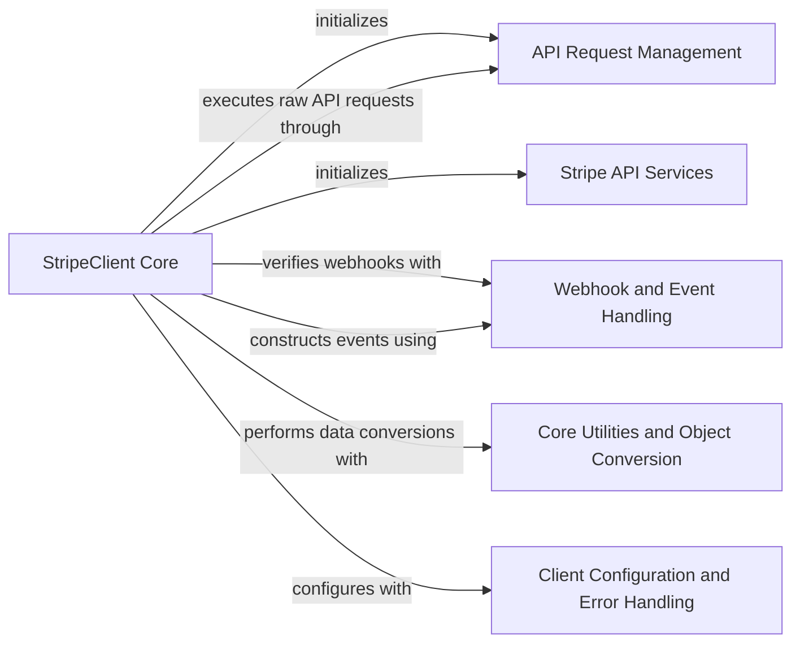

## Component Details

This architecture overview details the `Stripe Client Core` subsystem within the `stripe-python` library. It outlines the primary components responsible for initiating Stripe API interactions, managing HTTP requests, handling webhook events, and converting raw API responses into structured Python objects. The core client orchestrates these operations, leveraging specialized API services for different Stripe resources, and relies on utility components for configuration and error management.

### StripeClient Core
The central client for the `stripe-python` library, responsible for orchestrating API interactions. It initializes various API services, handles raw HTTP requests, processes webhook events, and manages the deserialization of API responses into Stripe objects.

**Related Classes/Methods**:

- `stripe._stripe_client.StripeClient` (full file reference)
- `stripe._stripe_client.StripeClient:__init__` (full file reference)
- `stripe._stripe_client.StripeClient:parse_thin_event` (full file reference)
- `stripe._stripe_client.StripeClient:construct_event` (full file reference)
- `stripe._stripe_client.StripeClient:raw_request` (full file reference)
- `stripe._stripe_client.StripeClient:raw_request_async` (full file reference)
- `stripe._stripe_client.StripeClient:deserialize` (full file reference)

### API Request Management
This component is responsible for the underlying mechanics of making HTTP requests to the Stripe API. It includes functionalities for creating and managing HTTP clients, extracting request options, and interpreting the raw responses received from the API.

**Related Classes/Methods**:

- `stripe._requestor_options.RequestorOptions` (full file reference)
- `stripe._http_client.new_default_http_client` (full file reference)
- `stripe._http_client.new_http_client_async_fallback` (full file reference)
- `stripe._api_requestor._APIRequestor` (full file reference)
- `stripe._api_requestor._APIRequestor.request_raw` (full file reference)
- `stripe._api_requestor._APIRequestor.request_raw_async` (full file reference)
- `stripe._api_requestor._APIRequestor._interpret_response` (full file reference)
- `stripe._request_options.extract_options_from_dict` (full file reference)

### Stripe API Services
This component comprises a multitude of specialized service classes, each corresponding to a specific resource within the Stripe API. These services encapsulate the logic for interacting with their respective API endpoints, providing a structured interface for common operations like creating, retrieving, updating, and deleting resources.

**Related Classes/Methods**:

- `stripe._oauth_service.OAuthService` (full file reference)
- `stripe._account_service.AccountService` (full file reference)
- `stripe._account_link_service.AccountLinkService` (full file reference)
- `stripe._account_session_service.AccountSessionService` (full file reference)
- `stripe._apple_pay_domain_service.ApplePayDomainService` (full file reference)
- `stripe._application_fee_service.ApplicationFeeService` (full file reference)
- `stripe._apps_service.AppsService` (full file reference)
- `stripe._balance_service.BalanceService` (full file reference)
- `stripe._balance_transaction_service.BalanceTransactionService` (full file reference)
- `stripe._billing_service.BillingService` (full file reference)
- `stripe._billing_portal_service.BillingPortalService` (full file reference)
- `stripe._charge_service.ChargeService` (full file reference)
- `stripe._checkout_service.CheckoutService` (full file reference)
- `stripe._climate_service.ClimateService` (full file reference)
- `stripe._confirmation_token_service.ConfirmationTokenService` (full file reference)
- `stripe._test_helpers_service.TestHelpersService` (full file reference)
- `stripe._country_spec_service.CountrySpecService` (full file reference)
- `stripe._coupon_service.CouponService` (full file reference)
- `stripe._credit_note_service.CreditNoteService` (full file reference)
- `stripe._customer_service.CustomerService` (full file reference)
- `stripe._customer_session_service.CustomerSessionService` (full file reference)
- `stripe._dispute_service.DisputeService` (full file reference)
- `stripe._entitlements_service.EntitlementsService` (full file reference)
- `stripe._ephemeral_key_service.EphemeralKeyService` (full file reference)
- `stripe._event_service.EventService` (full file reference)
- `stripe._exchange_rate_service.ExchangeRateService` (full file reference)
- `stripe._file_service.FileService` (full file reference)
- `stripe._file_link_service.FileLinkService` (full file reference)
- `stripe._financial_connections_service.FinancialConnectionsService` (full file reference)
- `stripe._forwarding_service.ForwardingService` (full file reference)
- `stripe._identity_service.IdentityService` (full file reference)
- `stripe._invoice_service.InvoiceService` (full file reference)
- `stripe._invoice_payment_service.InvoicePaymentService` (full file reference)
- `stripe._invoice_rendering_template_service.InvoiceRenderingTemplateService` (full file reference)
- `stripe._invoice_item_service.InvoiceItemService` (full file reference)
- `stripe._issuing_service.IssuingService` (full file reference)
- <a href="https://github.com/stripe/stripe-python/blob/master/stripe/_mandate_service.py#L11-L56" target="_blank" rel="noopener noreferrer">`stripe._mandate_service.MandateService` (11:56)</a>
- `stripe._payment_intent_service.PaymentIntentService` (full file reference)
- `stripe._payment_link_service.PaymentLinkService` (full file reference)
- `stripe._payment_method_service.PaymentMethodService` (full file reference)
- `stripe._payment_method_configuration_service.PaymentMethodConfigurationService` (full file reference)
- `stripe._payment_method_domain_service.PaymentMethodDomainService` (full file reference)
- `stripe._payout_service.PayoutService` (full file reference)
- `stripe._plan_service.PlanService` (full file reference)
- `stripe._price_service.PriceService` (full file reference)
- `stripe._product_service.ProductService` (full file reference)
- `stripe._promotion_code_service.PromotionCodeService` (full file reference)
- `stripe._quote_service.QuoteService` (full file reference)
- `stripe._radar_service.RadarService` (full file reference)
- `stripe._refund_service.RefundService` (full file reference)
- `stripe._reporting_service.ReportingService` (full file reference)
- `stripe._review_service.ReviewService` (full file reference)
- `stripe._sigma_service.SigmaService` (full file reference)
- `stripe._setup_attempt_service.SetupAttemptService` (full file reference)
- `stripe._setup_intent_service.SetupIntentService` (full file reference)
- `stripe._shipping_rate_service.ShippingRateService` (full file reference)
- `stripe._source_service.SourceService` (full file reference)
- `stripe._subscription_service.SubscriptionService` (full file reference)
- `stripe._subscription_item_service.SubscriptionItemService` (full file reference)
- `stripe._subscription_schedule_service.SubscriptionScheduleService` (full file reference)
- `stripe._tax_service.TaxService` (full file reference)
- `stripe._tax_code_service.TaxCodeCodeService` (full file reference)
- `stripe._tax_id_service.TaxIdService` (full file reference)
- `stripe._tax_rate_service.TaxRateService` (full file reference)
- `stripe._terminal_service.TerminalService` (full file reference)
- `stripe._token_service.TokenService` (full file reference)
- `stripe._topup_service.TopupService` (full file reference)
- `stripe._transfer_service.TransferService` (full file reference)
- `stripe._treasury_service.TreasuryService` (full file reference)
- `stripe._webhook_endpoint_service.WebhookEndpointService` (full file reference)
- `stripe._v2_services.V2Services` (full file reference)

### Webhook and Event Handling
This component focuses on the secure processing of webhook events. It includes functionalities for verifying webhook signatures to ensure authenticity and for constructing various types of event objects from raw data, including a thin event representation.

**Related Classes/Methods**:

- `stripe._webhook.WebhookSignature.verify_header` (full file reference)
- `stripe.v2._event.ThinEvent` (full file reference)
- `stripe._stripe_object.StripeObject._construct_from` (full file reference)

### Core Utilities and Object Conversion
This component provides foundational utility functions for the `stripe-python` library. Its responsibilities include determining the API mode and converting raw data structures into structured Stripe object representations, which are essential for consistent data handling across the library.

**Related Classes/Methods**:

- `stripe._util.get_api_mode` (full file reference)
- `stripe._util._convert_to_stripe_object` (full file reference)

### Client Configuration and Error Handling
This component is dedicated to managing the client-specific configuration settings for the Stripe API interactions and defining the custom error types that can be raised during API calls, such as authentication failures.

**Related Classes/Methods**:

- `stripe._error.AuthenticationError` (full file reference)
- `stripe._client_options._ClientOptions` (full file reference)

### [FAQ](https://github.com/CodeBoarding/GeneratedOnBoardings/tree/main?tab=readme-ov-file#faq)