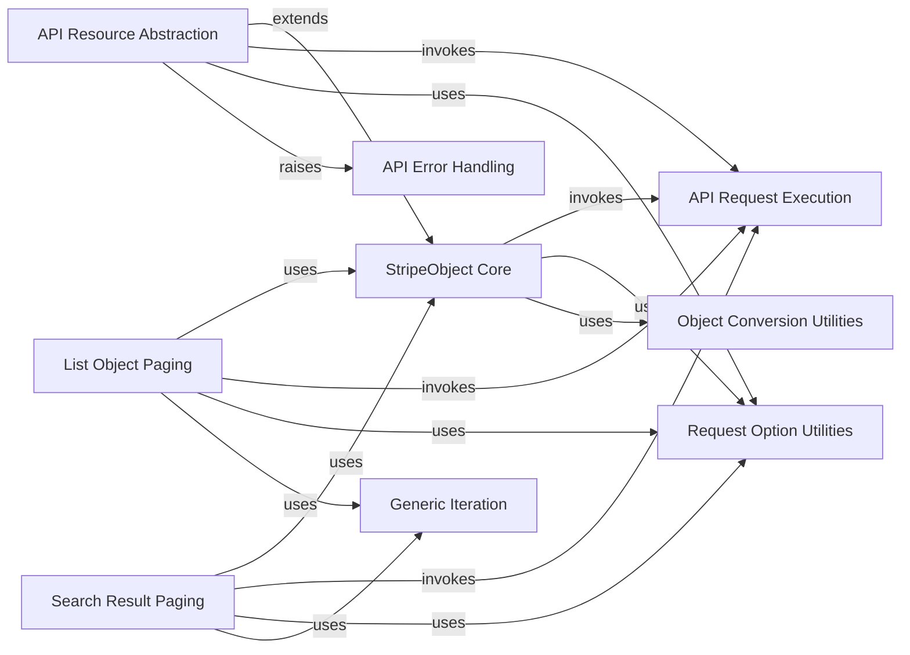

## Component Details

The Stripe Data Model subsystem defines the fundamental structures and behaviors for interacting with the Stripe API. It encompasses core object management, resource-specific abstractions, and mechanisms for handling paginated lists and search results. The main flow involves constructing Stripe objects from API responses, performing operations on these objects, and managing the underlying API requests and responses, including error handling and utility functions for data conversion and request options.

### StripeObject Core
This component represents the foundational `StripeObject` class and its associated helper functions. It is responsible for the core functionalities of Stripe objects, including their initialization, state management, serialization, deserialization, and basic request dispatching. It handles the conversion of raw data into structured Stripe objects and vice-versa.

**Related Classes/Methods**:

- `stripe._stripe_object._serialize_list` (full file reference)
- `stripe._stripe_object._compute_diff` (full file reference)
- `stripe._stripe_object.StripeObject` (full file reference)
- `stripe._stripe_object.StripeObject:__init__` (full file reference)
- `stripe._stripe_object.StripeObject:__setstate__` (full file reference)
- `stripe._stripe_object.StripeObject:construct_from` (full file reference)
- `stripe._stripe_object.StripeObject:_construct_from` (full file reference)
- `stripe._stripe_object.StripeObject:refresh_from` (full file reference)
- `stripe._stripe_object.StripeObject:_refresh_from` (full file reference)
- `stripe._stripe_object.StripeObject:request` (full file reference)
- `stripe._stripe_object.StripeObject:_request` (full file reference)
- `stripe._stripe_object.StripeObject:_request_async` (full file reference)
- `stripe._stripe_object.StripeObject:_request_stream` (full file reference)
- `stripe._stripe_object.StripeObject:_request_stream_async` (full file reference)
- `stripe._stripe_object.StripeObject:__str__` (full file reference)
- `stripe._stripe_object.StripeObject:_to_dict_recursive` (full file reference)
- `stripe._stripe_object.StripeObject:to_dict_recursive` (full file reference)
- `stripe._stripe_object.StripeObject:serialize` (full file reference)
- `stripe._stripe_object.StripeObject:__copy__` (full file reference)
- `stripe._stripe_object.StripeObject:__deepcopy__` (full file reference)

### API Resource Abstraction
This component provides an abstraction layer for interacting with specific Stripe API resources. It extends the `StripeObject Core` to offer resource-specific methods like `retrieve` and `refresh`, handling the URL construction and delegating the actual request execution to the `StripeObject Core`'s request methods. It also includes static request methods for resource-level operations.

**Related Classes/Methods**:

- `stripe._api_resource.APIResource` (full file reference)
- `stripe._api_resource.APIResource:retrieve` (full file reference)
- `stripe._api_resource.APIResource:refresh` (full file reference)
- `stripe._api_resource.APIResource:refresh_async` (full file reference)
- `stripe._api_resource.APIResource:instance_url` (full file reference)
- `stripe._api_resource.APIResource:_request` (full file reference)
- `stripe._api_resource.APIResource:_request_async` (full file reference)
- `stripe._api_resource.APIResource:_request_and_refresh` (full file reference)
- `stripe._api_resource.APIResource:_request_and_refresh_async` (full file reference)
- `stripe._api_resource.APIResource:_static_request` (full file reference)
- `stripe._api_resource.APIResource:_static_request_async` (full file reference)
- `stripe._api_resource.APIResource:_static_request_stream` (full file reference)
- `stripe._api_resource.APIResource:_static_request_stream_async` (full file reference)

### List Object Paging
This component specializes in handling paginated lists of Stripe objects. It provides methods for listing, creating, and retrieving objects within a list context, as well as mechanisms for automatic pagination and navigating through previous and next pages of results. It relies on the `StripeObject Core` for individual object operations.

**Related Classes/Methods**:

- `stripe._list_object.ListObject` (full file reference)
- `stripe._list_object.ListObject:list` (full file reference)
- `stripe._list_object.ListObject:list_async` (full file reference)
- `stripe._list_object.ListObject:create` (full file reference)
- `stripe._list_object.ListObject:retrieve` (full file reference)
- `stripe._list_object.ListObject:__getitem__` (full file reference)
- `stripe._list_object.ListObject:auto_paging_iter` (full file reference)
- `stripe._list_object.ListObject:_auto_paging_iter` (full file reference)
- `stripe._list_object.ListObject:_auto_paging_iter_async` (full file reference)
- `stripe._list_object.ListObject:_empty_list` (full file reference)
- `stripe._list_object.ListObject:next_page` (full file reference)
- `stripe._list_object.ListObject:next_page_async` (full file reference)
- `stripe._list_object.ListObject:previous_page` (full file reference)
- `stripe._list_object.ListObject:previous_page_async` (full file reference)
- `stripe._list_object.ListObject._get_url_for_list` (full file reference)
- `stripe._list_object.ListObject._get_filters_for_next_page` (full file reference)
- `stripe._list_object.ListObject._get_filters_for_previous_page` (full file reference)

### Search Result Paging
This component is dedicated to managing and iterating through search results from the Stripe API. It provides methods for performing searches and navigating through subsequent pages of search results, similar to list object paging but tailored for search operations. It also depends on the `StripeObject Core` for object construction.

**Related Classes/Methods**:

- `stripe._search_result_object.SearchResultObject` (full file reference)
- `stripe._search_result_object.SearchResultObject:_search` (full file reference)
- `stripe._search_result_object.SearchResultObject:search` (full file reference)
- `stripe._search_result_object.SearchResultObject:_search_async` (full file reference)
- `stripe._search_result_object.SearchResultObject:__getitem__` (full file reference)
- `stripe._search_result_object.SearchResultObject:_auto_paging_iter` (full file reference)
- `stripe._search_result_object.SearchResultObject:auto_paging_iter` (full file reference)
- `stripe._search_result_object.SearchResultObject:_auto_paging_iter_async` (full file reference)
- `stripe._search_result_object.SearchResultObject:_empty_search_result` (full file reference)
- `stripe._search_result_object.SearchResultObject:_maybe_empty_result` (full file reference)
- `stripe._search_result_object.SearchResultObject:next_search_result_page` (full file reference)
- `stripe._search_result_object.SearchResultObject:next_search_result_page_async` (full file reference)
- `stripe._search_result_object.SearchResultObject._get_url_for_search` (full file reference)
- `stripe._search_result_object.SearchResultObject._get_filters_for_next_page` (full file reference)

### API Request Execution
This component is responsible for the low-level execution of API requests to the Stripe backend. It manages global API request options and instances, serving as the direct interface for sending HTTP requests and receiving responses from the Stripe API.

**Related Classes/Methods**:

- `stripe._api_requestor._APIRequestor._global_with_options` (full file reference)
- `stripe._api_requestor._APIRequestor._global_instance` (full file reference)

### Request Option Utilities
This component provides utility functions specifically for extracting and processing request options from dictionaries. It ensures that API requests are properly configured with the necessary parameters before being sent.

**Related Classes/Methods**:

- `stripe._request_options.extract_options_from_dict` (full file reference)

### Object Conversion Utilities
This component offers utility functions for converting various data types into Stripe object representations. It plays a crucial role in ensuring data consistency and proper object instantiation within the Stripe library.

**Related Classes/Methods**:

- `stripe._util._convert_to_stripe_object` (full file reference)

### API Error Handling
This component is dedicated to handling and raising specific error types that can occur during Stripe API interactions. It provides structured error reporting for invalid requests and other API-related issues.

**Related Classes/Methods**:

- `stripe._error.InvalidRequestError` (full file reference)

### Generic Iteration
This component provides a generic iterator implementation that can be used for various iterable objects within the Stripe library. It supports both synchronous and asynchronous iteration patterns, facilitating efficient traversal of collections.

**Related Classes/Methods**:

- `stripe._any_iterator.AnyIterator` (full file reference)

### [FAQ](https://github.com/CodeBoarding/GeneratedOnBoardings/tree/main?tab=readme-ov-file#faq)