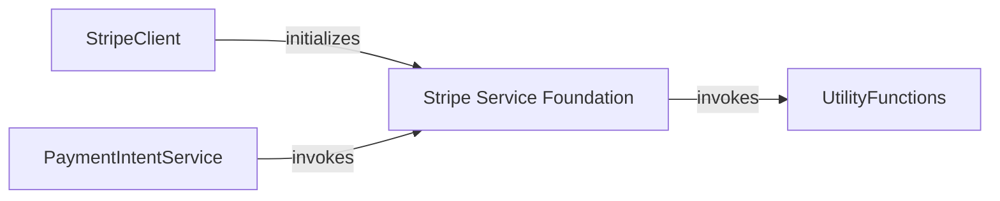

## Component Details

The Stripe Service Foundation component, represented by the `StripeService` class, serves as the abstract base for all specific Stripe API services. Its primary purpose is to provide a common mechanism for making API requests, handling both synchronous and asynchronous operations. The `StripeClient` acts as the main entry point, initializing instances of `StripeService` and its specialized subclasses (like `PaymentIntentService`). These specialized services then leverage the core request methods provided by `StripeService`, often utilizing `UtilityFunctions` for data preparation, such as ID sanitization, before dispatching requests to the Stripe API.

### Stripe Service Foundation
A foundational abstract service class that provides the core request mechanism for all Stripe API interactions. It handles both synchronous and asynchronous requests and integrates with utility functions for data sanitization.

**Related Classes/Methods**:

- <a href="https://github.com/stripe/stripe-python/blob/master/stripe/_mandate_service.py#L1-L100" target="_blank" rel="noopener noreferrer">`stripe-python.stripe._stripe_service.StripeService` (1:100)</a>
- `stripe._stripe_service.StripeService._request` (1:100)
- `stripe._stripe_service.StripeService._request_async` (1:100)
- `stripe._stripe_service.StripeService.__init__` (1:100)

### StripeClient
The central entry point for interacting with the Stripe API. It initializes and holds references to various service objects, each responsible for a specific Stripe resource (e.g., accounts, payments, customers). It also configures the HTTP client and request options.

**Related Classes/Methods**:

- <a href="https://github.com/stripe/stripe-python/blob/master/stripe/_mandate_service.py#L1-L100" target="_blank" rel="noopener noreferrer">`stripe-python.stripe._stripe_client.StripeClient:__init__` (1:100)</a>

### UtilityFunctions
A collection of utility functions, primarily responsible for sanitizing IDs before they are used in API requests, ensuring data integrity and correct formatting.

**Related Classes/Methods**:

- <a href="https://github.com/stripe/stripe-python/blob/master/stripe/_mandate_service.py#L1-L100" target="_blank" rel="noopener noreferrer">`stripe._util.sanitize_id` (1:100)</a>

### PaymentIntentService
Manages payment intents, allowing for creation, retrieval, updates, and various actions like confirming, canceling, capturing, and verifying microdeposits for payments.

**Related Classes/Methods**:

- <a href="https://github.com/stripe/stripe-python/blob/master/stripe/_mandate_service.py#L1-L100" target="_blank" rel="noopener noreferrer">`stripe-python.stripe._payment_intent_service.PaymentIntentService:list` (1:100)</a>

### [FAQ](https://github.com/CodeBoarding/GeneratedOnBoardings/tree/main?tab=readme-ov-file#faq)