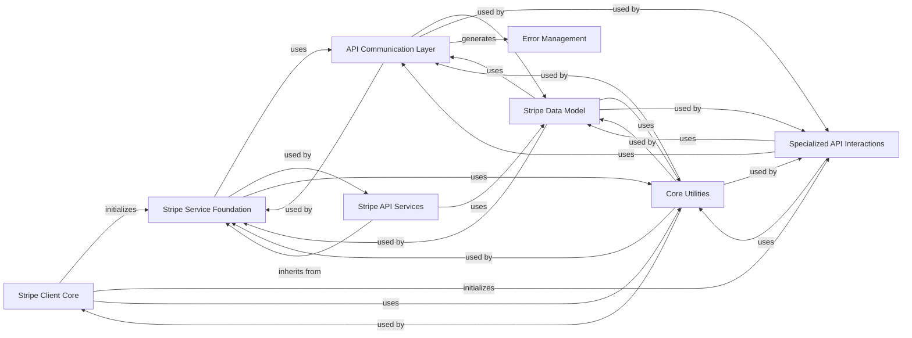

## Component Details

The `stripe-python` library provides a comprehensive Python interface for interacting with the Stripe API. The main flow involves a `Stripe Client Core` initiating requests through a `Stripe Service Foundation` which then utilizes the `API Communication Layer` to send and receive data from the Stripe API. Responses are then processed into `Stripe Data Model` objects, with `Error Management` handling any issues. `Core Utilities` provide common helper functions across the system, and `Specialized API Interactions` handle specific functionalities like OAuth and webhooks. Finally, `Stripe API Services` encapsulate all the product-specific API interactions.

### Stripe Client Core
The primary entry point for users to interact with the Stripe API, initializing and providing access to various Stripe service clients.

**Related Classes/Methods**:

- `stripe-python.stripe._stripe_client.StripeClient` (full file reference)

### API Communication Layer
Manages the lifecycle of API requests, including constructing requests, handling retries, interpreting responses, and providing underlying HTTP client implementations.

**Related Classes/Methods**:

- `stripe-python.stripe._api_requestor._APIRequestor` (full file reference)
- `stripe-python.stripe._http_client` (full file reference)

### Stripe Service Foundation
A foundational class for all specific Stripe API services, providing common methods for making API requests.

**Related Classes/Methods**:

- `stripe-python.stripe._stripe_service.StripeService` (full file reference)

### Stripe Data Model
Defines the base classes for all Stripe API resources and data objects, handling object construction, attribute access, and operations like list and search.

**Related Classes/Methods**:

- `stripe-python.stripe._api_resource.APIResource` (full file reference)
- `stripe-python.stripe._stripe_object.StripeObject` (full file reference)
- `stripe-python.stripe._list_object.ListObject` (full file reference)
- `stripe-python.stripe._search_result_object.SearchResultObject` (full file reference)

### Error Management
Defines a hierarchy of custom exception classes for various API errors, providing structured error information.

**Related Classes/Methods**:

- `stripe-python.stripe._error.StripeError` (full file reference)
- `stripe-python.stripe._error.APIConnectionError` (full file reference)
- `stripe-python.stripe._error.CardError` (full file reference)
- `stripe-python.stripe._error.InvalidRequestError` (full file reference)
- `stripe-python.stripe._error.SignatureVerificationError` (full file reference)
- `stripe-python.stripe.oauth_error.OAuthError` (full file reference)

### Core Utilities
Provides various helper functions for common tasks such as sanitizing IDs, data type conversions, and logging.

**Related Classes/Methods**:

- `stripe-python.stripe._util` (full file reference)

### Specialized API Interactions
Manages OAuth authentication flows and provides utilities for constructing and verifying Stripe webhook events.

**Related Classes/Methods**:

- `stripe-python.stripe._oauth.OAuth` (full file reference)
- `stripe-python.stripe._oauth_service.OAuthService` (full file reference)
- `stripe-python.stripe._webhook.Webhook` (full file reference)

### Stripe API Services
A consolidated component representing all specific Stripe product services (e.g., Customer, Payment, Subscription, Issuing, Tax, Terminal, Treasury, Test Helpers).

**Related Classes/Methods**:

- `stripe-python.stripe._customer_service.CustomerService` (full file reference)
- `stripe-python.stripe._payment_intent_service.PaymentIntentService` (full file reference)
- `stripe-python.stripe._subscription_service.SubscriptionService` (full file reference)
- `stripe-python.stripe._test_helpers_service.TestHelpersService` (full file reference)
- `stripe-python.stripe._plan_service.PlanService` (full file reference)
- `stripe-python.stripe._product_service.ProductService` (full file reference)
- `stripe-python.stripe._coupon_service.CouponService` (full file reference)
- `stripe-python.stripe._promotion_code_service.PromotionCodeService` (full file reference)
- `stripe-python.stripe._invoice_service.InvoiceService` (full file reference)
- `stripe-python.stripe._invoice_item_service.InvoiceItemService` (full file reference)
- `stripe-python.stripe._credit_note_service.CreditNoteService` (full file reference)
- `stripe-python.stripe._treasury_service.TreasuryService` (full file reference)
- `stripe-python.stripe.treasury._financial_account_service.FinancialAccountService` (full file reference)
- `stripe-python.stripe.treasury._inbound_transfer_service.InboundTransferService` (full file reference)
- `stripe-python.stripe.treasury._outbound_transfer_service.OutboundTransferService` (full file reference)
- `stripe-python.stripe.treasury._outbound_payment_service.OutboundPaymentService` (full file reference)
- `stripe-python.stripe.treasury._received_credit_service.ReceivedCreditService` (full file reference)
- `stripe-python.stripe.treasury._received_debit_service.ReceivedDebitService` (full file reference)
- `stripe-python.stripe.treasury._transaction_service.TransactionService` (full file reference)
- `stripe-python.stripe._terminal_service.TerminalService` (full file reference)
- `stripe-python.stripe.terminal._reader_service.ReaderService` (full file reference)
- `stripe-python.stripe.terminal._location_service.LocationService` (full file reference)
- <a href="https://github.com/stripe/stripe-python/blob/master/stripe/terminal/_configuration_service.py#L12-L1148" target="_blank" rel="noopener noreferrer">`stripe-python.stripe.terminal._configuration_service.ConfigurationService` (12:1148)</a>
- `stripe-python.stripe._issuing_service.IssuingService` (full file reference)
- `stripe-python.stripe.issuing._card_service.CardService` (full file reference)
- `stripe-python.stripe.issuing._cardholder_service.CardholderService` (full file reference)
- `stripe-python.stripe.issuing._authorization_service.AuthorizationService` (full file reference)
- `stripe-python.stripe.issuing._transaction_service.TransactionService` (full file reference)
- `stripe-python.stripe.issuing._dispute_service.DisputeService` (full file reference)
- `stripe-python.stripe._tax_service.TaxService` (full file reference)
- `stripe-python.stripe.tax._calculation_service.CalculationService` (full file reference)
- `stripe-python.stripe.tax._registration_service.RegistrationService` (full file reference)
- `stripe-python.stripe.tax._settings_service.SettingsService` (full file reference)
- `stripe-python.stripe.tax._transaction_service.TransactionService` (full file reference)

### [FAQ](https://github.com/CodeBoarding/GeneratedOnBoardings/tree/main?tab=readme-ov-file#faq)