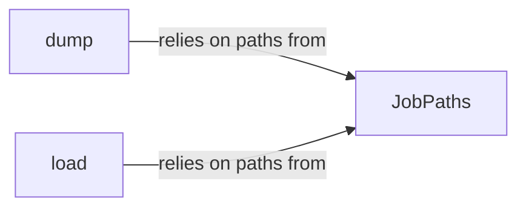

## Details

The `Data Serialization & I/O` subsystem is crucial for `submitit`'s operation, enabling the persistence and retrieval of job-related data and managing the file system layout for each job.

### JobPaths
This class acts as the central authority for managing and providing all file paths pertinent to a job. It encapsulates the logic for constructing and retrieving paths for submission scripts, pickled job objects, pickled results, standard output, and standard error logs. It also handles the formatting of job identifiers within these paths and the movement of temporary files, ensuring a consistent and organized job directory structure.

**Related Classes/Methods**:

- <a href="https://github.com/facebookincubator/submitit/blob/main/submitit/core/utils.py#L47-L113" target="_blank" rel="noopener noreferrer">`submitit.core.utils.JobPaths`:47-113</a>

### dump
This function is responsible for serializing Python objects, specifically the job function and its arguments, into a file. It utilizes `cloudpickle` to ensure that complex Python constructs, such as closures and lambda functions, can be correctly serialized for remote execution.

**Related Classes/Methods**:

- <a href="https://github.com/facebookincubator/submitit/blob/main/submitit/core/utils.py#L144-L145" target="_blank" rel="noopener noreferrer">`submitit.core.utils.dump`:144-145</a>

### load
This function handles the deserialization of Python objects from a file. It is used to reconstruct the submitted job objects on the execution side and to retrieve the final job results from their respective pickled files, making them accessible to the client.

**Related Classes/Methods**:

- <a href="https://github.com/facebookincubator/submitit/blob/main/submitit/core/utils.py#L151-L157" target="_blank" rel="noopener noreferrer">`submitit.core.utils.load`:151-157</a>

### [FAQ](https://github.com/CodeBoarding/GeneratedOnBoardings/tree/main?tab=readme-ov-file#faq)