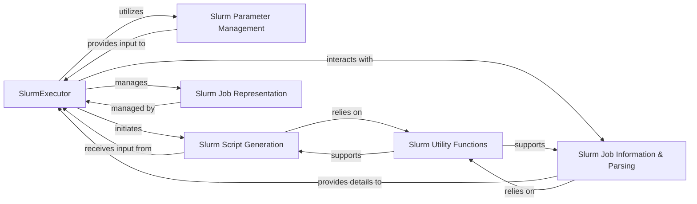

## Details

The `Slurm Executor Backend` subsystem, primarily encapsulated within the `submitit.slurm.slurm` module, serves as the dedicated interface for `submitit` to interact with the Slurm workload manager. It embodies the **Facade/Wrapper** and **Executor Pattern** by abstracting the complexities of Slurm job submission and management.

### SlurmExecutor
The central orchestrator for Slurm job submissions. It initializes the executor, validates and converts submission parameters, and manages the core process of submitting jobs to the Slurm cluster. This component embodies the Executor Pattern, abstracting the complexities of job execution.

**Related Classes/Methods**:

- <a href="https://github.com/facebookincubator/submitit/blob/main/submitit/slurm/slurm.py#L211-L384" target="_blank" rel="noopener noreferrer">`submitit.slurm.slurm.SlurmExecutor`:211-384</a>

### Slurm Parameter Management
Handles the validation, conversion, and internal updating of job submission parameters to ensure they conform to Slurm's requirements and `submitit`'s internal structure. It acts as a configuration layer for Slurm jobs.

**Related Classes/Methods**:

- <a href="https://github.com/facebookincubator/submitit/blob/main/submitit/slurm/slurm.py#L387-L392" target="_blank" rel="noopener noreferrer">`submitit.slurm.slurm._get_default_parameters`:387-392</a>
- <a href="https://github.com/facebookincubator/submitit/blob/main/submitit/slurm/slurm.py#L271-L274" target="_blank" rel="noopener noreferrer">`submitit.slurm.slurm._valid_parameters`:271-274</a>
- <a href="https://github.com/facebookincubator/submitit/blob/main/submitit/slurm/slurm.py#L276-L281" target="_blank" rel="noopener noreferrer">`submitit.slurm.slurm._convert_parameters`:276-281</a>
- <a href="https://github.com/facebookincubator/submitit/blob/main/submitit/slurm/slurm.py#L283-L319" target="_blank" rel="noopener noreferrer">`submitit.slurm.slurm._internal_update_parameters`:283-319</a>
- <a href="https://github.com/facebookincubator/submitit/blob/main/submitit/slurm/slurm.py#L533-L536" target="_blank" rel="noopener noreferrer">`submitit.slurm.slurm._convert_mem`:533-536</a>

### Slurm Script Generation
Responsible for constructing the `sbatch` command strings and generating the content of the Slurm submission script files. This is a key aspect of the Command Pattern, where the library generates the commands to be executed by the external Slurm system.

**Related Classes/Methods**:

- <a href="https://github.com/facebookincubator/submitit/blob/main/submitit/slurm/slurm.py#L396-L530" target="_blank" rel="noopener noreferrer">`submitit.slurm.slurm._make_sbatch_string`:396-530</a>
- <a href="https://github.com/facebookincubator/submitit/blob/main/submitit/slurm/slurm.py#L357-L358" target="_blank" rel="noopener noreferrer">`submitit.slurm.slurm._make_submission_file_text`:357-358</a>
- <a href="https://github.com/facebookincubator/submitit/blob/main/submitit/slurm/slurm.py#L353-L355" target="_blank" rel="noopener noreferrer">`submitit.slurm.slurm._submitit_command_str`:353-355</a>

### Slurm Job Information & Parsing
Extracts and parses information related to Slurm jobs, such as job IDs, node lists, and hostnames, from Slurm's output or internal data structures. This component is crucial for monitoring and retrieving job status.

**Related Classes/Methods**:

- <a href="https://github.com/facebookincubator/submitit/blob/main/submitit/slurm/slurm.py#L68-L99" target="_blank" rel="noopener noreferrer">`submitit.slurm.slurm.read_info`:68-99</a>
- <a href="https://github.com/facebookincubator/submitit/blob/main/submitit/slurm/slurm.py#L23-L39" target="_blank" rel="noopener noreferrer">`submitit.slurm.slurm.read_job_id`:23-39</a>
- <a href="https://github.com/facebookincubator/submitit/blob/main/submitit/slurm/slurm.py#L141-L161" target="_blank" rel="noopener noreferrer">`submitit.slurm.slurm._parse_node_group`:141-161</a>
- <a href="https://github.com/facebookincubator/submitit/blob/main/submitit/slurm/slurm.py#L164-L172" target="_blank" rel="noopener noreferrer">`submitit.slurm.slurm._parse_node_list`:164-172</a>
- <a href="https://github.com/facebookincubator/submitit/blob/main/submitit/slurm/slurm.py#L193-L208" target="_blank" rel="noopener noreferrer">`submitit.slurm.slurm.hostnames`:193-208</a>

### Slurm Job Representation
Represents an individual job submitted to Slurm, holding its unique identifier and status. It's a data structure used by the `SlurmExecutor` to track submitted jobs throughout their lifecycle.

**Related Classes/Methods**:

- <a href="https://github.com/facebookincubator/submitit/blob/main/submitit/slurm/slurm.py#L102-L118" target="_blank" rel="noopener noreferrer">`submitit.slurm.slurm.SlurmJob`:102-118</a>

### Slurm Utility Functions
Provides essential helper functionalities specific to Slurm interaction, such as safely joining shell commands, formatting `sbatch` flags, and handling parsing-related exceptions. These utilities support the core Slurm interaction logic.

**Related Classes/Methods**:

- <a href="https://github.com/facebookincubator/submitit/blob/main/submitit/slurm/slurm.py#L548-L550" target="_blank" rel="noopener noreferrer">`submitit.slurm.slurm._shlex_join`:548-550</a>
- <a href="https://github.com/facebookincubator/submitit/blob/main/submitit/slurm/slurm.py#L539-L545" target="_blank" rel="noopener noreferrer">`submitit.slurm.slurm._as_sbatch_flag`:539-545</a>
- <a href="https://github.com/facebookincubator/submitit/blob/main/submitit/slurm/slurm.py#L121-L122" target="_blank" rel="noopener noreferrer">`submitit.slurm.slurm.SlurmParseException`:121-122</a>

### [FAQ](https://github.com/CodeBoarding/GeneratedOnBoardings/tree/main?tab=readme-ov-file#faq)