```mermaid
graph LR
    Client_API["Client API"]
    Job_Orchestrator["Job Orchestrator"]
    Executor_Abstraction_Layer["Executor Abstraction Layer"]
    Slurm_Executor_Backend["Slurm Executor Backend"]
    Local_Executor_Backend["Local Executor Backend"]
    Data_Serialization_I_O["Data Serialization & I/O"]
    Client_API -- "submits job requests to" --> Job_Orchestrator
    Client_API -- "selects/configures" --> Executor_Abstraction_Layer
    Job_Orchestrator -- "delegates execution to" --> Executor_Abstraction_Layer
    Job_Orchestrator -- "queries status from" --> Executor_Abstraction_Layer
    Executor_Abstraction_Layer -- "implemented by" --> Slurm_Executor_Backend
    Executor_Abstraction_Layer -- "implemented by" --> Local_Executor_Backend
    Job_Orchestrator -- "utilizes for state/results" --> Data_Serialization_I_O
    Slurm_Executor_Backend -- "uses for data persistence" --> Data_Serialization_I_O
    Local_Executor_Backend -- "uses for data persistence" --> Data_Serialization_I_O
    click Client_API href "https://github.com/CodeBoarding/GeneratedOnBoardings/blob/main/submitit/Client_API.md" "Details"
    click Executor_Abstraction_Layer href "https://github.com/CodeBoarding/GeneratedOnBoardings/blob/main/submitit/Executor_Abstraction_Layer.md" "Details"
    click Slurm_Executor_Backend href "https://github.com/CodeBoarding/GeneratedOnBoardings/blob/main/submitit/Slurm_Executor_Backend.md" "Details"
    click Data_Serialization_I_O href "https://github.com/CodeBoarding/GeneratedOnBoardings/blob/main/submitit/Data_Serialization_I_O.md" "Details"
```

## Details

The `submitit` architecture is designed as a flexible job submission and orchestration library, primarily serving as a programmatic interface to external job schedulers like Slurm. At its core, the **Client API** provides the user-facing entry point for defining and submitting computational tasks. These tasks are then managed by the **Job Orchestrator**, which coordinates the entire job lifecycle. The Job Orchestrator leverages an **Executor Abstraction Layer** to decouple the core logic from specific execution environments, allowing for pluggable backends such as the **Slurm Executor Backend** for HPC clusters and the **Local Executor Backend** for local execution. Critical to the library's operation is the **Data Serialization & I/O** component, which handles the persistence of job data and manages the necessary file system interactions. This modular design ensures clear separation of concerns, enabling `submitit` to act as an efficient and extensible orchestrator between user code and diverse computing resources.

### Client API [[Expand]](./Client_API.md)
The primary public interface for users to define, configure, and submit computational jobs. It provides high-level methods for single job submission, array jobs, and automatic executor selection.

**Related Classes/Methods**:

- <a href="https://github.com/facebookincubator/submitit/blob/main/submitit/core/core.py" target="_blank" rel="noopener noreferrer">`submitit.core.core`</a>
- <a href="https://github.com/facebookincubator/submitit/blob/main/submitit/auto/auto.py" target="_blank" rel="noopener noreferrer">`submitit.auto.auto`</a>

### Job Orchestrator
Manages the entire lifecycle of a submitted job, from its initial submission to completion, including status tracking, result retrieval, and error handling. It acts as the central coordinator for job state.

**Related Classes/Methods**:

- <a href="https://github.com/facebookincubator/submitit/blob/main/submitit/core/core.py" target="_blank" rel="noopener noreferrer">`submitit.core.core`</a>

### Executor Abstraction Layer [[Expand]](./Executor_Abstraction_Layer.md)
Defines the common interface and mechanisms for different job execution backends (e.g., local, Slurm). It enables the pluggability of new backends and standardizes their interaction with the Job Orchestrator.

**Related Classes/Methods**:

- <a href="https://github.com/facebookincubator/submitit/blob/main/submitit/core/plugins.py" target="_blank" rel="noopener noreferrer">`submitit.core.plugins`</a>
- <a href="https://github.com/facebookincubator/submitit/blob/main/submitit/core/core.py" target="_blank" rel="noopener noreferrer">`submitit.core.core`</a>

### Slurm Executor Backend [[Expand]](./Slurm_Executor_Backend.md)
Interfaces with the Slurm workload manager to submit, monitor, and manage jobs on an HPC cluster. It handles the specifics of Slurm commands, script generation, and output parsing.

**Related Classes/Methods**:

- <a href="https://github.com/facebookincubator/submitit/blob/main/submitit/slurm/slurm.py" target="_blank" rel="noopener noreferrer">`submitit.slurm.slurm`</a>

### Local Executor Backend
Executes jobs directly on the local machine, providing immediate feedback and a simple execution environment. Includes a debug variant for development purposes.

**Related Classes/Methods**:

- <a href="https://github.com/facebookincubator/submitit/blob/main/submitit/local/local.py" target="_blank" rel="noopener noreferrer">`submitit.local.local`</a>
- <a href="https://github.com/facebookincubator/submitit/blob/main/submitit/local/debug.py" target="_blank" rel="noopener noreferrer">`submitit.local.debug`</a>

### Data Serialization & I/O [[Expand]](./Data_Serialization_I_O.md)
Manages the serialization and deserialization of job functions, arguments, and results using `cloudpickle`, and handles the creation, organization, and access of all job-related files (submission scripts, logs, pickled results) within the job's working directory.

**Related Classes/Methods**:

- <a href="https://github.com/facebookincubator/submitit/blob/main/submitit/core/utils.py" target="_blank" rel="noopener noreferrer">`submitit.core.utils`</a>

### [FAQ](https://github.com/CodeBoarding/GeneratedOnBoardings/tree/main?tab=readme-ov-file#faq)