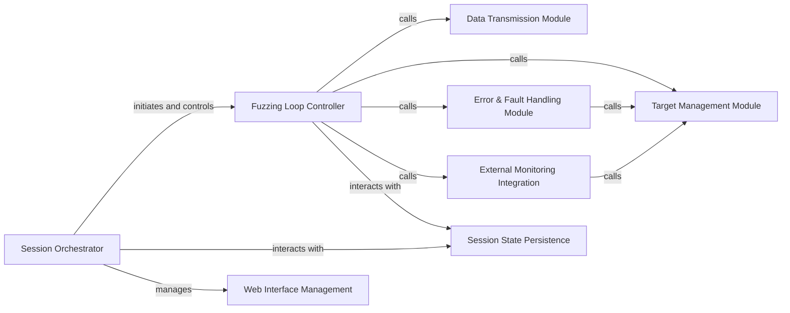

## Details

The `sulley.sessions` subsystem orchestrates the entire fuzzing process, centered around the `Session Orchestrator`. This orchestrator initiates and controls the `Fuzzing Loop Controller`, which is the core execution engine responsible for driving the fuzzing iterations. Within each iteration, the `Fuzzing Loop Controller` calls upon the `Data Transmission Module` to send fuzzed data to the target, the `Target Management Module` to handle SUT restarts, the `Error & Fault Handling Module` for fault detection and recovery, and the `External Monitoring Integration` for real-time feedback. The `Session Orchestrator` also manages the `Web Interface Management` for user interaction and interacts with `Session State Persistence` to save and load fuzzing progress. Both `Error & Fault Handling Module` and `External Monitoring Integration` can trigger actions on the `Target Management Module` for recovery or state management. This structure ensures a robust and manageable fuzzing campaign, with clear separation of concerns between high-level session management, core fuzzing execution, and specialized operational modules.

### Session Orchestrator [[Expand]](./Session_Orchestrator.md)
The high-level orchestrator for fuzzing sessions. It manages the overall state, initializes the fuzzing environment, handles session entry/resumption, and coordinates the main fuzzing loop.

**Related Classes/Methods**:

- <a href="https://github.com/OpenRCE/sulley/blob/master/sulley/sessions.py" target="_blank" rel="noopener noreferrer">`sulley.sessions.Session`</a>

### Fuzzing Loop Controller
Drives the main fuzzing loop, coordinating test case progression, fuzzed data transmission, target restarts, and integrating error handling and monitoring. It is the core execution engine of the fuzzing process.

**Related Classes/Methods**:

- <a href="https://github.com/OpenRCE/sulley/blob/master/sulley/sessions.py#L361-L561" target="_blank" rel="noopener noreferrer">`sulley.sessions.fuzz`:361-561</a>

### Data Transmission Module
Handles the actual transmission of generated fuzzed data to the System Under Test (SUT). This component is critical for delivering the test cases to the target.

**Related Classes/Methods**:

- <a href="https://github.com/OpenRCE/sulley/blob/master/sulley/sessions.py#L832-L898" target="_blank" rel="noopener noreferrer">`sulley.sessions.transmit`:832-898</a>

### Target Management Module
Manages the resetting and recovery of the target system during fuzzing. This includes restarting the SUT to ensure a clean state for subsequent test cases or after a detected fault.

**Related Classes/Methods**:

- <a href="https://github.com/OpenRCE/sulley/blob/master/sulley/sessions.py#L758-L792" target="_blank" rel="noopener noreferrer">`sulley.sessions.restart_target`:758-792</a>

### Error & Fault Handling Module
Provides centralized error management and response during the fuzzing process. It detects and processes faults or unexpected behaviors from the SUT, often triggering recovery actions.

**Related Classes/Methods**:

- <a href="https://github.com/OpenRCE/sulley/blob/master/sulley/sessions.py#L430-L438" target="_blank" rel="noopener noreferrer">`sulley.sessions.error_handler`:430-438</a>

### External Monitoring Integration
Facilitates communication with external monitoring and instrumentation agents (e.g., via PED-RPC). This component is responsible for gathering real-time feedback and crash detection from the SUT.

**Related Classes/Methods**:

- <a href="https://github.com/OpenRCE/sulley/blob/master/sulley/sessions.py#L660-L713" target="_blank" rel="noopener noreferrer">`sulley.sessions.poll_pedrpc`:660-713</a>

### Session State Persistence
Manages the persistence of fuzzing progress and session state to a file, and conversely, loads previous session states. This allows for fuzzing campaigns to be paused and resumed.

**Related Classes/Methods**:

- <a href="https://github.com/OpenRCE/sulley/blob/master/sulley/sessions.py#L328-L357" target="_blank" rel="noopener noreferrer">`sulley.sessions.export_file`:328-357</a>
- <a href="https://github.com/OpenRCE/sulley/blob/master/sulley/sessions.py#L565-L605" target="_blank" rel="noopener noreferrer">`sulley.sessions.import_file`:565-605</a>

### Web Interface Management
Initializes and manages the web interface components, providing a real-time dashboard and control mechanisms for the fuzzing process.

**Related Classes/Methods**:

- <a href="https://github.com/OpenRCE/sulley/blob/master/sulley/sessions.py#L796-L828" target="_blank" rel="noopener noreferrer">`sulley.sessions.server_init`:796-828</a>
- <a href="https://github.com/OpenRCE/sulley/blob/master/sulley/sessions.py#L1164-L1183" target="_blank" rel="noopener noreferrer">`sulley.sessions.web_interface_thread`:1164-1183</a>

### [FAQ](https://github.com/CodeBoarding/GeneratedOnBoardings/tree/main?tab=readme-ov-file#faq)