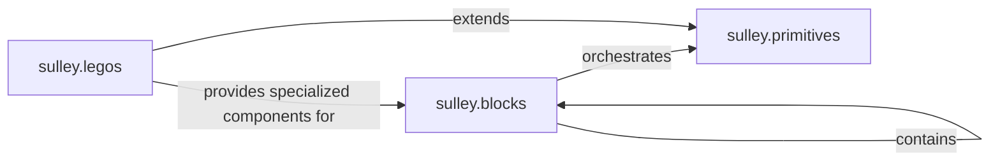

## Details

The `sulley` framework's core input generation mechanism is structured around three primary components: `sulley.blocks`, `sulley.primitives`, and `sulley.legos`. `sulley.blocks` forms the hierarchical backbone, defining the overall structure of fuzzed inputs and orchestrating the mutation and rendering process. At the granular level, `sulley.primitives` handles the fundamental data types and their specific mutation strategies. Building upon these, `sulley.legos` provides a library of pre-defined, specialized components for common protocols, abstracting complex details and accelerating the creation of protocol-aware fuzzed inputs. This modular design allows for flexible and extensible test case generation.

### sulley.blocks
This is the foundational component for defining the hierarchical structure of fuzzed inputs. It acts as a container for other blocks and primitives, orchestrating the overall input composition, managing mutation states, and calculating sizes for complex inputs. It enables the creation of structured, multi-part fuzzed data. The `request` class serves as the top-level container, while the `block` class allows for nested structures. Both manage their internal stacks by calling `mutate()` and `render()` on contained items.

**Related Classes/Methods**:

- <a href="https://github.com/OpenRCE/sulley/blob/master/sulley/blocks.py" target="_blank" rel="noopener noreferrer">`sulley.blocks`</a>

### sulley.primitives
This component handles the low-level representation, rendering, and mutation of fundamental data types (e.g., integers, strings, bytes). It encapsulates specific mutation strategies for these atomic units, ensuring diverse test case generation at the most granular level. Classes like `base_primitive`, `delim`, `group`, and `random_data` define these core functionalities.

**Related Classes/Methods**:

- <a href="https://github.com/OpenRCE/sulley/blob/master/sulley/primitives.py" target="_blank" rel="noopener noreferrer">`sulley.primitives`</a>

### sulley.legos
This component provides pre-defined, specialized input construction logic for common network protocols or data formats (e.g., DCERPC, XDR). These act as higher-level building blocks that abstract complex protocol details, simplifying the creation of protocol-aware fuzzed inputs and enhancing the framework's extensibility. It exposes specific classes (e.g., `ber.string`, `dcerpc.ndr_wstring`) that are often specialized extensions of primitives or complex block structures.

**Related Classes/Methods**:

- <a href="https://github.com/OpenRCE/sulley/blob/master/sulley/legos/__init__.py" target="_blank" rel="noopener noreferrer">`sulley.legos`</a>

### [FAQ](https://github.com/CodeBoarding/GeneratedOnBoardings/tree/main?tab=readme-ov-file#faq)