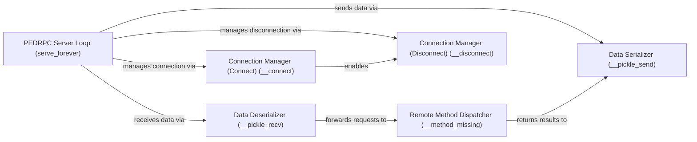

## Details

The `pedrpc` subsystem in Sulley provides a robust remote procedure call mechanism, centered around the `PEDRPC Server Loop (serve_forever)`. This loop is the core orchestrator, responsible for managing network connections through the `Connection Manager (Connect) (__connect)` and `Connection Manager (Disconnect) (__disconnect)` components. It also handles the flow of data by utilizing the `Data Deserializer (__pickle_recv)` for incoming requests and the `Data Serializer (__pickle_send)` for outgoing responses. Once data is deserialized, the `Remote Method Dispatcher (__method_missing)` takes over, identifying and executing the appropriate server-side functions, with their results then passed back to the `Data Serializer` for transmission. This architecture ensures a clear separation of concerns, with connection management, data serialization, and method dispatching handled by dedicated components under the central control of the server loop. The `pedrpc` subsystem is defined by the components within the `sulley.pedrpc` module, focusing on the core functionalities required for remote procedure calls.

### PEDRPC Server Loop (serve_forever)
Acts as the main server loop, continuously listening for and processing incoming PEDRPC requests. It is the primary entry point for remote interactions, orchestrating the reception and initial handling of all communication.

**Related Classes/Methods**:

- <a href="https://github.com/OpenRCE/sulley/blob/master/sulley/pedrpc.py" target="_blank" rel="noopener noreferrer">`sulley.pedrpc:serve_forever`</a>

### Remote Method Dispatcher (__method_missing)
Serves as the central dispatcher for remote method calls. It is responsible for looking up and executing the requested functions on the server side, effectively translating remote commands into local actions.

**Related Classes/Methods**:

- <a href="https://github.com/OpenRCE/sulley/blob/master/sulley/pedrpc.py" target="_blank" rel="noopener noreferrer">`sulley.pedrpc:__method_missing`</a>

### Data Serializer (__pickle_send)
Handles the serialization of Python objects into a byte stream suitable for network transmission. This component is critical for preparing data to be sent across the network to remote agents or components.

**Related Classes/Methods**:

- <a href="https://github.com/OpenRCE/sulley/blob/master/sulley/pedrpc.py" target="_blank" rel="noopener noreferrer">`sulley.pedrpc:__pickle_send`</a>

### Data Deserializer (__pickle_recv)
Manages the reception of raw network data and its deserialization back into usable Python objects. This component is essential for interpreting incoming data from remote sources.

**Related Classes/Methods**:

- <a href="https://github.com/OpenRCE/sulley/blob/master/sulley/pedrpc.py" target="_blank" rel="noopener noreferrer">`sulley.pedrpc:__pickle_recv`</a>

### Connection Manager (Connect) (__connect)
Responsible for establishing and re-establishing network connections for PEDRPC communication. It ensures that a reliable communication channel is available for data exchange.

**Related Classes/Methods**:

- <a href="https://github.com/OpenRCE/sulley/blob/master/sulley/pedrpc.py" target="_blank" rel="noopener noreferrer">`sulley.pedrpc:__connect`</a>

### Connection Manager (Disconnect) (__disconnect)
Manages the termination or disconnection of PEDRPC communication channels. It handles graceful shutdowns and ensures resources are properly released when communication ends.

**Related Classes/Methods**:

- <a href="https://github.com/OpenRCE/sulley/blob/master/sulley/pedrpc.py" target="_blank" rel="noopener noreferrer">`sulley.pedrpc:__disconnect`</a>

### [FAQ](https://github.com/CodeBoarding/GeneratedOnBoardings/tree/main?tab=readme-ov-file#faq)