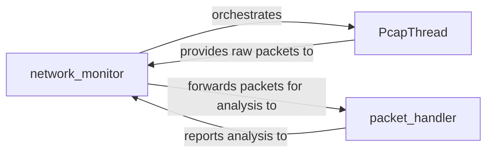

## Details

The network observation subsystem, centered around the `network_monitor`, orchestrates the capture and analysis of network traffic. The `network_monitor` initiates and manages the `PcapThread`, which asynchronously captures raw network packets. These raw packets are then provided by `PcapThread` to the `network_monitor`. The `network_monitor` in turn forwards these packets to the `packet_handler` for detailed analysis. After processing, the `packet_handler` reports its findings back to the `network_monitor`, completing the observation and analysis cycle. This design ensures efficient, non-blocking network monitoring crucial for fuzzing operations.

### network_monitor
Acts as the central orchestrator for the network observation subsystem. It manages the lifecycle of network capture, including starting and stopping the capture process, configuring network filters, and providing an interface for other fuzzer components to interact with the network monitoring capabilities. It forwards captured packets to the `packet_handler` for analysis and receives analysis reports back. Its `pre_send` and `post_send` methods indicate its active role in observing traffic directly related to the fuzzer's interactions with the SUT.

**Related Classes/Methods**:

- <a href="https://github.com/OpenRCE/sulley/blob/master/network_monitor.py" target="_blank" rel="noopener noreferrer">`network_monitor`</a>

### PcapThread
Dedicated to the low-level acquisition of network packets. It operates in a separate thread to ensure that packet capture is performed asynchronously, preventing it from blocking the main fuzzing process. This component is responsible for interfacing with network capture libraries (e.g., `pcap`) to sniff and collect raw network data, providing these raw packets to the `network_monitor`.

**Related Classes/Methods**:

- <a href="https://github.com/OpenRCE/sulley/blob/master/network_monitor.py#L59-L91" target="_blank" rel="noopener noreferrer">`PcapThread`:59-91</a>

### packet_handler
Receives captured network packets from `network_monitor` and performs specific analysis, filtering, or storage based on the fuzzing objectives. This component is crucial for processing raw network data into actionable insights, such as identifying malformed packets, unexpected responses, or confirming successful data transmission, and then reports its analysis back to the `network_monitor`.

**Related Classes/Methods**:

- <a href="https://github.com/OpenRCE/sulley/blob/master/network_monitor.py#L78-L86" target="_blank" rel="noopener noreferrer">`packet_handler`:78-86</a>

### [FAQ](https://github.com/CodeBoarding/GeneratedOnBoardings/tree/main?tab=readme-ov-file#faq)