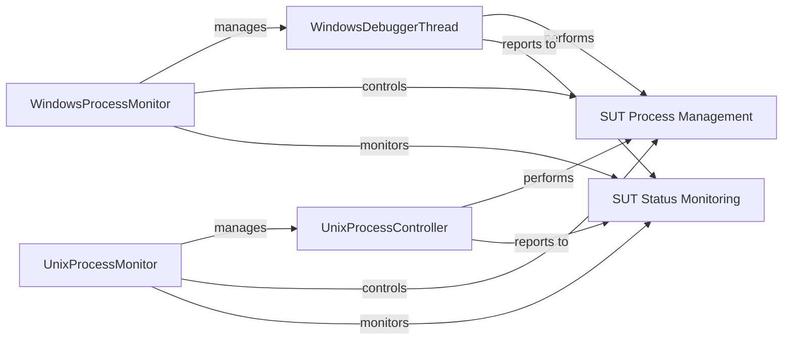

## Details

The `process_monitor` subsystem in Sulley is responsible for managing and monitoring the System Under Test (SUT) during fuzzing operations. It provides OS-specific implementations for Windows and Unix environments, encapsulated by the `WindowsProcessMonitor` and `UnixProcessMonitor` components, respectively. These monitors interact with specialized debugger or process control threads (`WindowsDebuggerThread` and `UnixProcessController`) to initiate, terminate, and observe the SUT's execution. The subsystem's core functionality revolves around `SUT Process Management` for controlling the target application's lifecycle and `SUT Status Monitoring` for detecting crashes or abnormal terminations, ensuring robust and reliable fuzzing campaigns.

### WindowsProcessMonitor
Implements the concrete logic for managing and observing the System Under Test (SUT) specifically on Windows operating systems. It leverages `pydbg` for debugging, handles process control (starting), and integrates with Windows-specific debugging mechanisms. This component directly interacts with the operating system to control the SUT and report on its status.

**Related Classes/Methods**:

- <a href="https://github.com/OpenRCE/sulley/blob/master/process_monitor.py#L291-L300" target="_blank" rel="noopener noreferrer">`sulley.process_monitor.ProcessMonitorPedrpcServer.start_target`:291-300</a>
- <a href="https://github.com/OpenRCE/sulley/blob/master/process_monitor.py#L266-L290" target="_blank" rel="noopener noreferrer">`sulley.process_monitor.ProcessMonitorPedrpcServer.pre_send`:266-290</a>
- <a href="https://github.com/OpenRCE/sulley/blob/master/process_monitor.py#L238-L264" target="_blank" rel="noopener noreferrer">`sulley.process_monitor.ProcessMonitorPedrpcServer.post_send`:238-264</a>
- <a href="https://github.com/OpenRCE/sulley/blob/master/process_monitor.py#L227-L237" target="_blank" rel="noopener noreferrer">`sulley.process_monitor.ProcessMonitorPedrpcServer.log`:227-237</a>
- <a href="https://github.com/OpenRCE/sulley/blob/master/process_monitor.py" target="_blank" rel="noopener noreferrer">`sulley.process_monitor.ProcessMonitorPedrpcServer.set_start_commands`</a>
- <a href="https://github.com/OpenRCE/sulley/blob/master/process_monitor.py" target="_blank" rel="noopener noreferrer">`sulley.process_monitor.ProcessMonitorPedrpcServer.set_stop_commands`</a>
- <a href="https://github.com/OpenRCE/sulley/blob/master/process_monitor.py" target="_blank" rel="noopener noreferrer">`sulley.process_monitor.ProcessMonitorPedrpcServer.set_proc_name`</a>

### UnixProcessMonitor
Implements the concrete logic for managing and observing the System Under Test (SUT) specifically on Unix-like operating systems. It handles OS-level process control (spawning, killing), integrates with Unix-specific monitoring mechanisms, and reports on the SUT's health. This component directly interacts with the operating system to control the SUT.

**Related Classes/Methods**:

- <a href="https://github.com/OpenRCE/sulley/blob/master/process_monitor_unix.py#L174-L186" target="_blank" rel="noopener noreferrer">`sulley.process_monitor_unix.nix_process_monitor_pedrpc_server.start_target`:174-186</a>
- <a href="https://github.com/OpenRCE/sulley/blob/master/process_monitor_unix.py#L188-L202" target="_blank" rel="noopener noreferrer">`sulley.process_monitor_unix.nix_process_monitor_pedrpc_server.stop_target`:188-202</a>
- <a href="https://github.com/OpenRCE/sulley/blob/master/process_monitor_unix.py#L160-L172" target="_blank" rel="noopener noreferrer">`sulley.process_monitor_unix.nix_process_monitor_pedrpc_server.pre_send`:160-172</a>
- <a href="https://github.com/OpenRCE/sulley/blob/master/process_monitor_unix.py#L132-L158" target="_blank" rel="noopener noreferrer">`sulley.process_monitor_unix.nix_process_monitor_pedrpc_server.post_send`:132-158</a>
- <a href="https://github.com/OpenRCE/sulley/blob/master/process_monitor_unix.py#L121-L130" target="_blank" rel="noopener noreferrer">`sulley.process_monitor_unix.nix_process_monitor_pedrpc_server.log`:121-130</a>
- <a href="https://github.com/OpenRCE/sulley/blob/master/process_monitor_unix.py#L204-L216" target="_blank" rel="noopener noreferrer">`sulley.process_monitor_unix.nix_process_monitor_pedrpc_server.set_start_commands`:204-216</a>
- <a href="https://github.com/OpenRCE/sulley/blob/master/process_monitor_unix.py#L218-L221" target="_blank" rel="noopener noreferrer">`sulley.process_monitor_unix.nix_process_monitor_pedrpc_server.set_stop_commands`:218-221</a>
- <a href="https://github.com/OpenRCE/sulley/blob/master/process_monitor_unix.py#L223-L227" target="_blank" rel="noopener noreferrer">`sulley.process_monitor_unix.nix_process_monitor_pedrpc_server.set_proc_name`:223-227</a>

### WindowsDebuggerThread
Manages the interaction with a debugger (PyDbg) in a separate thread to monitor the SUT for crashes or abnormal behavior on Windows. It's crucial for real-time fault detection within the fuzzing process, operating asynchronously to detect issues without blocking the main fuzzing loop.

**Related Classes/Methods**:

- <a href="https://github.com/OpenRCE/sulley/blob/master/process_monitor.py#L27-L130" target="_blank" rel="noopener noreferrer">`sulley.process_monitor.DebuggerThread`:27-130</a>
- <a href="https://github.com/OpenRCE/sulley/blob/master/process_monitor.py#L95-L112" target="_blank" rel="noopener noreferrer">`sulley.process_monitor.DebuggerThread.run`:95-112</a>
- <a href="https://github.com/OpenRCE/sulley/blob/master/process_monitor.py#L114-L130" target="_blank" rel="noopener noreferrer">`sulley.process_monitor.DebuggerThread.watch`:114-130</a>
- <a href="https://github.com/OpenRCE/sulley/blob/master/process_monitor.py#L53-L81" target="_blank" rel="noopener noreferrer">`sulley.process_monitor.DebuggerThread.dbg_callback_access_violation`:53-81</a>
- <a href="https://github.com/OpenRCE/sulley/blob/master/process_monitor.py#L83-L93" target="_blank" rel="noopener noreferrer">`sulley.process_monitor.DebuggerThread.dbg_callback_user`:83-93</a>

### UnixProcessController
This class handles the low-level process control for Unix-like systems, including spawning, stopping, and monitoring the target process's exit status. It is utilized by the `UnixProcessMonitor` to manage the SUT.

**Related Classes/Methods**:

- <a href="https://github.com/OpenRCE/sulley/blob/master/process_monitor_unix.py#L49-L90" target="_blank" rel="noopener noreferrer">`sulley.process_monitor_unix.debugger_thread`:49-90</a>
- <a href="https://github.com/OpenRCE/sulley/blob/master/process_monitor_unix.py#L64-L67" target="_blank" rel="noopener noreferrer">`sulley.process_monitor_unix.debugger_thread.spawn_target`:64-67</a>
- <a href="https://github.com/OpenRCE/sulley/blob/master/process_monitor_unix.py#L69-L81" target="_blank" rel="noopener noreferrer">`sulley.process_monitor_unix.debugger_thread.start_monitoring`:69-81</a>
- <a href="https://github.com/OpenRCE/sulley/blob/master/process_monitor_unix.py#L82-L83" target="_blank" rel="noopener noreferrer">`sulley.process_monitor_unix.debugger_thread.get_exit_status`:82-83</a>
- <a href="https://github.com/OpenRCE/sulley/blob/master/process_monitor_unix.py#L85-L87" target="_blank" rel="noopener noreferrer">`sulley.process_monitor_unix.debugger_thread.stop_target`:85-87</a>
- <a href="https://github.com/OpenRCE/sulley/blob/master/process_monitor_unix.py#L89-L90" target="_blank" rel="noopener noreferrer">`sulley.process_monitor_unix.debugger_thread.isAlive`:89-90</a>

### SUT Process Management
Encompasses the low-level actions of starting, stopping, and spawning the target application. This is a functional responsibility distributed across methods that abstract the direct interaction with the operating system's process management facilities.

**Related Classes/Methods**:

- <a href="https://github.com/OpenRCE/sulley/blob/master/process_monitor.py#L291-L300" target="_blank" rel="noopener noreferrer">`sulley.process_monitor.ProcessMonitorPedrpcServer.start_target`:291-300</a>
- <a href="https://github.com/OpenRCE/sulley/blob/master/process_monitor_unix.py#L174-L186" target="_blank" rel="noopener noreferrer">`sulley.process_monitor_unix.nix_process_monitor_pedrpc_server.start_target`:174-186</a>
- <a href="https://github.com/OpenRCE/sulley/blob/master/process_monitor_unix.py#L188-L202" target="_blank" rel="noopener noreferrer">`sulley.process_monitor_unix.nix_process_monitor_pedrpc_server.stop_target`:188-202</a>
- <a href="https://github.com/OpenRCE/sulley/blob/master/process_monitor_unix.py#L64-L67" target="_blank" rel="noopener noreferrer">`sulley.process_monitor_unix.debugger_thread.spawn_target`:64-67</a>
- <a href="https://github.com/OpenRCE/sulley/blob/master/process_monitor_unix.py#L85-L87" target="_blank" rel="noopener noreferrer">`sulley.process_monitor_unix.debugger_thread.stop_target`:85-87</a>

### SUT Status Monitoring
Involves checking the health and exit status of the SUT after interactions. This component provides the means to determine if the SUT is still running or if it terminated, and if so, its exit code, which is vital for identifying crashes or hangs.

**Related Classes/Methods**:

- <a href="https://github.com/OpenRCE/sulley/blob/master/process_monitor_unix.py#L82-L83" target="_blank" rel="noopener noreferrer">`sulley.process_monitor_unix.debugger_thread.get_exit_status`:82-83</a>
- <a href="https://github.com/OpenRCE/sulley/blob/master/process_monitor_unix.py#L89-L90" target="_blank" rel="noopener noreferrer">`sulley.process_monitor_unix.debugger_thread.isAlive`:89-90</a>
- <a href="https://github.com/OpenRCE/sulley/blob/master/process_monitor.py" target="_blank" rel="noopener noreferrer">`sulley.process_monitor.DebuggerThread.isAlive`</a>
- <a href="https://github.com/OpenRCE/sulley/blob/master/process_monitor.py#L238-L264" target="_blank" rel="noopener noreferrer">`sulley.process_monitor.ProcessMonitorPedrpcServer.post_send`:238-264</a>
- <a href="https://github.com/OpenRCE/sulley/blob/master/process_monitor_unix.py#L132-L158" target="_blank" rel="noopener noreferrer">`sulley.process_monitor_unix.nix_process_monitor_pedrpc_server.post_send`:132-158</a>

### [FAQ](https://github.com/CodeBoarding/GeneratedOnBoardings/tree/main?tab=readme-ov-file#faq)