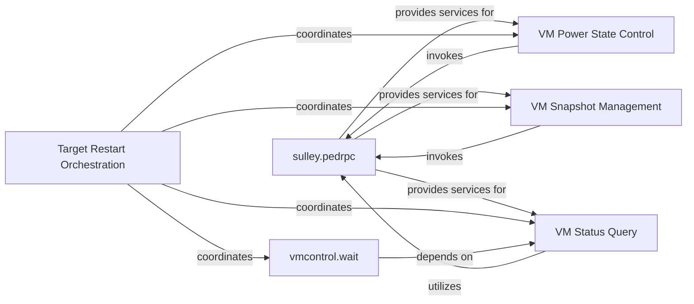

## Details

The `vmcontrol` subsystem in `sulley` provides comprehensive virtual machine management capabilities crucial for fuzzing operations. While `vmcontrol` itself is a conceptual grouping of functionalities, its core implementation and interaction with virtual machines are facilitated by the `sulley.pedrpc` component. `sulley.pedrpc` acts as the central communication layer, enabling remote execution of VM commands. Higher-level logical components such as `VM Power State Control`, `VM Snapshot Management`, `Target Restart Orchestration`, and `VM Status Query` abstract specific VM operations. These components interact with `sulley.pedrpc` to perform their respective tasks, ensuring a clean and consistent VM environment for each fuzzing iteration. The `vmcontrol.wait` utility further enhances state management by allowing the system to pause until a desired VM state is achieved, often relying on `VM Status Query`. This architecture ensures robust and repeatable fuzzing campaigns by providing precise control over the virtualized testing environment.

### sulley.pedrpc
This is the central component, acting as the communication backbone for all VM control operations. It provides the remote procedure call mechanism, allowing the fuzzing engine to interact with and control virtual machines, potentially across different hosts. All VM control commands are channeled through this component.

**Related Classes/Methods**:

- <a href="https://github.com/OpenRCE/sulley/blob/master/sulley/pedrpc.py" target="_blank" rel="noopener noreferrer">`sulley.pedrpc`</a>

### VM Power State Control
A logical grouping of functions responsible for managing the operational state of the virtual machine (e.g., start, stop, suspend, resume, pause). These operations are critical for controlling the System Under Test's (SUT) execution lifecycle during fuzzing.

**Related Classes/Methods**:

- <a href="https://github.com/OpenRCE/sulley/blob/master/sulley/pedrpc.py" target="_blank" rel="noopener noreferrer">`sulley.pedrpc`</a>

### VM Snapshot Management
A logical grouping of functions providing mechanisms to save and restore specific VM states. This is fundamental for ensuring test repeatability, efficient recovery after crashes, and quickly reverting to a known good state during fuzzing campaigns.

**Related Classes/Methods**:

- <a href="https://github.com/OpenRCE/sulley/blob/master/sulley/pedrpc.py" target="_blank" rel="noopener noreferrer">`sulley.pedrpc`</a>

### Target Restart Orchestration
A high-level function (`restart_target`) that coordinates a sequence of VM operations (e.g., stop, revert, start, wait) to bring the target VM back to a clean, ready state for the next fuzzing test case. This is a key workflow in the fuzzing loop.

**Related Classes/Methods**:

- <a href="https://github.com/OpenRCE/sulley/blob/master/sulley/pedrpc.py" target="_blank" rel="noopener noreferrer">`sulley.pedrpc`</a>

### VM Status Query
A logical grouping of functions responsible for querying the current operational status and detailed information of the virtual machine. This is essential for conditional operations and waiting for specific states, ensuring robust state management.

**Related Classes/Methods**:

- <a href="https://github.com/OpenRCE/sulley/blob/master/sulley/pedrpc.py" target="_blank" rel="noopener noreferrer">`sulley.pedrpc`</a>

### vmcontrol.wait
A utility function that repeatedly checks the VM's status until the target reaches a desired operational state. This works in conjunction with `VM Status Query` to ensure proper synchronization and sequencing of VM operations.

**Related Classes/Methods**:

- <a href="https://github.com/OpenRCE/sulley/blob/master/sulley/pedrpc.py" target="_blank" rel="noopener noreferrer">`sulley.pedrpc`</a>

### [FAQ](https://github.com/CodeBoarding/GeneratedOnBoardings/tree/main?tab=readme-ov-file#faq)