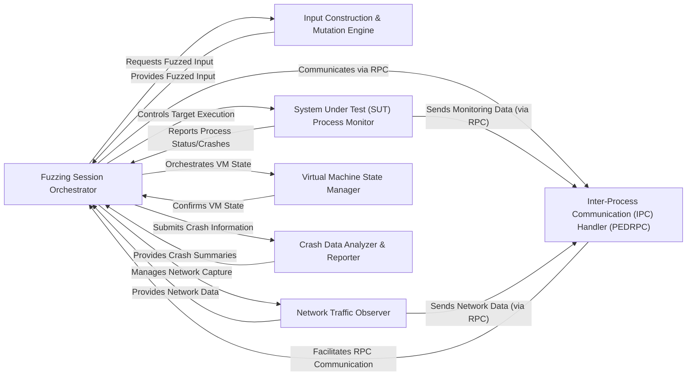

## Details

The Sulley fuzzing framework operates as a highly modular system, orchestrated by the Fuzzing Session Orchestrator. This central component drives the fuzzing process, coordinating the generation of diverse test cases by the Input Construction & Mutation Engine. It then dispatches these inputs to the System Under Test (SUT) Process Monitor for execution and crash detection. Network interactions are observed by the Network Traffic Observer, while the Virtual Machine State Manager ensures a clean testing environment. Communication across components, especially with remote monitoring agents, is facilitated by the Inter-Process Communication (IPC) Handler (PEDRPC). Finally, the Crash Data Analyzer & Reporter processes and categorizes any detected anomalies, providing critical feedback to the orchestrator. This design promotes clear separation of concerns, enabling robust and efficient fuzzing campaigns.

### Fuzzing Session Orchestrator [[Expand]](./Fuzzing_Session_Orchestrator.md)
The central control unit managing the fuzzing loop, test case progression, and overall state. It coordinates interactions between all other components, driving the fuzzing pipeline.

**Related Classes/Methods**:

- <a href="https://github.com/OpenRCE/sulley/blob/master/sulley/sessions.py" target="_blank" rel="noopener noreferrer">`sulley.sessions`</a>

### Input Construction & Mutation Engine [[Expand]](./Input_Construction_Mutation_Engine.md)
Responsible for generating and transforming fuzzed inputs based on defined data structures (blocks, primitives, legos) and applying various mutation strategies to create diverse test cases.

**Related Classes/Methods**:

- <a href="https://github.com/OpenRCE/sulley/blob/master/sulley/blocks.py" target="_blank" rel="noopener noreferrer">`sulley.blocks`</a>
- <a href="https://github.com/OpenRCE/sulley/blob/master/sulley/primitives.py" target="_blank" rel="noopener noreferrer">`sulley.primitives`</a>
- <a href="https://github.com/OpenRCE/sulley/blob/master/sulley/legos" target="_blank" rel="noopener noreferrer">`sulley.legos`</a>

### System Under Test (SUT) Process Monitor [[Expand]](./System_Under_Test_SUT_Process_Monitor.md)
Monitors and controls the execution of the target application (SUT), detecting crashes, hangs, or other anomalous behavior. It provides mechanisms to start, stop, and interact with the target process.

**Related Classes/Methods**:

- <a href="https://github.com/OpenRCE/sulley/blob/master/process_monitor.py" target="_blank" rel="noopener noreferrer">`process_monitor`</a>
- <a href="https://github.com/OpenRCE/sulley/blob/master/process_monitor_unix.py" target="_blank" rel="noopener noreferrer">`process_monitor_unix`</a>

### Network Traffic Observer [[Expand]](./Network_Traffic_Observer.md)
Observes and records network communications between the fuzzer and the SUT. It captures and analyzes network packets to identify network-related issues or confirm data transmission.

**Related Classes/Methods**:

- <a href="https://github.com/OpenRCE/sulley/blob/master/network_monitor.py" target="_blank" rel="noopener noreferrer">`network_monitor`</a>

### Virtual Machine State Manager [[Expand]](./Virtual_Machine_State_Manager.md)
Manages the state of virtual machines hosting the SUT, ensuring a clean and consistent environment for each fuzzing iteration by reverting to snapshots or controlling VM power states.

**Related Classes/Methods**: _None_

### Inter-Process Communication (IPC) Handler (PEDRPC) [[Expand]](./Inter_Process_Communication_IPC_Handler_PEDRPC_.md)
Provides the communication backbone for the fuzzer, enabling interaction with remote monitoring agents and other distributed components using Sulley's custom PEDRPC mechanism.

**Related Classes/Methods**:

- <a href="https://github.com/OpenRCE/sulley/blob/master/sulley/pedrpc.py" target="_blank" rel="noopener noreferrer">`sulley.pedrpc`</a>

### Crash Data Analyzer & Reporter [[Expand]](./Crash_Data_Analyzer_Reporter.md)
Processes raw crash data, categorizes crashes, and provides mechanisms for viewing and reporting findings, crucial for understanding the impact of fuzzed inputs.

**Related Classes/Methods**: _None_

### [FAQ](https://github.com/CodeBoarding/GeneratedOnBoardings/tree/main?tab=readme-ov-file#faq)