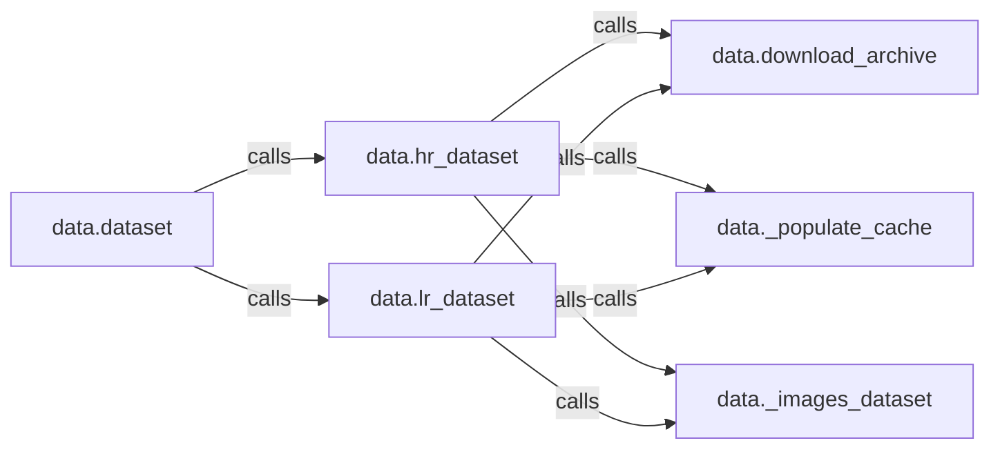

## Details

The `data` subsystem is designed to efficiently manage the acquisition, caching, and preparation of image datasets for super-resolution models. At its core, the `data.dataset` component orchestrates the entire data pipeline, delegating responsibilities to specialized `data.hr_dataset` and `data.lr_dataset` components for handling high-resolution and low-resolution images, respectively. These dataset-specific components rely on shared utilities: `data.download_archive` for fetching raw image archives, `data._populate_cache` for optimizing local storage and retrieval, and `data._images_dataset` for converting image files into a TensorFlow-compatible format. This modular design ensures a clear separation of concerns, allowing for independent management of HR and LR data while leveraging common functionalities for data handling.

### data.dataset
The primary orchestrator for constructing the complete dataset, coordinating the acquisition and preparation of both high-resolution (HR) and low-resolution (LR) image data. It serves as the main interface for consumers to obtain the prepared dataset.

**Related Classes/Methods**:

- <a href="https://github.com/krasserm/super-resolution/blob/master/data.py#L69-L78" target="_blank" rel="noopener noreferrer">`data.hr_dataset`:69-78</a>
- <a href="https://github.com/krasserm/super-resolution/blob/master/data.py#L80-L89" target="_blank" rel="noopener noreferrer">`data.lr_dataset`:80-89</a>

### data.hr_dataset
Manages the entire lifecycle of high-resolution (HR) image data, including downloading, caching, and preparing it for use in the dataset. It ensures HR images are correctly sourced and made available. This component encapsulates the logic for managing HR cache indices and resolving HR image file paths.

**Related Classes/Methods**:

- <a href="https://github.com/krasserm/super-resolution/blob/master/data.py#L188-L192" target="_blank" rel="noopener noreferrer">`data.download_archive`:188-192</a>
- <a href="https://github.com/krasserm/super-resolution/blob/master/data.py#L142-L146" target="_blank" rel="noopener noreferrer">`data._populate_cache`:142-146</a>
- <a href="https://github.com/krasserm/super-resolution/blob/master/data.py#L135-L140" target="_blank" rel="noopener noreferrer">`data._images_dataset`:135-140</a>
- <a href="https://github.com/krasserm/super-resolution/blob/master/data.py#L97-L98" target="_blank" rel="noopener noreferrer">`data._hr_cache_index`:97-98</a>
- <a href="https://github.com/krasserm/super-resolution/blob/master/data.py#L103-L105" target="_blank" rel="noopener noreferrer">`data._hr_image_files`:103-105</a>

### data.lr_dataset
Manages the entire lifecycle of low-resolution (LR) image data, including downloading, caching, and preparing it for use in the dataset. It ensures LR images are correctly sourced and made available. This component encapsulates the logic for managing LR cache indices and resolving LR image file paths.

**Related Classes/Methods**:

- <a href="https://github.com/krasserm/super-resolution/blob/master/data.py#L188-L192" target="_blank" rel="noopener noreferrer">`data.download_archive`:188-192</a>
- <a href="https://github.com/krasserm/super-resolution/blob/master/data.py#L142-L146" target="_blank" rel="noopener noreferrer">`data._populate_cache`:142-146</a>
- <a href="https://github.com/krasserm/super-resolution/blob/master/data.py#L135-L140" target="_blank" rel="noopener noreferrer">`data._images_dataset`:135-140</a>
- <a href="https://github.com/krasserm/super-resolution/blob/master/data.py#L100-L101" target="_blank" rel="noopener noreferrer">`data._lr_cache_index`:100-101</a>
- <a href="https://github.com/krasserm/super-resolution/blob/master/data.py#L107-L109" target="_blank" rel="noopener noreferrer">`data._lr_image_files`:107-109</a>

### data.download_archive
A shared utility function responsible for securely downloading compressed image archives from specified external URLs using `tf.keras.utils.get_file`. It abstracts the complexities of file downloading.

**Related Classes/Methods**:

- <a href="https://github.com/krasserm/super-resolution/blob/master/data.py#L188-L192" target="_blank" rel="noopener noreferrer">`data.download_archive`:188-192</a>

### data._populate_cache
A shared utility method responsible for managing the local caching mechanism by iterating through a TensorFlow dataset to trigger the caching of decoded image data. It prevents redundant downloads and processing.

**Related Classes/Methods**:

- <a href="https://github.com/krasserm/super-resolution/blob/master/data.py#L142-L146" target="_blank" rel="noopener noreferrer">`data._populate_cache`:142-146</a>

### data._images_dataset
A shared utility method that abstracts the process of creating a TensorFlow dataset from a collection of image file paths, handling the underlying dataset construction logic including reading and decoding PNG images.

**Related Classes/Methods**:

- <a href="https://github.com/krasserm/super-resolution/blob/master/data.py#L135-L140" target="_blank" rel="noopener noreferrer">`data._images_dataset`:135-140</a>

### [FAQ](https://github.com/CodeBoarding/GeneratedOnBoardings/tree/main?tab=readme-ov-file#faq)