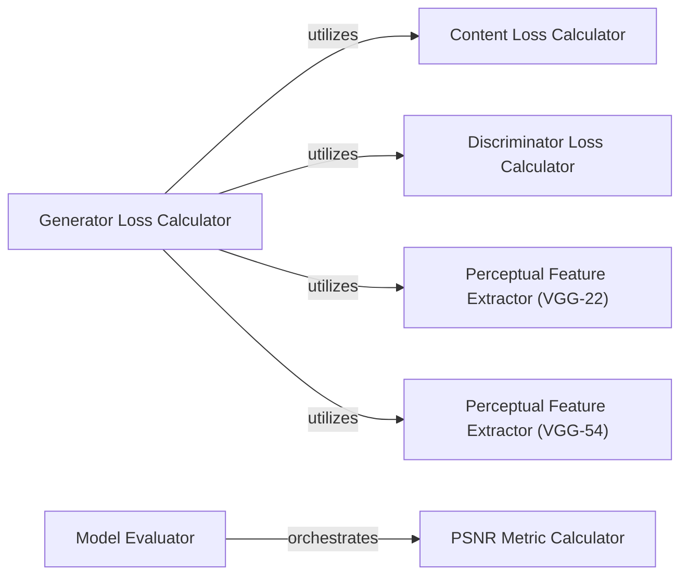

## Details

The super-resolution system is structured around a training pipeline focused on optimizing a generator network. The Generator Loss Calculator acts as the primary orchestrator for generator training, aggregating various loss components: Content Loss Calculator for pixel/feature fidelity, Discriminator Loss Calculator for adversarial training, and Perceptual Feature Extractor (VGG-22) and Perceptual Feature Extractor (VGG-54) for perceptual quality. Post-training or during evaluation, the Model Evaluator component takes charge, leveraging the PSNR Metric Calculator to quantitatively assess the super-resolution model's performance. This modular design clearly separates the training loss computation from the model evaluation process.

### Generator Loss Calculator
Computes the comprehensive loss for the generator network, typically combining content, adversarial, and perceptual loss components to guide the generator's optimization.

**Related Classes/Methods**:

- <a href="https://github.com/krasserm/super-resolution/blob/master/train.py#L205-L206" target="_blank" rel="noopener noreferrer">`train._generator_loss`:205-206</a>

### Content Loss Calculator
Calculates the content-based loss, which measures the pixel-wise or feature-wise difference between the generated low-resolution image and the target high-resolution image.

**Related Classes/Methods**:

- <a href="https://github.com/krasserm/super-resolution/blob/master/train.py#L197-L203" target="_blank" rel="noopener noreferrer">`train._content_loss`:197-203</a>

### Discriminator Loss Calculator
Determines the loss for the discriminator network, which is trained to distinguish between real high-resolution images and generated super-resolution images.

**Related Classes/Methods**:

- <a href="https://github.com/krasserm/super-resolution/blob/master/train.py#L208-L211" target="_blank" rel="noopener noreferrer">`train._discriminator_loss`:208-211</a>

### Perceptual Feature Extractor (VGG-22)
Utilizes a pre-trained VGG-19 network (up to layer 'block3_conv4') to extract features from images, which are then used to compute the perceptual loss, focusing on texture and style.

**Related Classes/Methods**:

- <a href="https://github.com/krasserm/super-resolution/blob/master/model/srgan.py#L85-L86" target="_blank" rel="noopener noreferrer">`model.srgan.vgg_22`:85-86</a>

### Perceptual Feature Extractor (VGG-54)
Employs a deeper part of the pre-trained VGG-19 network (up to layer 'block5_conv4') to extract more abstract features for perceptual loss, capturing higher-level semantic differences.

**Related Classes/Methods**:

- <a href="https://github.com/krasserm/super-resolution/blob/master/model/srgan.py#L89-L90" target="_blank" rel="noopener noreferrer">`model.srgan.vgg_54`:89-90</a>

### Model Evaluator
Orchestrates the quantitative assessment of the super-resolution model's performance, typically by invoking various metric calculation functions.

**Related Classes/Methods**:

- <a href="https://github.com/krasserm/super-resolution/blob/master/model/common.py#L21-L27" target="_blank" rel="noopener noreferrer">`model.common.evaluate`:21-27</a>

### PSNR Metric Calculator
Computes the Peak Signal-to-Noise Ratio (PSNR), a widely used objective metric for evaluating the quality of reconstructed images by comparing them to a reference image.

**Related Classes/Methods**:

- <a href="https://github.com/krasserm/super-resolution/blob/master/model/common.py#L63-L64" target="_blank" rel="noopener noreferrer">`model.common.psnr`:63-64</a>

### [FAQ](https://github.com/CodeBoarding/GeneratedOnBoardings/tree/main?tab=readme-ov-file#faq)