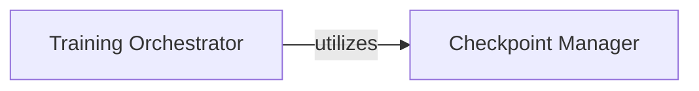

## Details

The training subsystem, primarily encapsulated within `train.py`, orchestrates the entire model training lifecycle. At its core, the Training Orchestrator manages the iterative training process, executing individual training steps and monitoring progress. Complementing this, the Checkpoint Manager ensures training continuity by handling the loading of previously saved model and optimizer states, allowing for seamless resumption or leveraging pre-trained configurations. This clear separation of concerns facilitates robust and manageable training workflows, with the Training Orchestrator driving the training loop and relying on the Checkpoint Manager to maintain state persistence.

### Training Orchestrator
The core of the training subsystem, primarily defined within `train.py`, revolves around the Training Orchestrator, which is responsible for the iterative execution of the training process, managing epochs and individual training steps. It manages the iterative training process, executing individual training steps and monitoring progress.

**Related Classes/Methods**:

- <a href="https://github.com/krasserm/super-resolution/blob/master/train.py#L1-L2" target="_blank" rel="noopener noreferrer">`Training Orchestrator:train`:1-2</a>
- <a href="https://github.com/krasserm/super-resolution/blob/master/train.py#L1-L2" target="_blank" rel="noopener noreferrer">`Training Orchestrator:train_step`:1-2</a>

### Checkpoint Manager
The Checkpoint Manager ensures the persistence and restoration of the training state, allowing for seamless resumption or leveraging pre-trained models. It ensures training continuity by handling the loading of previously saved model and optimizer states, allowing for seamless resumption or leveraging pre-trained configurations.

**Related Classes/Methods**:

- <a href="https://github.com/krasserm/super-resolution/blob/master/train.py#L1-L2" target="_blank" rel="noopener noreferrer">`Checkpoint Manager:restore`:1-2</a>

### [FAQ](https://github.com/CodeBoarding/GeneratedOnBoardings/tree/main?tab=readme-ov-file#faq)