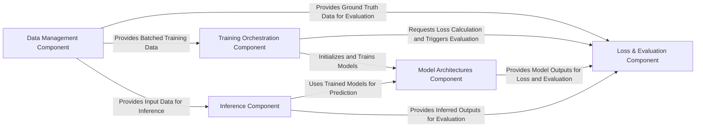

## Details

The `super-resolution` project is architected as a modular deep learning pipeline, primarily focused on the Trainer-Model-Data (TMD) pattern for image super-resolution tasks. The core flow begins with the Data Management Component, which efficiently loads and prepares high-resolution and low-resolution image datasets. This prepared data then feeds into the Training Orchestration Component, which manages the entire training lifecycle, coordinating the optimization of various Model Architectures Component (EDSR, SRGAN, WDSR). During training, the Loss & Evaluation Component calculates critical loss functions and assesses model performance, leveraging both model outputs and ground truth data. Post-training, the Inference Component utilizes the trained models to generate high-resolution images from new low-resolution inputs, completing the super-resolution workflow. This clear separation of concerns facilitates maintainability, scalability, and the integration of new models or datasets.

### Data Management Component [[Expand]](./Data_Management_Component.md)
Manages the entire data lifecycle, from loading and caching to preparing high-resolution (HR) and low-resolution (LR) image datasets. It transforms raw data into a format suitable for both model training and inference.

**Related Classes/Methods**:

- <a href="https://github.com/krasserm/super-resolution/blob/master/data.py#L58-L67" target="_blank" rel="noopener noreferrer">`data.dataset`:58-67</a>
- <a href="https://github.com/krasserm/super-resolution/blob/master/data.py#L69-L78" target="_blank" rel="noopener noreferrer">`data.hr_dataset`:69-78</a>
- <a href="https://github.com/krasserm/super-resolution/blob/master/data.py#L80-L89" target="_blank" rel="noopener noreferrer">`data.lr_dataset`:80-89</a>
- <a href="https://github.com/krasserm/super-resolution/blob/master/data.py#L188-L192" target="_blank" rel="noopener noreferrer">`data.download_archive`:188-192</a>
- <a href="https://github.com/krasserm/super-resolution/blob/master/data.py#L142-L146" target="_blank" rel="noopener noreferrer">`data._populate_cache`:142-146</a>

### Model Architectures Component
Encapsulates all neural network architectures used for single-image super-resolution, including distinct implementations for EDSR, SRGAN (Generator and Discriminator), and WDSR.

**Related Classes/Methods**:

- <a href="https://github.com/krasserm/super-resolution/blob/master/model/edsr.py#L7-L21" target="_blank" rel="noopener noreferrer">`model.edsr.edsr`:7-21</a>
- <a href="https://github.com/krasserm/super-resolution/blob/master/model/srgan.py#L27-L47" target="_blank" rel="noopener noreferrer">`model.srgan.sr_resnet`:27-47</a>
- <a href="https://github.com/krasserm/super-resolution/blob/master/model/srgan.py#L60-L82" target="_blank" rel="noopener noreferrer">`model.srgan.discriminator`:60-82</a>
- <a href="https://github.com/krasserm/super-resolution/blob/master/model/wdsr.py#L17-L35" target="_blank" rel="noopener noreferrer">`model.wdsr.wdsr`:17-35</a>

### Training Orchestration Component [[Expand]](./Training_Orchestration_Component.md)
Manages the overarching training process, including model initialization, execution of training loops, and state management (e.g., loading and saving checkpoints). It coordinates interactions between data, models, and loss/evaluation modules.

**Related Classes/Methods**:

- <a href="https://github.com/krasserm/super-resolution/blob/master/train.py#L156-L171" target="_blank" rel="noopener noreferrer">`train.train`:156-171</a>
- <a href="https://github.com/krasserm/super-resolution/blob/master/train.py#L91-L94" target="_blank" rel="noopener noreferrer">`train.restore`:91-94</a>

### Loss & Evaluation Component [[Expand]](./Loss_Evaluation_Component.md)
Handles the computation of various loss functions critical for optimizing super-resolution models during training (e.g., generator loss, content loss, discriminator loss). It also provides utilities for quantitatively assessing model performance using metrics like PSNR, and includes the Perceptual Loss (VGG) functionality.

**Related Classes/Methods**:

- <a href="https://github.com/krasserm/super-resolution/blob/master/train.py#L205-L206" target="_blank" rel="noopener noreferrer">`train._generator_loss`:205-206</a>
- <a href="https://github.com/krasserm/super-resolution/blob/master/train.py#L197-L203" target="_blank" rel="noopener noreferrer">`train._content_loss`:197-203</a>
- <a href="https://github.com/krasserm/super-resolution/blob/master/train.py#L208-L211" target="_blank" rel="noopener noreferrer">`train._discriminator_loss`:208-211</a>
- <a href="https://github.com/krasserm/super-resolution/blob/master/model/common.py#L21-L27" target="_blank" rel="noopener noreferrer">`model.common.evaluate`:21-27</a>
- <a href="https://github.com/krasserm/super-resolution/blob/master/model/common.py#L63-L64" target="_blank" rel="noopener noreferrer">`model.common.psnr`:63-64</a>
- <a href="https://github.com/krasserm/super-resolution/blob/master/model/srgan.py#L85-L86" target="_blank" rel="noopener noreferrer">`model.srgan.vgg_22`:85-86</a>
- <a href="https://github.com/krasserm/super-resolution/blob/master/model/srgan.py#L89-L90" target="_blank" rel="noopener noreferrer">`model.srgan.vgg_54`:89-90</a>

### Inference Component
Facilitates the application of trained super-resolution models to new low-resolution images to generate high-resolution outputs. It handles the forward pass through the selected model for prediction.

**Related Classes/Methods**:

- <a href="https://github.com/krasserm/super-resolution/blob/master/model/common.py#L8-L9" target="_blank" rel="noopener noreferrer">`model.common.resolve_single`:8-9</a>
- <a href="https://github.com/krasserm/super-resolution/blob/master/model/common.py#L12-L18" target="_blank" rel="noopener noreferrer">`model.common.resolve`:12-18</a>

### [FAQ](https://github.com/CodeBoarding/GeneratedOnBoardings/tree/main?tab=readme-ov-file#faq)