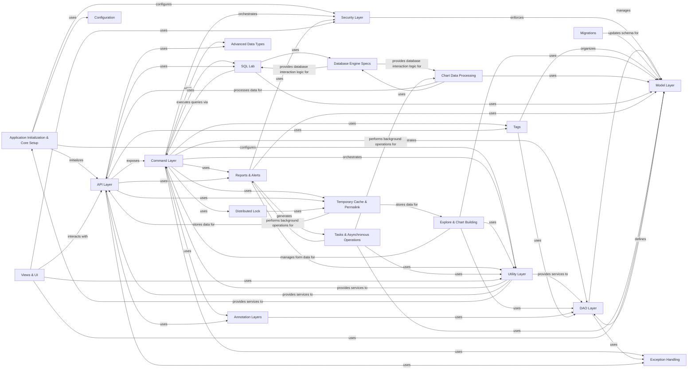

## Component Details

Manages the fundamental setup of the Superset application, including configuration, logging, and core services. It also provides common utility functions, temporary data caching, and distributed locking mechanisms essential for application stability and performance.

### Application Initialization & Core Setup
Manages the fundamental setup and bootstrapping of the Superset application. This includes initializing the Flask application, configuring logging, setting up feature flags, and registering core extensions and blueprints. It ensures the application is correctly configured and ready to handle requests.

**Related Classes/Methods**:

- <a href="https://github.com/apache/superset/blob/master/superset/app.py#L41-L76" target="_blank" rel="noopener noreferrer">`superset.app.create_app` (41:76)</a>
- `superset.initialization.SupersetAppInitializer:init_app` (full file reference)
- `superset.initialization.SupersetAppInitializer:init_app_in_ctx` (full file reference)
- `superset.initialization.SupersetAppInitializer:configure_fab` (full file reference)
- `superset.initialization.SupersetAppInitializer:configure_logging` (full file reference)
- `superset.initialization.SupersetAppInitializer:configure_feature_flags` (full file reference)
- <a href="https://github.com/apache/superset/blob/master/superset/utils/cache_manager.py#L89-L101" target="_blank" rel="noopener noreferrer">`superset.utils.cache_manager.CacheManager:init_app` (89:101)</a>

### Command Layer
The Command Layer encapsulates specific business logic operations, such as creating, updating, or deleting entities. Commands are designed to be atomic and self-contained, often orchestrating interactions with DAO (Data Access Object) and other utility layers. They handle input validation and error propagation.

**Related Classes/Methods**:

- <a href="https://github.com/apache/superset/blob/master/superset/commands/base.py#L25-L43" target="_blank" rel="noopener noreferrer">`superset.commands.base.BaseCommand` (25:43)</a>
- <a href="https://github.com/apache/superset/blob/master/superset/commands/base.py#L46-L58" target="_blank" rel="noopener noreferrer">`superset.commands.base.CreateMixin` (46:58)</a>
- <a href="https://github.com/apache/superset/blob/master/superset/commands/chart/create.py#L42-L82" target="_blank" rel="noopener noreferrer">`superset.commands.chart.create.CreateChartCommand` (42:82)</a>
- <a href="https://github.com/apache/superset/blob/master/superset/commands/chart/exceptions.py#L114-L115" target="_blank" rel="noopener noreferrer">`superset.commands.chart.exceptions.ChartCreateFailedError` (114:115)</a>
- <a href="https://github.com/apache/superset/blob/master/superset/commands/chart/exceptions.py#L110-L111" target="_blank" rel="noopener noreferrer">`superset.commands.chart.exceptions.ChartInvalidError` (110:111)</a>
- <a href="https://github.com/apache/superset/blob/master/superset/commands/chart/exceptions.py#L150-L151" target="_blank" rel="noopener noreferrer">`superset.commands.chart.exceptions.DashboardsForbiddenError` (150:151)</a>
- <a href="https://github.com/apache/superset/blob/master/superset/commands/chart/exceptions.py#L85-L91" target="_blank" rel="noopener noreferrer">`superset.commands.chart.exceptions.DashboardsNotFoundValidationError` (85:91)</a>
- <a href="https://github.com/apache/superset/blob/master/superset/commands/exceptions.py#L25-L31" target="_blank" rel="noopener noreferrer">`superset.commands.exceptions.CommandException` (25:31)</a>
- <a href="https://github.com/apache/superset/blob/master/superset/commands/utils.py#L104-L110" target="_blank" rel="noopener noreferrer">`superset.commands.utils.get_datasource_by_id` (104:110)</a>
- <a href="https://github.com/apache/superset/blob/master/superset/commands/explore/form_data/create.py#L40-L68" target="_blank" rel="noopener noreferrer">`superset.commands.explore.form_data.create.CreateFormDataCommand:run` (40:68)</a>
- <a href="https://github.com/apache/superset/blob/master/superset/commands/temporary_cache/get.py#L34-L39" target="_blank" rel="noopener noreferrer">`superset.commands.temporary_cache.get.GetTemporaryCacheCommand:run` (34:39)</a>
- <a href="https://github.com/apache/superset/blob/master/superset/commands/distributed_lock/create.py#L56-L64" target="_blank" rel="noopener noreferrer">`superset.commands.distributed_lock.create.CreateDistributedLock:run` (56:64)</a>
- <a href="https://github.com/apache/superset/blob/master/superset/commands/distributed_lock/delete.py#L48-L49" target="_blank" rel="noopener noreferrer">`superset.commands.distributed_lock.delete.DeleteDistributedLock:run` (48:49)</a>

### DAO Layer
The DAO (Data Access Object) Layer provides an abstract interface to interact with the database. Each DAO is responsible for CRUD (Create, Read, Update, Delete) operations for a specific model, abstracting away the underlying database implementation details. DAOs interact directly with the ORM models.

**Related Classes/Methods**:

- <a href="https://github.com/apache/superset/blob/master/superset/daos/base.py#L31-L186" target="_blank" rel="noopener noreferrer">`superset.daos.base.BaseDAO` (31:186)</a>
- <a href="https://github.com/apache/superset/blob/master/superset/daos/chart.py#L36-L78" target="_blank" rel="noopener noreferrer">`superset.daos.chart.ChartDAO` (36:78)</a>
- <a href="https://github.com/apache/superset/blob/master/superset/daos/dashboard.py#L48-L437" target="_blank" rel="noopener noreferrer">`superset.daos.dashboard.DashboardDAO` (48:437)</a>
- <a href="https://github.com/apache/superset/blob/master/superset/daos/exceptions.py#L20-L23" target="_blank" rel="noopener noreferrer">`superset.daos.exceptions.DAOException` (20:23)</a>

### Security Layer
The Security Layer is responsible for managing user authentication, authorization, and permissions. It integrates with the application's security framework to control access to various resources and functionalities.

**Related Classes/Methods**:

- `superset.security.manager.SecurityManager` (full file reference)
- `superset.security.guest_token.GuestTokenManager` (full file reference)

### Model Layer
The Model Layer defines the data structures and relationships used throughout the application. These models represent the entities stored in the database and are typically managed by an ORM (Object-Relational Mapper).

**Related Classes/Methods**:

- <a href="https://github.com/apache/superset/blob/master/superset/models/slice.py#L66-L366" target="_blank" rel="noopener noreferrer">`superset.models.slice.Slice` (66:366)</a>
- <a href="https://github.com/apache/superset/blob/master/superset/models/dashboard.py#L130-L442" target="_blank" rel="noopener noreferrer">`superset.models.dashboard.Dashboard` (130:442)</a>
- <a href="https://github.com/apache/superset/blob/master/superset/models/core.py#L129-L1171" target="_blank" rel="noopener noreferrer">`superset.models.core.Database` (129:1171)</a>
- <a href="https://github.com/apache/superset/blob/master/superset/models/core.py#L115-L121" target="_blank" rel="noopener noreferrer">`superset.models.core.CssTemplate` (115:121)</a>
- <a href="https://github.com/apache/superset/blob/master/superset/models/core.py#L1208-L1224" target="_blank" rel="noopener noreferrer">`superset.models.core.Log` (1208:1224)</a>
- <a href="https://github.com/apache/superset/blob/master/superset/models/core.py#L1232-L1239" target="_blank" rel="noopener noreferrer">`superset.models.core.FavStar` (1232:1239)</a>
- `superset.models.core.Table` (full file reference)
- <a href="https://github.com/apache/superset/blob/master/superset/models/annotations.py#L41-L68" target="_blank" rel="noopener noreferrer">`superset.models.annotations.Annotation` (41:68)</a>
- <a href="https://github.com/apache/superset/blob/master/superset/models/annotations.py#L29-L38" target="_blank" rel="noopener noreferrer">`superset.models.annotations.AnnotationLayer` (29:38)</a>
- <a href="https://github.com/apache/superset/blob/master/superset/models/sql_lab.py#L92-L382" target="_blank" rel="noopener noreferrer">`superset.models.sql_lab.Query` (92:382)</a>
- <a href="https://github.com/apache/superset/blob/master/superset/models/sql_lab.py#L385-L474" target="_blank" rel="noopener noreferrer">`superset.models.sql_lab.SavedQuery` (385:474)</a>
- `superset.models.reports.ReportSchedule` (full file reference)
- `superset.models.reports.ReportRecipients` (full file reference)
- `superset.models.reports.ReportExecutionLog` (full file reference)
- <a href="https://github.com/apache/superset/blob/master/superset/models/embedded_dashboard.py#L27-L60" target="_blank" rel="noopener noreferrer">`superset.models.embedded_dashboard.EmbeddedDashboard` (27:60)</a>
- `superset.models.key_value.KeyValueEntry` (full file reference)
- <a href="https://github.com/apache/superset/blob/master/superset/models/user_attributes.py#L26-L44" target="_blank" rel="noopener noreferrer">`superset.models.user_attributes.UserAttribute` (26:44)</a>
- <a href="https://github.com/apache/superset/blob/master/superset/tags/models.py#L90-L105" target="_blank" rel="noopener noreferrer">`superset.tags.models.Tag` (90:105)</a>
- <a href="https://github.com/apache/superset/blob/master/superset/tags/models.py#L108-L130" target="_blank" rel="noopener noreferrer">`superset.tags.models.TaggedObject` (108:130)</a>

### API Layer
The API Layer exposes the application's functionalities through RESTful endpoints. It acts as an interface for external clients and internal UI components to interact with the backend. This layer often uses schemas for data serialization and deserialization, and delegates business logic to the Command Layer.

**Related Classes/Methods**:

- <a href="https://github.com/apache/superset/blob/master/superset/charts/api.py#L107-L1153" target="_blank" rel="noopener noreferrer">`superset.charts.api.ChartRestApi` (107:1153)</a>
- <a href="https://github.com/apache/superset/blob/master/superset/dashboards/api.py#L161-L1830" target="_blank" rel="noopener noreferrer">`superset.dashboards.api.DashboardRestApi` (161:1830)</a>
- <a href="https://github.com/apache/superset/blob/master/superset/databases/api.py#L146-L2100" target="_blank" rel="noopener noreferrer">`superset.databases.api.DatabaseRestApi` (146:2100)</a>
- <a href="https://github.com/apache/superset/blob/master/superset/datasets/api.py#L94-L1219" target="_blank" rel="noopener noreferrer">`superset.datasets.api.DatasetRestApi` (94:1219)</a>
- <a href="https://github.com/apache/superset/blob/master/superset/sqllab/api.py#L72-L461" target="_blank" rel="noopener noreferrer">`superset.sqllab.api.SqlLabRestApi` (72:461)</a>
- <a href="https://github.com/apache/superset/blob/master/superset/reports/api.py#L66-L590" target="_blank" rel="noopener noreferrer">`superset.reports.api.ReportScheduleRestApi` (66:590)</a>
- <a href="https://github.com/apache/superset/blob/master/superset/views/base_api.py#L253-L681" target="_blank" rel="noopener noreferrer">`superset.views.base_api.BaseSupersetModelRestApi` (253:681)</a>
- <a href="https://github.com/apache/superset/blob/master/superset/temporary_cache/api.py#L70-L87" target="_blank" rel="noopener noreferrer">`superset.temporary_cache.api.TemporaryCacheRestApi:post` (70:87)</a>

### Utility Layer
The Utility Layer provides a collection of reusable functions and helpers that support various parts of the application, including decorators for common patterns, JSON serialization/deserialization, and core helper functions.

**Related Classes/Methods**:

- `superset.utils.decorators` (full file reference)
- `superset.utils.core` (full file reference)
- `superset.utils.json` (full file reference)
- `superset.utils.cache` (full file reference)
- `superset.utils.hashing` (full file reference)
- `superset.utils.screenshots` (full file reference)
- `superset.utils.urls` (full file reference)
- `superset.utils.slack` (full file reference)
- `superset.utils.pdf` (full file reference)
- `superset.utils.csv` (full file reference)
- `superset.utils.excel` (full file reference)
- `superset.utils.database` (full file reference)
- `superset.utils.date_parser` (full file reference)
- `superset.utils.filters` (full file reference)
- `superset.utils.encrypt` (full file reference)
- `superset.utils.log` (full file reference)
- `superset.utils.webdriver` (full file reference)
- `superset.utils.oauth2` (full file reference)
- `superset.utils.ssh_tunnel` (full file reference)
- `superset.utils.schema` (full file reference)
- `superset.utils.rls` (full file reference)
- `superset.utils.dashboard_filter_scopes_converter` (full file reference)
- `superset.utils.dict_import_export` (full file reference)
- <a href="https://github.com/apache/superset/blob/master/superset/utils/json.py#L187-L228" target="_blank" rel="noopener noreferrer">`superset.utils.json.dumps` (187:228)</a>
- <a href="https://github.com/apache/superset/blob/master/superset/utils/core.py#L1265-L1280" target="_blank" rel="noopener noreferrer">`superset.utils.core.get_user_id` (1265:1280)</a>
- <a href="https://github.com/apache/superset/blob/master/superset/utils/date_parser.py#L314-L529" target="_blank" rel="noopener noreferrer">`superset.utils.date_parser.get_since_until` (314:529)</a>
- <a href="https://github.com/apache/superset/blob/master/superset/utils/hashing.py#L27-L36" target="_blank" rel="noopener noreferrer">`superset.utils.hashing.md5_sha_from_dict` (27:36)</a>
- <a href="https://github.com/apache/superset/blob/master/superset/utils/decorators.py#L239-L279" target="_blank" rel="noopener noreferrer">`superset.utils.decorators.transaction` (239:279)</a>
- <a href="https://github.com/apache/superset/blob/master/superset/utils/csv.py#L67-L81" target="_blank" rel="noopener noreferrer">`superset.utils.csv.df_to_escaped_csv` (67:81)</a>
- <a href="https://github.com/apache/superset/blob/master/superset/utils/screenshots.py#L171-L176" target="_blank" rel="noopener noreferrer">`superset.utils.screenshots.BaseScreenshot:get_screenshot` (171:176)</a>
- <a href="https://github.com/apache/superset/blob/master/superset/utils/rls.py#L32-L66" target="_blank" rel="noopener noreferrer">`superset.utils.rls.apply_rls` (32:66)</a>
- <a href="https://github.com/apache/superset/blob/master/superset/utils/database.py#L66-L67" target="_blank" rel="noopener noreferrer">`superset.utils.database.get_example_database` (66:67)</a>

### Exception Handling
This component defines and manages custom exceptions used across the Superset application, providing a structured way to handle and propagate errors from various layers.

**Related Classes/Methods**:

- <a href="https://github.com/apache/superset/blob/master/superset/exceptions.py#L29-L61" target="_blank" rel="noopener noreferrer">`superset.exceptions.SupersetException` (29:61)</a>
- <a href="https://github.com/apache/superset/blob/master/superset/commands/exceptions.py#L25-L31" target="_blank" rel="noopener noreferrer">`superset.commands.exceptions.CommandException` (25:31)</a>
- <a href="https://github.com/apache/superset/blob/master/superset/daos/exceptions.py#L20-L23" target="_blank" rel="noopener noreferrer">`superset.daos.exceptions.DAOException` (20:23)</a>
- `superset.errors.Error` (full file reference)
- <a href="https://github.com/apache/superset/blob/master/superset/errors.py#L199-L208" target="_blank" rel="noopener noreferrer">`superset.errors.ErrorLevel` (199:208)</a>
- `superset.errors.ErrorType` (full file reference)

### Configuration
This component is responsible for loading and managing application-wide configuration settings.

**Related Classes/Methods**:

- `superset.config` (full file reference)

### Database Engine Specs
This component provides specifications and utilities for interacting with various database engines, including connection details, SQL dialect specifics, and query capabilities.

**Related Classes/Methods**:

- <a href="https://github.com/apache/superset/blob/master/superset/db_engine_specs/base.py#L189-L2195" target="_blank" rel="noopener noreferrer">`superset.db_engine_specs.base.BaseEngineSpec` (189:2195)</a>
- <a href="https://github.com/apache/superset/blob/master/superset/db_engine_specs/exceptions.py#L20-L21" target="_blank" rel="noopener noreferrer">`superset.db_engine_specs.exceptions.SupersetDBAPIError` (20:21)</a>
- <a href="https://github.com/apache/superset/blob/master/superset/db_engine_specs/postgres.py#L202-L483" target="_blank" rel="noopener noreferrer">`superset.db_engine_specs.postgres.PostgresEngineSpec` (202:483)</a>
- <a href="https://github.com/apache/superset/blob/master/superset/db_engine_specs/mysql.py#L65-L300" target="_blank" rel="noopener noreferrer">`superset.db_engine_specs.mysql.MySQLEngineSpec` (65:300)</a>
- `superset.db_engine_specs.sqlite.SQLiteEngineSpec` (full file reference)
- <a href="https://github.com/apache/superset/blob/master/superset/db_engine_specs/redshift.py#L60-L186" target="_blank" rel="noopener noreferrer">`superset.db_engine_specs.redshift.RedshiftEngineSpec` (60:186)</a>
- <a href="https://github.com/apache/superset/blob/master/superset/db_engine_specs/snowflake.py#L80-L419" target="_blank" rel="noopener noreferrer">`superset.db_engine_specs.snowflake.SnowflakeEngineSpec` (80:419)</a>
- <a href="https://github.com/apache/superset/blob/master/superset/db_engine_specs/presto.py#L890-L1390" target="_blank" rel="noopener noreferrer">`superset.db_engine_specs.presto.PrestoEngineSpec` (890:1390)</a>
- <a href="https://github.com/apache/superset/blob/master/superset/db_engine_specs/trino.py#L72-L488" target="_blank" rel="noopener noreferrer">`superset.db_engine_specs.trino.TrinoEngineSpec` (72:488)</a>

### SQL Lab
The SQL Lab component provides functionalities for users to write, execute, and manage SQL queries, including query history, saved queries, and result set handling.

**Related Classes/Methods**:

- `superset.sql_lab` (full file reference)
- <a href="https://github.com/apache/superset/blob/master/superset/sqllab/api.py#L72-L461" target="_blank" rel="noopener noreferrer">`superset.sqllab.api.SqlLabRestApi` (72:461)</a>
- `superset.sqllab.command_status.QueryCommandStatus` (full file reference)
- <a href="https://github.com/apache/superset/blob/master/superset/sqllab/exceptions.py#L31-L86" target="_blank" rel="noopener noreferrer">`superset.sqllab.exceptions.SqlLabException` (31:86)</a>
- <a href="https://github.com/apache/superset/blob/master/superset/sqllab/execution_context_convertor.py#L32-L65" target="_blank" rel="noopener noreferrer">`superset.sqllab.execution_context_convertor.ExecutionContextConvertor` (32:65)</a>
- <a href="https://github.com/apache/superset/blob/master/superset/sqllab/limiting_factor.py#L20-L25" target="_blank" rel="noopener noreferrer">`superset.sqllab.limiting_factor.LimitingFactor` (20:25)</a>
- <a href="https://github.com/apache/superset/blob/master/superset/sqllab/permalink/api.py#L35-L143" target="_blank" rel="noopener noreferrer">`superset.sqllab.permalink.api.SqlLabPermalinkRestApi` (35:143)</a>
- `superset.sqllab.permalink.exceptions.SqlLabPermalinkNotFoundError` (full file reference)
- `superset.sqllab.permalink.schemas.SqlLabPermalinkPostSchema` (full file reference)
- `superset.sqllab.query_render.QueryRender` (full file reference)
- `superset.sqllab.schemas.SqllabQuerySchema` (full file reference)
- <a href="https://github.com/apache/superset/blob/master/superset/sqllab/sql_json_executer.py#L51-L58" target="_blank" rel="noopener noreferrer">`superset.sqllab.sql_json_executer.SqlJsonExecutor` (51:58)</a>
- `superset.sqllab.sqllab_execution_context.SqllabExecutionContext` (full file reference)
- `superset.sqllab.utils.get_sql_lab_extra_data` (full file reference)
- `superset.sqllab.validators.validate_sql_json` (full file reference)

### Chart Data Processing
This component is responsible for processing and transforming data for chart visualization. It includes functionalities for querying data, applying post-processing operations (e.g., aggregation, pivoting), and managing query contexts.

**Related Classes/Methods**:

- `superset.common.chart_data` (full file reference)
- <a href="https://github.com/apache/superset/blob/master/superset/common/db_query_status.py#L20-L30" target="_blank" rel="noopener noreferrer">`superset.common.db_query_status.QueryStatus` (20:30)</a>
- `superset.common.query_actions` (full file reference)
- <a href="https://github.com/apache/superset/blob/master/superset/common/query_context.py#L41-L139" target="_blank" rel="noopener noreferrer">`superset.common.query_context.QueryContext` (41:139)</a>
- <a href="https://github.com/apache/superset/blob/master/superset/common/query_context_factory.py#L41-L204" target="_blank" rel="noopener noreferrer">`superset.common.query_context_factory.QueryContextFactory` (41:204)</a>
- <a href="https://github.com/apache/superset/blob/master/superset/common/query_context_processor.py#L114-L919" target="_blank" rel="noopener noreferrer">`superset.common.query_context_processor.QueryContextProcessor` (114:919)</a>
- <a href="https://github.com/apache/superset/blob/master/superset/common/query_object.py#L79-L470" target="_blank" rel="noopener noreferrer">`superset.common.query_object.QueryObject` (79:470)</a>
- <a href="https://github.com/apache/superset/blob/master/superset/common/query_object_factory.py#L40-L152" target="_blank" rel="noopener noreferrer">`superset.common.query_object_factory.QueryObjectFactory` (40:152)</a>
- `superset.common.utils.dataframe_utils` (full file reference)
- <a href="https://github.com/apache/superset/blob/master/superset/common/utils/query_cache_manager.py#L46-L223" target="_blank" rel="noopener noreferrer">`superset.common.utils.query_cache_manager.QueryCacheManager` (46:223)</a>
- `superset.common.utils.time_range_utils.get_time_range_endpoints` (full file reference)
- `superset.utils.pandas_postprocessing` (full file reference)

### Reports & Alerts
This component manages the creation, scheduling, and execution of reports and alerts, including sending notifications via various channels (e.g., email, Slack) and generating screenshots.

**Related Classes/Methods**:

- <a href="https://github.com/apache/superset/blob/master/superset/reports/api.py#L66-L590" target="_blank" rel="noopener noreferrer">`superset.reports.api.ReportScheduleRestApi` (66:590)</a>
- <a href="https://github.com/apache/superset/blob/master/superset/reports/filters.py#L28-L40" target="_blank" rel="noopener noreferrer">`superset.reports.filters.ReportScheduleFilter` (28:40)</a>
- `superset.reports.logs.api.ReportScheduleLogRestApi` (full file reference)
- <a href="https://github.com/apache/superset/blob/master/superset/reports/models.py#L114-L184" target="_blank" rel="noopener noreferrer">`superset.reports.models.ReportSchedule` (114:184)</a>
- <a href="https://github.com/apache/superset/blob/master/superset/reports/models.py#L187-L207" target="_blank" rel="noopener noreferrer">`superset.reports.models.ReportRecipients` (187:207)</a>
- <a href="https://github.com/apache/superset/blob/master/superset/reports/models.py#L210-L244" target="_blank" rel="noopener noreferrer">`superset.reports.models.ReportExecutionLog` (210:244)</a>
- `superset.reports.notifications.base.BaseNotifier` (full file reference)
- `superset.reports.notifications.email.EmailNotifier` (full file reference)
- <a href="https://github.com/apache/superset/blob/master/superset/reports/notifications/exceptions.py#L20-L24" target="_blank" rel="noopener noreferrer">`superset.reports.notifications.exceptions.NotificationError` (20:24)</a>
- `superset.reports.notifications.slack.SlackNotifier` (full file reference)
- `superset.reports.notifications.slackv2.SlackV2Notifier` (full file reference)
- `superset.reports.schemas.ReportScheduleSchema` (full file reference)
- `superset.reports.types.ReportScheduleType` (full file reference)

### Migrations
This component handles database schema migrations, ensuring compatibility and smooth updates across different versions of Superset. It includes shared utilities and version-specific migration scripts.

**Related Classes/Methods**:

- `superset.migrations.shared.catalogs` (full file reference)
- `superset.migrations.shared.constraints` (full file reference)
- `superset.migrations.shared.migrate_viz.base.BaseVizMigrator` (full file reference)
- `superset.migrations.shared.migrate_viz.processors` (full file reference)
- `superset.migrations.shared.native_filters` (full file reference)
- `superset.migrations.shared.security_converge` (full file reference)
- `superset.migrations.shared.utils` (full file reference)

### Tasks & Asynchronous Operations
This component manages asynchronous tasks, often using a task queue like Celery, for operations such as generating chart thumbnails, warming up caches, and executing scheduled reports.

**Related Classes/Methods**:

- `superset.tasks.async_queries` (full file reference)
- `superset.tasks.cache` (full file reference)
- `superset.tasks.celery_app` (full file reference)
- `superset.tasks.cron_util` (full file reference)
- `superset.tasks.exceptions.SupersetTaskException` (full file reference)
- <a href="https://github.com/apache/superset/blob/master/superset/tasks/scheduler.py#L44-L78" target="_blank" rel="noopener noreferrer">`superset.tasks.scheduler` (44:78)</a>
- `superset.tasks.slack` (full file reference)
- `superset.tasks.thumbnails` (full file reference)
- `superset.tasks.types` (full file reference)
- `superset.tasks.utils` (full file reference)

### Views & UI
This component encompasses the web views and UI-related functionalities, including rendering HTML pages, handling user interactions, and providing base classes for API views and filters.

**Related Classes/Methods**:

- `superset.views.alerts` (full file reference)
- `superset.views.all_entities` (full file reference)
- `superset.views.annotations` (full file reference)
- `superset.views.api` (full file reference)
- <a href="https://github.com/apache/superset/blob/master/superset/views/base.py#L199-L222" target="_blank" rel="noopener noreferrer">`superset.views.base.BaseSupersetView` (199:222)</a>
- <a href="https://github.com/apache/superset/blob/master/superset/views/base_api.py#L253-L681" target="_blank" rel="noopener noreferrer">`superset.views.base_api.BaseSupersetModelRestApi` (253:681)</a>
- `superset.views.chart.views.Chart` (full file reference)
- <a href="https://github.com/apache/superset/blob/master/superset/views/core.py#L122-L929" target="_blank" rel="noopener noreferrer">`superset.views.core.Superset` (122:929)</a>
- `superset.views.css_templates.CssTemplate` (full file reference)
- <a href="https://github.com/apache/superset/blob/master/superset/views/dashboard/views.py#L72-L131" target="_blank" rel="noopener noreferrer">`superset.views.dashboard.views.Dashboard` (72:131)</a>
- `superset.views.database.views.Database` (full file reference)
- <a href="https://github.com/apache/superset/blob/master/superset/views/datasource/views.py#L61-L211" target="_blank" rel="noopener noreferrer">`superset.views.datasource.views.Datasource` (61:211)</a>
- `superset.views.dynamic_plugins` (full file reference)
- `superset.views.error_handling` (full file reference)
- `superset.views.explore.Explore` (full file reference)
- `superset.views.filters` (full file reference)
- `superset.views.groups` (full file reference)
- <a href="https://github.com/apache/superset/blob/master/superset/views/health.py#L26-L29" target="_blank" rel="noopener noreferrer">`superset.views.health` (26:29)</a>
- <a href="https://github.com/apache/superset/blob/master/superset/views/log/api.py#L41-L155" target="_blank" rel="noopener noreferrer">`superset.views.log.api.LogRestApi` (41:155)</a>
- `superset.views.log.views.Log` (full file reference)
- `superset.views.logs` (full file reference)
- `superset.views.roles` (full file reference)
- `superset.views.sql_lab.views.SqlLab` (full file reference)
- `superset.views.sqllab` (full file reference)
- `superset.views.tags.Tag` (full file reference)
- `superset.views.user_info` (full file reference)
- <a href="https://github.com/apache/superset/blob/master/superset/views/users/api.py#L180-L243" target="_blank" rel="noopener noreferrer">`superset.views.users.api.UserRestApi` (180:243)</a>
- `superset.views.users_list` (full file reference)
- `superset.views.utils` (full file reference)

### Tags
This component provides functionality for managing and associating tags with various Superset assets like charts, dashboards, and saved queries, enabling better organization and discoverability.

**Related Classes/Methods**:

- <a href="https://github.com/apache/superset/blob/master/superset/tags/api.py#L65-L742" target="_blank" rel="noopener noreferrer">`superset.tags.api.TagRestApi` (65:742)</a>
- `superset.tags.core` (full file reference)
- `superset.tags.exceptions.TagInvalidError` (full file reference)
- `superset.tags.filters.TagFilter` (full file reference)
- <a href="https://github.com/apache/superset/blob/master/superset/tags/models.py#L90-L105" target="_blank" rel="noopener noreferrer">`superset.tags.models.Tag` (90:105)</a>
- <a href="https://github.com/apache/superset/blob/master/superset/tags/models.py#L108-L130" target="_blank" rel="noopener noreferrer">`superset.tags.models.TaggedObject` (108:130)</a>
- `superset.tags.schemas.TagSchema` (full file reference)

### Temporary Cache & Permalink
This component manages temporary data storage, often used for caching form data or creating shareable permalinks for dashboards and SQL Lab queries. It leverages a key-value store for persistence.

**Related Classes/Methods**:

- <a href="https://github.com/apache/superset/blob/master/superset/temporary_cache/api.py#L45-L144" target="_blank" rel="noopener noreferrer">`superset.temporary_cache.api.TemporaryCacheRestApi` (45:144)</a>
- <a href="https://github.com/apache/superset/blob/master/superset/temporary_cache/schemas.py#L22-L28" target="_blank" rel="noopener noreferrer">`superset.temporary_cache.schemas.TemporaryCachePostSchema` (22:28)</a>
- `superset.temporary_cache.utils.TemporaryCacheService` (full file reference)
- `superset.key_value.exceptions.KeyValueParseError` (full file reference)
- <a href="https://github.com/apache/superset/blob/master/superset/key_value/models.py#L29-L45" target="_blank" rel="noopener noreferrer">`superset.key_value.models.KeyValueEntry` (29:45)</a>
- `superset.key_value.shared_entries.SharedCacheCommand` (full file reference)
- <a href="https://github.com/apache/superset/blob/master/superset/key_value/types.py#L42-L48" target="_blank" rel="noopener noreferrer">`superset.key_value.types.KeyValueResource` (42:48)</a>
- `superset.key_value.utils.KeyValueDAO` (full file reference)

### Distributed Lock
This component provides mechanisms for distributed locking, ensuring atomicity and preventing race conditions across different processes or instances of the application. It typically relies on a shared key-value store.

**Related Classes/Methods**:

- `superset.distributed_lock.KeyValueDistributedLock` (full file reference)
- <a href="https://github.com/apache/superset/blob/master/superset/distributed_lock/utils.py#L44-L45" target="_blank" rel="noopener noreferrer">`superset.distributed_lock.utils:get_key` (44:45)</a>

### Explore & Chart Building
This component focuses on the interactive exploration of data and the building of charts. It handles the logic for generating chart data, managing form data, and creating permalinks for explore views.

**Related Classes/Methods**:

- <a href="https://github.com/apache/superset/blob/master/superset/explore/api.py#L39-L135" target="_blank" rel="noopener noreferrer">`superset.explore.api.ExploreRestApi` (39:135)</a>
- `superset.explore.exceptions.ExploreException` (full file reference)
- <a href="https://github.com/apache/superset/blob/master/superset/explore/form_data/api.py#L40-L288" target="_blank" rel="noopener noreferrer">`superset.explore.form_data.api.ExploreFormDataRestApi` (40:288)</a>
- `superset.explore.form_data.parameters.ExploreFormDataGetParameters` (full file reference)
- `superset.explore.form_data.schemas.ExploreFormDataPostSchema` (full file reference)
- `superset.explore.form_data.state.ExploreFormDataState` (full file reference)
- `superset.explore.form_data.utils.ExploreFormDataService` (full file reference)
- <a href="https://github.com/apache/superset/blob/master/superset/explore/permalink/api.py#L43-L164" target="_blank" rel="noopener noreferrer">`superset.explore.permalink.api.ExplorePermalinkRestApi` (43:164)</a>
- `superset.explore.permalink.exceptions.ExplorePermalinkNotFoundError` (full file reference)
- `superset.explore.permalink.schemas.ExplorePermalinkPostSchema` (full file reference)
- `superset.explore.utils.ExploreUtils` (full file reference)

### Advanced Data Types
This component provides support for advanced data types, including their API endpoints, schemas, and specific plugins for handling different data formats.

**Related Classes/Methods**:

- <a href="https://github.com/apache/superset/blob/master/superset/advanced_data_type/api.py#L36-L151" target="_blank" rel="noopener noreferrer">`superset.advanced_data_type.api.AdvancedDataTypeRestApi` (36:151)</a>
- `superset.advanced_data_type.plugins.internet_address.InternetAddress` (full file reference)
- `superset.advanced_data_type.plugins.internet_port.InternetPort` (full file reference)
- <a href="https://github.com/apache/superset/blob/master/superset/advanced_data_type/schemas.py#L37-L49" target="_blank" rel="noopener noreferrer">`superset.advanced_data_type.schemas.AdvancedDataTypeSchema` (37:49)</a>
- <a href="https://github.com/apache/superset/blob/master/superset/advanced_data_type/types.py#L50-L59" target="_blank" rel="noopener noreferrer">`superset.advanced_data_type.types.AdvancedDataType` (50:59)</a>

### Annotation Layers
This component manages annotation layers, allowing users to add contextual information to charts and dashboards. It includes APIs for creating, updating, and deleting annotations and their layers.

**Related Classes/Methods**:

- <a href="https://github.com/apache/superset/blob/master/superset/annotation_layers/annotations/api.py#L56-L494" target="_blank" rel="noopener noreferrer">`superset.annotation_layers.annotations.api.AnnotationRestApi` (56:494)</a>
- `superset.annotation_layers.annotations.filters.AnnotationFilter` (full file reference)
- `superset.annotation_layers.annotations.schemas.AnnotationSchema` (full file reference)
- <a href="https://github.com/apache/superset/blob/master/superset/annotation_layers/api.py#L56-L354" target="_blank" rel="noopener noreferrer">`superset.annotation_layers.api.AnnotationLayerRestApi` (56:354)</a>
- `superset.annotation_layers.filters.AnnotationLayerFilter` (full file reference)
- `superset.annotation_layers.schemas.AnnotationLayerSchema` (full file reference)

### [FAQ](https://github.com/CodeBoarding/GeneratedOnBoardings/tree/main?tab=readme-ov-file#faq)