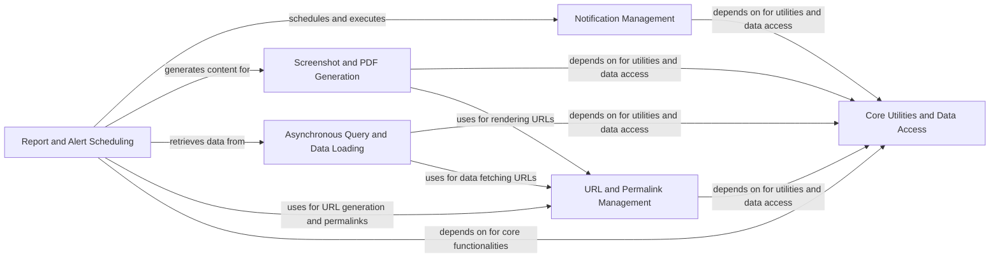

## Component Details

The Asynchronous Tasks & Reporting subsystem in Superset is designed to handle background processes, scheduled reports, and alerts efficiently. Its primary purpose is to offload long-running operations, such as report generation, data caching, and screenshot capture, from the main application thread. This subsystem ensures timely delivery of notifications via various channels like email and Slack, and manages the lifecycle of scheduled jobs, including their execution, state tracking, and error handling. It leverages a task queue for asynchronous processing and relies on a set of core utilities for data access, logging, and exception management.

### Report and Alert Scheduling
This component is responsible for the periodic scheduling and execution of reports and alerts within Superset. It manages the lifecycle of report schedules, including finding active schedules, executing them, and handling their state transitions and logging. It also includes functionality for pruning old report and query logs.

**Related Classes/Methods**:

- <a href="https://github.com/apache/superset/blob/master/superset/tasks/scheduler.py#L44-L78" target="_blank" rel="noopener noreferrer">`superset.tasks.scheduler` (44:78)</a>
- <a href="https://github.com/apache/superset/blob/master/superset/tasks/scheduler.py#L44-L78" target="_blank" rel="noopener noreferrer">`superset.tasks.scheduler:scheduler` (44:78)</a>
- <a href="https://github.com/apache/superset/blob/master/superset/tasks/scheduler.py#L82-L113" target="_blank" rel="noopener noreferrer">`superset.tasks.scheduler:execute` (82:113)</a>
- <a href="https://github.com/apache/superset/blob/master/superset/tasks/scheduler.py#L117-L126" target="_blank" rel="noopener noreferrer">`superset.tasks.scheduler:prune_log` (117:126)</a>
- <a href="https://github.com/apache/superset/blob/master/superset/tasks/scheduler.py#L130-L149" target="_blank" rel="noopener noreferrer">`superset.tasks.scheduler:prune_query` (130:149)</a>
- <a href="https://github.com/apache/superset/blob/master/superset/tasks/scheduler.py#L153-L172" target="_blank" rel="noopener noreferrer">`superset.tasks.scheduler:prune_logs` (153:172)</a>
- <a href="https://github.com/apache/superset/blob/master/superset/tasks/cron_util.py#L30-L50" target="_blank" rel="noopener noreferrer">`superset.tasks.cron_util:cron_schedule_window` (30:50)</a>
- <a href="https://github.com/apache/superset/blob/master/superset/daos/report.py#L205-L213" target="_blank" rel="noopener noreferrer">`superset.daos.report.ReportScheduleDAO:find_active` (205:213)</a>
- <a href="https://github.com/apache/superset/blob/master/superset/daos/report.py#L233-L248" target="_blank" rel="noopener noreferrer">`superset.daos.report.ReportScheduleDAO:find_last_entered_working_log` (233:248)</a>
- <a href="https://github.com/apache/superset/blob/master/superset/commands/report/execute.py#L864-L913" target="_blank" rel="noopener noreferrer">`superset.commands.report.execute.AsyncExecuteReportScheduleCommand` (864:913)</a>
- <a href="https://github.com/apache/superset/blob/master/superset/commands/report/execute.py#L878-L900" target="_blank" rel="noopener noreferrer">`superset.commands.report.execute.AsyncExecuteReportScheduleCommand.run` (878:900)</a>
- <a href="https://github.com/apache/superset/blob/master/superset/commands/report/execute.py#L902-L913" target="_blank" rel="noopener noreferrer">`superset.commands.report.execute.AsyncExecuteReportScheduleCommand.validate` (902:913)</a>
- <a href="https://github.com/apache/superset/blob/master/superset/commands/report/execute.py#L831-L861" target="_blank" rel="noopener noreferrer">`superset.commands.report.execute.ReportScheduleStateMachine` (831:861)</a>
- <a href="https://github.com/apache/superset/blob/master/superset/commands/report/execute.py#L849-L861" target="_blank" rel="noopener noreferrer">`superset.commands.report.execute.ReportScheduleStateMachine.run` (849:861)</a>
- <a href="https://github.com/apache/superset/blob/master/superset/commands/report/execute.py#L760-L783" target="_blank" rel="noopener noreferrer">`superset.commands.report.execute.ReportWorkingState` (760:783)</a>
- <a href="https://github.com/apache/superset/blob/master/superset/commands/report/execute.py#L770-L783" target="_blank" rel="noopener noreferrer">`superset.commands.report.execute.ReportWorkingState.next` (770:783)</a>
- <a href="https://github.com/apache/superset/blob/master/superset/commands/report/alert.py#L56-L220" target="_blank" rel="noopener noreferrer">`superset.commands.report.alert.AlertCommand` (56:220)</a>
- <a href="https://github.com/apache/superset/blob/master/superset/commands/report/alert.py#L62-L90" target="_blank" rel="noopener noreferrer">`superset.commands.report.alert.AlertCommand.run` (62:90)</a>
- <a href="https://github.com/apache/superset/blob/master/superset/commands/report/alert.py#L198-L220" target="_blank" rel="noopener noreferrer">`superset.commands.report.alert.AlertCommand.validate` (198:220)</a>
- <a href="https://github.com/apache/superset/blob/master/superset/commands/report/alert.py#L92-L94" target="_blank" rel="noopener noreferrer">`superset.commands.report.alert.AlertCommand._validate_not_null` (92:94)</a>
- <a href="https://github.com/apache/superset/blob/master/superset/commands/report/alert.py#L117-L127" target="_blank" rel="noopener noreferrer">`superset.commands.report.alert.AlertCommand._validate_operator` (117:127)</a>
- <a href="https://github.com/apache/superset/blob/master/superset/commands/report/alert.py#L97-L115" target="_blank" rel="noopener noreferrer">`superset.commands.report.alert.AlertCommand._validate_result` (97:115)</a>

### Notification Management
This component handles the generation and dispatch of various notifications, primarily for reports and alerts, through different channels like email and Slack. It encapsulates the logic for formatting notification content, managing recipients, and interacting with external notification services.

**Related Classes/Methods**:

- <a href="https://github.com/apache/superset/blob/master/superset/reports/notifications/email.py#L78-L262" target="_blank" rel="noopener noreferrer">`superset.reports.notifications.email.EmailNotification` (78:262)</a>
- <a href="https://github.com/apache/superset/blob/master/superset/reports/notifications/email.py#L231-L262" target="_blank" rel="noopener noreferrer">`superset.reports.notifications.email.EmailNotification:send` (231:262)</a>
- <a href="https://github.com/apache/superset/blob/master/superset/reports/notifications/email.py#L202-L207" target="_blank" rel="noopener noreferrer">`superset.reports.notifications.email.EmailNotification._get_subject` (202:207)</a>
- <a href="https://github.com/apache/superset/blob/master/superset/reports/notifications/email.py#L112-L200" target="_blank" rel="noopener noreferrer">`superset.reports.notifications.email.EmailNotification._get_content` (112:200)</a>
- <a href="https://github.com/apache/superset/blob/master/superset/reports/notifications/email.py#L219-L220" target="_blank" rel="noopener noreferrer">`superset.reports.notifications.email.EmailNotification._get_to` (219:220)</a>
- <a href="https://github.com/apache/superset/blob/master/superset/reports/notifications/email.py#L222-L224" target="_blank" rel="noopener noreferrer">`superset.reports.notifications.email.EmailNotification._get_cc` (222:224)</a>
- <a href="https://github.com/apache/superset/blob/master/superset/reports/notifications/email.py#L226-L228" target="_blank" rel="noopener noreferrer">`superset.reports.notifications.email.EmailNotification._get_bcc` (226:228)</a>
- <a href="https://github.com/apache/superset/blob/master/superset/reports/notifications/email.py#L70-L75" target="_blank" rel="noopener noreferrer">`superset.reports.notifications.email.EmailContent` (70:75)</a>
- <a href="https://github.com/apache/superset/blob/master/superset/reports/notifications/email.py#L99-L110" target="_blank" rel="noopener noreferrer">`superset.reports.notifications.email.EmailNotification._error_template` (99:110)</a>
- <a href="https://github.com/apache/superset/blob/master/superset/reports/notifications/email.py#L96-L97" target="_blank" rel="noopener noreferrer">`superset.reports.notifications.email.EmailNotification._get_smtp_domain` (96:97)</a>
- <a href="https://github.com/apache/superset/blob/master/superset/reports/notifications/email.py#L216-L217" target="_blank" rel="noopener noreferrer">`superset.reports.notifications.email.EmailNotification._get_call_to_action` (216:217)</a>
- <a href="https://github.com/apache/superset/blob/master/superset/reports/notifications/slack.py#L57-L135" target="_blank" rel="noopener noreferrer">`superset.reports.notifications.slack.SlackNotification` (57:135)</a>
- <a href="https://github.com/apache/superset/blob/master/superset/reports/notifications/slack.py#L88-L135" target="_blank" rel="noopener noreferrer">`superset.reports.notifications.slack.SlackNotification:send` (88:135)</a>
- <a href="https://github.com/apache/superset/blob/master/superset/reports/notifications/slack.py#L75-L84" target="_blank" rel="noopener noreferrer">`superset.reports.notifications.slack.SlackNotification._get_inline_files` (75:84)</a>
- <a href="https://github.com/apache/superset/blob/master/superset/reports/notifications/slack.py#L64-L73" target="_blank" rel="noopener noreferrer">`superset.reports.notifications.slack.SlackNotification._get_channel` (64:73)</a>
- <a href="https://github.com/apache/superset/blob/master/superset/reports/notifications/slackv2.py#L52-L132" target="_blank" rel="noopener noreferrer">`superset.reports.notifications.slackv2.SlackV2Notification` (52:132)</a>
- <a href="https://github.com/apache/superset/blob/master/superset/reports/notifications/slackv2.py#L82-L132" target="_blank" rel="noopener noreferrer">`superset.reports.notifications.slackv2.SlackV2Notification:send` (82:132)</a>
- <a href="https://github.com/apache/superset/blob/master/superset/reports/notifications/slackv2.py#L59-L67" target="_blank" rel="noopener noreferrer">`superset.reports.notifications.slackv2.SlackV2Notification._get_channels` (59:67)</a>
- <a href="https://github.com/apache/superset/blob/master/superset/reports/notifications/slackv2.py#L69-L78" target="_blank" rel="noopener noreferrer">`superset.reports.notifications.slackv2.SlackV2Notification._get_inline_files` (69:78)</a>
- <a href="https://github.com/apache/superset/blob/master/superset/reports/notifications/slack_mixin.py#L28-L124" target="_blank" rel="noopener noreferrer">`superset.reports.notifications.slack_mixin.SlackMixin` (28:124)</a>
- <a href="https://github.com/apache/superset/blob/master/superset/reports/notifications/slack_mixin.py#L63-L124" target="_blank" rel="noopener noreferrer">`superset.reports.notifications.slack_mixin.SlackMixin._get_body` (63:124)</a>
- <a href="https://github.com/apache/superset/blob/master/superset/reports/notifications/slack_mixin.py#L50-L61" target="_blank" rel="noopener noreferrer">`superset.reports.notifications.slack_mixin.SlackMixin._error_template` (50:61)</a>
- <a href="https://github.com/apache/superset/blob/master/superset/reports/notifications/slack_mixin.py#L29-L47" target="_blank" rel="noopener noreferrer">`superset.reports.notifications.slack_mixin.SlackMixin._message_template` (29:47)</a>
- <a href="https://github.com/apache/superset/blob/master/superset/reports/notifications/base.py#L27-L36" target="_blank" rel="noopener noreferrer">`superset.reports.notifications.base.NotificationContent` (27:36)</a>
- `superset.reports.notifications.create_notification` (full file reference)
- <a href="https://github.com/apache/superset/blob/master/superset/utils/core.py#L684-L776" target="_blank" rel="noopener noreferrer">`superset.utils.core.send_email_smtp` (684:776)</a>
- <a href="https://github.com/apache/superset/blob/master/superset/utils/core.py#L816-L826" target="_blank" rel="noopener noreferrer">`superset.utils.core.recipients_string_to_list` (816:826)</a>
- <a href="https://github.com/apache/superset/blob/master/superset/utils/core.py#L779-L813" target="_blank" rel="noopener noreferrer">`superset.utils.core.send_mime_email` (779:813)</a>
- <a href="https://github.com/apache/superset/blob/master/superset/utils/slack.py#L143-L158" target="_blank" rel="noopener noreferrer">`superset.utils.slack.should_use_v2_api` (143:158)</a>
- <a href="https://github.com/apache/superset/blob/master/superset/utils/slack.py#L47-L56" target="_blank" rel="noopener noreferrer">`superset.utils.slack.get_slack_client` (47:56)</a>
- <a href="https://github.com/apache/superset/blob/master/superset/utils/slack.py#L91-L140" target="_blank" rel="noopener noreferrer">`superset.utils.slack.get_channels_with_search` (91:140)</a>
- <a href="https://github.com/apache/superset/blob/master/superset/utils/slack.py#L63-L88" target="_blank" rel="noopener noreferrer">`superset.utils.slack.get_channels` (63:88)</a>
- <a href="https://github.com/apache/superset/blob/master/superset/reports/schemas.py#L404-L415" target="_blank" rel="noopener noreferrer">`superset.reports.schemas.SlackChannelSchema` (404:415)</a>
- <a href="https://github.com/apache/superset/blob/master/superset/commands/report/execute.py#L618-L625" target="_blank" rel="noopener noreferrer">`superset.commands.report.execute.BaseReportState:send` (618:625)</a>

### Screenshot and PDF Generation
This component is responsible for capturing screenshots of charts and dashboards, caching them, and generating PDF documents from these screenshots. It interacts with web drivers to render content and handles image manipulation.

**Related Classes/Methods**:

- <a href="https://github.com/apache/superset/blob/master/superset/tasks/thumbnails.py#L38-L71" target="_blank" rel="noopener noreferrer">`superset.tasks.thumbnails:cache_chart_thumbnail` (38:71)</a>
- <a href="https://github.com/apache/superset/blob/master/superset/utils/screenshots.py#L305-L323" target="_blank" rel="noopener noreferrer">`superset.utils.screenshots.ChartScreenshot` (305:323)</a>
- <a href="https://github.com/apache/superset/blob/master/superset/utils/screenshots.py#L149-L302" target="_blank" rel="noopener noreferrer">`superset.utils.screenshots.BaseScreenshot` (149:302)</a>
- <a href="https://github.com/apache/superset/blob/master/superset/utils/screenshots.py#L220-L277" target="_blank" rel="noopener noreferrer">`superset.utils.screenshots.BaseScreenshot.compute_and_cache` (220:277)</a>
- <a href="https://github.com/apache/superset/blob/master/superset/utils/screenshots.py#L160-L163" target="_blank" rel="noopener noreferrer">`superset.utils.screenshots.BaseScreenshot.__init__` (160:163)</a>
- <a href="https://github.com/apache/superset/blob/master/superset/utils/screenshots.py#L178-L192" target="_blank" rel="noopener noreferrer">`superset.utils.screenshots.BaseScreenshot.get_cache_key` (178:192)</a>
- <a href="https://github.com/apache/superset/blob/master/superset/utils/screenshots.py#L203-L218" target="_blank" rel="noopener noreferrer">`superset.utils.screenshots.BaseScreenshot.get_from_cache_key` (203:218)</a>
- <a href="https://github.com/apache/superset/blob/master/superset/utils/screenshots.py#L171-L176" target="_blank" rel="noopener noreferrer">`superset.utils.screenshots.BaseScreenshot.get_screenshot` (171:176)</a>
- <a href="https://github.com/apache/superset/blob/master/superset/utils/screenshots.py#L280-L302" target="_blank" rel="noopener noreferrer">`superset.utils.screenshots.BaseScreenshot.resize_image` (280:302)</a>
- <a href="https://github.com/apache/superset/blob/master/superset/utils/screenshots.py#L72-L146" target="_blank" rel="noopener noreferrer">`superset.utils.screenshots.ScreenshotCachePayload` (72:146)</a>
- <a href="https://github.com/apache/superset/blob/master/superset/utils/screenshots.py#L84-L89" target="_blank" rel="noopener noreferrer">`superset.utils.screenshots.ScreenshotCachePayload.from_dict` (84:89)</a>
- <a href="https://github.com/apache/superset/blob/master/superset/utils/screenshots.py#L59-L63" target="_blank" rel="noopener noreferrer">`superset.utils.screenshots.StatusValues` (59:63)</a>
- <a href="https://github.com/apache/superset/blob/master/superset/utils/screenshots.py#L165-L169" target="_blank" rel="noopener noreferrer">`superset.utils.screenshots.BaseScreenshot.driver` (165:169)</a>
- <a href="https://github.com/apache/superset/blob/master/superset/utils/screenshots.py#L326-L363" target="_blank" rel="noopener noreferrer">`superset.utils.screenshots.DashboardScreenshot` (326:363)</a>
- <a href="https://github.com/apache/superset/blob/master/superset/utils/screenshots.py#L347-L363" target="_blank" rel="noopener noreferrer">`superset.utils.screenshots.DashboardScreenshot.get_cache_key` (347:363)</a>
- <a href="https://github.com/apache/superset/blob/master/superset/utils/webdriver.py#L88-L244" target="_blank" rel="noopener noreferrer">`superset.utils.webdriver.WebDriverPlaywright` (88:244)</a>
- <a href="https://github.com/apache/superset/blob/master/superset/utils/webdriver.py#L139-L244" target="_blank" rel="noopener noreferrer">`superset.utils.webdriver.WebDriverPlaywright.get_screenshot` (139:244)</a>
- <a href="https://github.com/apache/superset/blob/master/superset/utils/webdriver.py#L90-L93" target="_blank" rel="noopener noreferrer">`superset.utils.webdriver.WebDriverPlaywright.auth` (90:93)</a>
- <a href="https://github.com/apache/superset/blob/master/superset/utils/webdriver.py#L96-L137" target="_blank" rel="noopener noreferrer">`superset.utils.webdriver.WebDriverPlaywright.find_unexpected_errors` (96:137)</a>
- <a href="https://github.com/apache/superset/blob/master/superset/utils/webdriver.py#L247-L487" target="_blank" rel="noopener noreferrer">`superset.utils.webdriver.WebDriverSelenium` (247:487)</a>
- <a href="https://github.com/apache/superset/blob/master/superset/utils/pdf.py#L30-L48" target="_blank" rel="noopener noreferrer">`superset.utils.pdf.build_pdf_from_screenshots` (30:48)</a>

### Asynchronous Query and Data Loading
This component manages the asynchronous execution of chart data queries and the loading of results into a cache. It also provides functionality to retrieve chart data in CSV or DataFrame formats.

**Related Classes/Methods**:

- <a href="https://github.com/apache/superset/blob/master/superset/tasks/async_queries.py#L83-L113" target="_blank" rel="noopener noreferrer">`superset.tasks.async_queries:load_chart_data_into_cache` (83:113)</a>
- <a href="https://github.com/apache/superset/blob/master/superset/tasks/async_queries.py#L68-L79" target="_blank" rel="noopener noreferrer">`superset.tasks.async_queries._load_user_from_job_metadata` (68:79)</a>
- <a href="https://github.com/apache/superset/blob/master/superset/tasks/async_queries.py#L49-L50" target="_blank" rel="noopener noreferrer">`superset.tasks.async_queries.set_form_data` (49:50)</a>
- <a href="https://github.com/apache/superset/blob/master/superset/tasks/async_queries.py#L53-L65" target="_blank" rel="noopener noreferrer">`superset.tasks.async_queries._create_query_context_from_form` (53:65)</a>
- <a href="https://github.com/apache/superset/blob/master/superset/async_events/async_query_manager.py#L237-L257" target="_blank" rel="noopener noreferrer">`superset.async_events.async_query_manager.AsyncQueryManager:submit_chart_data_job` (237:257)</a>
- <a href="https://github.com/apache/superset/blob/master/superset/async_events/async_query_manager.py#L208-L212" target="_blank" rel="noopener noreferrer">`superset.async_events.async_query_manager.AsyncQueryManager.init_job` (208:212)</a>
- <a href="https://github.com/apache/superset/blob/master/superset/async_events/async_query_manager.py#L53-L63" target="_blank" rel="noopener noreferrer">`superset.async_events.async_query_manager.build_job_metadata` (53:63)</a>
- <a href="https://github.com/apache/superset/blob/master/superset/commands/chart/data/get_data_command.py#L33-L67" target="_blank" rel="noopener noreferrer">`superset.commands.chart.data.get_data_command.ChartDataCommand` (33:67)</a>
- <a href="https://github.com/apache/superset/blob/master/superset/commands/chart/data/get_data_command.py#L39-L64" target="_blank" rel="noopener noreferrer">`superset.commands.chart.data.get_data_command.ChartDataCommand.run` (39:64)</a>
- <a href="https://github.com/apache/superset/blob/master/superset/charts/schemas.py#L1363-L1398" target="_blank" rel="noopener noreferrer">`superset.charts.schemas.ChartDataQueryContextSchema` (1363:1398)</a>
- <a href="https://github.com/apache/superset/blob/master/superset/utils/csv.py#L84-L98" target="_blank" rel="noopener noreferrer">`superset.utils.csv.get_chart_csv_data` (84:98)</a>
- <a href="https://github.com/apache/superset/blob/master/superset/utils/csv.py#L101-L139" target="_blank" rel="noopener noreferrer">`superset.utils.csv.get_chart_dataframe` (101:139)</a>

### URL and Permalink Management
This component is responsible for generating various URLs within Superset, including those for charts and dashboards, and for creating and managing permalinks to dashboards. It uses a key-value store for persistent permalink storage.

**Related Classes/Methods**:

- <a href="https://github.com/apache/superset/blob/master/superset/utils/urls.py#L35-L42" target="_blank" rel="noopener noreferrer">`superset.utils.urls.get_url_path` (35:42)</a>
- <a href="https://github.com/apache/superset/blob/master/superset/utils/urls.py#L31-L32" target="_blank" rel="noopener noreferrer">`superset.utils.urls.headless_url` (31:32)</a>
- <a href="https://github.com/apache/superset/blob/master/superset/utils/urls.py#L45-L59" target="_blank" rel="noopener noreferrer">`superset.utils.urls.modify_url_query` (45:59)</a>
- <a href="https://github.com/apache/superset/blob/master/superset/utils/urls.py#L25-L28" target="_blank" rel="noopener noreferrer">`superset.utils.urls.get_url_host` (25:28)</a>
- <a href="https://github.com/apache/superset/blob/master/superset/commands/dashboard/permalink/create.py#L39-L85" target="_blank" rel="noopener noreferrer">`superset.commands.dashboard.permalink.create.CreateDashboardPermalinkCommand` (39:85)</a>
- <a href="https://github.com/apache/superset/blob/master/superset/commands/dashboard/permalink/create.py#L66-L82" target="_blank" rel="noopener noreferrer">`superset.commands.dashboard.permalink.create.CreateDashboardPermalinkCommand.run` (66:82)</a>
- <a href="https://github.com/apache/superset/blob/master/superset/commands/dashboard/permalink/create.py#L84-L85" target="_blank" rel="noopener noreferrer">`superset.commands.dashboard.permalink.create.CreateDashboardPermalinkCommand.validate` (84:85)</a>
- <a href="https://github.com/apache/superset/blob/master/superset/daos/key_value.py#L40-L145" target="_blank" rel="noopener noreferrer">`superset.daos.key_value.KeyValueDAO` (40:145)</a>
- <a href="https://github.com/apache/superset/blob/master/superset/daos/key_value.py#L114-L128" target="_blank" rel="noopener noreferrer">`superset.daos.key_value.KeyValueDAO.upsert_entry` (114:128)</a>
- <a href="https://github.com/apache/superset/blob/master/superset/daos/key_value.py#L42-L47" target="_blank" rel="noopener noreferrer">`superset.daos.key_value.KeyValueDAO.get_entry` (42:47)</a>
- <a href="https://github.com/apache/superset/blob/master/superset/daos/key_value.py#L84-L111" target="_blank" rel="noopener noreferrer">`superset.daos.key_value.KeyValueDAO.create_entry` (84:111)</a>
- <a href="https://github.com/apache/superset/blob/master/superset/key_value/utils.py#L75-L78" target="_blank" rel="noopener noreferrer">`superset.key_value.utils.get_deterministic_uuid` (75:78)</a>
- <a href="https://github.com/apache/superset/blob/master/superset/key_value/utils.py#L56-L58" target="_blank" rel="noopener noreferrer">`superset.key_value.utils.encode_permalink_key` (56:58)</a>
- <a href="https://github.com/apache/superset/blob/master/superset/key_value/utils.py#L44-L53" target="_blank" rel="noopener noreferrer">`superset.key_value.utils.get_filter` (44:53)</a>
- <a href="https://github.com/apache/superset/blob/master/superset/key_value/utils.py#L69-L72" target="_blank" rel="noopener noreferrer">`superset.key_value.utils.get_uuid_namespace` (69:72)</a>
- <a href="https://github.com/apache/superset/blob/master/superset/key_value/models.py#L29-L45" target="_blank" rel="noopener noreferrer">`superset.key_value.models.KeyValueEntry` (29:45)</a>

### Core Utilities and Data Access
This foundational component provides a collection of general utility functions, common data access objects (DAOs) for interacting with various Superset models, and a centralized mechanism for handling exceptions across the subsystem. It includes features like feature flag management, user context overriding, logging, decorators for transactions and statistics, JSON serialization/deserialization, hashing, and retry mechanisms.

**Related Classes/Methods**:

- <a href="https://github.com/apache/superset/blob/master/superset/utils/feature_flag_manager.py#L22-L58" target="_blank" rel="noopener noreferrer">`superset.utils.feature_flag_manager.FeatureFlagManager` (22:58)</a>
- <a href="https://github.com/apache/superset/blob/master/superset/utils/feature_flag_manager.py#L47-L58" target="_blank" rel="noopener noreferrer">`superset.utils.feature_flag_manager.FeatureFlagManager.is_feature_enabled` (47:58)</a>
- <a href="https://github.com/apache/superset/blob/master/superset/utils/feature_flag_manager.py#L35-L45" target="_blank" rel="noopener noreferrer">`superset.utils.feature_flag_manager.FeatureFlagManager.get_feature_flags` (35:45)</a>
- <a href="https://github.com/apache/superset/blob/master/superset/utils/core.py#L1297-L1320" target="_blank" rel="noopener noreferrer">`superset.utils.core.override_user` (1297:1320)</a>
- <a href="https://github.com/apache/superset/blob/master/superset/utils/core.py#L1265-L1280" target="_blank" rel="noopener noreferrer">`superset.utils.core.get_user_id` (1265:1280)</a>
- <a href="https://github.com/apache/superset/blob/master/superset/utils/log.py#L75-L90" target="_blank" rel="noopener noreferrer">`superset.utils.log.get_logger_from_status` (75:90)</a>
- <a href="https://github.com/apache/superset/blob/master/superset/utils/decorators.py#L39-L66" target="_blank" rel="noopener noreferrer">`superset.utils.decorators.statsd_gauge` (39:66)</a>
- <a href="https://github.com/apache/superset/blob/master/superset/utils/decorators.py#L239-L279" target="_blank" rel="noopener noreferrer">`superset.utils.decorators.transaction` (239:279)</a>
- <a href="https://github.com/apache/superset/blob/master/superset/utils/decorators.py#L214-L236" target="_blank" rel="noopener noreferrer">`superset.utils.decorators.on_error` (214:236)</a>
- <a href="https://github.com/apache/superset/blob/master/superset/utils/json.py#L231-L251" target="_blank" rel="noopener noreferrer">`superset.utils.json.loads` (231:251)</a>
- <a href="https://github.com/apache/superset/blob/master/superset/utils/json.py#L187-L228" target="_blank" rel="noopener noreferrer">`superset.utils.json.dumps` (187:228)</a>
- <a href="https://github.com/apache/superset/blob/master/superset/utils/json.py#L166-L168" target="_blank" rel="noopener noreferrer">`superset.utils.json.json_dumps_w_dates` (166:168)</a>
- <a href="https://github.com/apache/superset/blob/master/superset/utils/hashing.py#L27-L36" target="_blank" rel="noopener noreferrer">`superset.utils.hashing.md5_sha_from_dict` (27:36)</a>
- <a href="https://github.com/apache/superset/blob/master/superset/utils/hashing.py#L23-L24" target="_blank" rel="noopener noreferrer">`superset.utils.hashing.md5_sha_from_str` (23:24)</a>
- <a href="https://github.com/apache/superset/blob/master/superset/utils/retries.py#L25-L42" target="_blank" rel="noopener noreferrer">`superset.utils.retries.retry_call` (25:42)</a>
- <a href="https://github.com/apache/superset/blob/master/superset/utils/filters.py#L24-L43" target="_blank" rel="noopener noreferrer">`superset.utils.filters.get_dataset_access_filters` (24:43)</a>
- <a href="https://github.com/apache/superset/blob/master/superset/tasks/utils.py#L44-L100" target="_blank" rel="noopener noreferrer">`superset.tasks.utils.get_executor` (44:100)</a>
- <a href="https://github.com/apache/superset/blob/master/superset/tasks/exceptions.py#L27-L28" target="_blank" rel="noopener noreferrer">`superset.tasks.exceptions.InvalidExecutorError` (27:28)</a>
- <a href="https://github.com/apache/superset/blob/master/superset/tasks/exceptions.py#L23-L24" target="_blank" rel="noopener noreferrer">`superset.tasks.exceptions.ExecutorNotFoundError` (23:24)</a>
- <a href="https://github.com/apache/superset/blob/master/superset/models/slice.py#L364-L366" target="_blank" rel="noopener noreferrer">`superset.models.slice.Slice.get` (364:366)</a>
- <a href="https://github.com/apache/superset/blob/master/superset/models/dashboard.py#L431-L433" target="_blank" rel="noopener noreferrer">`superset.models.dashboard.Dashboard.get` (431:433)</a>
- <a href="https://github.com/apache/superset/blob/master/superset/models/dashboard.py#L445-L450" target="_blank" rel="noopener noreferrer">`superset.models.dashboard.is_uuid` (445:450)</a>
- <a href="https://github.com/apache/superset/blob/master/superset/models/dashboard.py#L461-L466" target="_blank" rel="noopener noreferrer">`superset.models.dashboard.id_or_slug_filter` (461:466)</a>
- <a href="https://github.com/apache/superset/blob/master/superset/models/dashboard.py#L453-L458" target="_blank" rel="noopener noreferrer">`superset.models.dashboard.is_int` (453:458)</a>
- <a href="https://github.com/apache/superset/blob/master/superset/daos/dashboard.py#L48-L437" target="_blank" rel="noopener noreferrer">`superset.daos.dashboard.DashboardDAO` (48:437)</a>
- <a href="https://github.com/apache/superset/blob/master/superset/daos/dashboard.py#L52-L77" target="_blank" rel="noopener noreferrer">`superset.daos.dashboard.DashboardDAO.get_by_id_or_slug` (52:77)</a>
- <a href="https://github.com/apache/superset/blob/master/superset/dashboards/filters.py#L104-L193" target="_blank" rel="noopener noreferrer">`superset.dashboards.filters.DashboardAccessFilter` (104:193)</a>
- <a href="https://github.com/apache/superset/blob/master/superset/dashboards/filters.py#L116-L193" target="_blank" rel="noopener noreferrer">`superset.dashboards.filters.DashboardAccessFilter.apply` (116:193)</a>
- <a href="https://github.com/apache/superset/blob/master/superset/commands/report/exceptions.py#L227-L229" target="_blank" rel="noopener noreferrer">`superset.commands.report.exceptions.AlertValidatorConfigError` (227:229)</a>
- <a href="https://github.com/apache/superset/blob/master/superset/commands/report/exceptions.py#L191-L192" target="_blank" rel="noopener noreferrer">`superset.commands.report.exceptions.ReportScheduleExecuteUnexpectedError` (191:192)</a>
- <a href="https://github.com/apache/superset/blob/master/superset/commands/report/exceptions.py#L162-L164" target="_blank" rel="noopener noreferrer">`superset.commands.report.exceptions.ReportScheduleNotFoundError` (162:164)</a>
- <a href="https://github.com/apache/superset/blob/master/superset/commands/report/exceptions.py#L286-L287" target="_blank" rel="noopener noreferrer">`superset.commands.report.exceptions.ReportScheduleStateNotFoundError` (286:287)</a>
- <a href="https://github.com/apache/superset/blob/master/superset/commands/report/exceptions.py#L256-L258" target="_blank" rel="noopener noreferrer">`superset.commands.report.exceptions.ReportScheduleScreenshotTimeout` (256:258)</a>
- <a href="https://github.com/apache/superset/blob/master/superset/commands/report/exceptions.py#L175-L176" target="_blank" rel="noopener noreferrer">`superset.commands.report.exceptions.ReportScheduleScreenshotFailedError` (175:176)</a>
- <a href="https://github.com/apache/superset/blob/master/superset/commands/report/exceptions.py#L261-L263" target="_blank" rel="noopener noreferrer">`superset.commands.report.exceptions.ReportScheduleCsvTimeout` (261:263)</a>
- <a href="https://github.com/apache/superset/blob/master/superset/commands/report/exceptions.py#L183-L184" target="_blank" rel="noopener noreferrer">`superset.commands.report.exceptions.ReportScheduleCsvFailedError` (183:184)</a>
- <a href="https://github.com/apache/superset/blob/master/superset/commands/report/exceptions.py#L266-L268" target="_blank" rel="noopener noreferrer">`superset.commands.report.exceptions.ReportScheduleDataFrameTimeout` (266:268)</a>
- <a href="https://github.com/apache/superset/blob/master/superset/commands/report/exceptions.py#L187-L188" target="_blank" rel="noopener noreferrer">`superset.commands.report.exceptions.ReportScheduleDataFrameFailedError` (187:188)</a>
- <a href="https://github.com/apache/superset/blob/master/superset/commands/report/exceptions.py#L237-L239" target="_blank" rel="noopener noreferrer">`superset.commands.report.exceptions.AlertQueryInvalidTypeError` (237:239)</a>
- <a href="https://github.com/apache/superset/blob/master/superset/commands/report/exceptions.py#L179-L180" target="_blank" rel="noopener noreferrer">`superset.commands.report.exceptions.ReportSchedulePdfFailedError` (179:180)</a>
- <a href="https://github.com/apache/superset/blob/master/superset/commands/report/exceptions.py#L290-L292" target="_blank" rel="noopener noreferrer">`superset.commands.report.exceptions.ReportScheduleSystemErrorsException` (290:292)</a>
- <a href="https://github.com/apache/superset/blob/master/superset/commands/report/exceptions.py#L295-L298" target="_blank" rel="noopener noreferrer">`superset.commands.report.exceptions.ReportScheduleClientErrorsException` (295:298)</a>
- <a href="https://github.com/apache/superset/blob/master/superset/commands/report/exceptions.py#L222-L224" target="_blank" rel="noopener noreferrer">`superset.commands.report.exceptions.AlertQueryMultipleRowsError` (222:224)</a>
- <a href="https://github.com/apache/superset/blob/master/superset/commands/report/exceptions.py#L232-L234" target="_blank" rel="noopener noreferrer">`superset.commands.report.exceptions.AlertQueryMultipleColumnsError` (232:234)</a>
- <a href="https://github.com/apache/superset/blob/master/superset/commands/report/exceptions.py#L200-L202" target="_blank" rel="noopener noreferrer">`superset.commands.report.exceptions.ReportScheduleWorkingTimeoutError` (200:202)</a>
- <a href="https://github.com/apache/superset/blob/master/superset/commands/report/exceptions.py#L195-L197" target="_blank" rel="noopener noreferrer">`superset.commands.report.exceptions.ReportSchedulePreviousWorkingError` (195:197)</a>
- <a href="https://github.com/apache/superset/blob/master/superset/commands/chart/exceptions.py#L142-L143" target="_blank" rel="noopener noreferrer">`superset.commands.chart.exceptions.ChartDataCacheLoadError` (142:143)</a>
- <a href="https://github.com/apache/superset/blob/master/superset/commands/chart/exceptions.py#L138-L139" target="_blank" rel="noopener noreferrer">`superset.commands.chart.exceptions.ChartDataQueryFailedError` (138:139)</a>
- <a href="https://github.com/apache/superset/blob/master/superset/commands/dashboard/exceptions.py#L46-L50" target="_blank" rel="noopener noreferrer">`superset.commands.dashboard.exceptions.DashboardNotFoundError` (46:50)</a>
- <a href="https://github.com/apache/superset/blob/master/superset/commands/dashboard/exceptions.py#L89-L90" target="_blank" rel="noopener noreferrer">`superset.commands.dashboard.exceptions.DashboardAccessDeniedError` (89:90)</a>
- <a href="https://github.com/apache/superset/blob/master/superset/commands/exceptions.py#L83-L85" target="_blank" rel="noopener noreferrer">`superset.commands.exceptions.UpdateFailedError` (83:85)</a>
- <a href="https://github.com/apache/superset/blob/master/superset/reports/notifications/exceptions.py#L20-L24" target="_blank" rel="noopener noreferrer">`superset.reports.notifications.exceptions.NotificationError` (20:24)</a>
- <a href="https://github.com/apache/superset/blob/master/superset/reports/notifications/exceptions.py#L38-L39" target="_blank" rel="noopener noreferrer">`superset.reports.notifications.exceptions.NotificationParamException` (38:39)</a>
- <a href="https://github.com/apache/superset/blob/master/superset/reports/notifications/exceptions.py#L56-L57" target="_blank" rel="noopener noreferrer">`superset.reports.notifications.exceptions.NotificationMalformedException` (56:57)</a>
- <a href="https://github.com/apache/superset/blob/master/superset/reports/notifications/exceptions.py#L42-L43" target="_blank" rel="noopener noreferrer">`superset.reports.notifications.exceptions.NotificationAuthorizationException` (42:43)</a>
- <a href="https://github.com/apache/superset/blob/master/superset/reports/notifications/exceptions.py#L46-L53" target="_blank" rel="noopener noreferrer">`superset.reports.notifications.exceptions.NotificationUnprocessableException` (46:53)</a>
- <a href="https://github.com/apache/superset/blob/master/superset/key_value/exceptions.py#L33-L34" target="_blank" rel="noopener noreferrer">`superset.key_value.exceptions.KeyValueCreateFailedError` (33:34)</a>
- <a href="https://github.com/apache/superset/blob/master/superset/key_value/exceptions.py#L29-L30" target="_blank" rel="noopener noreferrer">`superset.key_value.exceptions.KeyValueParseKeyError` (29:30)</a>
- <a href="https://github.com/apache/superset/blob/master/superset/exceptions.py#L29-L61" target="_blank" rel="noopener noreferrer">`superset.exceptions.SupersetException` (29:61)</a>
- <a href="https://github.com/apache/superset/blob/master/superset/errors.py#L212-L247" target="_blank" rel="noopener noreferrer">`superset.errors.SupersetError` (212:247)</a>
- <a href="https://github.com/apache/superset/blob/master/superset/utils/cache.py#L92-L146" target="_blank" rel="noopener noreferrer">`superset.utils.cache.memoized_func` (92:146)</a>

### [FAQ](https://github.com/CodeBoarding/GeneratedOnBoardings/tree/main?tab=readme-ov-file#faq)