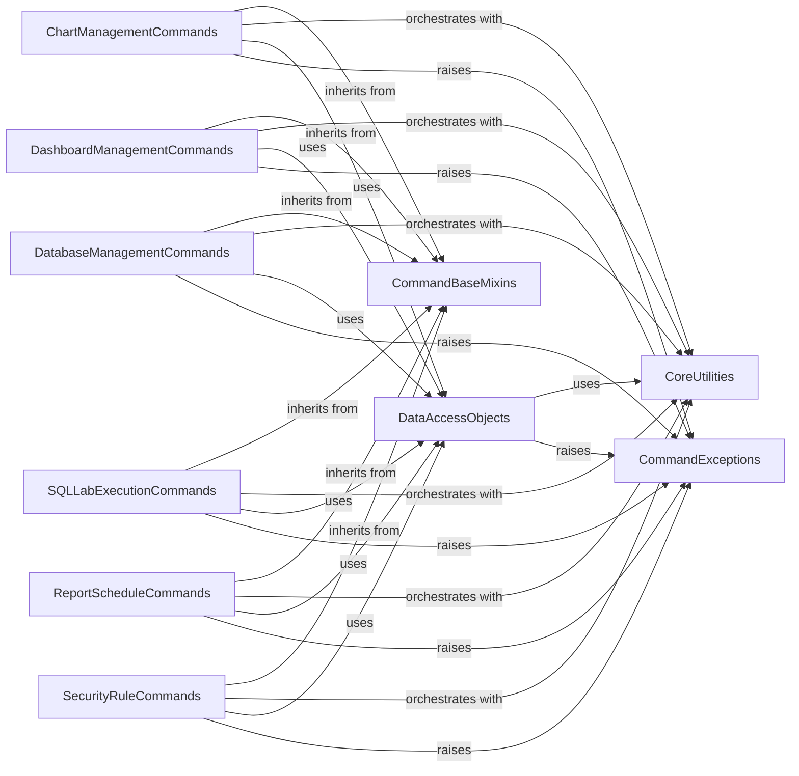

## Component Details

This subsystem implements the core business rules and operations for managing Superset entities like charts, dashboards, and databases. It utilizes a command pattern to encapsulate actions and orchestrate interactions with data access objects and other utility services. The system is structured around various command components, each responsible for specific entity management, inheriting from base command mixins for common functionalities. Data access is abstracted through DAOs, and common utilities provide cross-cutting concerns like transaction management and error handling. Custom exceptions are defined for robust error management within the command execution flow.

### CommandBaseMixins
Provides foundational abstract methods and common functionalities like owner population for various command classes, ensuring a consistent structure and behavior across different command implementations.

**Related Classes/Methods**:

- <a href="https://github.com/apache/superset/blob/master/superset/commands/base.py#L46-L58" target="_blank" rel="noopener noreferrer">`superset.commands.base.CreateMixin` (46:58)</a>
- <a href="https://github.com/apache/superset/blob/master/superset/commands/base.py#L25-L43" target="_blank" rel="noopener noreferrer">`superset.commands.base.BaseCommand` (25:43)</a>
- <a href="https://github.com/apache/superset/blob/master/superset/commands/base.py#L61-L86" target="_blank" rel="noopener noreferrer">`superset.commands.base.UpdateMixin` (61:86)</a>
- <a href="https://github.com/apache/superset/blob/master/superset/commands/base.py#L48-L58" target="_blank" rel="noopener noreferrer">`superset.commands.base.CreateMixin:populate_owners` (48:58)</a>

### ChartManagementCommands
Encapsulates the logic for creating, updating, deleting, and managing charts, including handling associated datasources and dashboards, and managing chart ownership and favorites. It orchestrates interactions with DAOs and utility functions.

**Related Classes/Methods**:

- <a href="https://github.com/apache/superset/blob/master/superset/commands/chart/create.py#L42-L82" target="_blank" rel="noopener noreferrer">`superset.commands.chart.create.CreateChartCommand` (42:82)</a>
- <a href="https://github.com/apache/superset/blob/master/superset/commands/chart/create.py#L47-L51" target="_blank" rel="noopener noreferrer">`superset.commands.chart.create.CreateChartCommand:run` (47:51)</a>
- <a href="https://github.com/apache/superset/blob/master/superset/commands/chart/create.py#L53-L82" target="_blank" rel="noopener noreferrer">`superset.commands.chart.create.CreateChartCommand.validate` (53:82)</a>
- <a href="https://github.com/apache/superset/blob/master/superset/commands/chart/update.py#L53-L132" target="_blank" rel="noopener noreferrer">`superset.commands.chart.update.UpdateChartCommand` (53:132)</a>
- <a href="https://github.com/apache/superset/blob/master/superset/commands/chart/delete.py#L40-L70" target="_blank" rel="noopener noreferrer">`superset.commands.chart.delete.DeleteChartCommand` (40:70)</a>
- <a href="https://github.com/apache/superset/blob/master/superset/commands/chart/fave.py#L37-L57" target="_blank" rel="noopener noreferrer">`superset.commands.chart.fave.AddFavoriteChartCommand` (37:57)</a>
- <a href="https://github.com/apache/superset/blob/master/superset/commands/chart/unfave.py#L37-L57" target="_blank" rel="noopener noreferrer">`superset.commands.chart.unfave.DelFavoriteChartCommand` (37:57)</a>
- <a href="https://github.com/apache/superset/blob/master/superset/commands/chart/export.py#L44-L113" target="_blank" rel="noopener noreferrer">`superset.commands.chart.export.ExportChartsCommand` (44:113)</a>
- <a href="https://github.com/apache/superset/blob/master/superset/commands/chart/importers/dispatcher.py#L35-L70" target="_blank" rel="noopener noreferrer">`superset.commands.chart.importers.dispatcher.ImportChartsCommand` (35:70)</a>
- <a href="https://github.com/apache/superset/blob/master/superset/commands/chart/warm_up_cache.py#L37-L108" target="_blank" rel="noopener noreferrer">`superset.commands.chart.warm_up_cache.ChartWarmUpCacheCommand` (37:108)</a>

### DashboardManagementCommands
Manages the lifecycle of dashboards, including creation, updates, deletion, copying, and handling of filter states and permalinks. It ensures transactional integrity, data validation, and proper metadata processing.

**Related Classes/Methods**:

- <a href="https://github.com/apache/superset/blob/master/superset/commands/dashboard/update.py#L50-L190" target="_blank" rel="noopener noreferrer">`superset.commands.dashboard.update.UpdateDashboardCommand` (50:190)</a>
- <a href="https://github.com/apache/superset/blob/master/superset/commands/dashboard/update.py#L57-L72" target="_blank" rel="noopener noreferrer">`superset.commands.dashboard.update.UpdateDashboardCommand:run` (57:72)</a>
- <a href="https://github.com/apache/superset/blob/master/superset/commands/dashboard/update.py#L74-L120" target="_blank" rel="noopener noreferrer">`superset.commands.dashboard.update.UpdateDashboardCommand.validate` (74:120)</a>
- <a href="https://github.com/apache/superset/blob/master/superset/commands/dashboard/update.py#L122-L190" target="_blank" rel="noopener noreferrer">`superset.commands.dashboard.update.UpdateDashboardCommand.process_tab_diff` (122:190)</a>
- <a href="https://github.com/apache/superset/blob/master/superset/commands/dashboard/create.py#L37-L70" target="_blank" rel="noopener noreferrer">`superset.commands.dashboard.create.CreateDashboardCommand` (37:70)</a>
- <a href="https://github.com/apache/superset/blob/master/superset/commands/dashboard/delete.py#L54-L84" target="_blank" rel="noopener noreferrer">`superset.commands.dashboard.delete.DeleteDashboardCommand` (54:84)</a>
- <a href="https://github.com/apache/superset/blob/master/superset/commands/dashboard/copy.py#L35-L53" target="_blank" rel="noopener noreferrer">`superset.commands.dashboard.copy.CopyDashboardCommand` (35:53)</a>
- <a href="https://github.com/apache/superset/blob/master/superset/commands/dashboard/fave.py#L33-L46" target="_blank" rel="noopener noreferrer">`superset.commands.dashboard.fave.AddFavoriteDashboardCommand` (33:46)</a>
- <a href="https://github.com/apache/superset/blob/master/superset/commands/dashboard/unfave.py#L33-L46" target="_blank" rel="noopener noreferrer">`superset.commands.dashboard.unfave.DelFavoriteDashboardCommand` (33:46)</a>
- <a href="https://github.com/apache/superset/blob/master/superset/commands/dashboard/export.py#L108-L223" target="_blank" rel="noopener noreferrer">`superset.commands.dashboard.export.ExportDashboardsCommand` (108:223)</a>
- <a href="https://github.com/apache/superset/blob/master/superset/commands/dashboard/importers/dispatcher.py#L38-L73" target="_blank" rel="noopener noreferrer">`superset.commands.dashboard.importers.dispatcher.ImportDashboardsCommand` (38:73)</a>
- <a href="https://github.com/apache/superset/blob/master/superset/commands/dashboard/filter_state/create.py#L31-L44" target="_blank" rel="noopener noreferrer">`superset.commands.dashboard.filter_state.create.CreateFilterStateCommand` (31:44)</a>
- <a href="https://github.com/apache/superset/blob/master/superset/commands/dashboard/filter_state/delete.py#L29-L42" target="_blank" rel="noopener noreferrer">`superset.commands.dashboard.filter_state.delete.DeleteFilterStateCommand` (29:42)</a>
- <a href="https://github.com/apache/superset/blob/master/superset/commands/dashboard/filter_state/get.py#L28-L41" target="_blank" rel="noopener noreferrer">`superset.commands.dashboard.filter_state.get.GetFilterStateCommand` (28:41)</a>
- <a href="https://github.com/apache/superset/blob/master/superset/commands/dashboard/filter_state/update.py#L32-L55" target="_blank" rel="noopener noreferrer">`superset.commands.dashboard.filter_state.update.UpdateFilterStateCommand` (32:55)</a>
- <a href="https://github.com/apache/superset/blob/master/superset/commands/dashboard/permalink/create.py#L39-L85" target="_blank" rel="noopener noreferrer">`superset.commands.dashboard.permalink.create.CreateDashboardPermalinkCommand` (39:85)</a>
- <a href="https://github.com/apache/superset/blob/master/superset/commands/dashboard/permalink/get.py#L38-L63" target="_blank" rel="noopener noreferrer">`superset.commands.dashboard.permalink.get.GetDashboardPermalinkCommand` (38:63)</a>

### DatabaseManagementCommands
Provides operations for creating, updating, deleting, testing connections, syncing permissions, and managing SSH tunnels for database entities. It also handles database import/export and data upload functionalities.

**Related Classes/Methods**:

- <a href="https://github.com/apache/superset/blob/master/superset/commands/database/delete.py#L38-L66" target="_blank" rel="noopener noreferrer">`superset.commands.database.delete.DeleteDatabaseCommand` (38:66)</a>
- <a href="https://github.com/apache/superset/blob/master/superset/commands/database/delete.py#L44-L47" target="_blank" rel="noopener noreferrer">`superset.commands.database.delete.DeleteDatabaseCommand:run` (44:47)</a>
- <a href="https://github.com/apache/superset/blob/master/superset/commands/database/delete.py#L49-L66" target="_blank" rel="noopener noreferrer">`superset.commands.database.delete.DeleteDatabaseCommand.validate` (49:66)</a>
- <a href="https://github.com/apache/superset/blob/master/superset/commands/database/create.py#L54-L164" target="_blank" rel="noopener noreferrer">`superset.commands.database.create.CreateDatabaseCommand` (54:164)</a>
- <a href="https://github.com/apache/superset/blob/master/superset/commands/database/update.py#L53-L216" target="_blank" rel="noopener noreferrer">`superset.commands.database.update.UpdateDatabaseCommand` (53:216)</a>
- <a href="https://github.com/apache/superset/blob/master/superset/commands/database/test_connection.py#L63-L232" target="_blank" rel="noopener noreferrer">`superset.commands.database.test_connection.TestConnectionDatabaseCommand` (63:232)</a>
- <a href="https://github.com/apache/superset/blob/master/superset/commands/database/sync_permissions.py#L51-L313" target="_blank" rel="noopener noreferrer">`superset.commands.database.sync_permissions.SyncPermissionsCommand` (51:313)</a>
- <a href="https://github.com/apache/superset/blob/master/superset/commands/database/ssh_tunnel/create.py#L41-L100" target="_blank" rel="noopener noreferrer">`superset.commands.database.ssh_tunnel.create.CreateSSHTunnelCommand` (41:100)</a>
- <a href="https://github.com/apache/superset/blob/master/superset/commands/database/ssh_tunnel/delete.py#L35-L52" target="_blank" rel="noopener noreferrer">`superset.commands.database.ssh_tunnel.delete.DeleteSSHTunnelCommand` (35:52)</a>
- <a href="https://github.com/apache/superset/blob/master/superset/commands/database/ssh_tunnel/update.py#L40-L82" target="_blank" rel="noopener noreferrer">`superset.commands.database.ssh_tunnel.update.UpdateSSHTunnelCommand` (40:82)</a>
- <a href="https://github.com/apache/superset/blob/master/superset/commands/database/export.py#L54-L136" target="_blank" rel="noopener noreferrer">`superset.commands.database.export.ExportDatabasesCommand` (54:136)</a>
- <a href="https://github.com/apache/superset/blob/master/superset/commands/database/importers/dispatcher.py#L33-L68" target="_blank" rel="noopener noreferrer">`superset.commands.database.importers.dispatcher.ImportDatabasesCommand` (33:68)</a>
- <a href="https://github.com/apache/superset/blob/master/superset/commands/database/uploaders/base.py#L139-L191" target="_blank" rel="noopener noreferrer">`superset.commands.database.uploaders.base.UploadCommand` (139:191)</a>
- <a href="https://github.com/apache/superset/blob/master/superset/commands/database/validate.py#L40-L141" target="_blank" rel="noopener noreferrer">`superset.commands.database.validate.ValidateDatabaseParametersCommand` (40:141)</a>
- <a href="https://github.com/apache/superset/blob/master/superset/commands/database/validate_sql.py#L43-L123" target="_blank" rel="noopener noreferrer">`superset.commands.database.validate_sql.ValidateSQLCommand` (43:123)</a>

### SQLLabExecutionCommands
Handles the execution, estimation, export, and result retrieval of SQL queries within the SQL Lab environment, managing transactional boundaries and query states. It also supports permalinks for SQL Lab queries.

**Related Classes/Methods**:

- <a href="https://github.com/apache/superset/blob/master/superset/commands/sql_lab/execute.py#L58-L241" target="_blank" rel="noopener noreferrer">`superset.commands.sql_lab.execute.ExecuteSqlCommand` (58:241)</a>
- <a href="https://github.com/apache/superset/blob/master/superset/commands/sql_lab/execute.py#L95-L125" target="_blank" rel="noopener noreferrer">`superset.commands.sql_lab.execute.ExecuteSqlCommand:run` (95:125)</a>
- <a href="https://github.com/apache/superset/blob/master/superset/commands/sql_lab/execute.py#L127-L132" target="_blank" rel="noopener noreferrer">`superset.commands.sql_lab.execute.ExecuteSqlCommand._try_get_existing_query` (127:132)</a>
- <a href="https://github.com/apache/superset/blob/master/superset/commands/sql_lab/execute.py#L135-L140" target="_blank" rel="noopener noreferrer">`superset.commands.sql_lab.execute.ExecuteSqlCommand.is_query_handled` (135:140)</a>
- <a href="https://github.com/apache/superset/blob/master/superset/commands/sql_lab/execute.py#L142-L163" target="_blank" rel="noopener noreferrer">`superset.commands.sql_lab.execute.ExecuteSqlCommand._run_sql_json_exec_from_scratch` (142:163)</a>
- <a href="https://github.com/apache/superset/blob/master/superset/commands/sql_lab/estimate.py#L47-L119" target="_blank" rel="noopener noreferrer">`superset.commands.sql_lab.estimate.QueryEstimationCommand` (47:119)</a>
- <a href="https://github.com/apache/superset/blob/master/superset/commands/sql_lab/export.py#L46-L140" target="_blank" rel="noopener noreferrer">`superset.commands.sql_lab.export.SqlResultExportCommand` (46:140)</a>
- <a href="https://github.com/apache/superset/blob/master/superset/commands/sql_lab/results.py#L41-L130" target="_blank" rel="noopener noreferrer">`superset.commands.sql_lab.results.SqlExecutionResultsCommand` (41:130)</a>
- <a href="https://github.com/apache/superset/blob/master/superset/commands/sql_lab/permalink/create.py#L37-L62" target="_blank" rel="noopener noreferrer">`superset.commands.sql_lab.permalink.create.CreateSqlLabPermalinkCommand` (37:62)</a>
- <a href="https://github.com/apache/superset/blob/master/superset/commands/sql_lab/permalink/get.py#L38-L71" target="_blank" rel="noopener noreferrer">`superset.commands.sql_lab.permalink.get.GetSqlLabPermalinkCommand` (38:71)</a>

### ReportScheduleCommands
Manages the creation, update, deletion, and execution of scheduled reports and alerts, including logging and pruning of execution logs.

**Related Classes/Methods**:

- <a href="https://github.com/apache/superset/blob/master/superset/commands/report/create.py#L48-L163" target="_blank" rel="noopener noreferrer">`superset.commands.report.create.CreateReportScheduleCommand` (48:163)</a>
- <a href="https://github.com/apache/superset/blob/master/superset/commands/report/create.py#L53-L55" target="_blank" rel="noopener noreferrer">`superset.commands.report.create.CreateReportScheduleCommand:run` (53:55)</a>
- <a href="https://github.com/apache/superset/blob/master/superset/commands/report/create.py#L57-L131" target="_blank" rel="noopener noreferrer">`superset.commands.report.create.CreateReportScheduleCommand.validate` (57:131)</a>
- <a href="https://github.com/apache/superset/blob/master/superset/commands/report/update.py#L45-L140" target="_blank" rel="noopener noreferrer">`superset.commands.report.update.UpdateReportScheduleCommand` (45:140)</a>
- <a href="https://github.com/apache/superset/blob/master/superset/commands/report/delete.py#L36-L58" target="_blank" rel="noopener noreferrer">`superset.commands.report.delete.DeleteReportScheduleCommand` (36:58)</a>
- <a href="https://github.com/apache/superset/blob/master/superset/commands/report/alert.py#L56-L220" target="_blank" rel="noopener noreferrer">`superset.commands.report.alert.AlertCommand` (56:220)</a>
- <a href="https://github.com/apache/superset/blob/master/superset/commands/report/execute.py#L864-L913" target="_blank" rel="noopener noreferrer">`superset.commands.report.execute.AsyncExecuteReportScheduleCommand` (864:913)</a>
- <a href="https://github.com/apache/superset/blob/master/superset/commands/report/log_prune.py#L32-L63" target="_blank" rel="noopener noreferrer">`superset.commands.report.log_prune.AsyncPruneReportScheduleLogCommand` (32:63)</a>

### SecurityRuleCommands
Manages the creation, update, and deletion of Row-Level Security (RLS) rules. It also includes a command for resetting Superset's security.

**Related Classes/Methods**:

- <a href="https://github.com/apache/superset/blob/master/superset/commands/security/create.py#L33-L52" target="_blank" rel="noopener noreferrer">`superset.commands.security.create.CreateRLSRuleCommand` (33:52)</a>
- <a href="https://github.com/apache/superset/blob/master/superset/commands/security/create.py#L40-L42" target="_blank" rel="noopener noreferrer">`superset.commands.security.create.CreateRLSRuleCommand:run` (40:42)</a>
- <a href="https://github.com/apache/superset/blob/master/superset/commands/security/create.py#L44-L52" target="_blank" rel="noopener noreferrer">`superset.commands.security.create.CreateRLSRuleCommand.validate` (44:52)</a>
- <a href="https://github.com/apache/superset/blob/master/superset/commands/security/update.py#L34-L59" target="_blank" rel="noopener noreferrer">`superset.commands.security.update.UpdateRLSRuleCommand` (34:59)</a>
- <a href="https://github.com/apache/superset/blob/master/superset/commands/security/delete.py#L33-L47" target="_blank" rel="noopener noreferrer">`superset.commands.security.delete.DeleteRLSRuleCommand` (33:47)</a>
- <a href="https://github.com/apache/superset/blob/master/superset/commands/security/reset.py#L32-L94" target="_blank" rel="noopener noreferrer">`superset.commands.security.reset.ResetSupersetCommand` (32:94)</a>

### DataAccessObjects
Provides an abstraction layer for database interactions, offering generic CRUD operations and specialized methods for managing various data models such as charts, dashboards, reports, and security rules.

**Related Classes/Methods**:

- <a href="https://github.com/apache/superset/blob/master/superset/daos/base.py#L31-L186" target="_blank" rel="noopener noreferrer">`superset.daos.base.BaseDAO` (31:186)</a>
- <a href="https://github.com/apache/superset/blob/master/superset/daos/base.py#L121-L141" target="_blank" rel="noopener noreferrer">`superset.daos.base.BaseDAO.create` (121:141)</a>
- <a href="https://github.com/apache/superset/blob/master/superset/daos/base.py#L144-L166" target="_blank" rel="noopener noreferrer">`superset.daos.base.BaseDAO.update` (144:166)</a>
- <a href="https://github.com/apache/superset/blob/master/superset/daos/base.py#L169-L186" target="_blank" rel="noopener noreferrer">`superset.daos.base.BaseDAO.delete` (169:186)</a>
- <a href="https://github.com/apache/superset/blob/master/superset/daos/chart.py#L36-L78" target="_blank" rel="noopener noreferrer">`superset.daos.chart.ChartDAO` (36:78)</a>
- <a href="https://github.com/apache/superset/blob/master/superset/daos/dashboard.py#L48-L437" target="_blank" rel="noopener noreferrer">`superset.daos.dashboard.DashboardDAO` (48:437)</a>
- <a href="https://github.com/apache/superset/blob/master/superset/daos/dashboard.py#L179-L267" target="_blank" rel="noopener noreferrer">`superset.daos.dashboard.DashboardDAO.set_dash_metadata` (179:267)</a>
- <a href="https://github.com/apache/superset/blob/master/superset/daos/report.py#L42-L293" target="_blank" rel="noopener noreferrer">`superset.daos.report.ReportScheduleDAO` (42:293)</a>
- <a href="https://github.com/apache/superset/blob/master/superset/daos/report.py#L141-L170" target="_blank" rel="noopener noreferrer">`superset.daos.report.ReportScheduleDAO.create` (141:170)</a>
- <a href="https://github.com/apache/superset/blob/master/superset/daos/datasource.py#L33-L63" target="_blank" rel="noopener noreferrer">`superset.daos.datasource.DatasourceDAO` (33:63)</a>
- <a href="https://github.com/apache/superset/blob/master/superset/daos/tag.py#L44-L384" target="_blank" rel="noopener noreferrer">`superset.daos.tag.TagDAO` (44:384)</a>
- <a href="https://github.com/apache/superset/blob/master/superset/daos/database.py#L37-L167" target="_blank" rel="noopener noreferrer">`superset.daos.database.DatabaseDAO` (37:167)</a>
- <a href="https://github.com/apache/superset/blob/master/superset/daos/security.py#L22-L23" target="_blank" rel="noopener noreferrer">`superset.daos.security.RLSDAO` (22:23)</a>
- <a href="https://github.com/apache/superset/blob/master/superset/daos/query.py#L35-L79" target="_blank" rel="noopener noreferrer">`superset.daos.query.QueryDAO` (35:79)</a>
- <a href="https://github.com/apache/superset/blob/master/superset/daos/query.py#L82-L83" target="_blank" rel="noopener noreferrer">`superset.daos.query.SavedQueryDAO` (82:83)</a>
- <a href="https://github.com/apache/superset/blob/master/superset/daos/annotation_layer.py#L27-L46" target="_blank" rel="noopener noreferrer">`superset.daos.annotation_layer.AnnotationDAO` (27:46)</a>
- <a href="https://github.com/apache/superset/blob/master/superset/daos/annotation_layer.py#L49-L80" target="_blank" rel="noopener noreferrer">`superset.daos.annotation_layer.AnnotationLayerDAO` (49:80)</a>
- <a href="https://github.com/apache/superset/blob/master/superset/daos/css.py#L21-L22" target="_blank" rel="noopener noreferrer">`superset.daos.css.CssTemplateDAO` (21:22)</a>
- <a href="https://github.com/apache/superset/blob/master/superset/daos/key_value.py#L40-L145" target="_blank" rel="noopener noreferrer">`superset.daos.key_value.KeyValueDAO` (40:145)</a>
- <a href="https://github.com/apache/superset/blob/master/superset/daos/log.py#L33-L149" target="_blank" rel="noopener noreferrer">`superset.daos.log.LogDAO` (33:149)</a>
- <a href="https://github.com/apache/superset/blob/master/superset/daos/user.py#L30-L42" target="_blank" rel="noopener noreferrer">`superset.daos.user.UserDAO` (30:42)</a>

### CoreUtilities
A collection of general-purpose utility functions and decorators that support various aspects of the Superset application, including transaction management, error handling, JSON serialization/deserialization, and common data manipulation tasks like owner and tag list processing.

**Related Classes/Methods**:

- `superset.utils.decorators` (full file reference)
- <a href="https://github.com/apache/superset/blob/master/superset/utils/decorators.py#L239-L279" target="_blank" rel="noopener noreferrer">`superset.utils.decorators.transaction` (239:279)</a>
- <a href="https://github.com/apache/superset/blob/master/superset/utils/decorators.py#L214-L236" target="_blank" rel="noopener noreferrer">`superset.utils.decorators.on_error` (214:236)</a>
- `superset.commands.utils` (full file reference)
- <a href="https://github.com/apache/superset/blob/master/superset/commands/utils.py#L44-L68" target="_blank" rel="noopener noreferrer">`superset.commands.utils.populate_owner_list` (44:68)</a>
- <a href="https://github.com/apache/superset/blob/master/superset/commands/utils.py#L157-L188" target="_blank" rel="noopener noreferrer">`superset.commands.utils.update_tags` (157:188)</a>
- <a href="https://github.com/apache/superset/blob/master/superset/commands/utils.py#L104-L110" target="_blank" rel="noopener noreferrer">`superset.commands.utils.get_datasource_by_id` (104:110)</a>
- <a href="https://github.com/apache/superset/blob/master/superset/utils/json.py#L231-L251" target="_blank" rel="noopener noreferrer">`superset.utils.json.loads` (231:251)</a>
- <a href="https://github.com/apache/superset/blob/master/superset/utils/json.py#L187-L228" target="_blank" rel="noopener noreferrer">`superset.utils.json.dumps` (187:228)</a>
- `superset.utils.core` (full file reference)
- `superset.utils.file` (full file reference)
- `superset.utils.dict_import_export` (full file reference)
- `superset.utils.ssh_tunnel` (full file reference)
- `superset.utils.urls` (full file reference)
- `superset.utils.screenshots` (full file reference)
- `superset.utils.slack` (full file reference)
- `superset.utils.csv` (full file reference)
- `superset.utils.pdf` (full file reference)
- `superset.utils.retries` (full file reference)
- `superset.utils.cache` (full file reference)
- `superset.utils.hashing` (full file reference)
- `superset.utils.date_parser` (full file reference)

### CommandExceptions
Defines a hierarchy of custom exceptions used across various command implementations to provide specific error handling for business logic operations.

**Related Classes/Methods**:

- <a href="https://github.com/apache/superset/blob/master/superset/commands/exceptions.py#L25-L31" target="_blank" rel="noopener noreferrer">`superset.commands.exceptions.CommandException` (25:31)</a>
- <a href="https://github.com/apache/superset/blob/master/superset/commands/exceptions.py#L88-L90" target="_blank" rel="noopener noreferrer">`superset.commands.exceptions.CreateFailedError` (88:90)</a>
- <a href="https://github.com/apache/superset/blob/master/superset/commands/exceptions.py#L83-L85" target="_blank" rel="noopener noreferrer">`superset.commands.exceptions.UpdateFailedError` (83:85)</a>
- <a href="https://github.com/apache/superset/blob/master/superset/commands/exceptions.py#L93-L95" target="_blank" rel="noopener noreferrer">`superset.commands.exceptions.DeleteFailedError` (93:95)</a>
- <a href="https://github.com/apache/superset/blob/master/superset/commands/exceptions.py#L54-L80" target="_blank" rel="noopener noreferrer">`superset.commands.exceptions.CommandInvalidError` (54:80)</a>
- <a href="https://github.com/apache/superset/blob/master/superset/commands/exceptions.py#L98-L100" target="_blank" rel="noopener noreferrer">`superset.commands.exceptions.ForbiddenError` (98:100)</a>
- <a href="https://github.com/apache/superset/blob/master/superset/commands/exceptions.py#L34-L51" target="_blank" rel="noopener noreferrer">`superset.commands.exceptions.ObjectNotFoundError` (34:51)</a>
- <a href="https://github.com/apache/superset/blob/master/superset/commands/exceptions.py#L103-L105" target="_blank" rel="noopener noreferrer">`superset.commands.exceptions.ImportFailedError` (103:105)</a>
- <a href="https://github.com/apache/superset/blob/master/superset/sqllab/exceptions.py#L31-L86" target="_blank" rel="noopener noreferrer">`superset.sqllab.exceptions.SqlLabException` (31:86)</a>
- <a href="https://github.com/apache/superset/blob/master/superset/commands/chart/exceptions.py#L114-L115" target="_blank" rel="noopener noreferrer">`superset.commands.chart.exceptions.ChartCreateFailedError` (114:115)</a>
- <a href="https://github.com/apache/superset/blob/master/superset/commands/dashboard/exceptions.py#L53-L54" target="_blank" rel="noopener noreferrer">`superset.commands.dashboard.exceptions.DashboardCreateFailedError` (53:54)</a>
- <a href="https://github.com/apache/superset/blob/master/superset/commands/database/exceptions.py#L126-L127" target="_blank" rel="noopener noreferrer">`superset.commands.database.exceptions.DatabaseCreateFailedError` (126:127)</a>
- <a href="https://github.com/apache/superset/blob/master/superset/commands/report/exceptions.py#L154-L155" target="_blank" rel="noopener noreferrer">`superset.commands.report.exceptions.ReportScheduleCreateFailedError` (154:155)</a>
- <a href="https://github.com/apache/superset/blob/master/superset/commands/security/exceptions.py#L23-L25" target="_blank" rel="noopener noreferrer">`superset.commands.security.exceptions.RLSRuleNotFoundError` (23:25)</a>

### [FAQ](https://github.com/CodeBoarding/GeneratedOnBoardings/tree/main?tab=readme-ov-file#faq)