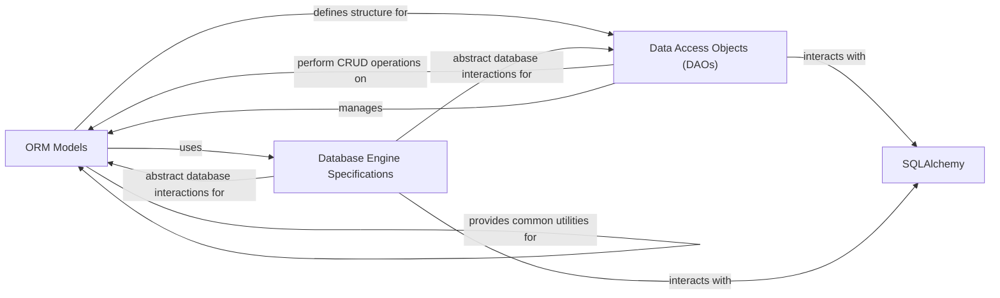

## Component Details

The `Data Persistence & Database Integration` component is the core layer responsible for all data storage, retrieval, and interaction with various database systems within Superset. It encompasses the definition of ORM models, a Data Access Object (DAO) layer for standardized CRUD operations, and a flexible system for managing database-specific configurations and behaviors, including SQL dialects, connection parameters, and query execution nuances. This component ensures that Superset can seamlessly connect to and operate with a diverse range of data sources.

### ORM Models
These classes define the structure of data entities (e.g., databases, dashboards, charts, queries, key-value entries) and their relationships within Superset's metadata database. They serve as the blueprint for data storage and retrieval, providing an object-relational mapping.

**Related Classes/Methods**:

- <a href="https://github.com/apache/superset/blob/master/superset/models/core.py#L129-L1171" target="_blank" rel="noopener noreferrer">`superset.models.core.Database` (129:1171)</a>
- <a href="https://github.com/apache/superset/blob/master/superset/models/dashboard.py#L130-L442" target="_blank" rel="noopener noreferrer">`superset.models.dashboard.Dashboard` (130:442)</a>
- <a href="https://github.com/apache/superset/blob/master/superset/models/slice.py#L66-L366" target="_blank" rel="noopener noreferrer">`superset.models.slice.Slice` (66:366)</a>
- <a href="https://github.com/apache/superset/blob/master/superset/models/sql_lab.py#L92-L382" target="_blank" rel="noopener noreferrer">`superset.models.sql_lab.Query` (92:382)</a>
- `superset.models.key_value.KeyValueEntry` (full file reference)
- <a href="https://github.com/apache/superset/blob/master/superset/models/helpers.py#L177-L467" target="_blank" rel="noopener noreferrer">`superset.models.helpers.ImportExportMixin` (177:467)</a>

### Data Access Objects (DAOs)
This layer provides a standardized interface for performing Create, Read, Update, and Delete (CRUD) operations on ORM models. Specific DAOs encapsulate business logic and security checks for different data entities, abstracting direct database interactions.

**Related Classes/Methods**:

- <a href="https://github.com/apache/superset/blob/master/superset/daos/base.py#L31-L186" target="_blank" rel="noopener noreferrer">`superset.daos.base.BaseDAO` (31:186)</a>
- <a href="https://github.com/apache/superset/blob/master/superset/daos/chart.py#L36-L78" target="_blank" rel="noopener noreferrer">`superset.daos.chart.ChartDAO` (36:78)</a>
- <a href="https://github.com/apache/superset/blob/master/superset/daos/dashboard.py#L48-L437" target="_blank" rel="noopener noreferrer">`superset.daos.dashboard.DashboardDAO` (48:437)</a>
- <a href="https://github.com/apache/superset/blob/master/superset/daos/database.py#L37-L167" target="_blank" rel="noopener noreferrer">`superset.daos.database.DatabaseDAO` (37:167)</a>
- <a href="https://github.com/apache/superset/blob/master/superset/daos/dataset.py#L39-L352" target="_blank" rel="noopener noreferrer">`superset.daos.dataset.DatasetDAO` (39:352)</a>
- <a href="https://github.com/apache/superset/blob/master/superset/daos/query.py#L35-L79" target="_blank" rel="noopener noreferrer">`superset.daos.query.QueryDAO` (35:79)</a>
- <a href="https://github.com/apache/superset/blob/master/superset/daos/key_value.py#L40-L145" target="_blank" rel="noopener noreferrer">`superset.daos.key_value.KeyValueDAO` (40:145)</a>

### Database Engine Specifications
This component provides an abstract interface and concrete implementations for handling database-specific logic. It manages connections, retrieves metadata, generates and executes dialect-specific SQL queries, handles data type mappings, and processes database-specific errors.

**Related Classes/Methods**:

- <a href="https://github.com/apache/superset/blob/master/superset/db_engine_specs/base.py#L189-L2195" target="_blank" rel="noopener noreferrer">`superset.db_engine_specs.base.BaseEngineSpec` (189:2195)</a>
- <a href="https://github.com/apache/superset/blob/master/superset/db_engine_specs/presto.py#L890-L1390" target="_blank" rel="noopener noreferrer">`superset.db_engine_specs.presto.PrestoEngineSpec` (890:1390)</a>
- <a href="https://github.com/apache/superset/blob/master/superset/db_engine_specs/bigquery.py#L118-L830" target="_blank" rel="noopener noreferrer">`superset.db_engine_specs.bigquery.BigQueryEngineSpec` (118:830)</a>
- <a href="https://github.com/apache/superset/blob/master/superset/db_engine_specs/snowflake.py#L80-L419" target="_blank" rel="noopener noreferrer">`superset.db_engine_specs.snowflake.SnowflakeEngineSpec` (80:419)</a>

### [FAQ](https://github.com/CodeBoarding/GeneratedOnBoardings/tree/main?tab=readme-ov-file#faq)