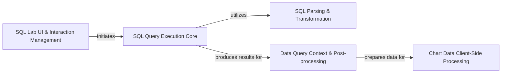

## Component Details

This subsystem manages the complete lifecycle of SQL queries within Superset, starting from user interaction in SQL Lab, through robust parsing, sanitization, and security transformations, to efficient execution against various databases. It then handles the retrieval, post-processing, and client-side preparation of query results for diverse visualizations, ensuring data integrity and adherence to security policies like Row-Level Security (RLS).

### SQL Lab UI & Interaction Management
This component is responsible for the user-facing aspects of SQL Lab, including rendering the SQL editor, managing the state of individual tabs, and handling user interactions such as submitting queries and saving query states. It acts as the entry point for SQL query operations initiated by the user.

**Related Classes/Methods**:

- <a href="https://github.com/apache/superset/blob/master/superset/views/sqllab.py#L43-L49" target="_blank" rel="noopener noreferrer">`superset.views.sqllab.SqllabView:root` (43:49)</a>
- <a href="https://github.com/apache/superset/blob/master/superset/views/sql_lab/views.py#L57-L85" target="_blank" rel="noopener noreferrer">`superset.views.sql_lab.views.TabStateView:post` (57:85)</a>
- <a href="https://github.com/apache/superset/blob/master/superset/sqllab/sqllab_execution_context.py#L149-L183" target="_blank" rel="noopener noreferrer">`superset.sqllab.sqllab_execution_context.SqlJsonExecutionContext:create_query` (149:183)</a>
- <a href="https://github.com/apache/superset/blob/master/superset/models/sql_lab.py#L477-L539" target="_blank" rel="noopener noreferrer">`superset.models.sql_lab.TabState` (477:539)</a>

### SQL Query Execution Core
This component handles the fundamental process of executing SQL queries against a database. It includes the logic for submitting queries, managing their lifecycle (running, finished, failed), applying query limits, and retrieving raw results. It relies on database engine specifications for dialect-specific operations.

**Related Classes/Methods**:

- <a href="https://github.com/apache/superset/blob/master/superset/sql_lab.py#L171-L198" target="_blank" rel="noopener noreferrer">`superset.sql_lab.get_sql_results` (171:198)</a>
- <a href="https://github.com/apache/superset/blob/master/superset/sql_lab.py#L363-L617" target="_blank" rel="noopener noreferrer">`superset.sql_lab.execute_sql_statements` (363:617)</a>
- <a href="https://github.com/apache/superset/blob/master/superset/sqllab/sql_json_executer.py#L87-L116" target="_blank" rel="noopener noreferrer">`superset.sqllab.sql_json_executer.SynchronousSqlJsonExecutor:execute` (87:116)</a>
- <a href="https://github.com/apache/superset/blob/master/superset/sqllab/sql_json_executer.py#L118-L128" target="_blank" rel="noopener noreferrer">`superset.sqllab.sql_json_executer.SynchronousSqlJsonExecutor._get_sql_results_with_timeout` (118:128)</a>
- <a href="https://github.com/apache/superset/blob/master/superset/commands/sql_lab/execute.py#L58-L241" target="_blank" rel="noopener noreferrer">`superset.commands.sql_lab.execute.ExecuteSqlCommand` (58:241)</a>
- <a href="https://github.com/apache/superset/blob/master/superset/models/sql_lab.py#L92-L382" target="_blank" rel="noopener noreferrer">`superset.models.sql_lab.Query` (92:382)</a>
- <a href="https://github.com/apache/superset/blob/master/superset/daos/query.py#L35-L79" target="_blank" rel="noopener noreferrer">`superset.daos.query.QueryDAO` (35:79)</a>
- <a href="https://github.com/apache/superset/blob/master/superset/db_engine_specs/base.py#L189-L2195" target="_blank" rel="noopener noreferrer">`superset.db_engine_specs.base.BaseEngineSpec` (189:2195)</a>

### SQL Parsing & Transformation
This component is responsible for the static analysis and modification of SQL queries before execution. This includes parsing SQL statements to identify tables, sanitizing clauses to prevent SQL injection, applying Row-Level Security (RLS) predicates, and optimizing the query structure. It ensures the query is safe and adheres to security policies.

**Related Classes/Methods**:

- <a href="https://github.com/apache/superset/blob/master/superset/sql/parse.py#L1194-L1201" target="_blank" rel="noopener noreferrer">`superset.sql.parse.SQLScript.format` (1194:1201)</a>
- <a href="https://github.com/apache/superset/blob/master/superset/sql/parse.py#L1357-L1421" target="_blank" rel="noopener noreferrer">`superset.sql.parse.extract_tables_from_jinja_sql` (1357:1421)</a>
- <a href="https://github.com/apache/superset/blob/master/superset/sql/parse.py#L1424-L1431" target="_blank" rel="noopener noreferrer">`superset.sql.parse.sanitize_clause` (1424:1431)</a>
- <a href="https://github.com/apache/superset/blob/master/superset/sql/parse.py#L146-L165" target="_blank" rel="noopener noreferrer">`superset.sql.parse.RLSTransformer:get_predicate` (146:165)</a>
- <a href="https://github.com/apache/superset/blob/master/superset/sql/parse.py#L678-L688" target="_blank" rel="noopener noreferrer">`superset.sql.parse.SQLStatement:optimize` (678:688)</a>
- <a href="https://github.com/apache/superset/blob/master/superset/sql/parse.py#L1173-L1265" target="_blank" rel="noopener noreferrer">`superset.sql.parse.SQLScript` (1173:1265)</a>
- <a href="https://github.com/apache/superset/blob/master/superset/sql/parse.py#L308-L505" target="_blank" rel="noopener noreferrer">`superset.sql.parse.BaseSQLStatement` (308:505)</a>
- <a href="https://github.com/apache/superset/blob/master/superset/sql/parse.py#L168-L220" target="_blank" rel="noopener noreferrer">`superset.sql.parse.RLSAsPredicateTransformer` (168:220)</a>
- <a href="https://github.com/apache/superset/blob/master/superset/sql/parse.py#L223-L263" target="_blank" rel="noopener noreferrer">`superset.sql.parse.RLSAsSubqueryTransformer` (223:263)</a>
- `superset.utils.rls` (full file reference)

### Data Query Context & Post-processing
This component provides a structured approach to defining and processing data requests, primarily through QueryObject and QueryContext. It manages the construction of query parameters, handles caching mechanisms for query results, and orchestrates various post-processing operations (e.g., pivoting, aggregation) on the retrieved data before it's prepared for visualization.

**Related Classes/Methods**:

- <a href="https://github.com/apache/superset/blob/master/superset/common/query_object.py#L112-L166" target="_blank" rel="noopener noreferrer">`superset.common.query_object.QueryObject:__init__` (112:166)</a>
- <a href="https://github.com/apache/superset/blob/master/superset/common/query_object.py#L443-L470" target="_blank" rel="noopener noreferrer">`superset.common.query_object.QueryObject:exec_post_processing` (443:470)</a>
- <a href="https://github.com/apache/superset/blob/master/superset/common/query_context_processor.py#L130-L231" target="_blank" rel="noopener noreferrer">`superset.common.query_context_processor.QueryContextProcessor:get_df_payload` (130:231)</a>
- <a href="https://github.com/apache/superset/blob/master/superset/common/query_context_factory.py#L47-L105" target="_blank" rel="noopener noreferrer">`superset.common.query_context_factory.QueryContextFactory:create` (47:105)</a>
- <a href="https://github.com/apache/superset/blob/master/superset/common/query_context.py#L41-L139" target="_blank" rel="noopener noreferrer">`superset.common.query_context.QueryContext` (41:139)</a>
- <a href="https://github.com/apache/superset/blob/master/superset/common/query_object_factory.py#L40-L152" target="_blank" rel="noopener noreferrer">`superset.common.query_object_factory.QueryObjectFactory` (40:152)</a>
- `superset.utils.pandas_postprocessing` (full file reference)
- <a href="https://github.com/apache/superset/blob/master/superset/common/utils/query_cache_manager.py#L46-L223" target="_blank" rel="noopener noreferrer">`superset.common.utils.query_cache_manager.QueryCacheManager` (46:223)</a>

### Chart Data Client-Side Processing
This component specifically focuses on applying client-side data transformations to query results, ensuring that the data is in the correct format and structure for various chart types and visualizations. This includes operations like pivoting and other chart-specific data manipulations.

**Related Classes/Methods**:

- <a href="https://github.com/apache/superset/blob/master/superset/charts/client_processing.py#L312-L387" target="_blank" rel="noopener noreferrer">`superset.charts.client_processing:apply_client_processing` (312:387)</a>

### [FAQ](https://github.com/CodeBoarding/GeneratedOnBoardings/tree/main?tab=readme-ov-file#faq)