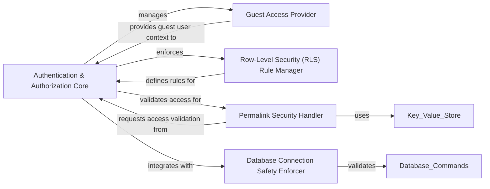

## Component Details

The `Security & Access Control` component in Superset is a critical subsystem responsible for managing user authentication, role-based access control (RBAC), and fine-grained permissions across all Superset resources. It also handles specialized security features such as guest access for embedded content and secure permalink generation for sharing. Its primary purpose is to ensure that users can only access and interact with resources for which they have explicit authorization, thereby maintaining data integrity and confidentiality.

### Authentication & Authorization Core
The central engine for user authentication, role management, and fine-grained access control across all Superset resources. It determines user permissions for various objects like databases, charts, and dashboards, and raises exceptions for unauthorized access. It also manages the synchronization of roles.

**Related Classes/Methods**:

- <a href="https://github.com/apache/superset/blob/master/superset/security/manager.py#L241-L2804" target="_blank" rel="noopener noreferrer">`superset.security.manager.SupersetSecurityManager` (241:2804)</a>
- <a href="https://github.com/apache/superset/blob/master/superset/security/manager.py#L510-L522" target="_blank" rel="noopener noreferrer">`superset.security.manager.SupersetSecurityManager:can_access_database` (510:522)</a>
- <a href="https://github.com/apache/superset/blob/master/superset/security/manager.py#L2200-L2456" target="_blank" rel="noopener noreferrer">`superset.security.manager.SupersetSecurityManager:raise_for_access` (2200:2456)</a>
- <a href="https://github.com/apache/superset/blob/master/superset/security/manager.py#L1099-L1124" target="_blank" rel="noopener noreferrer">`superset.security.manager.SupersetSecurityManager:sync_role_definitions` (1099:1124)</a>

### Guest Access Provider
Specializes in handling guest user sessions and token-based access for embedded content. It is responsible for creating and validating guest access tokens, allowing controlled, temporary access to specific resources without full user authentication.

**Related Classes/Methods**:

- <a href="https://github.com/apache/superset/blob/master/superset/security/manager.py#L2695-L2707" target="_blank" rel="noopener noreferrer">`superset.security.manager.SupersetSecurityManager:is_guest_user` (2695:2707)</a>
- <a href="https://github.com/apache/superset/blob/master/superset/security/manager.py#L2617-L2640" target="_blank" rel="noopener noreferrer">`superset.security.manager.SupersetSecurityManager:create_guest_access_token` (2617:2640)</a>
- <a href="https://github.com/apache/superset/blob/master/superset/security/manager.py#L2642-L2673" target="_blank" rel="noopener noreferrer">`superset.security.manager.SupersetSecurityManager:get_guest_user_from_request` (2642:2673)</a>
- <a href="https://github.com/apache/superset/blob/master/superset/security/guest_token.py#L56-L89" target="_blank" rel="noopener noreferrer">`superset.security.guest_token.GuestUser` (56:89)</a>

### Row-Level Security (RLS) Rule Manager
Manages the definition, persistence, and application of row-level security filters. It provides an API for CRUD operations on RLS rules, which are then used by the core security manager to restrict data visibility.

**Related Classes/Methods**:

- <a href="https://github.com/apache/superset/blob/master/superset/row_level_security/api.py#L63-L368" target="_blank" rel="noopener noreferrer">`superset.row_level_security.api.RLSRestApi` (63:368)</a>
- <a href="https://github.com/apache/superset/blob/master/superset/row_level_security/api.py#L158-L224" target="_blank" rel="noopener noreferrer">`superset.row_level_security.api.RLSRestApi:post` (158:224)</a>
- <a href="https://github.com/apache/superset/blob/master/superset/commands/security/create.py#L33-L52" target="_blank" rel="noopener noreferrer">`superset.commands.security.create.CreateRLSRuleCommand` (33:52)</a>
- <a href="https://github.com/apache/superset/blob/master/superset/commands/security/delete.py#L33-L47" target="_blank" rel="noopener noreferrer">`superset.commands.security.delete.DeleteRLSRuleCommand` (33:47)</a>
- <a href="https://github.com/apache/superset/blob/master/superset/commands/security/update.py#L34-L59" target="_blank" rel="noopener noreferrer">`superset.commands.security.update.UpdateRLSRuleCommand` (34:59)</a>
- <a href="https://github.com/apache/superset/blob/master/superset/connectors/sqla/models.py#L2078-L2105" target="_blank" rel="noopener noreferrer">`superset.connectors.sqla.models.RowLevelSecurityFilter` (2078:2105)</a>
- <a href="https://github.com/apache/superset/blob/master/superset/daos/security.py#L22-L23" target="_blank" rel="noopener noreferrer">`superset.daos.security.RLSDAO` (22:23)</a>

### Permalink Security Handler
Ensures the secure generation and retrieval of permalinks for sharing charts and dashboards. It integrates with the core security mechanisms to validate access rights for content shared via permalinks and uses a key-value store for secure storage.

**Related Classes/Methods**:

- <a href="https://github.com/apache/superset/blob/master/superset/commands/explore/permalink/create.py#L56-L74" target="_blank" rel="noopener noreferrer">`superset.commands.explore.permalink.create.CreateExplorePermalinkCommand:run` (56:74)</a>
- <a href="https://github.com/apache/superset/blob/master/superset/commands/dashboard/permalink/get.py#L42-L60" target="_blank" rel="noopener noreferrer">`superset.commands.dashboard.permalink.get.GetDashboardPermalinkCommand:run` (42:60)</a>
- <a href="https://github.com/apache/superset/blob/master/superset/key_value/shared_entries.py#L42-L48" target="_blank" rel="noopener noreferrer">`superset.key_value.shared_entries:get_permalink_salt` (42:48)</a>
- <a href="https://github.com/apache/superset/blob/master/superset/key_value/utils.py#L56-L58" target="_blank" rel="noopener noreferrer">`superset.key_value.utils.encode_permalink_key` (56:58)</a>
- <a href="https://github.com/apache/superset/blob/master/superset/key_value/utils.py#L61-L66" target="_blank" rel="noopener noreferrer">`superset.key_value.utils.decode_permalink_id` (61:66)</a>

### Database Connection Safety Enforcer
A specialized module that validates database connection URIs against a predefined blocklist to prevent the use of potentially unsafe database dialects or access methods, thereby enhancing overall system security.

**Related Classes/Methods**:

- <a href="https://github.com/apache/superset/blob/master/superset/security/analytics_db_safety.py#L37-L58" target="_blank" rel="noopener noreferrer">`superset.security.analytics_db_safety:check_sqlalchemy_uri` (37:58)</a>

### [FAQ](https://github.com/CodeBoarding/GeneratedOnBoardings/tree/main?tab=readme-ov-file#faq)