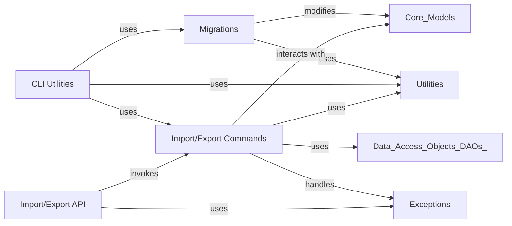

## Component Details

The System Management & Data Lifecycle subsystem in Superset is responsible for administrative operations, including managing database schema changes, providing command-line utilities for data handling, and facilitating the import and export of Superset assets. It ensures data consistency through migrations, enables bulk operations via CLI, and offers programmatic access to import/export functionalities through dedicated API endpoints and command classes.

### Migrations
This component contains database migration scripts and utilities to manage schema changes and data transformations across different Superset versions.

**Related Classes/Methods**:

- `superset.migrations.versions.2022-03_04_09_59_6766938c6065_add_key_value_store:upgrade` (full file reference)
- <a href="https://github.com/apache/superset/blob/master/superset/migrations/shared/utils.py#L235-L254" target="_blank" rel="noopener noreferrer">`superset.migrations.shared.utils.create_table` (235:254)</a>
- <a href="https://github.com/apache/superset/blob/master/superset/migrations/shared/constraints.py#L39-L73" target="_blank" rel="noopener noreferrer">`superset.migrations.shared.constraints.redefine` (39:73)</a>
- <a href="https://github.com/apache/superset/blob/master/superset/migrations/shared/security_converge.py#L163-L179" target="_blank" rel="noopener noreferrer">`superset.migrations.shared.security_converge.add_pvms` (163:179)</a>
- <a href="https://github.com/apache/superset/blob/master/superset/migrations/shared/migrate_viz/base.py#L201-L207" target="_blank" rel="noopener noreferrer">`superset.migrations.shared.migrate_viz.base.MigrateViz.upgrade` (201:207)</a>

### CLI Utilities
Provides command-line interface tools for administrative tasks, including data loading, database testing, and synchronization of metadata.

**Related Classes/Methods**:

- <a href="https://github.com/apache/superset/blob/master/superset/cli/examples.py#L108-L115" target="_blank" rel="noopener noreferrer">`superset.cli.examples:load_examples` (108:115)</a>
- <a href="https://github.com/apache/superset/blob/master/superset/cli/importexport.py#L70-L93" target="_blank" rel="noopener noreferrer">`superset.cli.importexport:export_dashboards` (70:93)</a>
- <a href="https://github.com/apache/superset/blob/master/superset/cli/test_db.py#L141-L173" target="_blank" rel="noopener noreferrer">`superset.cli.test_db:test_db` (141:173)</a>
- <a href="https://github.com/apache/superset/blob/master/superset/cli/update.py#L59-L69" target="_blank" rel="noopener noreferrer">`superset.cli.update:sync_tags` (59:69)</a>
- <a href="https://github.com/apache/superset/blob/master/superset/cli/viz_migrations.py#L109-L115" target="_blank" rel="noopener noreferrer">`superset.cli.viz_migrations:upgrade` (109:115)</a>

### Import/Export Commands
Encapsulates the generic business logic for importing and exporting Superset models and assets. Specific asset types (charts, dashboards, etc.) have their own commands that utilize these generic commands.

**Related Classes/Methods**:

- <a href="https://github.com/apache/superset/blob/master/superset/commands/export/models.py#L58-L73" target="_blank" rel="noopener noreferrer">`superset.commands.export.models.ExportModelsCommand:run` (58:73)</a>
- `superset.commands.importers.v1.ImportModelsCommand:run` (full file reference)
- <a href="https://github.com/apache/superset/blob/master/superset/commands/importers/v1/utils.py#L216-L222" target="_blank" rel="noopener noreferrer">`superset.commands.importers.v1.utils.get_contents_from_bundle` (216:222)</a>

### Import/Export API
Provides REST API endpoints specifically for importing and exporting Superset assets.

**Related Classes/Methods**:

- <a href="https://github.com/apache/superset/blob/master/superset/importexport/api.py#L52-L92" target="_blank" rel="noopener noreferrer">`superset.importexport.api.ImportExportRestApi:export` (52:92)</a>
- <a href="https://github.com/apache/superset/blob/master/superset/importexport/api.py#L102-L215" target="_blank" rel="noopener noreferrer">`superset.importexport.api.ImportExportRestApi:import_` (102:215)</a>

### [FAQ](https://github.com/CodeBoarding/GeneratedOnBoardings/tree/main?tab=readme-ov-file#faq)