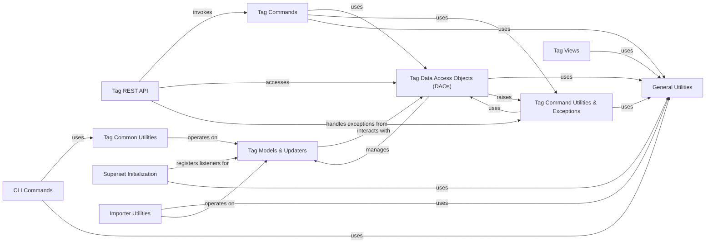

## Component Details

The Tagging System in Superset provides a flexible mechanism for users to organize and discover content such as charts, dashboards, and datasets through tags. It encompasses data models for tags and tagged objects, RESTful APIs for managing these, data access objects for database interactions, and command-line utilities for tag synchronization. The system integrates with Superset's initialization process to register event listeners and offers views for UI management, ensuring a comprehensive tagging solution.

### Tag Models & Updaters
This component defines the data models related to tags and handles updates to tagged objects, including ownership and favorite status. It interacts with the database to persist tag and tagged object information.

**Related Classes/Methods**:

- <a href="https://github.com/apache/superset/blob/master/superset/tags/models.py#L162-L291" target="_blank" rel="noopener noreferrer">`superset.tags.models.ObjectUpdater` (162:291)</a>
- <a href="https://github.com/apache/superset/blob/master/superset/tags/models.py#L221-L236" target="_blank" rel="noopener noreferrer">`superset.tags.models.ObjectUpdater:after_insert` (221:236)</a>
- <a href="https://github.com/apache/superset/blob/master/superset/tags/models.py#L185-L195" target="_blank" rel="noopener noreferrer">`superset.tags.models.ObjectUpdater._add_owners` (185:195)</a>
- <a href="https://github.com/apache/superset/blob/master/superset/tags/models.py#L198-L218" target="_blank" rel="noopener noreferrer">`superset.tags.models.ObjectUpdater.add_tag_object_if_not_tagged` (198:218)</a>
- <a href="https://github.com/apache/superset/blob/master/superset/tags/models.py#L172-L182" target="_blank" rel="noopener noreferrer">`superset.tags.models.ObjectUpdater:get_owner_tag_ids` (172:182)</a>
- <a href="https://github.com/apache/superset/blob/master/superset/tags/models.py#L166-L169" target="_blank" rel="noopener noreferrer">`superset.tags.models.ObjectUpdater.get_owners_ids` (166:169)</a>
- <a href="https://github.com/apache/superset/blob/master/superset/tags/models.py#L239-L275" target="_blank" rel="noopener noreferrer">`superset.tags.models.ObjectUpdater:after_update` (239:275)</a>
- <a href="https://github.com/apache/superset/blob/master/superset/tags/models.py#L326-L362" target="_blank" rel="noopener noreferrer">`superset.tags.models.FavStarUpdater` (326:362)</a>
- <a href="https://github.com/apache/superset/blob/master/superset/tags/models.py#L328-L340" target="_blank" rel="noopener noreferrer">`superset.tags.models.FavStarUpdater:after_insert` (328:340)</a>
- <a href="https://github.com/apache/superset/blob/master/superset/tags/models.py#L133-L144" target="_blank" rel="noopener noreferrer">`superset.tags.models.get_tag` (133:144)</a>
- <a href="https://github.com/apache/superset/blob/master/superset/tags/models.py#L108-L130" target="_blank" rel="noopener noreferrer">`superset.tags.models.TaggedObject` (108:130)</a>
- <a href="https://github.com/apache/superset/blob/master/superset/tags/models.py#L90-L105" target="_blank" rel="noopener noreferrer">`superset.tags.models.Tag` (90:105)</a>
- <a href="https://github.com/apache/superset/blob/master/superset/tags/models.py#L147-L159" target="_blank" rel="noopener noreferrer">`superset.tags.models.get_object_type` (147:159)</a>
- <a href="https://github.com/apache/superset/blob/master/superset/tags/core.py#L20-L53" target="_blank" rel="noopener noreferrer">`superset.tags.core.register_sqla_event_listeners` (20:53)</a>

### Tag REST API
This component exposes RESTful endpoints for managing tags and tagged objects. It handles requests for creating, updating, deleting, and retrieving tags and their relationships with various Superset objects.

**Related Classes/Methods**:

- <a href="https://github.com/apache/superset/blob/master/superset/tags/api.py#L65-L742" target="_blank" rel="noopener noreferrer">`superset.tags.api.TagRestApi` (65:742)</a>
- <a href="https://github.com/apache/superset/blob/master/superset/tags/api.py#L161-L203" target="_blank" rel="noopener noreferrer">`superset.tags.api.TagRestApi:post` (161:203)</a>
- <a href="https://github.com/apache/superset/blob/master/superset/tags/api.py#L355-L409" target="_blank" rel="noopener noreferrer">`superset.tags.api.TagRestApi:add_objects` (355:409)</a>
- <a href="https://github.com/apache/superset/blob/master/superset/tags/api.py#L213-L280" target="_blank" rel="noopener noreferrer">`superset.tags.api.TagRestApi:bulk_create` (213:280)</a>
- <a href="https://github.com/apache/superset/blob/master/superset/tags/api.py#L290-L345" target="_blank" rel="noopener noreferrer">`superset.tags.api.TagRestApi:put` (290:345)</a>
- <a href="https://github.com/apache/superset/blob/master/superset/tags/api.py#L419-L476" target="_blank" rel="noopener noreferrer">`superset.tags.api.TagRestApi:delete_object` (419:476)</a>
- <a href="https://github.com/apache/superset/blob/master/superset/tags/api.py#L487-L532" target="_blank" rel="noopener noreferrer">`superset.tags.api.TagRestApi:bulk_delete` (487:532)</a>
- <a href="https://github.com/apache/superset/blob/master/superset/tags/api.py#L542-L596" target="_blank" rel="noopener noreferrer">`superset.tags.api.TagRestApi:get_objects` (542:596)</a>
- <a href="https://github.com/apache/superset/blob/master/superset/tags/api.py#L608-L649" target="_blank" rel="noopener noreferrer">`superset.tags.api.TagRestApi:favorite_status` (608:649)</a>
- <a href="https://github.com/apache/superset/blob/master/superset/tags/api.py#L659-L695" target="_blank" rel="noopener noreferrer">`superset.tags.api.TagRestApi:add_favorite` (659:695)</a>
- <a href="https://github.com/apache/superset/blob/master/superset/tags/api.py#L706-L742" target="_blank" rel="noopener noreferrer">`superset.tags.api.TagRestApi:remove_favorite` (706:742)</a>
- <a href="https://github.com/apache/superset/blob/master/superset/tags/schemas.py#L80-L81" target="_blank" rel="noopener noreferrer">`superset.tags.schemas.TagPostBulkSchema` (80:81)</a>

### Tag Data Access Objects (DAOs)
This component provides an abstraction layer for interacting with the database for tag-related operations. It encapsulates common database queries and operations for tags and tagged objects.

**Related Classes/Methods**:

- <a href="https://github.com/apache/superset/blob/master/superset/daos/tag.py#L44-L384" target="_blank" rel="noopener noreferrer">`superset.daos.tag.TagDAO` (44:384)</a>
- <a href="https://github.com/apache/superset/blob/master/superset/daos/tag.py#L46-L73" target="_blank" rel="noopener noreferrer">`superset.daos.tag.TagDAO:create_custom_tagged_objects` (46:73)</a>
- <a href="https://github.com/apache/superset/blob/master/superset/daos/tag.py#L117-L129" target="_blank" rel="noopener noreferrer">`superset.daos.tag.TagDAO.get_by_name` (117:129)</a>
- <a href="https://github.com/apache/superset/blob/master/superset/daos/tag.py#L76-L98" target="_blank" rel="noopener noreferrer">`superset.daos.tag.TagDAO:delete_tagged_object` (76:98)</a>
- <a href="https://github.com/apache/superset/blob/master/superset/daos/tag.py#L101-L114" target="_blank" rel="noopener noreferrer">`superset.daos.tag.TagDAO:delete_tags` (101:114)</a>
- <a href="https://github.com/apache/superset/blob/master/superset/daos/tag.py#L164-L247" target="_blank" rel="noopener noreferrer">`superset.daos.tag.TagDAO:get_tagged_objects_by_tag_ids` (164:247)</a>
- <a href="https://github.com/apache/superset/blob/master/superset/daos/tag.py#L250-L262" target="_blank" rel="noopener noreferrer">`superset.daos.tag.TagDAO:get_tagged_objects_by_tag_names` (250:262)</a>
- <a href="https://github.com/apache/superset/blob/master/superset/daos/tag.py#L140-L144" target="_blank" rel="noopener noreferrer">`superset.daos.tag.TagDAO.find_by_names` (140:144)</a>
- <a href="https://github.com/apache/superset/blob/master/superset/daos/tag.py#L265-L282" target="_blank" rel="noopener noreferrer">`superset.daos.tag.TagDAO:favorite_tag_by_id_for_current_user` (265:282)</a>
- <a href="https://github.com/apache/superset/blob/master/superset/daos/tag.py#L285-L299" target="_blank" rel="noopener noreferrer">`superset.daos.tag.TagDAO:remove_user_favorite_tag` (285:299)</a>
- <a href="https://github.com/apache/superset/blob/master/superset/daos/tag.py#L302-L330" target="_blank" rel="noopener noreferrer">`superset.daos.tag.TagDAO:favorited_ids` (302:330)</a>
- <a href="https://github.com/apache/superset/blob/master/superset/daos/tag.py#L333-L384" target="_blank" rel="noopener noreferrer">`superset.daos.tag.TagDAO:create_tag_relationship` (333:384)</a>
- <a href="https://github.com/apache/superset/blob/master/superset/daos/base.py#L31-L186" target="_blank" rel="noopener noreferrer">`superset.daos.base.BaseDAO` (31:186)</a>
- <a href="https://github.com/apache/superset/blob/master/superset/daos/base.py#L75-L92" target="_blank" rel="noopener noreferrer">`superset.daos.base.BaseDAO.find_by_ids` (75:92)</a>
- <a href="https://github.com/apache/superset/blob/master/superset/daos/base.py#L53-L72" target="_blank" rel="noopener noreferrer">`superset.daos.base.BaseDAO.find_by_id` (53:72)</a>
- <a href="https://github.com/apache/superset/blob/master/superset/daos/base.py#L95-L105" target="_blank" rel="noopener noreferrer">`superset.daos.base.BaseDAO.find_all` (95:105)</a>

### Tag Commands
This component encapsulates business logic for various tag operations, such as creating, updating, and deleting tags and tagged objects. It uses DAOs to interact with the database and handles validation and error reporting.

**Related Classes/Methods**:

- <a href="https://github.com/apache/superset/blob/master/superset/commands/tag/create.py#L67-L119" target="_blank" rel="noopener noreferrer">`superset.commands.tag.create.CreateCustomTagWithRelationshipsCommand` (67:119)</a>
- <a href="https://github.com/apache/superset/blob/master/superset/commands/tag/create.py#L74-L86" target="_blank" rel="noopener noreferrer">`superset.commands.tag.create.CreateCustomTagWithRelationshipsCommand:run` (74:86)</a>
- <a href="https://github.com/apache/superset/blob/master/superset/commands/tag/create.py#L88-L119" target="_blank" rel="noopener noreferrer">`superset.commands.tag.create.CreateCustomTagWithRelationshipsCommand:validate` (88:119)</a>
- <a href="https://github.com/apache/superset/blob/master/superset/commands/tag/create.py#L33-L64" target="_blank" rel="noopener noreferrer">`superset.commands.tag.create.CreateCustomTagCommand` (33:64)</a>
- <a href="https://github.com/apache/superset/blob/master/superset/commands/tag/create.py#L40-L50" target="_blank" rel="noopener noreferrer">`superset.commands.tag.create.CreateCustomTagCommand:run` (40:50)</a>
- <a href="https://github.com/apache/superset/blob/master/superset/commands/tag/create.py#L52-L64" target="_blank" rel="noopener noreferrer">`superset.commands.tag.create.CreateCustomTagCommand:validate` (52:64)</a>
- <a href="https://github.com/apache/superset/blob/master/superset/commands/tag/update.py#L33-L71" target="_blank" rel="noopener noreferrer">`superset.commands.tag.update.UpdateTagCommand` (33:71)</a>
- <a href="https://github.com/apache/superset/blob/master/superset/commands/tag/update.py#L40-L51" target="_blank" rel="noopener noreferrer">`superset.commands.tag.update.UpdateTagCommand:run` (40:51)</a>
- <a href="https://github.com/apache/superset/blob/master/superset/commands/tag/update.py#L53-L71" target="_blank" rel="noopener noreferrer">`superset.commands.tag.update.UpdateTagCommand:validate` (53:71)</a>
- <a href="https://github.com/apache/superset/blob/master/superset/commands/tag/export.py#L32-L131" target="_blank" rel="noopener noreferrer">`superset.commands.tag.export.ExportTagsCommand` (32:131)</a>
- <a href="https://github.com/apache/superset/blob/master/superset/commands/tag/export.py#L56-L118" target="_blank" rel="noopener noreferrer">`superset.commands.tag.export.ExportTagsCommand:_file_content` (56:118)</a>
- <a href="https://github.com/apache/superset/blob/master/superset/commands/tag/export.py#L41-L53" target="_blank" rel="noopener noreferrer">`superset.commands.tag.export.ExportTagsCommand:_merge_tags` (41:53)</a>
- <a href="https://github.com/apache/superset/blob/master/superset/commands/tag/export.py#L121-L131" target="_blank" rel="noopener noreferrer">`superset.commands.tag.export.ExportTagsCommand:export` (121:131)</a>
- <a href="https://github.com/apache/superset/blob/master/superset/commands/tag/export.py#L36-L38" target="_blank" rel="noopener noreferrer">`superset.commands.tag.export.ExportTagsCommand:_file_name` (36:38)</a>
- <a href="https://github.com/apache/superset/blob/master/superset/commands/tag/delete.py#L37-L86" target="_blank" rel="noopener noreferrer">`superset.commands.tag.delete.DeleteTaggedObjectCommand` (37:86)</a>
- <a href="https://github.com/apache/superset/blob/master/superset/commands/tag/delete.py#L44-L51" target="_blank" rel="noopener noreferrer">`superset.commands.tag.delete.DeleteTaggedObjectCommand:run` (44:51)</a>
- <a href="https://github.com/apache/superset/blob/master/superset/commands/tag/delete.py#L53-L86" target="_blank" rel="noopener noreferrer">`superset.commands.tag.delete.DeleteTaggedObjectCommand:validate` (53:86)</a>
- <a href="https://github.com/apache/superset/blob/master/superset/commands/tag/delete.py#L89-L105" target="_blank" rel="noopener noreferrer">`superset.commands.tag.delete.DeleteTagsCommand` (89:105)</a>
- <a href="https://github.com/apache/superset/blob/master/superset/commands/tag/delete.py#L94-L96" target="_blank" rel="noopener noreferrer">`superset.commands.tag.delete.DeleteTagsCommand:run` (94:96)</a>
- <a href="https://github.com/apache/superset/blob/master/superset/commands/tag/delete.py#L98-L105" target="_blank" rel="noopener noreferrer">`superset.commands.tag.delete.DeleteTagsCommand:validate` (98:105)</a>

### Tag Command Utilities & Exceptions
This component provides utility functions and defines custom exceptions specific to tag-related commands. These utilities assist in data transformation and validation within the command layer.

**Related Classes/Methods**:

- `superset.commands.tag.utils` (full file reference)
- <a href="https://github.com/apache/superset/blob/master/superset/commands/tag/utils.py#L38-L47" target="_blank" rel="noopener noreferrer">`superset.commands.tag.utils:to_object_model` (38:47)</a>
- <a href="https://github.com/apache/superset/blob/master/superset/commands/tag/utils.py#L29-L35" target="_blank" rel="noopener noreferrer">`superset.commands.tag.utils.to_object_type` (29:35)</a>
- <a href="https://github.com/apache/superset/blob/master/superset/commands/tag/exceptions.py#L51-L56" target="_blank" rel="noopener noreferrer">`superset.commands.tag.exceptions.TagNotFoundError` (51:56)</a>
- <a href="https://github.com/apache/superset/blob/master/superset/commands/tag/exceptions.py#L52-L56" target="_blank" rel="noopener noreferrer">`superset.commands.tag.exceptions.TagNotFoundError:__init__` (52:56)</a>
- <a href="https://github.com/apache/superset/blob/master/superset/commands/tag/exceptions.py#L59-L71" target="_blank" rel="noopener noreferrer">`superset.commands.tag.exceptions.TaggedObjectNotFoundError` (59:71)</a>
- <a href="https://github.com/apache/superset/blob/master/superset/commands/tag/exceptions.py#L60-L71" target="_blank" rel="noopener noreferrer">`superset.commands.tag.exceptions.TaggedObjectNotFoundError:__init__` (60:71)</a>
- <a href="https://github.com/apache/superset/blob/master/superset/commands/exceptions.py#L54-L80" target="_blank" rel="noopener noreferrer">`superset.commands.exceptions.CommandInvalidError` (54:80)</a>
- <a href="https://github.com/apache/superset/blob/master/superset/commands/exceptions.py#L76-L80" target="_blank" rel="noopener noreferrer">`superset.commands.exceptions.CommandInvalidError.normalized_messages` (76:80)</a>
- <a href="https://github.com/apache/superset/blob/master/superset/commands/tag/exceptions.py#L31-L32" target="_blank" rel="noopener noreferrer">`superset.commands.tag.exceptions.TagInvalidError` (31:32)</a>
- <a href="https://github.com/apache/superset/blob/master/superset/commands/tag/exceptions.py#L35-L36" target="_blank" rel="noopener noreferrer">`superset.commands.tag.exceptions.TagCreateFailedError` (35:36)</a>
- <a href="https://github.com/apache/superset/blob/master/superset/commands/tag/exceptions.py#L47-L48" target="_blank" rel="noopener noreferrer">`superset.commands.tag.exceptions.TaggedObjectDeleteFailedError` (47:48)</a>
- <a href="https://github.com/apache/superset/blob/master/superset/commands/exceptions.py#L34-L51" target="_blank" rel="noopener noreferrer">`superset.commands.exceptions.ObjectNotFoundError` (34:51)</a>
- <a href="https://github.com/apache/superset/blob/master/superset/exceptions.py#L29-L61" target="_blank" rel="noopener noreferrer">`superset.exceptions.SupersetException` (29:61)</a>
- <a href="https://github.com/apache/superset/blob/master/superset/commands/exceptions.py#L150-L152" target="_blank" rel="noopener noreferrer">`superset.commands.exceptions.TagForbiddenError` (150:152)</a>
- <a href="https://github.com/apache/superset/blob/master/superset/commands/exceptions.py#L145-L147" target="_blank" rel="noopener noreferrer">`superset.commands.exceptions.TagNotFoundValidationError` (145:147)</a>
- <a href="https://github.com/apache/superset/blob/master/superset/exceptions.py#L206-L207" target="_blank" rel="noopener noreferrer">`superset.exceptions.MissingUserContextException` (206:207)</a>

### Tag Common Utilities
This component provides common utility functions related to tags, such as adding types, owners, and favorites to various Superset objects. These utilities are often used in background tasks or CLI commands.

**Related Classes/Methods**:

- `superset.common.tags` (full file reference)
- <a href="https://github.com/apache/superset/blob/master/superset/common/tags.py#L156-L231" target="_blank" rel="noopener noreferrer">`superset.common.tags:add_types` (156:231)</a>
- <a href="https://github.com/apache/superset/blob/master/superset/common/tags.py#L28-L57" target="_blank" rel="noopener noreferrer">`superset.common.tags.add_types_to_charts` (28:57)</a>
- <a href="https://github.com/apache/superset/blob/master/superset/common/tags.py#L60-L89" target="_blank" rel="noopener noreferrer">`superset.common.tags.add_types_to_dashboards` (60:89)</a>
- <a href="https://github.com/apache/superset/blob/master/superset/common/tags.py#L92-L121" target="_blank" rel="noopener noreferrer">`superset.common.tags.add_types_to_saved_queries` (92:121)</a>
- <a href="https://github.com/apache/superset/blob/master/superset/common/tags.py#L124-L153" target="_blank" rel="noopener noreferrer">`superset.common.tags.add_types_to_datasets` (124:153)</a>
- <a href="https://github.com/apache/superset/blob/master/superset/common/tags.py#L378-L451" target="_blank" rel="noopener noreferrer">`superset.common.tags:add_owners` (378:451)</a>
- <a href="https://github.com/apache/superset/blob/master/superset/common/tags.py#L234-L267" target="_blank" rel="noopener noreferrer">`superset.common.tags.add_owners_to_charts` (234:267)</a>
- <a href="https://github.com/apache/superset/blob/master/superset/common/tags.py#L270-L303" target="_blank" rel="noopener noreferrer">`superset.common.tags.add_owners_to_dashboards` (270:303)</a>
- <a href="https://github.com/apache/superset/blob/master/superset/common/tags.py#L306-L339" target="_blank" rel="noopener noreferrer">`superset.common.tags.add_owners_to_saved_queries` (306:339)</a>
- <a href="https://github.com/apache/superset/blob/master/superset/common/tags.py#L342-L375" target="_blank" rel="noopener noreferrer">`superset.common.tags.add_owners_to_datasets` (342:375)</a>
- <a href="https://github.com/apache/superset/blob/master/superset/common/tags.py#L454-L514" target="_blank" rel="noopener noreferrer">`superset.common.tags.add_favorites` (454:514)</a>

### Superset Initialization
This component is responsible for initializing the Superset application context, including configuring various managers, authenticators, and registering event listeners, such as those for SQLAlchemy tag events.

**Related Classes/Methods**:

- `superset.initialization.SupersetAppInitializer` (full file reference)
- `superset.initialization.SupersetAppInitializer:init_app_in_ctx` (full file reference)
- `superset.initialization.SupersetAppInitializer.configure_fab` (full file reference)
- `superset.initialization.SupersetAppInitializer.configure_url_map_converters` (full file reference)
- `superset.initialization.SupersetAppInitializer.configure_data_sources` (full file reference)
- `superset.initialization.SupersetAppInitializer.configure_auth_provider` (full file reference)
- `superset.initialization.SupersetAppInitializer.configure_async_queries` (full file reference)
- `superset.initialization.SupersetAppInitializer.configure_ssh_manager` (full file reference)
- `superset.initialization.SupersetAppInitializer.configure_stats_manager` (full file reference)
- `superset.initialization.SupersetAppInitializer.init_views` (full file reference)

### Tag Views
This component defines the Flask-AppBuilder views for displaying and managing tags within the Superset UI. It handles rendering templates and checking feature flag enablement for tag-related functionalities.

**Related Classes/Methods**:

- <a href="https://github.com/apache/superset/blob/master/superset/views/tags.py#L37-L49" target="_blank" rel="noopener noreferrer">`superset.views.tags.TagModelView` (37:49)</a>
- <a href="https://github.com/apache/superset/blob/master/superset/views/tags.py#L45-L49" target="_blank" rel="noopener noreferrer">`superset.views.tags.TagModelView:list` (45:49)</a>
- <a href="https://github.com/apache/superset/blob/master/superset/views/tags.py#L52-L77" target="_blank" rel="noopener noreferrer">`superset.views.tags.TagView` (52:77)</a>
- <a href="https://github.com/apache/superset/blob/master/superset/views/tags.py#L54-L55" target="_blank" rel="noopener noreferrer">`superset.views.tags.TagView:is_enabled` (54:55)</a>
- <a href="https://github.com/apache/superset/blob/master/superset/views/tags.py#L58-L60" target="_blank" rel="noopener noreferrer">`superset.views.tags.TagView:ensure_enabled` (58:60)</a>
- <a href="https://github.com/apache/superset/blob/master/superset/views/tags.py#L64-L77" target="_blank" rel="noopener noreferrer">`superset.views.tags.TagView:tags` (64:77)</a>
- <a href="https://github.com/apache/superset/blob/master/superset/views/all_entities.py#L33-L45" target="_blank" rel="noopener noreferrer">`superset.views.all_entities.TaggedObjectsModelView` (33:45)</a>
- <a href="https://github.com/apache/superset/blob/master/superset/views/all_entities.py#L41-L45" target="_blank" rel="noopener noreferrer">`superset.views.all_entities.TaggedObjectsModelView:list` (41:45)</a>
- <a href="https://github.com/apache/superset/blob/master/superset/views/base.py#L375-L386" target="_blank" rel="noopener noreferrer">`superset.views.base.SupersetModelView.render_app_template` (375:386)</a>
- <a href="https://github.com/apache/superset/blob/master/superset/views/base.py#L131-L132" target="_blank" rel="noopener noreferrer">`superset.views.base.json_success` (131:132)</a>

### CLI Commands
This component includes command-line interface utilities, such as synchronizing tags, which involve applying common tag utilities to various Superset objects.

**Related Classes/Methods**:

- <a href="https://github.com/apache/superset/blob/master/superset/cli/update.py#L59-L69" target="_blank" rel="noopener noreferrer">`superset.cli.update.sync_tags` (59:69)</a>

### Importer Utilities
This component provides utility functions for importing tags and tagged objects, often used during data migration or loading processes.

**Related Classes/Methods**:

- <a href="https://github.com/apache/superset/blob/master/superset/commands/importers/v1/utils.py#L228-L307" target="_blank" rel="noopener noreferrer">`superset.commands.importers.v1.utils.import_tag` (228:307)</a>

### General Utilities
This component includes general utility functions used across different parts of Superset, such as decorators for transactions, feature flag management, and user ID retrieval.

**Related Classes/Methods**:

- <a href="https://github.com/apache/superset/blob/master/superset/utils/decorators.py#L239-L279" target="_blank" rel="noopener noreferrer">`superset.utils.decorators.transaction` (239:279)</a>
- <a href="https://github.com/apache/superset/blob/master/superset/utils/feature_flag_manager.py#L22-L58" target="_blank" rel="noopener noreferrer">`superset.utils.feature_flag_manager.FeatureFlagManager` (22:58)</a>
- <a href="https://github.com/apache/superset/blob/master/superset/utils/feature_flag_manager.py#L47-L58" target="_blank" rel="noopener noreferrer">`superset.utils.feature_flag_manager.FeatureFlagManager.is_feature_enabled` (47:58)</a>
- <a href="https://github.com/apache/superset/blob/master/superset/utils/core.py#L1265-L1280" target="_blank" rel="noopener noreferrer">`superset.utils.core.get_user_id` (1265:1280)</a>
- <a href="https://github.com/apache/superset/blob/master/superset/utils/json.py#L187-L228" target="_blank" rel="noopener noreferrer">`superset.utils.json.dumps` (187:228)</a>
- <a href="https://github.com/apache/superset/blob/master/superset/commands/utils.py#L113-L154" target="_blank" rel="noopener noreferrer">`superset.commands.utils.validate_tags` (113:154)</a>
- <a href="https://github.com/apache/superset/blob/master/superset/commands/utils.py#L157-L188" target="_blank" rel="noopener noreferrer">`superset.commands.utils.update_tags` (157:188)</a>

### [FAQ](https://github.com/CodeBoarding/GeneratedOnBoardings/tree/main?tab=readme-ov-file#faq)