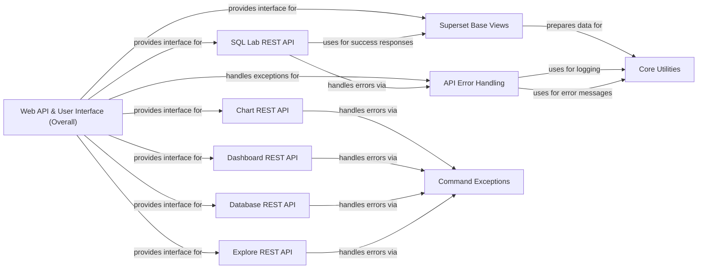

## Component Details

This graph illustrates the core components of the Web API & User Interface subsystem in Superset. It outlines how incoming HTTP requests are processed, how the user interface is rendered, and how various RESTful APIs expose functionalities for charts, dashboards, databases, and SQL Lab. The system emphasizes centralized error handling and leverages shared utility functions for common tasks.

### Web API & User Interface (Overall)
This overarching component provides the external interface for Superset, encompassing both the rendering of the user interface and the exposure of RESTful APIs. It serves as the primary interaction point for users, translating user requests into internal system operations and presenting data back to the user.

**Related Classes/Methods**:

- <a href="https://github.com/apache/superset/blob/master/superset/views/base.py#L208-L222" target="_blank" rel="noopener noreferrer">`superset.views.base.BaseSupersetView:render_app_template` (208:222)</a>
- <a href="https://github.com/apache/superset/blob/master/superset/views/base.py#L131-L132" target="_blank" rel="noopener noreferrer">`superset.views.base.json_success` (131:132)</a>
- <a href="https://github.com/apache/superset/blob/master/superset/views/error_handling.py#L90-L129" target="_blank" rel="noopener noreferrer">`superset.views.error_handling:handle_api_exception` (90:129)</a>
- <a href="https://github.com/apache/superset/blob/master/superset/charts/api.py#L299-L353" target="_blank" rel="noopener noreferrer">`superset.charts.api.ChartRestApi:post` (299:353)</a>
- <a href="https://github.com/apache/superset/blob/master/superset/dashboards/api.py#L338-L376" target="_blank" rel="noopener noreferrer">`superset.dashboards.api.DashboardRestApi:get` (338:376)</a>
- <a href="https://github.com/apache/superset/blob/master/superset/databases/api.py#L493-L565" target="_blank" rel="noopener noreferrer">`superset.databases.api.DatabaseRestApi:put` (493:565)</a>
- <a href="https://github.com/apache/superset/blob/master/superset/sqllab/api.py#L359-L421" target="_blank" rel="noopener noreferrer">`superset.sqllab.api.SqlLabRestApi:execute_sql_query` (359:421)</a>
- <a href="https://github.com/apache/superset/blob/master/superset/explore/api.py#L55-L135" target="_blank" rel="noopener noreferrer">`superset.explore.api.ExploreRestApi:get` (55:135)</a>
- <a href="https://github.com/apache/superset/blob/master/superset/views/base_api.py#L249-L250" target="_blank" rel="noopener noreferrer">`superset.views.base_api.BaseSupersetApi` (249:250)</a>
- <a href="https://github.com/apache/superset/blob/master/superset/views/base_api.py#L253-L681" target="_blank" rel="noopener noreferrer">`superset.views.base_api.BaseSupersetModelRestApi` (253:681)</a>

### Superset Base Views
This component handles the foundational rendering of Superset's web application templates, including bootstrapping user-specific and common application data for the frontend, and providing utility functions for JSON responses.

**Related Classes/Methods**:

- <a href="https://github.com/apache/superset/blob/master/superset/views/base.py#L199-L222" target="_blank" rel="noopener noreferrer">`superset.views.base.BaseSupersetView` (199:222)</a>
- <a href="https://github.com/apache/superset/blob/master/superset/views/base.py#L131-L132" target="_blank" rel="noopener noreferrer">`superset.views.base.json_success` (131:132)</a>
- <a href="https://github.com/apache/superset/blob/master/superset/views/base.py#L349-L353" target="_blank" rel="noopener noreferrer">`superset.views.base.common_bootstrap_payload` (349:353)</a>
- <a href="https://github.com/apache/superset/blob/master/superset/views/utils.py#L71-L101" target="_blank" rel="noopener noreferrer">`superset.views.utils.bootstrap_user_data` (71:101)</a>

### API Error Handling
This component provides a centralized mechanism for catching and standardizing API exceptions, converting them into consistent JSON error responses with appropriate logging.

**Related Classes/Methods**:

- <a href="https://github.com/apache/superset/blob/master/superset/views/error_handling.py#L90-L129" target="_blank" rel="noopener noreferrer">`superset.views.error_handling.handle_api_exception` (90:129)</a>
- <a href="https://github.com/apache/superset/blob/master/superset/views/error_handling.py#L69-L87" target="_blank" rel="noopener noreferrer">`superset.views.error_handling.json_error_response` (69:87)</a>
- <a href="https://github.com/apache/superset/blob/master/superset/utils/log.py#L75-L90" target="_blank" rel="noopener noreferrer">`superset.utils.log.get_logger_from_status` (75:90)</a>
- <a href="https://github.com/apache/superset/blob/master/superset/utils/core.py#L419-L439" target="_blank" rel="noopener noreferrer">`superset.utils.core.error_msg_from_exception` (419:439)</a>

### Chart REST API
This component manages the lifecycle of charts (slices) through a RESTful interface, supporting creation, updates, deletion, export, and other chart-related operations.

**Related Classes/Methods**:

- <a href="https://github.com/apache/superset/blob/master/superset/charts/api.py#L107-L1153" target="_blank" rel="noopener noreferrer">`superset.charts.api.ChartRestApi` (107:1153)</a>

### Dashboard REST API
This component offers RESTful endpoints for retrieving, creating, updating, deleting, and managing dashboards, including their associated charts and datasets.

**Related Classes/Methods**:

- <a href="https://github.com/apache/superset/blob/master/superset/dashboards/api.py#L161-L1830" target="_blank" rel="noopener noreferrer">`superset.dashboards.api.DashboardRestApi` (161:1830)</a>

### Database REST API
This component exposes RESTful endpoints for managing database connections, including testing connectivity, retrieving schemas and tables, and handling SSH tunnel configurations.

**Related Classes/Methods**:

- <a href="https://github.com/apache/superset/blob/master/superset/databases/api.py#L146-L2100" target="_blank" rel="noopener noreferrer">`superset.databases.api.DatabaseRestApi` (146:2100)</a>

### SQL Lab REST API
This component provides endpoints for executing arbitrary SQL queries, estimating query costs, formatting SQL, and retrieving query results within the SQL Lab environment.

**Related Classes/Methods**:

- <a href="https://github.com/apache/superset/blob/master/superset/sqllab/api.py#L72-L461" target="_blank" rel="noopener noreferrer">`superset.sqllab.api.SqlLabRestApi` (72:461)</a>

### Explore REST API
This component handles the retrieval of data and metadata required for the Explore page, which is the primary interface for chart creation and editing.

**Related Classes/Methods**:

- <a href="https://github.com/apache/superset/blob/master/superset/explore/api.py#L39-L135" target="_blank" rel="noopener noreferrer">`superset.explore.api.ExploreRestApi` (39:135)</a>

### Command Exceptions
This component defines a hierarchy of exceptions used across the command layer to provide structured error information, particularly for invalid command parameters and other command-related failures.

**Related Classes/Methods**:

- <a href="https://github.com/apache/superset/blob/master/superset/commands/exceptions.py#L54-L80" target="_blank" rel="noopener noreferrer">`superset.commands.exceptions.CommandInvalidError` (54:80)</a>

### Core Utilities
This component provides fundamental utility functions used across the application for common tasks such as error message formatting, logging, and general data manipulation.

**Related Classes/Methods**:

- <a href="https://github.com/apache/superset/blob/master/superset/utils/core.py#L419-L439" target="_blank" rel="noopener noreferrer">`superset.utils.core.error_msg_from_exception` (419:439)</a>
- <a href="https://github.com/apache/superset/blob/master/superset/utils/log.py#L75-L90" target="_blank" rel="noopener noreferrer">`superset.utils.log.get_logger_from_status` (75:90)</a>

### [FAQ](https://github.com/CodeBoarding/GeneratedOnBoardings/tree/main?tab=readme-ov-file#faq)