```mermaid
graph LR
    Application_Core_Infrastructure["Application Core & Infrastructure"]
    Web_API_User_Interface["Web API & User Interface"]
    Business_Logic_Commands["Business Logic & Commands"]
    Data_Persistence_Database_Integration["Data Persistence & Database Integration"]
    SQL_Query_Data_Processing["SQL Query & Data Processing"]
    Security_Access_Control["Security & Access Control"]
    Asynchronous_Tasks_Reporting["Asynchronous Tasks & Reporting"]
    System_Management_Data_Lifecycle["System Management & Data Lifecycle"]
    Tagging_System["Tagging System"]
    Application_Core_Infrastructure -- "initializes and configures" --> Web_API_User_Interface
    Application_Core_Infrastructure -- "initializes and configures" --> Data_Persistence_Database_Integration
    Application_Core_Infrastructure -- "initializes and configures" --> Security_Access_Control
    Application_Core_Infrastructure -- "initializes and configures" --> Asynchronous_Tasks_Reporting
    Application_Core_Infrastructure -- "provides services to" --> Web_API_User_Interface
    Application_Core_Infrastructure -- "provides services to" --> Data_Persistence_Database_Integration
    Application_Core_Infrastructure -- "provides services to" --> SQL_Query_Data_Processing
    Application_Core_Infrastructure -- "provides services to" --> Business_Logic_Commands
    Application_Core_Infrastructure -- "provides services to" --> Security_Access_Control
    Application_Core_Infrastructure -- "provides services to" --> Asynchronous_Tasks_Reporting
    Application_Core_Infrastructure -- "provides services to" --> System_Management_Data_Lifecycle
    Application_Core_Infrastructure -- "provides services to" --> Tagging_System
    Web_API_User_Interface -- "invokes" --> Business_Logic_Commands
    Web_API_User_Interface -- "enforces access via" --> Security_Access_Control
    Web_API_User_Interface -- "displays data from" --> SQL_Query_Data_Processing
    Web_API_User_Interface -- "interacts with" --> Tagging_System
    Business_Logic_Commands -- "executes operations by interacting with" --> Data_Persistence_Database_Integration
    Business_Logic_Commands -- "uses for SQL manipulation" --> SQL_Query_Data_Processing
    Business_Logic_Commands -- "triggers background tasks in" --> Asynchronous_Tasks_Reporting
    Business_Logic_Commands -- "enforces access via" --> Security_Access_Control
    Data_Persistence_Database_Integration -- "provides data to" --> SQL_Query_Data_Processing
    Data_Persistence_Database_Integration -- "stores data for" --> Business_Logic_Commands
    Data_Persistence_Database_Integration -- "is configured by" --> System_Management_Data_Lifecycle
    SQL_Query_Data_Processing -- "executes queries on" --> Data_Persistence_Database_Integration
    SQL_Query_Data_Processing -- "applies rules from" --> Security_Access_Control
    Security_Access_Control -- "enforces permissions on data accessed via" --> Data_Persistence_Database_Integration
    Security_Access_Control -- "applies Row-Level Security using" --> SQL_Query_Data_Processing
    Security_Access_Control -- "manages" --> Web_API_User_Interface
    Asynchronous_Tasks_Reporting -- "executes tasks from" --> Business_Logic_Commands
    Asynchronous_Tasks_Reporting -- "retrieves data from" --> Data_Persistence_Database_Integration
    Asynchronous_Tasks_Reporting -- "sends notifications via" --> Web_API_User_Interface
    System_Management_Data_Lifecycle -- "modifies" --> Data_Persistence_Database_Integration
    System_Management_Data_Lifecycle -- "uses" --> Business_Logic_Commands
    Tagging_System -- "manages data in" --> Data_Persistence_Database_Integration
    click Application_Core_Infrastructure href "https://github.com/CodeBoarding/GeneratedOnBoardings/blob/main/superset/Application Core & Infrastructure.md" "Details"
    click Web_API_User_Interface href "https://github.com/CodeBoarding/GeneratedOnBoardings/blob/main/superset/Web API & User Interface.md" "Details"
    click Business_Logic_Commands href "https://github.com/CodeBoarding/GeneratedOnBoardings/blob/main/superset/Business Logic & Commands.md" "Details"
    click Data_Persistence_Database_Integration href "https://github.com/CodeBoarding/GeneratedOnBoardings/blob/main/superset/Data Persistence & Database Integration.md" "Details"
    click SQL_Query_Data_Processing href "https://github.com/CodeBoarding/GeneratedOnBoardings/blob/main/superset/SQL Query & Data Processing.md" "Details"
    click Security_Access_Control href "https://github.com/CodeBoarding/GeneratedOnBoardings/blob/main/superset/Security & Access Control.md" "Details"
    click Asynchronous_Tasks_Reporting href "https://github.com/CodeBoarding/GeneratedOnBoardings/blob/main/superset/Asynchronous Tasks & Reporting.md" "Details"
    click System_Management_Data_Lifecycle href "https://github.com/CodeBoarding/GeneratedOnBoardings/blob/main/superset/System Management & Data Lifecycle.md" "Details"
    click Tagging_System href "https://github.com/CodeBoarding/GeneratedOnBoardings/blob/main/superset/Tagging System.md" "Details"
```

## Component Details

The Superset architecture is designed around a modular and extensible structure, facilitating data exploration, visualization, and dashboarding. The core flow involves application initialization, followed by user interaction through the Web API & User Interface. Business Logic & Commands process these interactions, often relying on the Data Persistence & Database Integration layer for data storage and retrieval. SQL Query & Data Processing handles the complexities of generating and executing SQL queries, including security considerations like Row-Level Security. Security & Access Control is paramount, ensuring proper authentication and authorization across all components. Asynchronous Tasks & Reporting manages background operations and scheduled reports, while System Management & Data Lifecycle provides tools for administrative tasks like migrations and import/export. The Tagging System allows for better organization and discovery of assets.

### Application Core & Infrastructure
Manages the fundamental setup of the Superset application, including configuration, logging, and core services. It also provides common utility functions, temporary data caching, and distributed locking mechanisms essential for application stability and performance.

**Related Classes/Methods**:

- <a href="https://github.com/apache/superset/blob/master/superset/app.py#L41-L76" target="_blank" rel="noopener noreferrer">`superset.app.create_app` (41:76)</a>
- `superset.initialization.SupersetAppInitializer:init_app` (full file reference)
- `superset.initialization.SupersetAppInitializer:init_app_in_ctx` (full file reference)
- `superset.initialization.SupersetAppInitializer:configure_fab` (full file reference)
- `superset.initialization.SupersetAppInitializer:configure_logging` (full file reference)
- `superset.initialization.SupersetAppInitializer:configure_feature_flags` (full file reference)
- <a href="https://github.com/apache/superset/blob/master/superset/utils/json.py#L187-L228" target="_blank" rel="noopener noreferrer">`superset.utils.json.dumps` (187:228)</a>
- <a href="https://github.com/apache/superset/blob/master/superset/utils/core.py#L1265-L1280" target="_blank" rel="noopener noreferrer">`superset.utils.core.get_user_id` (1265:1280)</a>
- <a href="https://github.com/apache/superset/blob/master/superset/utils/date_parser.py#L314-L529" target="_blank" rel="noopener noreferrer">`superset.utils.date_parser.get_since_until` (314:529)</a>
- <a href="https://github.com/apache/superset/blob/master/superset/utils/hashing.py#L27-L36" target="_blank" rel="noopener noreferrer">`superset.utils.hashing.md5_sha_from_dict` (27:36)</a>
- <a href="https://github.com/apache/superset/blob/master/superset/utils/decorators.py#L239-L279" target="_blank" rel="noopener noreferrer">`superset.utils.decorators.transaction` (239:279)</a>
- <a href="https://github.com/apache/superset/blob/master/superset/utils/csv.py#L67-L81" target="_blank" rel="noopener noreferrer">`superset.utils.csv.df_to_escaped_csv` (67:81)</a>
- <a href="https://github.com/apache/superset/blob/master/superset/utils/screenshots.py#L171-L176" target="_blank" rel="noopener noreferrer">`superset.utils.screenshots.BaseScreenshot:get_screenshot` (171:176)</a>
- <a href="https://github.com/apache/superset/blob/master/superset/utils/rls.py#L32-L66" target="_blank" rel="noopener noreferrer">`superset.utils.rls.apply_rls` (32:66)</a>
- <a href="https://github.com/apache/superset/blob/master/superset/utils/database.py#L66-L67" target="_blank" rel="noopener noreferrer">`superset.utils.database.get_example_database` (66:67)</a>
- <a href="https://github.com/apache/superset/blob/master/superset/commands/explore/form_data/create.py#L40-L68" target="_blank" rel="noopener noreferrer">`superset.commands.explore.form_data.create.CreateFormDataCommand:run` (40:68)</a>
- <a href="https://github.com/apache/superset/blob/master/superset/commands/temporary_cache/get.py#L34-L39" target="_blank" rel="noopener noreferrer">`superset.commands.temporary_cache.get.GetTemporaryCacheCommand:run` (34:39)</a>
- <a href="https://github.com/apache/superset/blob/master/superset/temporary_cache/api.py#L70-L87" target="_blank" rel="noopener noreferrer">`superset.temporary_cache.api.TemporaryCacheRestApi:post` (70:87)</a>
- <a href="https://github.com/apache/superset/blob/master/superset/utils/cache_manager.py#L89-L101" target="_blank" rel="noopener noreferrer">`superset.utils.cache_manager.CacheManager:init_app` (89:101)</a>
- `superset.distributed_lock.KeyValueDistributedLock` (full file reference)
- <a href="https://github.com/apache/superset/blob/master/superset/commands/distributed_lock/create.py#L56-L64" target="_blank" rel="noopener noreferrer">`superset.commands.distributed_lock.create.CreateDistributedLock:run` (56:64)</a>
- <a href="https://github.com/apache/superset/blob/master/superset/commands/distributed_lock/delete.py#L48-L49" target="_blank" rel="noopener noreferrer">`superset.commands.distributed_lock.delete.DeleteDistributedLock:run` (48:49)</a>
- <a href="https://github.com/apache/superset/blob/master/superset/distributed_lock/utils.py#L44-L45" target="_blank" rel="noopener noreferrer">`superset.distributed_lock.utils:get_key` (44:45)</a>

### Web API & User Interface
Provides the external interface for Superset, handling incoming HTTP requests, rendering the user interface, and exposing RESTful APIs for various functionalities. It serves as the primary interaction point for users.

**Related Classes/Methods**:

- <a href="https://github.com/apache/superset/blob/master/superset/views/base.py#L208-L222" target="_blank" rel="noopener noreferrer">`superset.views.base.BaseSupersetView:render_app_template` (208:222)</a>
- <a href="https://github.com/apache/superset/blob/master/superset/views/base.py#L131-L132" target="_blank" rel="noopener noreferrer">`superset.views.base.json_success` (131:132)</a>
- <a href="https://github.com/apache/superset/blob/master/superset/views/error_handling.py#L90-L129" target="_blank" rel="noopener noreferrer">`superset.views.error_handling:handle_api_exception` (90:129)</a>
- <a href="https://github.com/apache/superset/blob/master/superset/charts/api.py#L299-L353" target="_blank" rel="noopener noreferrer">`superset.charts.api.ChartRestApi:post` (299:353)</a>
- <a href="https://github.com/apache/superset/blob/master/superset/dashboards/api.py#L338-L376" target="_blank" rel="noopener noreferrer">`superset.dashboards.api.DashboardRestApi:get` (338:376)</a>
- <a href="https://github.com/apache/superset/blob/master/superset/databases/api.py#L493-L565" target="_blank" rel="noopener noreferrer">`superset.databases.api.DatabaseRestApi:put` (493:565)</a>
- <a href="https://github.com/apache/superset/blob/master/superset/sqllab/api.py#L359-L421" target="_blank" rel="noopener noreferrer">`superset.sqllab.api.SqlLabRestApi:execute_sql_query` (359:421)</a>
- <a href="https://github.com/apache/superset/blob/master/superset/explore/api.py#L55-L135" target="_blank" rel="noopener noreferrer">`superset.explore.api.ExploreRestApi:get` (55:135)</a>

### Business Logic & Commands
Implements the core business rules and operations for managing Superset entities like charts, dashboards, and databases. It uses a command pattern to encapsulate actions and orchestrate interactions with data access and other services.

**Related Classes/Methods**:

- <a href="https://github.com/apache/superset/blob/master/superset/commands/base.py#L48-L58" target="_blank" rel="noopener noreferrer">`superset.commands.base.CreateMixin:populate_owners` (48:58)</a>
- <a href="https://github.com/apache/superset/blob/master/superset/commands/chart/create.py#L47-L51" target="_blank" rel="noopener noreferrer">`superset.commands.chart.create.CreateChartCommand:run` (47:51)</a>
- <a href="https://github.com/apache/superset/blob/master/superset/commands/dashboard/update.py#L57-L72" target="_blank" rel="noopener noreferrer">`superset.commands.dashboard.update.UpdateDashboardCommand:run` (57:72)</a>
- <a href="https://github.com/apache/superset/blob/master/superset/commands/database/delete.py#L44-L47" target="_blank" rel="noopener noreferrer">`superset.commands.database.delete.DeleteDatabaseCommand:run` (44:47)</a>
- <a href="https://github.com/apache/superset/blob/master/superset/commands/sql_lab/execute.py#L95-L125" target="_blank" rel="noopener noreferrer">`superset.commands.sql_lab.execute.ExecuteSqlCommand:run` (95:125)</a>
- <a href="https://github.com/apache/superset/blob/master/superset/commands/report/create.py#L53-L55" target="_blank" rel="noopener noreferrer">`superset.commands.report.create.CreateReportScheduleCommand:run` (53:55)</a>
- <a href="https://github.com/apache/superset/blob/master/superset/commands/security/create.py#L40-L42" target="_blank" rel="noopener noreferrer">`superset.commands.security.create.CreateRLSRuleCommand:run` (40:42)</a>

### Data Persistence & Database Integration
Handles all interactions with various database systems, including defining ORM models, providing a data access object (DAO) layer for CRUD operations, and managing database-specific configurations and behaviors (e.g., SQL dialects, connection parameters).

**Related Classes/Methods**:

- <a href="https://github.com/apache/superset/blob/master/superset/daos/base.py#L53-L72" target="_blank" rel="noopener noreferrer">`superset.daos.base.BaseDAO.find_by_id` (53:72)</a>
- <a href="https://github.com/apache/superset/blob/master/superset/daos/chart.py#L54-L64" target="_blank" rel="noopener noreferrer">`superset.daos.chart.ChartDAO:add_favorite` (54:64)</a>
- <a href="https://github.com/apache/superset/blob/master/superset/daos/dashboard.py#L284-L321" target="_blank" rel="noopener noreferrer">`superset.daos.dashboard.DashboardDAO:copy_dashboard` (284:321)</a>
- <a href="https://github.com/apache/superset/blob/master/superset/daos/database.py#L41-L62" target="_blank" rel="noopener noreferrer">`superset.daos.database.DatabaseDAO:update` (41:62)</a>
- <a href="https://github.com/apache/superset/blob/master/superset/daos/dataset.py#L177-L203" target="_blank" rel="noopener noreferrer">`superset.daos.dataset.DatasetDAO:update` (177:203)</a>
- <a href="https://github.com/apache/superset/blob/master/superset/daos/query.py#L60-L79" target="_blank" rel="noopener noreferrer">`superset.daos.query.QueryDAO:stop_query` (60:79)</a>
- <a href="https://github.com/apache/superset/blob/master/superset/daos/key_value.py#L84-L111" target="_blank" rel="noopener noreferrer">`superset.daos.key_value.KeyValueDAO:create_entry` (84:111)</a>
- <a href="https://github.com/apache/superset/blob/master/superset/models/core.py#L409-L464" target="_blank" rel="noopener noreferrer">`superset.models.core.Database:get_sqla_engine` (409:464)</a>
- <a href="https://github.com/apache/superset/blob/master/superset/models/dashboard.py#L360-L428" target="_blank" rel="noopener noreferrer">`superset.models.dashboard.Dashboard:export_dashboards` (360:428)</a>
- <a href="https://github.com/apache/superset/blob/master/superset/models/slice.py#L289-L298" target="_blank" rel="noopener noreferrer">`superset.models.slice.Slice:get_query_context` (289:298)</a>
- <a href="https://github.com/apache/superset/blob/master/superset/models/sql_lab.py#L164-L194" target="_blank" rel="noopener noreferrer">`superset.models.sql_lab.Query:to_dict` (164:194)</a>
- <a href="https://github.com/apache/superset/blob/master/superset/models/helpers.py#L252-L368" target="_blank" rel="noopener noreferrer">`superset.models.helpers.ImportExportMixin:import_from_dict` (252:368)</a>
- <a href="https://github.com/apache/superset/blob/master/superset/db_engine_specs/base.py#L1195-L1206" target="_blank" rel="noopener noreferrer">`superset.db_engine_specs.base.BaseEngineSpec:convert_dttm` (1195:1206)</a>
- <a href="https://github.com/apache/superset/blob/master/superset/db_engine_specs/base.py#L971-L1008" target="_blank" rel="noopener noreferrer">`superset.db_engine_specs.base.BaseEngineSpec:fetch_data` (971:1008)</a>
- <a href="https://github.com/apache/superset/blob/master/superset/db_engine_specs/base.py#L1366-L1391" target="_blank" rel="noopener noreferrer">`superset.db_engine_specs.base.BaseEngineSpec:get_table_names` (1366:1391)</a>
- `superset.db_engine_specs.presto.PrestoEngineSpec:get_columns` (full file reference)
- <a href="https://github.com/apache/superset/blob/master/superset/db_engine_specs/bigquery.py#L502-L538" target="_blank" rel="noopener noreferrer">`superset.db_engine_specs.bigquery.BigQueryEngineSpec:estimate_query_cost` (502:538)</a>
- <a href="https://github.com/apache/superset/blob/master/superset/db_engine_specs/snowflake.py#L327-L351" target="_blank" rel="noopener noreferrer">`superset.db_engine_specs.snowflake.SnowflakeEngineSpec:validate_parameters` (327:351)</a>

### SQL Query & Data Processing
Encompasses the entire lifecycle of SQL queries within Superset, from parsing and sanitization to execution, result retrieval, and post-processing for visualization. It also includes the application of Row-Level Security (RLS) and handling of SQL Lab functionalities.

**Related Classes/Methods**:

- <a href="https://github.com/apache/superset/blob/master/superset/sql_lab.py#L171-L198" target="_blank" rel="noopener noreferrer">`superset.sql_lab.get_sql_results` (171:198)</a>
- <a href="https://github.com/apache/superset/blob/master/superset/sql_lab.py#L363-L617" target="_blank" rel="noopener noreferrer">`superset.sql_lab.execute_sql_statements` (363:617)</a>
- <a href="https://github.com/apache/superset/blob/master/superset/sqllab/sqllab_execution_context.py#L149-L183" target="_blank" rel="noopener noreferrer">`superset.sqllab.sqllab_execution_context.SqlJsonExecutionContext:create_query` (149:183)</a>
- <a href="https://github.com/apache/superset/blob/master/superset/sqllab/sql_json_executer.py#L87-L116" target="_blank" rel="noopener noreferrer">`superset.sqllab.sql_json_executer.SynchronousSqlJsonExecutor:execute` (87:116)</a>
- <a href="https://github.com/apache/superset/blob/master/superset/views/sqllab.py#L43-L49" target="_blank" rel="noopener noreferrer">`superset.views.sqllab.SqllabView:root` (43:49)</a>
- <a href="https://github.com/apache/superset/blob/master/superset/views/sql_lab/views.py#L57-L85" target="_blank" rel="noopener noreferrer">`superset.views.sql_lab.views.TabStateView:post` (57:85)</a>
- <a href="https://github.com/apache/superset/blob/master/superset/sql/parse.py#L1194-L1201" target="_blank" rel="noopener noreferrer">`superset.sql.parse.SQLScript.format` (1194:1201)</a>
- <a href="https://github.com/apache/superset/blob/master/superset/sql/parse.py#L1357-L1421" target="_blank" rel="noopener noreferrer">`superset.sql.parse.extract_tables_from_jinja_sql` (1357:1421)</a>
- <a href="https://github.com/apache/superset/blob/master/superset/sql/parse.py#L1424-L1431" target="_blank" rel="noopener noreferrer">`superset.sql.parse.sanitize_clause` (1424:1431)</a>
- <a href="https://github.com/apache/superset/blob/master/superset/sql/parse.py#L146-L165" target="_blank" rel="noopener noreferrer">`superset.sql.parse.RLSTransformer:get_predicate` (146:165)</a>
- <a href="https://github.com/apache/superset/blob/master/superset/sql/parse.py#L678-L688" target="_blank" rel="noopener noreferrer">`superset.sql.parse.SQLStatement:optimize` (678:688)</a>
- <a href="https://github.com/apache/superset/blob/master/superset/common/query_object.py#L112-L166" target="_blank" rel="noopener noreferrer">`superset.common.query_object.QueryObject:__init__` (112:166)</a>
- <a href="https://github.com/apache/superset/blob/master/superset/common/query_object.py#L443-L470" target="_blank" rel="noopener noreferrer">`superset.common.query_object.QueryObject:exec_post_processing` (443:470)</a>
- <a href="https://github.com/apache/superset/blob/master/superset/common/query_context_processor.py#L130-L231" target="_blank" rel="noopener noreferrer">`superset.common.query_context_processor.QueryContextProcessor:get_df_payload` (130:231)</a>
- <a href="https://github.com/apache/superset/blob/master/superset/common/query_context_factory.py#L47-L105" target="_blank" rel="noopener noreferrer">`superset.common.query_context_factory.QueryContextFactory:create` (47:105)</a>
- <a href="https://github.com/apache/superset/blob/master/superset/charts/client_processing.py#L312-L387" target="_blank" rel="noopener noreferrer">`superset.charts.client_processing:apply_client_processing` (312:387)</a>

### Security & Access Control
Manages user authentication, role-based access control (RBAC), and fine-grained permissions across all Superset resources. It also handles guest access and permalink generation for secure content sharing.

**Related Classes/Methods**:

- <a href="https://github.com/apache/superset/blob/master/superset/security/manager.py#L510-L522" target="_blank" rel="noopener noreferrer">`superset.security.manager.SupersetSecurityManager:can_access_database` (510:522)</a>
- <a href="https://github.com/apache/superset/blob/master/superset/security/manager.py#L2200-L2456" target="_blank" rel="noopener noreferrer">`superset.security.manager.SupersetSecurityManager:raise_for_access` (2200:2456)</a>
- <a href="https://github.com/apache/superset/blob/master/superset/security/manager.py#L1099-L1124" target="_blank" rel="noopener noreferrer">`superset.security.manager.SupersetSecurityManager:sync_role_definitions` (1099:1124)</a>
- <a href="https://github.com/apache/superset/blob/master/superset/security/manager.py#L2695-L2707" target="_blank" rel="noopener noreferrer">`superset.security.manager.SupersetSecurityManager:is_guest_user` (2695:2707)</a>
- <a href="https://github.com/apache/superset/blob/master/superset/security/analytics_db_safety.py#L37-L58" target="_blank" rel="noopener noreferrer">`superset.security.analytics_db_safety:check_sqlalchemy_uri` (37:58)</a>
- <a href="https://github.com/apache/superset/blob/master/superset/row_level_security/api.py#L158-L224" target="_blank" rel="noopener noreferrer">`superset.row_level_security.api.RLSRestApi:post` (158:224)</a>
- <a href="https://github.com/apache/superset/blob/master/superset/security/manager.py#L2617-L2640" target="_blank" rel="noopener noreferrer">`superset.security.manager.SupersetSecurityManager:create_guest_access_token` (2617:2640)</a>
- <a href="https://github.com/apache/superset/blob/master/superset/security/manager.py#L2642-L2673" target="_blank" rel="noopener noreferrer">`superset.security.manager.SupersetSecurityManager:get_guest_user_from_request` (2642:2673)</a>
- <a href="https://github.com/apache/superset/blob/master/superset/commands/explore/permalink/create.py#L56-L74" target="_blank" rel="noopener noreferrer">`superset.commands.explore.permalink.create.CreateExplorePermalinkCommand:run` (56:74)</a>
- <a href="https://github.com/apache/superset/blob/master/superset/commands/dashboard/permalink/get.py#L42-L60" target="_blank" rel="noopener noreferrer">`superset.commands.dashboard.permalink.get.GetDashboardPermalinkCommand:run` (42:60)</a>
- <a href="https://github.com/apache/superset/blob/master/superset/key_value/shared_entries.py#L42-L48" target="_blank" rel="noopener noreferrer">`superset.key_value.shared_entries:get_permalink_salt` (42:48)</a>

### Asynchronous Tasks & Reporting
Manages background jobs, scheduled reports, and alerts. It leverages a task queue for offloading long-running processes and handles the generation and delivery of notifications via various channels (e.g., email, Slack).

**Related Classes/Methods**:

- <a href="https://github.com/apache/superset/blob/master/superset/tasks/scheduler.py#L44-L78" target="_blank" rel="noopener noreferrer">`superset.tasks.scheduler:scheduler` (44:78)</a>
- <a href="https://github.com/apache/superset/blob/master/superset/tasks/thumbnails.py#L38-L71" target="_blank" rel="noopener noreferrer">`superset.tasks.thumbnails.cache_chart_thumbnail` (38:71)</a>
- <a href="https://github.com/apache/superset/blob/master/superset/tasks/async_queries.py#L83-L113" target="_blank" rel="noopener noreferrer">`superset.tasks.async_queries:load_chart_data_into_cache` (83:113)</a>
- <a href="https://github.com/apache/superset/blob/master/superset/async_events/async_query_manager.py#L237-L257" target="_blank" rel="noopener noreferrer">`superset.async_events.async_query_manager.AsyncQueryManager:submit_chart_data_job` (237:257)</a>
- <a href="https://github.com/apache/superset/blob/master/superset/tasks/scheduler.py#L82-L113" target="_blank" rel="noopener noreferrer">`superset.tasks.scheduler:execute` (82:113)</a>
- <a href="https://github.com/apache/superset/blob/master/superset/reports/notifications/email.py#L231-L262" target="_blank" rel="noopener noreferrer">`superset.reports.notifications.email.EmailNotification:send` (231:262)</a>
- <a href="https://github.com/apache/superset/blob/master/superset/reports/notifications/slack.py#L88-L135" target="_blank" rel="noopener noreferrer">`superset.reports.notifications.slack.SlackNotification:send` (88:135)</a>
- <a href="https://github.com/apache/superset/blob/master/superset/reports/notifications/slackv2.py#L82-L132" target="_blank" rel="noopener noreferrer">`superset.reports.notifications.slackv2.SlackV2Notification:send` (82:132)</a>
- <a href="https://github.com/apache/superset/blob/master/superset/commands/report/execute.py#L618-L625" target="_blank" rel="noopener noreferrer">`superset.commands.report.execute.BaseReportState:send` (618:625)</a>
- <a href="https://github.com/apache/superset/blob/master/superset/commands/report/alert.py#L62-L90" target="_blank" rel="noopener noreferrer">`superset.commands.report.alert.AlertCommand:run` (62:90)</a>

### System Management & Data Lifecycle
Provides tools and functionalities for administrative tasks, including database schema migrations, command-line utilities for data loading and management, and a framework for importing and exporting Superset assets.

**Related Classes/Methods**:

- `superset.migrations.versions.2022-03_04_09_59_6766938c6065_add_key_value_store:upgrade` (full file reference)
- <a href="https://github.com/apache/superset/blob/master/superset/migrations/shared/utils.py#L235-L254" target="_blank" rel="noopener noreferrer">`superset.migrations.shared.utils.create_table` (235:254)</a>
- <a href="https://github.com/apache/superset/blob/master/superset/migrations/shared/constraints.py#L39-L73" target="_blank" rel="noopener noreferrer">`superset.migrations.shared.constraints.redefine` (39:73)</a>
- <a href="https://github.com/apache/superset/blob/master/superset/migrations/shared/security_converge.py#L163-L179" target="_blank" rel="noopener noreferrer">`superset.migrations.shared.security_converge.add_pvms` (163:179)</a>
- <a href="https://github.com/apache/superset/blob/master/superset/migrations/shared/migrate_viz/base.py#L201-L207" target="_blank" rel="noopener noreferrer">`superset.migrations.shared.migrate_viz.base.MigrateViz.upgrade` (201:207)</a>
- <a href="https://github.com/apache/superset/blob/master/superset/cli/examples.py#L108-L115" target="_blank" rel="noopener noreferrer">`superset.cli.examples:load_examples` (108:115)</a>
- <a href="https://github.com/apache/superset/blob/master/superset/cli/importexport.py#L70-L93" target="_blank" rel="noopener noreferrer">`superset.cli.importexport:export_dashboards` (70:93)</a>
- <a href="https://github.com/apache/superset/blob/master/superset/cli/test_db.py#L141-L173" target="_blank" rel="noopener noreferrer">`superset.cli.test_db:test_db` (141:173)</a>
- <a href="https://github.com/apache/superset/blob/master/superset/cli/update.py#L59-L69" target="_blank" rel="noopener noreferrer">`superset.cli.update:sync_tags` (59:69)</a>
- <a href="https://github.com/apache/superset/blob/master/superset/cli/viz_migrations.py#L109-L115" target="_blank" rel="noopener noreferrer">`superset.cli.viz_migrations:upgrade` (109:115)</a>
- <a href="https://github.com/apache/superset/blob/master/superset/commands/export/models.py#L58-L73" target="_blank" rel="noopener noreferrer">`superset.commands.export.models.ExportModelsCommand:run` (58:73)</a>
- `superset.commands.importers.v1.ImportModelsCommand:run` (full file reference)
- <a href="https://github.com/apache/superset/blob/master/superset/commands/importers/v1/utils.py#L216-L222" target="_blank" rel="noopener noreferrer">`superset.commands.importers.v1.utils.get_contents_from_bundle` (216:222)</a>
- <a href="https://github.com/apache/superset/blob/master/superset/importexport/api.py#L52-L92" target="_blank" rel="noopener noreferrer">`superset.importexport.api.ImportExportRestApi:export` (52:92)</a>
- <a href="https://github.com/apache/superset/blob/master/superset/importexport/api.py#L102-L215" target="_blank" rel="noopener noreferrer">`superset.importexport.api.ImportExportRestApi:import_` (102:215)</a>

### Tagging System
Enables users to organize and discover Superset content (charts, dashboards, datasets) through a flexible tagging mechanism, supporting creation, assignment, and retrieval of tags.

**Related Classes/Methods**:

- <a href="https://github.com/apache/superset/blob/master/superset/tags/models.py#L221-L236" target="_blank" rel="noopener noreferrer">`superset.tags.models.ObjectUpdater:after_insert` (221:236)</a>
- <a href="https://github.com/apache/superset/blob/master/superset/tags/api.py#L161-L203" target="_blank" rel="noopener noreferrer">`superset.tags.api.TagRestApi:post` (161:203)</a>
- <a href="https://github.com/apache/superset/blob/master/superset/tags/api.py#L355-L409" target="_blank" rel="noopener noreferrer">`superset.tags.api.TagRestApi:add_objects` (355:409)</a>
- <a href="https://github.com/apache/superset/blob/master/superset/daos/tag.py#L46-L73" target="_blank" rel="noopener noreferrer">`superset.daos.tag.TagDAO:create_custom_tagged_objects` (46:73)</a>
- <a href="https://github.com/apache/superset/blob/master/superset/tags/core.py#L20-L53" target="_blank" rel="noopener noreferrer">`superset.tags.core.register_sqla_event_listeners` (20:53)</a>

### [FAQ](https://github.com/CodeBoarding/GeneratedOnBoardings/tree/main?tab=readme-ov-file#faq)