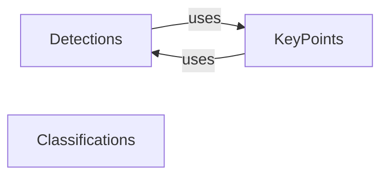

## Component Details

This component, `Core Data Structures`, provides the foundational, standardized data models (`Detections`, `KeyPoints`, `Classifications`) that represent various computer vision outputs. These structures are central to the library, ensuring consistent data exchange and interoperability across all functionalities. They encapsulate raw results (e.g., bounding boxes, masks, class IDs, confidence scores) and offer methods for basic manipulation. These three components (`Detections`, `KeyPoints`, `Classifications`) are fundamental to the `supervision` library because they establish the **core data models** for the most prevalent computer vision tasks: object detection/segmentation, keypoint detection/pose estimation, and image classification. They provide a unified and consistent way to represent diverse outputs from a multitude of underlying computer vision models (e.g., YOLO, Ultralytics, Detectron2, SAM, CLIP). This abstraction layer is crucial for interoperability, allowing different parts of the `supervision` library (annotators, trackers, tools, metrics) to work seamlessly with any model output, regardless of its origin or specific format. By defining clear data contracts, these components enable easy integration of new models and facilitate the chaining of different computer vision operations. For instance, the `KeyPoints.as_detections()` method exemplifies how these core structures can interact and feed into each other's functionalities, allowing pose estimation results to be leveraged in object detection contexts. Developers can interact with these simplified, well-defined data structures instead of dealing with varied and often complex raw model outputs. This significantly reduces the complexity of implementing visualization, analysis, and tracking algorithms, as they only need to understand these standardized formats. The inclusion of `data` and `metadata` fields in `Detections` and `KeyPoints` provides a flexible mechanism to attach additional, custom information without altering the core structure, ensuring future extensibility and adaptability to new data types. Almost every other module within `supervision` that processes or generates model outputs will either consume or produce instances of these core data structures. They are the bedrock upon which the entire `supervision` ecosystem is built, ensuring consistency, robustness, and ease of use across the library.

### Detections
The `Detections` component serves as the universal data structure for representing object detection and segmentation results. It encapsulates bounding box coordinates (`xyxy`), optional segmentation masks (`mask`), confidence scores (`confidence`), class identifiers (`class_id`), and tracker IDs (`tracker_id`). Its primary purpose is to provide a standardized, flexible, and extensible format for handling diverse outputs from various computer vision models, enabling seamless integration with other `supervision` functionalities like tracking, annotation, and analysis. It also offers methods for common operations such as non-maximum suppression (NMS), non-maximum merging (NMM), and merging multiple detection sets.

**Related Classes/Methods**:

- <a href="https://github.com/roboflow/supervision/blob/master/supervision/detection/core.py#L49-L1435" target="_blank" rel="noopener noreferrer">`supervision.detection.core.Detections` (49:1435)</a>
- <a href="https://github.com/roboflow/supervision/blob/master/supervision/keypoint/core.py#L711-L773" target="_blank" rel="noopener noreferrer">`supervision.keypoint.core.KeyPoints:as_detections` (711:773)</a>

### KeyPoints
The `KeyPoints` component is designed to standardize the output of keypoint detection and pose estimation models. It stores the `[x, y]` coordinates of multiple keypoints for each detected object (`xy`), along with optional confidence scores (`confidence`) and class IDs (`class_id`). This component ensures a consistent representation of pose data, facilitating its use with keypoint annotators and enabling conversion to bounding box detections when needed.

**Related Classes/Methods**:

- <a href="https://github.com/roboflow/supervision/blob/master/supervision/keypoint/core.py#L15-L773" target="_blank" rel="noopener noreferrer">`supervision.keypoint.core.KeyPoints` (15:773)</a>
- <a href="https://github.com/roboflow/supervision/blob/master/supervision/detection/core.py#L49-L1435" target="_blank" rel="noopener noreferrer">`supervision.detection.core.Detections` (49:1435)</a>

### Classifications
The `Classifications` component provides a standardized data model for representing image classification results. It primarily stores class IDs (`class_id`) and their corresponding confidence scores (`confidence`). This component simplifies the handling and analysis of classification outputs, offering methods to retrieve top-k predictions.

**Related Classes/Methods**:

- <a href="https://github.com/roboflow/supervision/blob/master/supervision/classification/core.py#L28-L187" target="_blank" rel="noopener noreferrer">`supervision.classification.core.Classifications` (28:187)</a>

### [FAQ](https://github.com/CodeBoarding/GeneratedOnBoardings/tree/main?tab=readme-ov-file#faq)