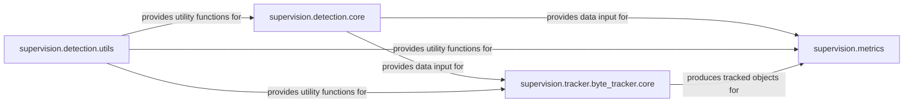

## Component Details

The `Data Processing & Analysis` component is central to the library's intelligence, providing algorithms and utilities for refining, tracking, and evaluating `Core Data Structures`. It transforms and enriches raw detection data, making it suitable for various downstream tasks.

### supervision.detection.core
This module defines the `Detections` data structure, which is the primary representation of detected objects. It also encapsulates methods like `Detections.with_nms` (Non-Maximum Suppression) and `Detections.with_nmm` (Non-Maximum Merging), crucial for refining and consolidating detection results. It acts as a central hub for managing and transforming detection data, serving as the input and output format for many operations within the `Data Processing & Analysis` component.

**Related Classes/Methods**:

- <a href="https://github.com/roboflow/supervision/blob/master/supervision/detection/core.py#L49-L1435" target="_blank" rel="noopener noreferrer">`supervision.detection.core.Detections` (49:1435)</a>
- <a href="https://github.com/roboflow/supervision/blob/master/supervision/detection/core.py#L1322-L1376" target="_blank" rel="noopener noreferrer">`supervision.detection.core.Detections:with_nms` (1322:1376)</a>
- <a href="https://github.com/roboflow/supervision/blob/master/supervision/detection/core.py#L1378-L1435" target="_blank" rel="noopener noreferrer">`supervision.detection.core.Detections:with_nmm` (1378:1435)</a>

### supervision.detection.utils
This utility module provides essential functions for manipulating bounding boxes and masks, including Intersection Over Union (IOU) calculations. These utilities are fundamental for operations like NMS, object tracking, and metric computations, as they enable the comparison and spatial understanding of detection outputs.

**Related Classes/Methods**:

- <a href="https://github.com/roboflow/supervision/blob/master/supervision/detection/utils.py#L0-L0" target="_blank" rel="noopener noreferrer">`supervision.detection.utils` (0:0)</a>
- <a href="https://github.com/roboflow/supervision/blob/master/supervision/detection/utils.py#L50-L80" target="_blank" rel="noopener noreferrer">`supervision.detection.utils:box_iou_batch` (50:80)</a>

### supervision.tracker.byte_tracker.core
This module implements the ByteTrack algorithm, a sophisticated multi-object tracking solution. It takes raw detections (typically `Detections` objects) and associates them over time, providing consistent object identities across video frames. This is vital for applications requiring temporal analysis of objects.

**Related Classes/Methods**:

- <a href="https://github.com/roboflow/supervision/blob/master/supervision/tracker/byte_tracker/core.py#L0-L0" target="_blank" rel="noopener noreferrer">`supervision.tracker.byte_tracker.core` (0:0)</a>
- <a href="https://github.com/roboflow/supervision/blob/master/supervision/tracker/byte_tracker/core.py#L12-L313" target="_blank" rel="noopener noreferrer">`supervision.tracker.byte_tracker.core:ByteTrack` (12:313)</a>

### supervision.metrics
This package is dedicated to evaluating the performance of detection and tracking models. It contains various sub-modules for specific metrics (e.g., F1-Score, Mean Average Precision). These modules rely on the `Detections` object and `detection.utils` for their computations, providing quantitative assessments of model accuracy and effectiveness.

**Related Classes/Methods**:

- `supervision.metrics` (0:0)

### [FAQ](https://github.com/CodeBoarding/GeneratedOnBoardings/tree/main?tab=readme-ov-file#faq)