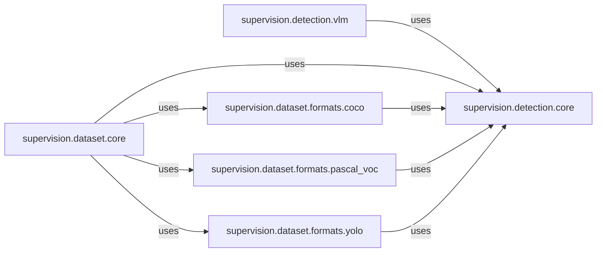

## Component Details

One paragraph explaining the functionality which is represented by this graph. What the main flow is and what is its purpose.

### supervision.detection.core
This module defines the `Detections` class, the library's fundamental data structure for representing object detection results. It acts as a central hub for integrating outputs from various computer vision models (YOLO, SAM, VLMs) by providing static methods to convert their native formats into the unified `Detections` format.

**Related Classes/Methods**: _None_

### supervision.detection.vlm
This module specializes in handling the integration of Vision-Language Models (VLMs). It contains the logic and utilities to parse raw VLM outputs (e.g., from PaliGemma, Qwen-2.5-VL, Florence-2) and transform them into the `Detections` format, ensuring compatibility with the `supervision` library's internal data representation.

**Related Classes/Methods**: _None_

### supervision.dataset.core
This module provides the core functionalities for dataset management and loading. It orchestrates the ingestion of external datasets by leveraging format-specific modules to parse raw data and then converting this parsed data into the library's internal `Detections` structure. It also manages image loading (including lazy loading) and dataset splitting.

**Related Classes/Methods**: _None_

### supervision.dataset.formats.coco
This module is responsible for parsing and loading annotations from the COCO dataset format. It includes functions to convert COCO categories to internal class lists, group annotations by image ID, and transform COCO annotations (including bounding boxes and masks) into `Detections` objects. It also supports saving `Detections` back to COCO format.

**Related Classes/Methods**: _None_

### supervision.dataset.formats.pascal_voc
This module handles the parsing and loading of annotations from the Pascal VOC dataset format. It provides functionalities to convert Pascal VOC XML structures into `Detections` objects, including bounding boxes and optional polygons, and to convert `Detections` back into Pascal VOC XML.

**Related Classes/Methods**: _None_

### supervision.dataset.formats.yolo
This module is dedicated to parsing and loading annotations from the YOLO dataset format. It supports both standard bounding box and oriented bounding box (OBB) formats, as well as masks. It reads YOLO annotation files and the associated `data.yaml` to construct `Detections` objects. It also provides utilities for saving `Detections` to YOLO format.

**Related Classes/Methods**: _None_

### [FAQ](https://github.com/CodeBoarding/GeneratedOnBoardings/tree/main?tab=readme-ov-file#faq)