```mermaid
graph LR
    supervision_detection_line_zone_LineZone["supervision.detection.line_zone.LineZone"]
    supervision_detection_tools_polygon_zone_PolygonZone["supervision.detection.tools.polygon_zone.PolygonZone"]
    supervision_detection_tools_inference_slicer_InferenceSlicer["supervision.detection.tools.inference_slicer.InferenceSlicer"]
    supervision_detection_tools_csv_sink_CSVSink["supervision.detection.tools.csv_sink.CSVSink"]
    supervision_detection_tools_json_sink_JSONSink["supervision.detection.tools.json_sink.JSONSink"]
    supervision_detection_core_Detections["supervision.detection.core.Detections"]
    supervision_validators["supervision.validators"]
    supervision_detection_utils["supervision.detection.utils"]
    supervision_utils_image["supervision.utils.image"]
    supervision_geometry_core["supervision.geometry.core"]
    supervision_detection_line_zone_LineZone -- "processes" --> supervision_detection_core_Detections
    supervision_detection_line_zone_LineZone -- "utilizes" --> supervision_detection_utils
    supervision_detection_tools_polygon_zone_PolygonZone -- "processes" --> supervision_detection_core_Detections
    supervision_detection_tools_polygon_zone_PolygonZone -- "utilizes" --> supervision_geometry_core
    supervision_detection_tools_inference_slicer_InferenceSlicer -- "processes" --> supervision_detection_core_Detections
    supervision_detection_tools_inference_slicer_InferenceSlicer -- "utilizes" --> supervision_utils_image
    supervision_detection_tools_csv_sink_CSVSink -- "consumes" --> supervision_detection_core_Detections
    supervision_detection_tools_json_sink_JSONSink -- "consumes" --> supervision_detection_core_Detections
    supervision_detection_core_Detections -- "validated by" --> supervision_validators
    supervision_detection_utils -- "operates on" --> supervision_detection_core_Detections
    supervision_detection_utils -- "relies on" --> supervision_geometry_core
    supervision_geometry_core -- "provides primitives for" --> supervision_detection_utils
    supervision_geometry_core -- "provides primitives for" --> supervision_detection_tools_polygon_zone_PolygonZone
    supervision_utils_image -- "supports" --> supervision_detection_tools_inference_slicer_InferenceSlicer
```

## Component Details

The `Specialized Tools & Utilities` component is crucial for `supervision` as it encapsulates both high-level, domain-specific functionalities and essential foundational utilities. I've selected the following 10 components because they directly embody these two aspects: Problem-Specific Functionalities: `LineZone`, `PolygonZone`, `InferenceSlicer`, `CSVSink`, and `JSONSink` provide ready-to-use solutions for common computer vision tasks like object counting in defined areas, handling large images, and exporting results. These are the "tools" that users would directly interact with for specific problems. Foundational Internal Support: `Detections`, `validators`, `detection.utils`, `utils.image`, and `geometry.core` form the backbone. `Detections` is the central data structure manipulated by many tools. `validators` ensures data integrity. `detection.utils`, `utils.image`, and `geometry.core` provide the fundamental helper functions and data structures (e.g., for geometry and image manipulation) that the higher-level tools and other parts of the library rely on. Without these foundational elements, the specialized tools would not be able to function effectively or consistently. These components are fundamental because they represent the core capabilities of the `Specialized Tools & Utilities` component, enabling both direct application-level features and robust internal operations.

### supervision.detection.line_zone.LineZone
Defines a virtual line in an image to count objects crossing it, enabling directional counting in video streams. It processes `Detections` objects to determine if bounding box centroids cross the defined line.

**Related Classes/Methods**:

- <a href="https://github.com/roboflow/supervision/blob/master/supervision/detection/line_zone.py#L22-L313" target="_blank" rel="noopener noreferrer">`supervision.detection.line_zone.LineZone` (22:313)</a>

### supervision.detection.tools.polygon_zone.PolygonZone
Defines an arbitrary polygonal region to count objects entering or exiting it. It uses geometric utilities to determine if detection bounding boxes or their centroids fall within the polygon.

**Related Classes/Methods**:

- <a href="https://github.com/roboflow/supervision/blob/master/supervision/detection/tools/polygon_zone.py#L15-L108" target="_blank" rel="noopener noreferrer">`supervision.detection.tools.polygon_zone.PolygonZone` (15:108)</a>

### supervision.detection.tools.inference_slicer.InferenceSlicer
Facilitates processing of large images by slicing them into smaller tiles, running inference on each, and merging results. It handles overlaps and applies non-maximum suppression (NMS) or non-maximum merging (NMM) to consolidate detections.

**Related Classes/Methods**:

- <a href="https://github.com/roboflow/supervision/blob/master/supervision/detection/tools/inference_slicer.py#L50-L287" target="_blank" rel="noopener noreferrer">`supervision.detection.tools.inference_slicer.InferenceSlicer` (50:287)</a>

### supervision.detection.tools.csv_sink.CSVSink
A utility class for saving detection data to a CSV file. It serializes `Detections` objects, including bounding box coordinates and additional attributes, into a structured CSV format.

**Related Classes/Methods**:

- <a href="https://github.com/roboflow/supervision/blob/master/supervision/detection/tools/csv_sink.py#L19-L180" target="_blank" rel="noopener noreferrer">`supervision.detection.tools.csv_sink.CSVSink` (19:180)</a>

### supervision.detection.tools.json_sink.JSONSink
A utility class for saving detection data to a JSON file. It serializes `Detections` objects into a structured JSON format, suitable for programmatic access and data exchange.

**Related Classes/Methods**:

- <a href="https://github.com/roboflow/supervision/blob/master/supervision/detection/tools/json_sink.py#L9-L141" target="_blank" rel="noopener noreferrer">`supervision.detection.tools.json_sink.JSONSink` (9:141)</a>

### supervision.detection.core.Detections
The core data structure representing detected objects in an image or video frame. It encapsulates bounding boxes, confidence scores, class IDs, and optional trackers or masks. Many other components consume or produce instances of this class.

**Related Classes/Methods**:

- <a href="https://github.com/roboflow/supervision/blob/master/supervision/detection/core.py#L49-L1435" target="_blank" rel="noopener noreferrer">`supervision.detection.core.Detections` (49:1435)</a>

### supervision.validators
Responsible for validating the integrity and consistency of detection data. It ensures that fields within a `Detections` object adhere to expected formats, types, and constraints, preventing errors and ensuring reliable processing.

**Related Classes/Methods**:

- `supervision.validators` (0:0)

### supervision.detection.utils
Provides a collection of general-purpose utility functions specifically for manipulating and processing `Detections` data. This includes transformations, comparisons, and calculations related to bounding boxes and detection attributes.

**Related Classes/Methods**:

- <a href="https://github.com/roboflow/supervision/blob/master/supervision/detection/utils.py#L0-L0" target="_blank" rel="noopener noreferrer">`supervision.detection.utils` (0:0)</a>

### supervision.utils.image
Offers a suite of image processing utilities, such as resizing, cropping, and creating image grids. These functions are foundational for preparing images for inference or for visualizing results.

**Related Classes/Methods**:

- <a href="https://github.com/roboflow/supervision/blob/master/supervision/utils/image.py#L0-L0" target="_blank" rel="noopener noreferrer">`supervision.utils.image` (0:0)</a>

### supervision.geometry.core
Defines fundamental geometric data structures such as `Vector`, `Point`, and `Rect`. These are crucial for representing and manipulating spatial information, forming the basis for many geometric operations across the library.

**Related Classes/Methods**:

- <a href="https://github.com/roboflow/supervision/blob/master/supervision/geometry/core.py#L0-L0" target="_blank" rel="noopener noreferrer">`supervision.geometry.core` (0:0)</a>

### [FAQ](https://github.com/CodeBoarding/GeneratedOnBoardings/tree/main?tab=readme-ov-file#faq)