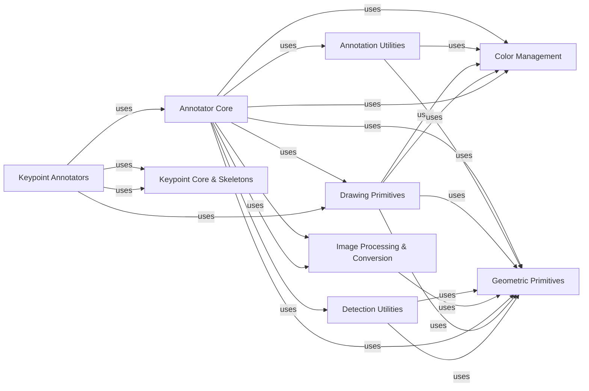

## Component Details

Visualization & Annotation Subsystem: This subsystem is dedicated to making computer vision results clear, customizable, and visually appealing. It achieves this by providing a comprehensive set of tools for drawing various annotations on images, managing colors, and handling image transformations.

### Annotator Core
This is the central component for applying diverse visual annotations (e.g., bounding boxes, masks, labels) onto an image. It provides a base for common annotation functionalities and specialized classes for each annotation type. These annotators encapsulate the logic for drawing specific visual elements, orchestrating the use of other components for drawing primitives, color management, and data conversion.

**Related Classes/Methods**:

- <a href="https://github.com/roboflow/supervision/blob/master/supervision/annotators/core.py#L1-L1000" target="_blank" rel="noopener noreferrer">`supervision.annotators.core` (1:1000)</a>

### Keypoint Annotators
A specialized extension of the `Annotator Core`, this component focuses on visualizing keypoint detections on images. It handles the drawing of keypoints and their connections (skeletons) based on predefined or custom skeleton structures, building upon the core annotator framework.

**Related Classes/Methods**:

- <a href="https://github.com/roboflow/supervision/blob/master/supervision/keypoint/annotators.py#L1-L1000" target="_blank" rel="noopener noreferrer">`supervision.keypoint.annotators` (1:1000)</a>

### Annotation Utilities
This component provides common utility functions that support the `Annotator Core` and `Keypoint Annotators`. These utilities assist in preparing data, resolving visual properties (like colors or text backgrounds), and performing other helper tasks necessary for effective annotation.

**Related Classes/Methods**:

- <a href="https://github.com/roboflow/supervision/blob/master/supervision/annotators/utils.py#L1-L1000" target="_blank" rel="noopener noreferrer">`supervision.annotators.utils` (1:1000)</a>

### Drawing Primitives
This fundamental component offers low-level drawing functions and robust color management capabilities. It abstracts the underlying image manipulation library (likely OpenCV) to provide a consistent and easy-to-use API for drawing basic shapes, text, and managing color palettes.

**Related Classes/Methods**:

- <a href="https://github.com/roboflow/supervision/blob/master/supervision/draw/utils.py#L1-L1000" target="_blank" rel="noopener noreferrer">`supervision.draw.utils` (1:1000)</a>
- <a href="https://github.com/roboflow/supervision/blob/master/supervision/draw/color.py#L1-L1000" target="_blank" rel="noopener noreferrer">`supervision.draw.color` (1:1000)</a>

### Color Management
This component defines core data structures for colors (`Color`) and color palettes (`ColorPalette`), along with methods for their creation, manipulation, and conversion between different formats (e.g., hex, RGB, BGR). It provides a standardized way to manage and apply colors consistently across the visualization subsystem.

**Related Classes/Methods**:

- <a href="https://github.com/roboflow/supervision/blob/master/supervision/draw/color.py#L1-L1000" target="_blank" rel="noopener noreferrer">`supervision.draw.color` (1:1000)</a>

### Detection Utilities
This component provides a collection of utility functions specifically designed for manipulating and transforming `Detections` objects. It includes operations related to bounding boxes (clipping, spreading, padding) and mask conversions (mask to polygons, polygons to mask), which are frequently required during the annotation process to prepare data for visualization.

**Related Classes/Methods**:

- <a href="https://github.com/roboflow/supervision/blob/master/supervision/detection/utils.py#L1-L1000" target="_blank" rel="noopener noreferrer">`supervision.detection.utils` (1:1000)</a>

### Image Processing & Conversion
This component is responsible for various image manipulation tasks, including resizing, tiling, cropping, and scaling. Crucially, it handles conversions between different image formats (e.g., NumPy arrays for OpenCV and PIL Image objects), ensuring compatibility across different parts of the `supervision` library, especially for annotation functions that might expect specific image types.

**Related Classes/Methods**:

- <a href="https://github.com/roboflow/supervision/blob/master/supervision/utils/image.py#L1-L1000" target="_blank" rel="noopener noreferrer">`supervision.utils.image` (1:1000)</a>
- <a href="https://github.com/roboflow/supervision/blob/master/supervision/utils/conversion.py#L1-L1000" target="_blank" rel="noopener noreferrer">`supervision.utils.conversion` (1:1000)</a>

### Geometric Primitives
This foundational component defines core geometric data structures such as `Rect` (rectangle) and `Point`, along with methods for their creation, manipulation, and common geometric operations (e.g., padding a rectangle). These primitives are essential building blocks for defining and manipulating regions of interest and visual elements across the entire visualization and annotation subsystem.

**Related Classes/Methods**:

- <a href="https://github.com/roboflow/supervision/blob/master/supervision/geometry/core.py#L1-L1000" target="_blank" rel="noopener noreferrer">`supervision.geometry.core` (1:1000)</a>
- <a href="https://github.com/roboflow/supervision/blob/master/supervision/geometry/utils.py#L1-L1000" target="_blank" rel="noopener noreferrer">`supervision.geometry.utils` (1:1000)</a>

### Keypoint Core & Skeletons
This component defines the core data structures for keypoints (`Keypoints` class) and provides mechanisms for managing and retrieving predefined or custom skeleton definitions. Skeletons are crucial for connecting keypoints visually in `Keypoint Annotators`, enabling the drawing of human poses or other articulated structures.

**Related Classes/Methods**:

- <a href="https://github.com/roboflow/supervision/blob/master/supervision/keypoint/core.py#L1-L1000" target="_blank" rel="noopener noreferrer">`supervision.keypoint.core` (1:1000)</a>
- <a href="https://github.com/roboflow/supervision/blob/master/supervision/keypoint/skeletons.py#L1-L1000" target="_blank" rel="noopener noreferrer">`supervision.keypoint.skeletons` (1:1000)</a>

### [FAQ](https://github.com/CodeBoarding/GeneratedOnBoardings/tree/main?tab=readme-ov-file#faq)