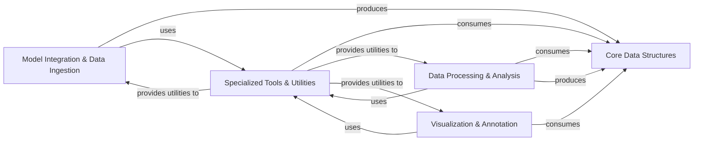

## Component Details

The `supervision` library's architecture is designed around a clear separation of concerns, with a central focus on standardized data structures for computer vision outputs. The analysis of both Control Flow Graphs (CFG) and source code reveals a robust, modular design that facilitates integration, processing, and visualization of diverse computer vision tasks.

### Core Data Structures
This component provides the foundational, standardized data models (`Detections`, `KeyPoints`, `Classifications`) that represent various computer vision outputs. These structures are central to the library, ensuring consistent data exchange and interoperability across all functionalities. They encapsulate raw results (e.g., bounding boxes, masks, class IDs, confidence scores) and offer methods for basic manipulation.

**Related Classes/Methods**:

- <a href="https://github.com/roboflow/supervision/blob/master/supervision/detection/core.py#L0-L0" target="_blank" rel="noopener noreferrer">`supervision.detection.core` (0:0)</a>
- <a href="https://github.com/roboflow/supervision/blob/master/supervision/keypoint/core.py#L0-L0" target="_blank" rel="noopener noreferrer">`supervision.keypoint.core` (0:0)</a>
- <a href="https://github.com/roboflow/supervision/blob/master/supervision/classification/core.py#L0-L0" target="_blank" rel="noopener noreferrer">`supervision.classification.core` (0:0)</a>

### Model Integration & Data Ingestion
This component acts as the primary entry point for external computer vision data. It is responsible for integrating with various pre-trained models (e.g., YOLO, SAM, Vision-Language Models) and handling diverse dataset formats (COCO, YOLO, Pascal VOC). Its core function is to convert these external, often disparate, data formats into the library's internal `Core Data Structures`, standardizing the input for subsequent processing.

**Related Classes/Methods**:

- <a href="https://github.com/roboflow/supervision/blob/master/supervision/detection/core.py#L233-L301" target="_blank" rel="noopener noreferrer">`supervision.detection.core:Detections.from_ultralytics` (233:301)</a>
- <a href="https://github.com/roboflow/supervision/blob/master/supervision/detection/core.py#L633-L672" target="_blank" rel="noopener noreferrer">`supervision.detection.core:Detections.from_sam` (633:672)</a>
- <a href="https://github.com/roboflow/supervision/blob/master/supervision/detection/core.py#L875-L901" target="_blank" rel="noopener noreferrer">`supervision.detection.core:Detections.from_vlm` (875:901)</a>
- <a href="https://github.com/roboflow/supervision/blob/master/supervision/detection/vlm.py#L0-L0" target="_blank" rel="noopener noreferrer">`supervision.detection.vlm` (0:0)</a>
- <a href="https://github.com/roboflow/supervision/blob/master/supervision/dataset/core.py#L0-L0" target="_blank" rel="noopener noreferrer">`supervision.dataset.core` (0:0)</a>

### Data Processing & Analysis
This component provides the core computational intelligence of the library, offering a comprehensive suite of algorithms and utilities for manipulating, refining, tracking, and evaluating `Core Data Structures`. Key functionalities include non-maximum suppression (NMS), Intersection Over Union (IOU) calculations, multi-object tracking (e.g., ByteTrack), and performance metrics (e.g., F1-Score, Mean Average Precision). It transforms and enriches the raw detection data.

**Related Classes/Methods**:

- <a href="https://github.com/roboflow/supervision/blob/master/supervision/detection/utils.py#L0-L0" target="_blank" rel="noopener noreferrer">`supervision.detection.utils` (0:0)</a>
- <a href="https://github.com/roboflow/supervision/blob/master/supervision/tracker/byte_tracker/core.py#L0-L0" target="_blank" rel="noopener noreferrer">`supervision.tracker.byte_tracker.core` (0:0)</a>
- `supervision.metrics` (0:0)
- <a href="https://github.com/roboflow/supervision/blob/master/supervision/detection/core.py#L1322-L1376" target="_blank" rel="noopener noreferrer">`supervision.detection.core:Detections.with_nms` (1322:1376)</a>
- <a href="https://github.com/roboflow/supervision/blob/master/supervision/detection/core.py#L1378-L1435" target="_blank" rel="noopener noreferrer">`supervision.detection.core:Detections.with_nmm` (1378:1435)</a>

### Visualization & Annotation
Focused on making computer vision results interpretable and presentable, this component offers a rich set of tools for visually representing `Core Data Structures` on images. It includes various annotators (e.g., `BoxAnnotator`, `MaskAnnotator`, `LabelAnnotator`, `Keypoint Annotator`) and leverages underlying drawing primitives, color management, and image manipulation utilities to create clear, customizable, and aesthetically pleasing visualizations.

**Related Classes/Methods**:

- <a href="https://github.com/roboflow/supervision/blob/master/supervision/annotators/core.py#L0-L0" target="_blank" rel="noopener noreferrer">`supervision.annotators.core` (0:0)</a>
- <a href="https://github.com/roboflow/supervision/blob/master/supervision/keypoint/annotators.py#L0-L0" target="_blank" rel="noopener noreferrer">`supervision.keypoint.annotators` (0:0)</a>
- <a href="https://github.com/roboflow/supervision/blob/master/supervision/draw/utils.py#L0-L0" target="_blank" rel="noopener noreferrer">`supervision.draw.utils` (0:0)</a>
- <a href="https://github.com/roboflow/supervision/blob/master/supervision/draw/color.py#L0-L0" target="_blank" rel="noopener noreferrer">`supervision.draw.color` (0:0)</a>
- <a href="https://github.com/roboflow/supervision/blob/master/supervision/utils/image.py#L0-L0" target="_blank" rel="noopener noreferrer">`supervision.utils.image` (0:0)</a>
- <a href="https://github.com/roboflow/supervision/blob/master/supervision/utils/conversion.py#L0-L0" target="_blank" rel="noopener noreferrer">`supervision.utils.conversion` (0:0)</a>
- <a href="https://github.com/roboflow/supervision/blob/master/supervision/geometry/core.py#L0-L0" target="_blank" rel="noopener noreferrer">`supervision.geometry.core` (0:0)</a>

### Specialized Tools & Utilities
This component serves a dual purpose: providing higher-level, problem-specific functionalities and offering foundational internal support across the library. It includes advanced tools for common computer vision workflows like object counting (e.g., `LineZone`, `PolygonZone`), processing large images by tiling (`InferenceSlicer`), and exporting results to various formats (`CSVSink`, `JSONSink`). Additionally, it houses internal validation mechanisms and general-purpose helper functions (e.g., geometry, image conversions) that ensure data integrity and support the operations of other components.

**Related Classes/Methods**:

- <a href="https://github.com/roboflow/supervision/blob/master/supervision/detection/line_zone.py#L0-L0" target="_blank" rel="noopener noreferrer">`supervision.detection.line_zone` (0:0)</a>
- <a href="https://github.com/roboflow/supervision/blob/master/supervision/detection/tools/polygon_zone.py#L0-L0" target="_blank" rel="noopener noreferrer">`supervision.detection.tools.polygon_zone` (0:0)</a>
- <a href="https://github.com/roboflow/supervision/blob/master/supervision/detection/tools/inference_slicer.py#L0-L0" target="_blank" rel="noopener noreferrer">`supervision.detection.tools.inference_slicer` (0:0)</a>
- <a href="https://github.com/roboflow/supervision/blob/master/supervision/detection/tools/csv_sink.py#L0-L0" target="_blank" rel="noopener noreferrer">`supervision.detection.tools.csv_sink` (0:0)</a>
- <a href="https://github.com/roboflow/supervision/blob/master/supervision/detection/tools/json_sink.py#L0-L0" target="_blank" rel="noopener noreferrer">`supervision.detection.tools.json_sink` (0:0)</a>
- `supervision.validators` (0:0)
- <a href="https://github.com/roboflow/supervision/blob/master/supervision/detection/core.py#L0-L0" target="_blank" rel="noopener noreferrer">`supervision.detection.core` (0:0)</a>
- `supervision.utils` (0:0)

### [FAQ](https://github.com/CodeBoarding/GeneratedOnBoardings/tree/main?tab=readme-ov-file#faq)