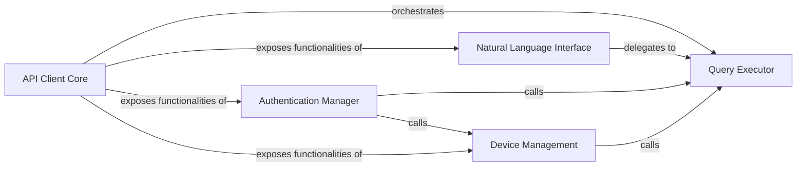

## Details

The `API Client Core` subsystem serves as the primary interface for interacting with the external Susi API, managing HTTP requests, session handling, and authentication. It orchestrates the overall API call lifecycle by delegating to specialized internal components.

### API Client Core [[Expand]](./API_Client_Core.md)
The top-level abstraction and main entry point for interacting with the Susi API. It provides a unified interface for various API operations, orchestrating calls to underlying specialized components.

**Related Classes/Methods**:

- <a href="https://github.com/fossasia/susi_api_wrapper/blob/master/python_wrapper/susi_python/main.py" target="_blank" rel="noopener noreferrer">`python_wrapper.susi_python.main.py:ask`</a>
- <a href="https://github.com/fossasia/susi_api_wrapper/blob/master/python_wrapper/susi_python/main.py" target="_blank" rel="noopener noreferrer">`python_wrapper.susi_python.main.py:query`</a>
- <a href="https://github.com/fossasia/susi_api_wrapper/blob/master/python_wrapper/susi_python/main.py" target="_blank" rel="noopener noreferrer">`python_wrapper.susi_python.main.py:sign_in`</a>
- <a href="https://github.com/fossasia/susi_api_wrapper/blob/master/python_wrapper/susi_python/main.py" target="_blank" rel="noopener noreferrer">`python_wrapper.susi_python.main.py:add_device`</a>

### Query Executor
Encapsulates the fundamental logic for sending HTTP requests to the Susi API, processing responses, and managing network communication. It is the core component for all direct API calls.

**Related Classes/Methods**:

- <a href="https://github.com/fossasia/susi_api_wrapper/blob/master/python_wrapper/susi_python/main.py" target="_blank" rel="noopener noreferrer">`python_wrapper.susi_python.main.py:query`</a>

### Natural Language Interface
Provides a simplified, user-friendly interface for sending natural language queries to the Susi API. It prepares request parameters and delegates the actual API call execution.

**Related Classes/Methods**:

- <a href="https://github.com/fossasia/susi_api_wrapper/blob/master/python_wrapper/susi_python/main.py" target="_blank" rel="noopener noreferrer">`python_wrapper.susi_python.main.py:ask`</a>

### Authentication Manager
Manages the user authentication process with the Susi API. This includes handling user credentials, initiating sign-in requests, and potentially triggering device registration as part of the authentication flow.

**Related Classes/Methods**:

- <a href="https://github.com/fossasia/susi_api_wrapper/blob/master/python_wrapper/susi_python/main.py" target="_blank" rel="noopener noreferrer">`python_wrapper.susi_python.main.py:sign_in`</a>

### Device Management
Facilitates the registration and management of devices with the Susi API. This component handles the specific API calls and data required for device-related operations.

**Related Classes/Methods**:

- <a href="https://github.com/fossasia/susi_api_wrapper/blob/master/python_wrapper/susi_python/main.py" target="_blank" rel="noopener noreferrer">`python_wrapper.susi_python.main.py:add_device`</a>

### [FAQ](https://github.com/CodeBoarding/GeneratedOnBoardings/tree/main?tab=readme-ov-file#faq)