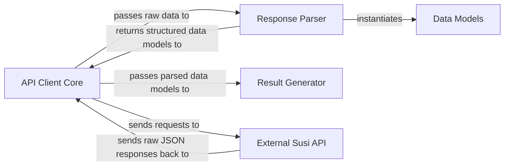

## Details

The `python_wrapper` acts as a robust client for the Susi API, designed with a clear separation of concerns. The **`API Client Core`** serves as the central orchestrator, managing communication with the **`External Susi API`** by sending requests and receiving raw JSON responses. These raw responses are then channeled to the **`Response Parser`**, which is responsible for deserializing the JSON into structured Python objects, leveraging the definitions provided by the **`Data Models`** component. Once the data is parsed and modeled, it is returned to the `API Client Core`, which subsequently dispatches it to the **`Result Generator`**. The `Result Generator` then applies business logic to transform these structured data models into a user-friendly output. This architectural pattern ensures a clean, unidirectional data flow, making the system easy to understand, maintain, and extend, and is highly suitable for visual representation in a data flow diagram.

### API Client Core [[Expand]](./API_Client_Core.md)
The primary interface for interacting with the external Susi API, handling HTTP requests, session management, and authentication. It orchestrates the overall API call lifecycle.

**Related Classes/Methods**:

- <a href="https://github.com/fossasia/susi_api_wrapper/blob/master/python_wrapper/susi_python/main.py#L117-L119" target="_blank" rel="noopener noreferrer">`python_wrapper.susi_python.main.ask`:117-119</a>
- <a href="https://github.com/fossasia/susi_api_wrapper/blob/master/python_wrapper/susi_python/main.py#L47-L78" target="_blank" rel="noopener noreferrer">`python_wrapper.susi_python.main.query`:47-78</a>
- <a href="https://github.com/fossasia/susi_api_wrapper/blob/master/python_wrapper/susi_python/main.py#L183-L200" target="_blank" rel="noopener noreferrer">`python_wrapper.susi_python.main.sign_in`:183-200</a>
- <a href="https://github.com/fossasia/susi_api_wrapper/blob/master/python_wrapper/susi_python/main.py#L140-L181" target="_blank" rel="noopener noreferrer">`python_wrapper.susi_python.main.add_device`:140-181</a>

### Response Parser
Dedicated to transforming raw JSON responses from the Susi API into structured Python objects, acting as the deserialization layer.

**Related Classes/Methods**:

- <a href="https://github.com/fossasia/susi_api_wrapper/blob/master/python_wrapper/susi_python/response_parser.py#L33-L53" target="_blank" rel="noopener noreferrer">`python_wrapper.susi_python.response_parser.get_query_response`:33-53</a>
- <a href="https://github.com/fossasia/susi_api_wrapper/blob/master/python_wrapper/susi_python/response_parser.py#L63-L70" target="_blank" rel="noopener noreferrer">`python_wrapper.susi_python.response_parser.get_memory_responses`:63-70</a>
- <a href="https://github.com/fossasia/susi_api_wrapper/blob/master/python_wrapper/susi_python/response_parser.py#L73-L74" target="_blank" rel="noopener noreferrer">`python_wrapper.susi_python.response_parser.get_forgot_password_response`:73-74</a>
- <a href="https://github.com/fossasia/susi_api_wrapper/blob/master/python_wrapper/susi_python/response_parser.py#L56-L60" target="_blank" rel="noopener noreferrer">`python_wrapper.susi_python.response_parser.get_sign_in_response`:56-60</a>

### Data Models
Defines the schema and structure for all data objects exchanged within the API client, representing entities and responses from the Susi API with a strong type system.

**Related Classes/Methods**:

- <a href="https://github.com/fossasia/susi_api_wrapper/blob/master/python_wrapper/susi_python/models.py#L67-L72" target="_blank" rel="noopener noreferrer">`python_wrapper.susi_python.models.Metadata`:67-72</a>
- <a href="https://github.com/fossasia/susi_api_wrapper/blob/master/python_wrapper/susi_python/models.py#L47-L55" target="_blank" rel="noopener noreferrer">`python_wrapper.susi_python.models.Answer`:47-55</a>
- <a href="https://github.com/fossasia/susi_api_wrapper/blob/master/python_wrapper/susi_python/models.py" target="_blank" rel="noopener noreferrer">`python_wrapper.susi_python.models.Datum`</a>
- <a href="https://github.com/fossasia/susi_api_wrapper/blob/master/python_wrapper/susi_python/models.py#L39-L44" target="_blank" rel="noopener noreferrer">`python_wrapper.susi_python.models.ForgotPasswordResponse`:39-44</a>
- <a href="https://github.com/fossasia/susi_api_wrapper/blob/master/python_wrapper/susi_python/models.py#L157-L165" target="_blank" rel="noopener noreferrer">`python_wrapper.susi_python.models.Identity`:157-165</a>
- <a href="https://github.com/fossasia/susi_api_wrapper/blob/master/python_wrapper/susi_python/models.py#L149-L154" target="_blank" rel="noopener noreferrer">`python_wrapper.susi_python.models.Session`:149-154</a>
- <a href="https://github.com/fossasia/susi_api_wrapper/blob/master/python_wrapper/susi_python/models.py#L85-L88" target="_blank" rel="noopener noreferrer">`python_wrapper.susi_python.models.AnswerAction`:85-88</a>
- <a href="https://github.com/fossasia/susi_api_wrapper/blob/master/python_wrapper/susi_python/models.py#L133-L137" target="_blank" rel="noopener noreferrer">`python_wrapper.susi_python.models.AudioAction`:133-137</a>
- <a href="https://github.com/fossasia/susi_api_wrapper/blob/master/python_wrapper/susi_python/models.py#L91-L95" target="_blank" rel="noopener noreferrer">`python_wrapper.susi_python.models.TableAction`:91-95</a>
- <a href="https://github.com/fossasia/susi_api_wrapper/blob/master/python_wrapper/susi_python/models.py#L98-L106" target="_blank" rel="noopener noreferrer">`python_wrapper.susi_python.models.MapAction`:98-106</a>
- <a href="https://github.com/fossasia/susi_api_wrapper/blob/master/python_wrapper/susi_python/models.py#L109-L113" target="_blank" rel="noopener noreferrer">`python_wrapper.susi_python.models.AnchorAction`:109-113</a>
- <a href="https://github.com/fossasia/susi_api_wrapper/blob/master/python_wrapper/susi_python/models.py#L115-L119" target="_blank" rel="noopener noreferrer">`python_wrapper.susi_python.models.VideoAction`:115-119</a>
- <a href="https://github.com/fossasia/susi_api_wrapper/blob/master/python_wrapper/susi_python/models.py#L144-L147" target="_blank" rel="noopener noreferrer">`python_wrapper.susi_python.models.VolumeAction`:144-147</a>
- <a href="https://github.com/fossasia/susi_api_wrapper/blob/master/python_wrapper/susi_python/models.py#L121-L127" target="_blank" rel="noopener noreferrer">`python_wrapper.susi_python.models.RssAction`:121-127</a>
- <a href="https://github.com/fossasia/susi_api_wrapper/blob/master/python_wrapper/susi_python/models.py#L129-L131" target="_blank" rel="noopener noreferrer">`python_wrapper.susi_python.models.StopAction`:129-131</a>
- <a href="https://github.com/fossasia/susi_api_wrapper/blob/master/python_wrapper/susi_python/models.py" target="_blank" rel="noopener noreferrer">`python_wrapper.susi_python.models.MediaAction`</a>

### Result Generator
Processes the structured data models received from the API Client Core to produce the final, user-friendly output, applying business logic for presentation.

**Related Classes/Methods**:

- <a href="https://github.com/fossasia/susi_api_wrapper/blob/master/python_wrapper/susi_python/main.py#L81-L114" target="_blank" rel="noopener noreferrer">`python_wrapper.susi_python.main.generate_result`:81-114</a>
- <a href="https://github.com/fossasia/susi_api_wrapper/blob/master/python_wrapper/susi_python/main.py#L128-L138" target="_blank" rel="noopener noreferrer">`python_wrapper.susi_python.main.get_rss_entities`:128-138</a>

### External Susi API
Represents the external RESTful API that the client library interacts with, serving as the source of data and services consumed by the `python_wrapper`. This component is external to the project's codebase and therefore does not have internal source code references.

**Related Classes/Methods**: _None_

### [FAQ](https://github.com/CodeBoarding/GeneratedOnBoardings/tree/main?tab=readme-ov-file#faq)