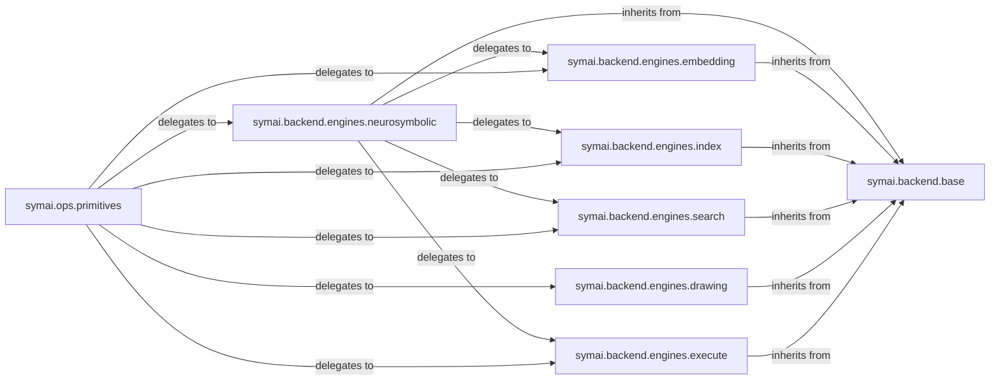

## Details

The AI Engine Backends subsystem in symai serves as the core computational layer, providing a collection of adapters and wrappers for diverse AI models and specialized engines. It embodies the framework's modular design and plugin architecture, allowing for seamless integration of various AI capabilities.

### symai.backend.base
Defines the abstract interface (`forward`, `preview`) that all AI engine implementations must adhere to. It establishes a consistent API for the framework, acting as the core contract for all backend operations, enabling the "Adapter" pattern.

**Related Classes/Methods**:

- <a href="https://github.com/ExtensityAI/symbolicai/blob/main/symai/backend/base.py" target="_blank" rel="noopener noreferrer">`symai.backend.base`</a>

### symai.backend.engines.neurosymbolic
Integrates various Large Language Models (LLMs) and advanced reasoning engines (e.g., DeepSeekX, Anthropic ClaudeX, HuggingFace, Groq, Google GeminiX, OpenAI GPTX, LlamaCpp). It handles core AI computations like NLP, generation, complex reasoning, input preparation, multimodal processing, token management, and function calling.

**Related Classes/Methods**:

- <a href="https://github.com/ExtensityAI/symbolicai/blob/main/symai/backend/engines/neurosymbolic" target="_blank" rel="noopener noreferrer">`symai.backend.engines.neurosymbolic`</a>

### symai.backend.engines.embedding
Provides interfaces for generating high-dimensional numerical representations (embeddings) of data, essential for semantic search and similarity tasks.

**Related Classes/Methods**:

- <a href="https://github.com/ExtensityAI/symbolicai/blob/main/symai/backend/engines/embedding" target="_blank" rel="noopener noreferrer">`symai.backend.engines.embedding`</a>

### symai.backend.engines.index
Manages interactions with vector databases (e.g., Pinecone), enabling efficient storage, retrieval, and similarity search over embedding datasets.

**Related Classes/Methods**:

- <a href="https://github.com/ExtensityAI/symbolicai/blob/main/symai/backend/engines/index" target="_blank" rel="noopener noreferrer">`symai.backend.engines.index`</a>

### symai.backend.engines.search
Integrates with external search APIs (e.g., Perplexity, OpenAI, SerpAPI) to fetch real-time information, augmenting the AI system's knowledge base.

**Related Classes/Methods**:

- <a href="https://github.com/ExtensityAI/symbolicai/blob/main/symai/backend/engines/search" target="_blank" rel="noopener noreferrer">`symai.backend.engines.search`</a>

### symai.backend.engines.drawing
Provides capabilities for AI models that generate images or visual content based on prompts.

**Related Classes/Methods**:

- <a href="https://github.com/ExtensityAI/symbolicai/blob/main/symai/backend/engines/drawing" target="_blank" rel="noopener noreferrer">`symai.backend.engines.drawing`</a>

### symai.backend.engines.execute
Provides a mechanism to execute code or commands (e.g., Python code) within a controlled environment, allowing the AI to perform actions.

**Related Classes/Methods**:

- <a href="https://github.com/ExtensityAI/symbolicai/blob/main/symai/backend/engines/execute" target="_blank" rel="noopener noreferrer">`symai.backend.engines.execute`</a>

### symai.ops.primitives
Acts as a higher-level abstraction over the specific engine implementations, delegating execution to various backend engines based on the required AI operation. It serves as the primary consumer of the AI Engine Backends.

**Related Classes/Methods**:

- <a href="https://github.com/ExtensityAI/symbolicai/blob/main/symai/ops/primitives.py" target="_blank" rel="noopener noreferrer">`symai.ops.primitives`</a>

### [FAQ](https://github.com/CodeBoarding/GeneratedOnBoardings/tree/main?tab=readme-ov-file#faq)