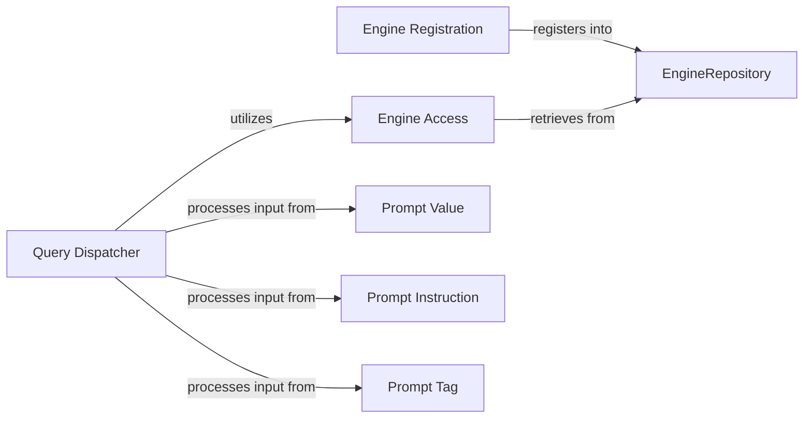

## Details

The AI Engine Management & Configuration subsystem is responsible for the dynamic registration, dispatch, and configuration of all integrated AI models and services, including prompt management. Its core functionality is encapsulated within the symai.functional and symai.prompts modules.

### EngineRepository
The central registry and repository for all dynamically integrated AI models and services. It embodies the plugin architecture, allowing for the registration and management of diverse AI engines.

**Related Classes/Methods**:

- <a href="https://github.com/ExtensityAI/symbolicai/blob/main/symai/functional.py" target="_blank" rel="noopener noreferrer">`symai.functional:EngineRepository`</a>

### Engine Registration
Facilitates the dynamic registration of new AI engines and services into the EngineRepository. This component ensures that new models can be seamlessly integrated and made available to the system.

**Related Classes/Methods**:

- <a href="https://github.com/ExtensityAI/symbolicai/blob/main/symai/functional.py" target="_blank" rel="noopener noreferrer">`symai.functional:register`</a>

### Engine Access
Provides a unified and controlled access point to retrieve registered AI engine instances from the EngineRepository. It acts as a facade for accessing specific AI functionalities.

**Related Classes/Methods**:

- <a href="https://github.com/ExtensityAI/symbolicai/blob/main/symai/functional.py" target="_blank" rel="noopener noreferrer">`symai.functional:get`</a>

### Query Dispatcher
The primary entry point for processing user or system queries using the registered AI engines. It orchestrates the execution flow, including pre- and post-processing, and dispatches the query to the appropriate engine.

**Related Classes/Methods**:

- <a href="https://github.com/ExtensityAI/symbolicai/blob/main/symai/functional.py" target="_blank" rel="noopener noreferrer">`symai.functional:query`</a>

### Prompt Value
Represents the core textual content or primary input for an AI engine within a prompt. It encapsulates the main data that the AI model will process.

**Related Classes/Methods**:

- <a href="https://github.com/ExtensityAI/symbolicai/blob/main/symai/prompts.py" target="_blank" rel="noopener noreferrer">`symai.prompts:value`</a>

### Prompt Instruction
Represents specific directives, guidelines, or constraints embedded within a prompt, guiding the AI model's behavior and output format.

**Related Classes/Methods**:

- <a href="https://github.com/ExtensityAI/symbolicai/blob/main/symai/prompts.py" target="_blank" rel="noopener noreferrer">`symai.prompts:instruction`</a>

### Prompt Tag
Represents metadata or categorization tags associated with a prompt. These tags can provide richer context, enable conditional logic, or drive configuration-driven prompt generation.

**Related Classes/Methods**:

- <a href="https://github.com/ExtensityAI/symbolicai/blob/main/symai/prompts.py" target="_blank" rel="noopener noreferrer">`symai.prompts:tag`</a>

### [FAQ](https://github.com/CodeBoarding/GeneratedOnBoardings/tree/main?tab=readme-ov-file#faq)