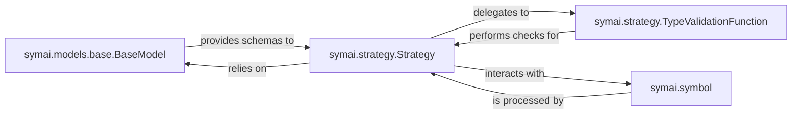

## Details

The `Data Contract & Validation` subsystem is crucial for ensuring the reliability and consistency of AI interactions within the `symai` framework. It defines, validates, and remediates data against predefined schemas and contracts, aligning with the project's architectural bias towards "Reliability through Contracts."

### symai.models.base.BaseModel
This foundational component is responsible for defining data contracts and managing data structures. It provides mechanisms for schema generation, simplification, and creating examples for data adherence, specifically formatting these contracts for consumption by Large Language Models (LLMs).

**Related Classes/Methods**:

- <a href="https://github.com/ExtensityAI/symbolicai/blob/main/symai/models/base.py" target="_blank" rel="noopener noreferrer">`symai.models.base.BaseModel`</a>

### symai.strategy.Strategy
Acts as the central orchestrator for data validation and remediation processes. It manages the overall flow, including both input and output validation, and triggers necessary remediation steps to ensure data adherence throughout the system's operations. It embodies the "Pipeline / Chain of Responsibility" pattern for validation flows.

**Related Classes/Methods**:

- <a href="https://github.com/ExtensityAI/symbolicai/blob/main/symai/strategy.py#L876-L884" target="_blank" rel="noopener noreferrer">`symai.strategy.Strategy`:876-884</a>

### symai.strategy.TypeValidationFunction
A specialized component responsible for executing the concrete type validation logic against data, based on the registered data models. It performs the granular checks required by the `Strategy` component, acting as a specific step within the validation pipeline.

**Related Classes/Methods**:

- <a href="https://github.com/ExtensityAI/symbolicai/blob/main/symai/strategy.py#L159-L370" target="_blank" rel="noopener noreferrer">`symai.strategy.TypeValidationFunction`:159-370</a>

### symai.symbol
Represents the core symbolic AI data structure used for dynamic context and value handling within the system. It is the primary data type that undergoes validation and remediation processes, serving as the abstraction layer for diverse AI functionalities.

**Related Classes/Methods**:

- <a href="https://github.com/ExtensityAI/symbolicai/blob/main/symai/symbol.py" target="_blank" rel="noopener noreferrer">`symai.symbol`</a>

### [FAQ](https://github.com/CodeBoarding/GeneratedOnBoardings/tree/main?tab=readme-ov-file#faq)