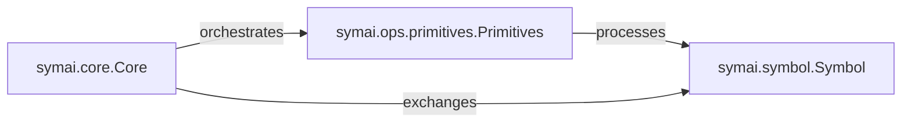

## Details

Analysis of the 'Symbolic AI Core' subsystem within the `symai` project.

### symai.symbol.Symbol
Acts as the core data structure, representing abstract data and concepts as symbolic entities. It encapsulates values, metadata, and manages dependency graphs, serving as the universal medium for data exchange across the AI framework. This component is crucial for the "Abstraction Layer" architectural bias, unifying access to diverse AI functionalities.

**Related Classes/Methods**:

- <a href="https://github.com/ExtensityAI/symbolicai/blob/main/symai/symbol.py#L210-L957" target="_blank" rel="noopener noreferrer">`symai.symbol.Symbol`:210-957</a>

### symai.ops.primitives.Primitives
Implements the fundamental symbolic computations and AI-specific operations. It is the computational engine that processes `Symbol` objects, performing transformations and logical operations. This component embodies the "Neuro-Symbolic Interaction" by providing the symbolic processing capabilities.

**Related Classes/Methods**:

- <a href="https://github.com/ExtensityAI/symbolicai/blob/main/symai/ops/primitives.py" target="_blank" rel="noopener noreferrer">`symai.ops.primitives.Primitives`</a>

### symai.core.Core
Serves as the central orchestrator and high-level API for AI-driven processes. It abstracts complex AI workflows, delegates computations to `Primitives`, and manages interactions with various AI engines via the `EngineRepository` (though `EngineRepository` itself is outside this specific subsystem's scope, `Core`'s interaction with it is noted). This component aligns with the "Core Framework" and "Pipeline / Chain of Responsibility" patterns.

**Related Classes/Methods**:

- <a href="https://github.com/ExtensityAI/symbolicai/blob/main/symai/core.py" target="_blank" rel="noopener noreferrer">`symai.core.Core`</a>

### [FAQ](https://github.com/CodeBoarding/GeneratedOnBoardings/tree/main?tab=readme-ov-file#faq)