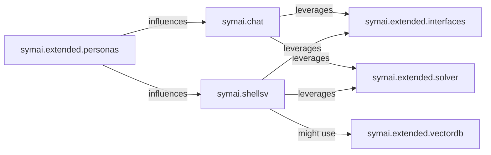

## Details

The User Interfaces & Extensions subsystem provides the primary interaction points for users and extends the core AI framework with specialized functionalities.

### symai.chat
Manages human-AI conversational interactions, including processing user input, generating narrative responses, and maintaining conversational memory. It serves as a primary user interface for dialogue-based interactions.

**Related Classes/Methods**:

- <a href="https://github.com/ExtensityAI/symbolicai/blob/main/symai/chat.py" target="_blank" rel="noopener noreferrer">`symai.chat`</a>

### symai.shellsv
Provides an intelligent command-line interface, enabling users to interact with the system through shell commands augmented by language model capabilities. It handles command processing, history management, and integration with external tools.

**Related Classes/Methods**:

- <a href="https://github.com/ExtensityAI/symbolicai/blob/main/symai/shellsv.py" target="_blank" rel="noopener noreferrer">`symai.shellsv`</a>

### symai.extended.interfaces
Acts as a facade and adapter layer, providing a unified interface to a wide array of external AI models and services (e.g., DALL-E, CLIP, Whisper, WolframAlpha, SerpAPI). It abstracts the complexities of interacting with diverse APIs, aligning with the "Abstraction Layer" and "External API Integrations" patterns.

**Related Classes/Methods**:

- <a href="https://github.com/ExtensityAI/symbolicai/blob/main/symai/extended/interfaces" target="_blank" rel="noopener noreferrer">`symai.extended.interfaces`</a>

### symai.extended.vectordb
Manages vector database operations, including adding, loading, and purging documents, and initializing embedding models. This component is crucial for Retrieval Augmented Generation (RAG) functionalities, supporting the "Data Models" and "AI Engines" aspects.

**Related Classes/Methods**:

- <a href="https://github.com/ExtensityAI/symbolicai/blob/main/symai/extended/vectordb.py" target="_blank" rel="noopener noreferrer">`symai.extended.vectordb`</a>

### symai.extended.solver
Provides capabilities for symbolic problem-solving, including formula rewriting, problem classification, and SAT solving. It embodies the "symbolic" aspect of the neuro-symbolic AI framework, aligning with the "AI Engines" pattern.

**Related Classes/Methods**:

- <a href="https://github.com/ExtensityAI/symbolicai/blob/main/symai/extended/solver.py" target="_blank" rel="noopener noreferrer">`symai.extended.solver`</a>

### symai.extended.personas
Defines and manages different AI personas, influencing their behavior, conversational style, and response generation. This allows for customizable user experiences and tailored AI interactions, supporting the "Configuration-Driven Architecture" and "Data Models" patterns.

**Related Classes/Methods**:

- <a href="https://github.com/ExtensityAI/symbolicai/blob/main/symai/extended/personas" target="_blank" rel="noopener noreferrer">`symai.extended.personas`</a>

### [FAQ](https://github.com/CodeBoarding/GeneratedOnBoardings/tree/main?tab=readme-ov-file#faq)