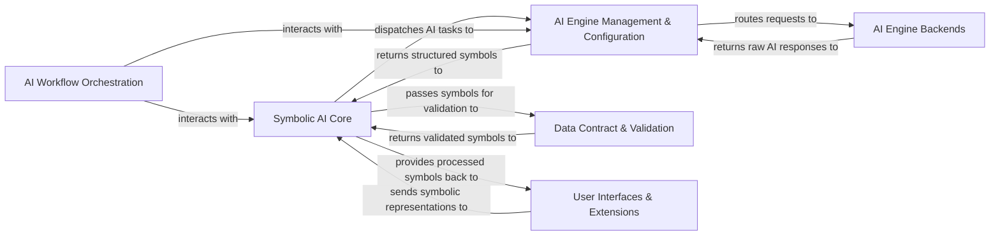

## Details

The `symbolicai` framework is architected as a modular AI toolkit, centered around a Symbolic AI Core that provides a unified symbolic representation for all data and operations. This core interacts with an AI Engine Management & Configuration layer, which dynamically dispatches requests to diverse AI Engine Backends (including neural and specialized models) while applying system-wide configurations and prompt templates. Data integrity is maintained by the Data Contract & Validation system, which ensures all inputs and outputs conform to defined schemas. Complex multi-step AI tasks are managed by the AI Workflow Orchestration component, enabling the creation of robust AI pipelines. User interaction is handled by User Interfaces & Extensions, which provide intuitive access to the framework's capabilities and integrate specialized functionalities. This design emphasizes modularity, extensibility, and reliable data flow, making it ideal for building sophisticated neuro-symbolic AI applications.

### Symbolic AI Core [[Expand]](./Symbolic_AI_Core.md)
The foundational component for data abstraction and symbolic operations, acting as the central hub for all AI-driven processes.

**Related Classes/Methods**:

- <a href="https://github.com/ExtensityAI/symbolicai/blob/main/symai/symbol.py" target="_blank" rel="noopener noreferrer">`symai.symbol`</a>
- <a href="https://github.com/ExtensityAI/symbolicai/blob/main/symai/ops/primitives.py" target="_blank" rel="noopener noreferrer">`symai.ops.primitives`</a>
- <a href="https://github.com/ExtensityAI/symbolicai/blob/main/symai/core.py" target="_blank" rel="noopener noreferrer">`symai.core`</a>

### AI Engine Management & Configuration [[Expand]](./AI_Engine_Management_Configuration.md)
Manages the dynamic registration, dispatch, and configuration of all integrated AI models and services, including prompt management.

**Related Classes/Methods**:

- <a href="https://github.com/ExtensityAI/symbolicai/blob/main/symai/functional.py" target="_blank" rel="noopener noreferrer">`symai.functional`</a>
- <a href="https://github.com/ExtensityAI/symbolicai/blob/main/symai/prompts.py" target="_blank" rel="noopener noreferrer">`symai.prompts`</a>

### AI Engine Backends [[Expand]](./AI_Engine_Backends.md)
A collection of adapters and wrappers for various AI models (LLMs, specialized engines) that perform the actual AI computations.

**Related Classes/Methods**:

- <a href="https://github.com/ExtensityAI/symbolicai/blob/main/symai/backend/engines" target="_blank" rel="noopener noreferrer">`symai.backend.engines`</a>
- <a href="https://github.com/ExtensityAI/symbolicai/blob/main/symai/backend/engines/neurosymbolic" target="_blank" rel="noopener noreferrer">`symai.backend.engines.neurosymbolic`</a>

### Data Contract & Validation [[Expand]](./Data_Contract_Validation.md)
Ensures the reliability and consistency of AI interactions by defining, validating, and remediating data against predefined schemas and contracts.

**Related Classes/Methods**:

- <a href="https://github.com/ExtensityAI/symbolicai/blob/main/symai/strategy.py" target="_blank" rel="noopener noreferrer">`symai.strategy`</a>
- <a href="https://github.com/ExtensityAI/symbolicai/blob/main/symai/models/base.py" target="_blank" rel="noopener noreferrer">`symai.models.base`</a>

### AI Workflow Orchestration
Provides a flexible framework for constructing, managing, and executing complex AI workflows and pipelines.

**Related Classes/Methods**:

- <a href="https://github.com/ExtensityAI/symbolicai/blob/main/symai/components.py" target="_blank" rel="noopener noreferrer">`symai.components`</a>

### User Interfaces & Extensions [[Expand]](./User_Interfaces_Extensions.md)
High-level interfaces for human-AI interaction (conversational agents, intelligent shell) and specialized modules extending core functionalities.

**Related Classes/Methods**:

- <a href="https://github.com/ExtensityAI/symbolicai/blob/main/symai/chat.py" target="_blank" rel="noopener noreferrer">`symai.chat`</a>
- <a href="https://github.com/ExtensityAI/symbolicai/blob/main/symai/shellsv.py" target="_blank" rel="noopener noreferrer">`symai.shellsv`</a>
- <a href="https://github.com/ExtensityAI/symbolicai/blob/main/symai/extended" target="_blank" rel="noopener noreferrer">`symai.extended`</a>

### [FAQ](https://github.com/CodeBoarding/GeneratedOnBoardings/tree/main?tab=readme-ov-file#faq)