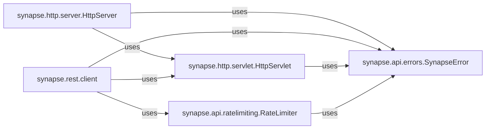

## Component Details

This subsystem is the primary external interface for the Synapse server, handling all incoming HTTP requests from Matrix clients and other external entities. It is responsible for routing requests, parsing bodies, managing responses, enforcing rate limits, and handling API-level errors.

### synapse.http.server.HttpServer
This class provides the core HTTP server functionality. It listens for incoming HTTP requests, manages connections, and dispatches requests to registered callbacks (servlets). It handles the low-level aspects of HTTP communication, including request parsing and response writing. It acts as the foundational layer for all incoming HTTP traffic.

**Related Classes/Methods**: _None_

### synapse.http.servlet.HttpServlet
This module defines the base class for HTTP request handlers (servlets). Servlets are responsible for processing specific HTTP requests, extracting parameters, and generating responses. They provide a structured way to define API endpoints and their logic, abstracting the complexities of raw HTTP handling.

**Related Classes/Methods**: _None_

### synapse.rest.client
This package is the core implementation of the Matrix client-server API. It contains numerous specialized servlets (e.g., for account management, login, room operations, synchronization) that inherit from `HttpServlet`. It acts as the primary collection of handlers for all client-facing API endpoints.

**Related Classes/Methods**: _None_

### synapse.api.errors.SynapseError
This class defines custom exception types used throughout the Synapse API to represent various error conditions. These errors are designed to be converted into appropriate HTTP error responses for clients, providing standardized error codes and messages.

**Related Classes/Methods**: _None_

### synapse.api.ratelimiting.RateLimiter
This class provides mechanisms for rate-limiting API requests. It tracks request rates for users or other entities and blocks requests that exceed configured thresholds, preventing abuse and ensuring server stability and fairness.

**Related Classes/Methods**: _None_

### [FAQ](https://github.com/CodeBoarding/GeneratedOnBoardings/tree/main?tab=readme-ov-file#faq)